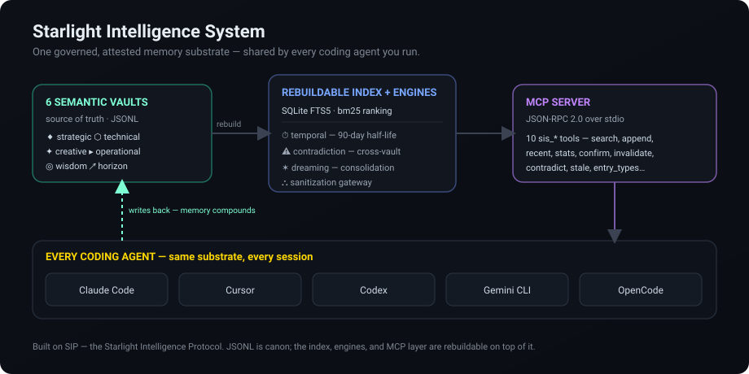
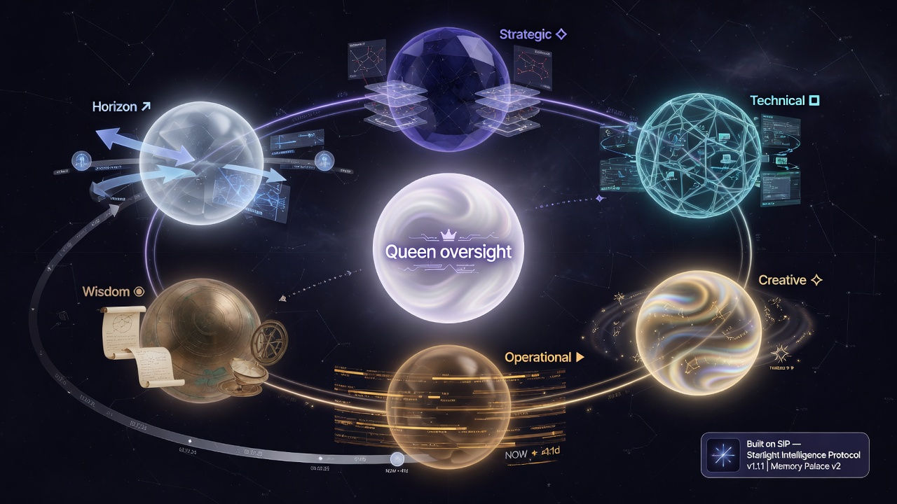

# Starlight Intelligence System

> **One governed, attested memory substrate — shared by every coding agent you run.**
>
> Claude Code, Cursor, Codex, Gemini CLI, OpenCode. Per-tool memory is now table
> stakes; what your fleet is missing is memory that is **cross-tool, cross-repo,
> temporal, and attested**. That's this repo: real engines — SQLite/FTS5
> retrieval, a 90-day confidence half-life, cross-vault contradiction detection,
> and an MCP server — over six human-readable JSONL vaults. Not a slide deck. Run
> `npm run demo` and watch it work.

[](https://github.com/frankxai/Starlight-Intelligence-System/releases)
[](SIP.md)
[](https://starlightintelligence.org/protocol)
[](LICENSE)
[](https://github.com/frankxai/Starlight-Intelligence-System/actions/workflows/vercel-deploy.yml)
[](https://github.com/frankxai/Starlight-Intelligence-System/stargazers)


---

## See it work

No setup, no API key, no network. From a fresh clone, `npm install && npm run demo`
seeds eight memory atoms and runs **four real engines** against them — the exact
code in `src/`, fully deterministic:

```text
✦ Starlight Intelligence System — live engine demo
  wrote 8 atoms across 3 vaults

━━ 1. Retrieval — FTS5 / bm25 over the JSONL vaults ━━━━━━━
  query: "FTS5 index retrieval ranking"
    2.47  [technical] SQLite FTS5 with bm25 beats embeddings for vault search ranking under 10k entries
    2.00  [strategic] Never cache the rebuilt FTS5 index between sessions for faster cold-start retrieval
    2.00  [technical] Always cache the rebuilt FTS5 index between sessions for faster cold-start retrieval

━━ 2. Temporal — staleness + 90-day confidence half-life ━━
  8 entries · 7 healthy · 1 stale · avg confidence 0.772
    STALE (210d, 0.9→0.179) Ship the closed beta on the private registry first, then open the protocol
    (old knowledge decays unless reconfirmed — surfaced, not silently trusted)

━━ 3. Contradiction — cross-vault conflict detection ━━━━━━
  CONFLICT similarity 1.00
    [strategic] Never cache the rebuilt FTS5 index between sessions for faster cold-start retrieval
    [technical] Always cache the rebuilt FTS5 index between sessions for faster cold-start retrieval

━━ 4. Orchestration — routing + pattern + synthesis ━━━━━━━
  task: "Review the code for security issues and quality before release"
  routed → Starlight Quality Checker (10), Starlight Code IS (10), Starlight Sentinel (10)
  pattern: sequential  complexity: 4/10  agents: 2  confidence: 0.55

✓ Four engines, real output, zero mocks. This is the operational core.
```

Source: [`examples/demo.ts`](examples/demo.ts). It runs against a temp dir and
cleans up — your real vaults are never touched.

---

## What's actually here (live, derived from source)

<!-- METRICS:START -->

| Surface | Live count | Source of truth |
|---|---|---|
| Named agents | **144** | `agents/**/*.md` |
| Auto-activating skills | **83** | `skills/skill-rules.json` |
| Engine code | **20,440 LOC** across 73 files | `src/**/*.ts` (excl. tests) |
| Test cases | **760** across 67 files | `src` + `test` `*.test.ts` |
| Version | **8.3.0** | `package.json` |

_Derived from source, not hand-typed. Regenerate with `npm run metrics`; CI fails on drift via `npm run metrics -- --check`. Last verified 2026-06-22._

<!-- METRICS:END -->

Every number above is recomputed from the repo by [`scripts/sync-metrics.mjs`](scripts/sync-metrics.mjs)
and written between the markers — so this README can't drift from reality. That's
the same discipline the agent harness enforces (`npm run agents:harness-check`).

---

## 60-second start

```bash
# 1. Seed the six JSONL vaults at ~/.starlight/vaults
npx -p @arcanea/starlight-intelligence-system starlight init --vaults
```

```jsonc
// 2. Point any MCP client at them (Claude Code, Cursor, Codex, …)
{
  "mcpServers": {
    "starlight": {
      "command": "node",
      "args": [
        "node_modules/@arcanea/starlight-intelligence-system/dist/mcp-server.js",
        "--vault-dir", "~/.starlight/vaults"
      ]
    }
  }
}
```

Restart your client and you have ten `sis_*` tools in every session — the same
vaults, from every CLI you run. If you skip the seed step the server still works:
it auto-seeds an empty `--vault-dir` on first boot, so the empty state is never
silently broken.

**Prefer to run from source?**

```bash
git clone https://github.com/frankxai/Starlight-Intelligence-System.git
cd Starlight-Intelligence-System
npm install
npm run demo     # watch the four engines run (above)
npm run build    # tsc → dist/
npm test         # the full operational + substrate + eval suite
```

> **Operator?** Start at [`SETUP.md`](./SETUP.md) — `private/` instance state,
> secrets, cron wiring, cockpit launch, and a smoke test in ~30 min.
> **New to the protocol, not the build?** Don't fork this repo — fork the
> [SIP adoption kit](https://github.com/frankxai/starlight) (eleven markdown
> files, no code) and ship your first attested artifact in 60 seconds.

---

## The engineering

The reference build is **20,440 lines of TypeScript** with one runtime
dependency (`better-sqlite3`). JSONL vaults are canon; everything else is a
rebuildable layer on top.

| Layer | File | What it does |
|---|---|---|
| **Vault memory** | [`src/vault-memory.ts`](src/vault-memory.ts) | Six semantic vaults, JSONL-backed, classification on write |
| **Retrieval** | [`src/retrieval.ts`](src/retrieval.ts) | Rebuildable SQLite **FTS5** shadow index, bm25 ranking; optional `sqlite-vec` hybrid via RRF |
| **Temporal** | [`src/temporal.ts`](src/temporal.ts) | Validity windows + a **90-day confidence half-life**; stale knowledge is surfaced, not trusted |
| **Contradiction** | [`src/contradiction.ts`](src/contradiction.ts) | Cross-vault conflict via word-trigram Jaccard with opposing-signal boosting |
| **Dreaming** | [`src/dreaming.ts`](src/dreaming.ts) | Background consolidation — merges duplicates, promotes patterns, archives stale atoms |
| **Orchestration** | [`src/orchestrator.ts`](src/orchestrator.ts) | 6 patterns + a 7-layer pipeline (perceive → recall → reason → route → execute → synthesize → write) |
| **MCP server** | [`src/mcp-server.ts`](src/mcp-server.ts) | 10 `sis_*` tools over JSON-RPC 2.0 stdio |
| **Adapters** | [`src/adapters/`](src/adapters) | Same substrate across five coding tools |
| **Gateway** | [`src/gateway/`](src/gateway) | HTTP + in-process transport for shared/remote vault access |

It's tested, not asserted — every claim above is gated by the test suite
(`npm test`; live case count in the table above).

### How it works




### The six vaults

| Vault | Symbol | Purpose | Example entry |
|---|---|---|---|
| Strategic | ◆ | Decisions, architecture, competitive moats | `"Open core beats premium tiers at this stage"` |
| Technical | ⬡ | Patterns, stack decisions, solutions | `"SQLite FTS5 with bm25 beats embeddings under 10k entries"` |
| Creative | ✦ | Voice, aesthetic rules, lore | `"Direct, technical, warm. Show don't tell."` |
| Operational | ▸ | Workflow patterns, execution lessons | `"Read a file before editing — catches stale state"` |
| Wisdom | ◎ | Cross-domain principles | `"Memory that compounds is intelligence that grows"` |
| Horizon | ↗ | Append-only ledger of human intentions | `"Build the substrate that makes AI agents continuous"` |

Each vault is a JSONL file — human-readable, git-versionable, greppable. The MCP
server and `src/retrieval.ts` read `*.jsonl` in your `--vault-dir`; that is the
one source of truth at runtime.



### MCP tools

| Tool | Description |
|---|---|
| `sis_vault_search` | Free-text search across vaults |
| `sis_recent_entries` | Latest entries from one or all vaults |
| `sis_stats` | Total entry counts per vault |
| `sis_append_entry` | Write a new entry to a vault |
| `sis_entry_types` | List supported vault types + entry categories |
| `sis_search` | Keyword + temporal search (term-overlap, tag boost, staleness penalty) |
| `sis_confirm` | Touch `lastConfirmed` on an entry |
| `sis_invalidate` | Mark an entry expired |
| `sis_contradict` | Flag two entries as contradictory |
| `sis_stale` | List entries not confirmed within a threshold |

### Platform adapters

The same substrate, normalized per tool — **Claude Code, Cursor, Codex, Gemini
CLI, OpenCode**:

| Platform | Memory file | MCP config | Max tokens |
|---|---|---|---|
| Claude Code | `CLAUDE.md` | `~/.claude/settings.json` → `mcpServers` | 200,000 |
| Cursor | `.cursorrules` | Cursor settings → MCP | 128,000 |
| Codex | `AGENTS.md` | `~/.codex/config.toml` | 192,000 |
| Gemini CLI | `GEMINI.md` | `~/.gemini/settings.json` | 1,000,000 |
| OpenCode | `AGENTS.md` (compact) | `~/.opencode/config.json` | 128,000 |

### Agents

The reference build ships **144 agents** — a 7-archetype named council
(Orchestrator, Prime, Architect, Navigator, Sentinel, Weaver, Sage) plus
specialist and domain-vertical tiers. They map onto SIP's five abstract voice
archetypes; anyone forking SIP can choose entirely different agents above the
substrate. Full registry: [`agents/AGENT_REGISTRY.md`](agents/AGENT_REGISTRY.md).

---

## The substrate (SIP)

Under the build is the **Starlight Intelligence Protocol** — the contract that
lets sovereign parties compose intelligence systems without losing sovereignty.
Six layers: file contract · attestation (`/sip-attest`) · MCP registry standard ·
command taxonomy · sovereignty + attribution clause · optional archetype
extension.

```bash
/luminor-board "Open-source the agent layer or keep it closed?"   # pressure-test
/alliance-forge trinity "architect,sovereign-creator,implementer"  # forge an alliance
/vertical-spawn anime-legends "anime-aesthetic fiction"            # spawn a vertical
/sip-attest path/to/artifact.md                                    # attest a shipped artifact
```

Source of truth: [`SIP.md`](SIP.md) · mirror: [starlightintelligence.org/protocol](https://starlightintelligence.org/protocol).
Substrate map and the other contract files: [`SIS.md`](SIS.md), [`ALLIANCE.md`](ALLIANCE.md),
[`STACK.md`](STACK.md), [`VOICES.md`](VOICES.md), [`VERTICALS.md`](VERTICALS.md).

You can adopt **just the substrate** (fork SIP), **just the operational layer**
(use the MCP server for AI memory), or **the full stack**. They're independent.

---

## Fork patterns

| If you want to… | Take | Leave |
|---|---|---|
| Adopt SIP for your own stack | `SIP.md`, `SKILL.md`, `VOICES.md`, `.claude/commands/` | `agents/`, `memory/`, `skills/`, `src/` |
| Use the MCP memory server, no protocol | `src/`, `dist/`, npm package | Substrate spec files |
| Forge an alliance under SIP | `SIP.md`, `ALLIANCE.md`, `VOICES.md`, all commands | Operational layer |
| Run the full reference build | All of it | Nothing |

---

## Development

```bash
npm install
npm run demo     # the four engines, live
npm run build    # tsc → dist/
npm test         # operational + substrate + v01 evals
npm run lint     # tsc --noEmit
npm run metrics  # recompute the live-metrics block from source
npm run verify   # the full CI gate (lint, harness, tests, build, metrics --check, site)
```

`src/` is **20,440 lines of TypeScript** (regenerate the exact figure with
`npm run metrics`) with zero runtime dependencies outside `better-sqlite3`.
Substrate docs are markdown-only — no build dependency.

---

## Beyond the build

The commercial layer on top of SIS — the **Estate Factory** (repeatable "Mind +
Mesh + Steward" sovereign agent armies) and the **Web4 / "Ethereum for
intelligence"** positioning — lives in
[`docs/strategic/estate-factory-web4-positioning.md`](docs/strategic/estate-factory-web4-positioning.md),
with the full delivery workflow in
[`docs/delivery/estate-army-commissioning-workflow.md`](docs/delivery/estate-army-commissioning-workflow.md).

---

## License

- **Code + substrate-tier commands:** MIT — see [`LICENSE`](LICENSE).
- **Substrate spec docs** (`SIP.md`, `SIS.md`, …): MIT. "Built on SIP" is a
  social-layer attestation convention captured in [`NOTICE`](NOTICE), not a
  license restriction.
- **Arcanea canon** (if your fork composes it): CC-BY-NC 4.0, © Arcanea BV.
- **Trademarks:** ARCANEA, FRANKX, STARLIGHT INTELLIGENCE — reserved rights.

---

## Related

- [Arcanea](https://arcanea.ai) — creator platform; canon-defining vertical built on SIS
- [FrankX](https://frankx.ai) — architect brand; SIP thought leadership
- [Public Vaults](https://starlightintelligence.org) — browse and fork vaults
- [Protocol page](https://starlightintelligence.org/protocol) — canonical SIP spec

---

**Built on SIP** · Starlight Intelligence Protocol · v1.1.1 · v8.3.0 · MIT
