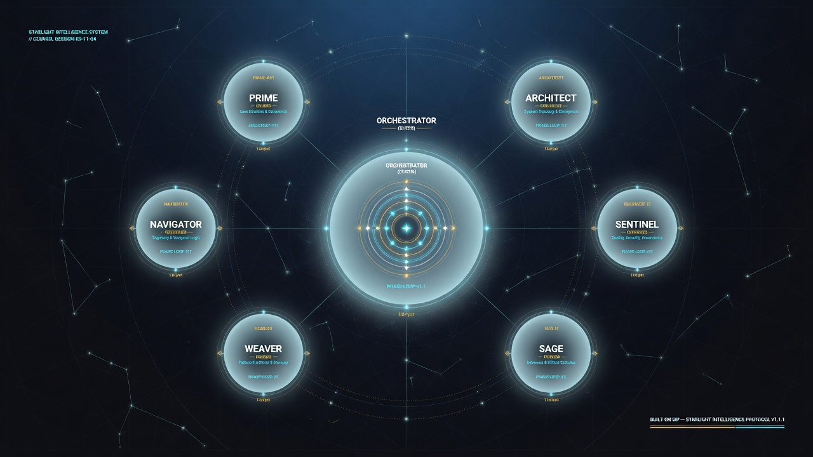
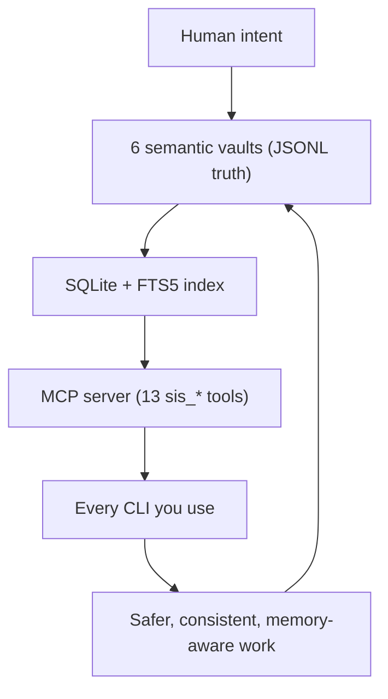
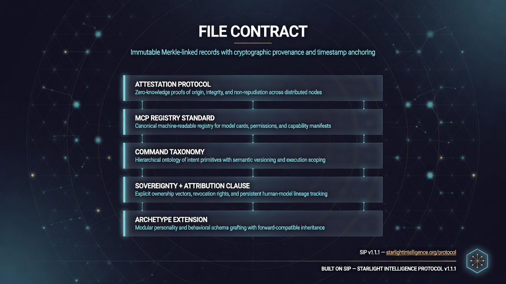
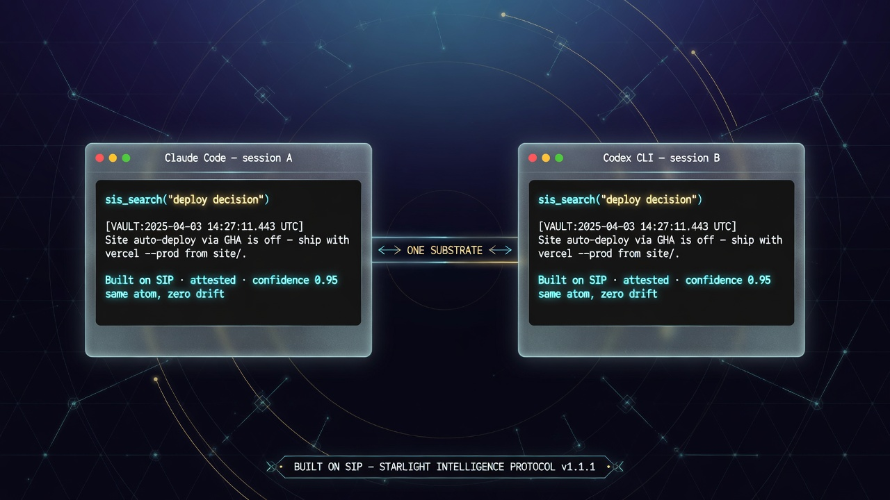
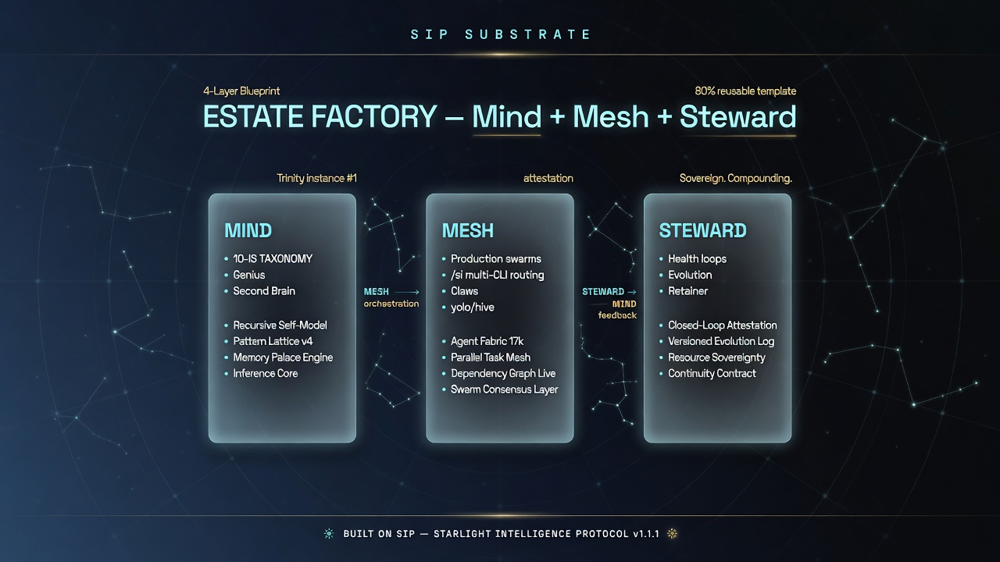
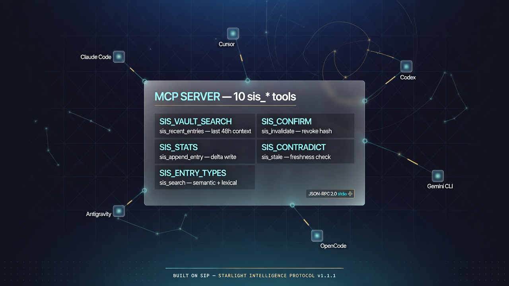
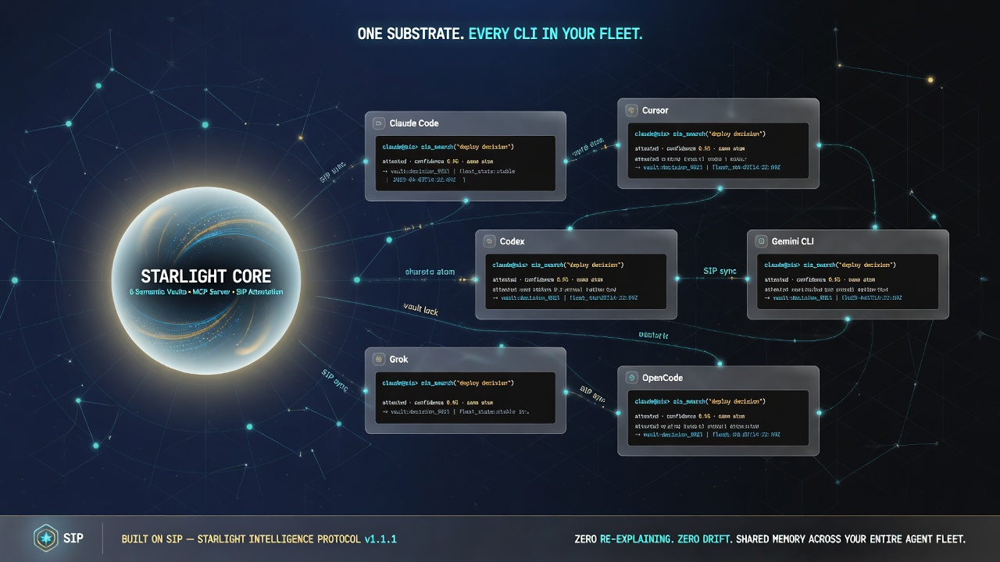
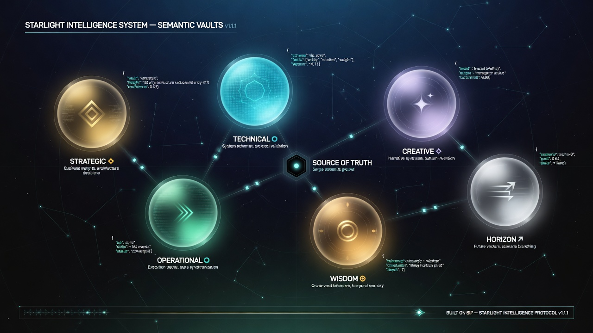
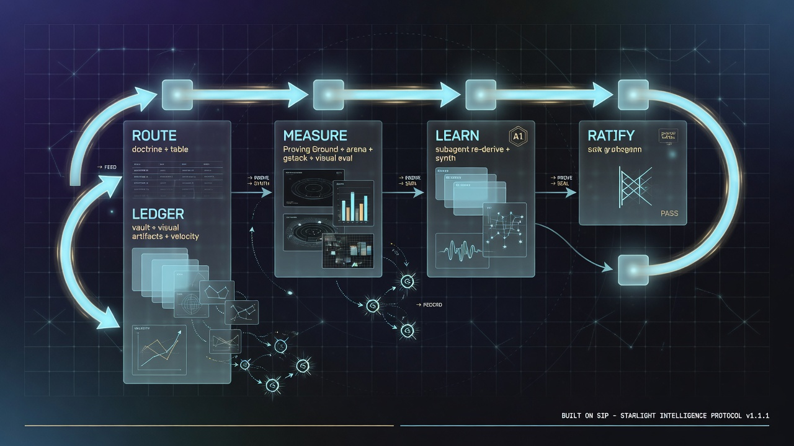

<p align="center"></p>

# Starlight Intelligence System

> **One shared brain for your entire AI fleet — across every tool and every repository.**

Persistent memory. Attested knowledge. Sovereign control.

Claude Code, Cursor, Codex, Gemini CLI, OpenCode, Antigravity — they all read from and write to the **same six semantic vaults**, with full provenance. No more explaining the same thing to every agent. No drift. No lost decisions.

[](https://github.com/frankxai/Starlight-Intelligence-System/releases)
[](SIP.md)
[](LICENSE)
[](https://starlightintelligence.org/protocol)
[](https://github.com/frankxai/Starlight-Intelligence-System/actions/workflows/vercel-deploy.yml)
[](https://github.com/frankxai/Starlight-Intelligence-System/stargazers)



*Claude Code, Cursor, Codex, Gemini, and OpenCode — all reading the exact same attested memory from one substrate.*

---

Starlight is two things in one repository:

- **SIP** — the open Starlight Intelligence Protocol: a clean contract for sovereign memory, identity, and governance that anyone can adopt.
- **SIS** — the reference implementation: 144 specialized agents, 84 auto-activating skills, 6 semantic vaults, a production MCP server, and the repeatable **Estate Factory** for running full sovereign agent armies.

Use just the memory layer in your current tools. Adopt the protocol. Or run the complete system Frank uses every day.

## 60-second start

```bash
git clone https://github.com/frankxai/Starlight-Intelligence-System
cd Starlight-Intelligence-System && npm install && npm run build
node dist/cli.js init --vaults
```

> **Note:** npm currently serves v6.0.1 of `@arcanea/starlight-intelligence-system` — two major versions behind this repo. Use the git path above until v8.x is published.

Then add to your MCP config (Claude Code, Cursor, Codex, Gemini, etc.), pointing at the `dist/mcp-server.js` inside your clone:

```json
{
  "mcpServers": {
    "starlight": {
      "command": "node",
      "args": ["/path/to/Starlight-Intelligence-System/dist/mcp-server.js", "--vault-dir", "~/.starlight/vaults"]
    }
  }
}
```

(If you installed via npm instead, the path is `node_modules/@arcanea/starlight-intelligence-system/dist/mcp-server.js` — but see the version note above.)

Restart your client. Every agent now shares the same memory. Thirteen `sis_*` tools appear instantly (verified by JSON-RPC handshake, 2026-07-12).

---

## Two layers, one repo

| Layer              | What it is                                                                 | Best for |
|--------------------|----------------------------------------------------------------------------|----------|
| **SIP (Protocol)** | Open standard. Six clean layers for memory, attestation, commands, and sovereignty. | Forking the protocol or building your own systems |
| **SIS (Reference)** | Complete working system: 144 agents, 84 skills, 6 vaults, MCP server, Estate Factory. | Running it as your daily multi-agent brain |

Use the protocol alone, the memory layer alone, or the full reference implementation. They are designed to compose.

**Getting started locally** — [SETUP.md](./SETUP.md) (30-minute full setup including private state).<br>
**Just want the protocol spec** — use the lightweight [SIP kit](https://github.com/frankxai/starlight) instead.

See [CHANGELOG.md](CHANGELOG.md) for history.

[](https://starlightintelligence.org/protocol)

---

## Why It Matters



**The difference**:
- One source of truth instead of N fragmented contexts
- Knowledge that compounds instead of resetting every session
- Attestation so you always know what came from where
- The same memory works in Claude, Cursor, Codex, Gemini — simultaneously

We made the hard parts (temporal decay, contradiction detection, cross-tool sync) automatic.

## For production sovereign systems

Starlight includes a complete **Estate Factory** pattern for running real "Mind + Mesh + Steward" agent armies at scale.

- **Mind**: Your grounded intelligence layers
- **Mesh**: Coordinated swarms with routing, synthesis, and operations
- **Steward**: Health monitoring, evolution, and long-term value

A 4-layer blueprint plus reusable templates lets you stand up new estates quickly while keeping them 100% yours.





Full workflow and templates: `docs/delivery/estate-army-commissioning-workflow.md`.

---

## The substrate (SIP)

**Starlight Intelligence Protocol** — the contract that lets sovereign parties compose intelligence systems without losing sovereignty. Six layers:

1. **File contract** — canonical names and shapes for `SKILL.md`, `AGENTS.md`/`VOICES.md`, `MEMORY.md`, `CANON.md`, `SOUL.md`, `STACK.md`, `.claude/commands/*`, plus `.arc` / `.nea` / `.skill` extensions.
2. **Attestation protocol** — verifiable "Built on SIP" attribution via `/sip-attest`. Refuses decorative use.
3. **MCP registry standard** — how MCP servers declare, compose, version (`mcp.json` schema).
4. **Command taxonomy** — protocol / alliance / vertical / sovereign tiers with explicit decision rights.
5. **Sovereignty + attribution clause** — the non-negotiable social contract.
6. **Archetype extension** — optional canon adoption (Arcanea archetypes available CC-BY-NC).

**Canonical URL:** [starlightintelligence.org/protocol](https://starlightintelligence.org/protocol) · **Source of truth:** [`SIP.md`](SIP.md) in this repo.

### Substrate files at a glance

| File | What it does |
|------|--------------|
| [`SIP.md`](SIP.md) | The protocol spec (six layers). |
| [`SIS.md`](SIS.md) | Substrate map — verticals, composition rules, what SIS does and doesn't provide. |
| [`ALLIANCE.md`](ALLIANCE.md) | The alliance forging method — how 2-5 sovereign nodes compose without collapsing into one entity. |
| [`STACK.md`](STACK.md) | Recommended sovereign stack (L0-L6). Defaults, not mandates. |
| [`VOICES.md`](VOICES.md) | Five canonical voice archetypes (architect, sovereign-creator, protocol-defender, implementer, overseer). |
| [`VERTICALS.md`](VERTICALS.md) | Public registry of sovereign verticals + alliance class definitions. |
| [`MEMORY.md`](MEMORY.md) | Template for per-instance state. |
| [`REGISTRY.md`](REGISTRY.md) | MCP server registry. |
| [`SKILL.md`](SKILL.md) | Substrate-layer behavior (what AI adopts when working at this layer). |
| `.claude/commands/` | 9 substrate-tier slash commands (`/sip-attest`, `/alliance-forge`, `/alliance-reflect`, `/alliance-decide`, `/vertical-spawn`, `/luminor-board`, `/sovereign-signal`, `/openclaw-audit`, `/wealth-dpi`) among 121 total command files. |





### Forge an alliance, spawn a vertical

```bash
# Pressure-test before committing
/luminor-board "Open-source the agent layer or keep it closed?"

# Forge an alliance under SIP
/alliance-forge trinity "architect,sovereign-creator,protocol-defender,implementer"

# Spawn a vertical IS under SIS
/vertical-spawn anime-legends "anime-aesthetic fiction + character design"

# Attest a shipped artifact
/sip-attest path/to/artifact.md
```

Every cross-party artifact carries the "Built on SIP" attestation block. Silent composition is a breach.

---

## The operational layer (reference build)

This repo also ships Frank's working implementation — the daily-driver intelligence system that runs on top of SIP. Use it directly, fork it, or replace it entirely with your own layer above the substrate.

### Quick start (operational layer, 2 minutes)

**Option 1: As an MCP server (recommended for AI tools)**

First, seed your vault directory so the system has somewhere to read from
(a fresh install has no `~/.starlight/vaults` yet):

```bash
# From a git clone of this repo (npm registry is at stale v6.0.1 — see note above):
node dist/cli.js init --vaults
# → seeds the six JSONL vaults in ~/.starlight/vaults (welcome entry + public examples)
```

Then point your MCP client at that directory:

```json
{
  "mcpServers": {
    "starlight": {
      "command": "node",
      "args": [
        "node_modules/@arcanea/starlight-intelligence-system/dist/mcp-server.js",
        "--vault-dir",
        "~/.starlight/vaults"
      ]
    }
  }
}
```

Restart Claude Code. You now have thirteen `sis_*` tools available in every session.
(If you skip the seed step the server still works — it auto-seeds an empty
`--vault-dir` on first boot so the empty state is never silently broken.)

**Option 2: As a library**

```bash
npm install @arcanea/starlight-intelligence-system  # registry serves v6.0.1 — for v8.x, install from the git clone until republished
```

```ts
import { StarlightIntelligence } from "@arcanea/starlight-intelligence-system";
import { createAdapter } from "@arcanea/starlight-intelligence-system/adapters";

const sis = new StarlightIntelligence();
sis.initialize();

sis.remember({
  content: "Always Read a file before editing — catches stale state",
  category: "pattern",
  tags: ["workflow", "edit-safety"],
  confidence: 0.95,
});

const adapter = createAdapter("claude-code");
const context = await adapter.generate({ vaultDir: "~/.starlight/vaults" });
```

### The six vaults

| Vault | Symbol | Purpose | Example entry |
|---|---|---|---|
| Strategic | ◆ | Business insights, architecture decisions, competitive moats | `"Open Core + Founding Circle beats premium tiers at this stage"` |
| Technical | ⬡ | Implementation learnings, stack decisions, patterns | `"SQLite FTS5 with bm25 beats embeddings for <10k entries"` |
| Creative | ✦ | Design preferences, aesthetic rules, voice, lore | `"Never Cinzel. Space Grotesk display, Inter body."` |
| Operational | ▸ | Workflow patterns, execution lessons, process rules | `"Max 2 worktrees. Digest pattern for terminal output."` |
| Wisdom | ◎ | Deep principles, truths, cross-domain insights | `"Memory that compounds is intelligence that grows"` |
| Horizon | ↗ | Vision statements, append-only ledger of human intentions | `"Build the substrate that makes AI agents continuous"` |

Each vault is a JSONL file. Human-readable. Git-versionable. Greppable.



> **Where memory lives.** The MCP server and `src/retrieval.ts` read **`*.jsonl`
> files in your `--vault-dir`** (default `~/.starlight/vaults`) — that is the one
> source of truth at runtime. The repo ships two example sets for reference only:
> `public-vault/*.jsonl` is the canonical starter content that `starlight init
> --vaults` copies into your vault dir; `memory/vaults/*.md` are human-readable
> narrative snapshots and are **not** read by the engine. Seed once, then your
> own `~/.starlight/vaults` is what counts.

### What the operational layer adds on top of SIP

- **SQLite hybrid retrieval** — `src/retrieval.ts` builds a rebuildable FTS5 shadow index over JSONL vaults with bm25 ranking. Keyword + temporal today (measured recall in CI via `npm run eval:retrieval`); optional `sqlite-vec` semantic layer is roadmapped in [`docs/bring-your-own-model.md`](docs/bring-your-own-model.md).
- **Temporal reasoning** — `src/temporal.ts` adds validity windows and a 90-day confidence half-life.
- **Contradiction detection** — `src/contradiction.ts` finds conflicting entries via word-trigram Jaccard with opposing-signal boosting.
- **Dreaming** — `src/dreaming.ts` processes session transcripts in the background.
- **Five platform adapters** — Claude Code, Cursor, Codex, Gemini CLI, OpenCode share the same vaults.
- **MCP v2** — `src/mcp-server.ts` ships ten tools over JSON-RPC 2.0 stdio.

### MCP tools

| Tool | Description |
|---|---|
| `sis_vault_search` | Free-text search across vaults |
| `sis_recent_entries` | Latest entries from one or all vaults |
| `sis_stats` | Total entry counts per vault |
| `sis_append_entry` | Write a new entry to a vault |
| `sis_entry_types` | List supported vault types and entry categories |
| `sis_search` | Keyword + temporal search (term-overlap score, tag boost, staleness penalty) |
| `sis_confirm` | Touch `lastConfirmed` on an entry |
| `sis_invalidate` | Mark an entry as expired |
| `sis_contradict` | Flag two entries as contradictory |
| `sis_stale` | List entries not confirmed within a threshold |

### Platform adapters

| Platform | Memory file | MCP config | Max tokens |
|---|---|---|---|
| Claude Code | `CLAUDE.md` | `~/.claude/settings.json` → `mcpServers` | 200,000 |
| Cursor | `.cursorrules` | Cursor settings → MCP | 128,000 |
| Codex | `AGENTS.md` | `~/.codex/config.toml` | 192,000 |
| Gemini CLI | `GEMINI.md` | `~/.gemini/settings.json` | 1,000,000 |
| OpenCode | `AGENTS.md` (compact) | `~/.opencode/config.json` | 128,000 |

### The 7 named agents (operational layer)

The reference build maps SIP's 5 voice archetypes to 7 named runtime agents — Orchestrator, Prime, Architect, Navigator, Sentinel, Weaver, Sage. Full registry: [`agents/AGENT_REGISTRY.md`](agents/AGENT_REGISTRY.md).



Voice archetypes are abstract; named agents are specific implementations. Anyone forking SIP can choose entirely different agents above the substrate.

---

## Fork patterns

| If you want to... | Take | Leave |
|------------------|------|-------|
| Adopt SIP for your own creator stack | `SIP.md`, `SKILL.md`, `VOICES.md`, `.claude/commands/sip-attest.md`, `.claude/commands/alliance-forge.md` | Everything in `agents/`, `memory/`, `skills/`, `src/` |
| Use the MCP memory server, no protocol | `src/`, `dist/`, npm package | Substrate spec files |
| Forge an alliance under SIP | `SIP.md`, `ALLIANCE.md`, `VOICES.md`, the 9 substrate commands in `.claude/commands/` | Operational layer |
| Run the full reference build | All of it | Nothing |

---

## Public canonical URL

[`starlightintelligence.org/protocol`](https://starlightintelligence.org/protocol) mirrors `SIP.md`. This repo is the source of truth.

---

## Architecture (operational layer)

```
            ┌─────────────────────────────────────────┐
            │  JSONL vaults  (source of truth)        │
            │  ~/.starlight/vaults/*.jsonl            │
            │  human-readable · git-versionable       │
            └────────────────┬────────────────────────┘
                             │
                             │  rebuildable from JSONL
                             ▼
            ┌─────────────────────────────────────────┐
            │  SQLite + FTS5  (shadow index)          │
            │  bm25 ranking · temporal filters        │
            └────────────────┬────────────────────────┘
                             │
                             │  JSON-RPC 2.0 over stdio
                             ▼
            ┌─────────────────────────────────────────┐
            │  MCP server  (13 sis_* tools)           │
            └────────────────┬────────────────────────┘
                             │
        ┌────────────────────┼────────────────────────┐
        ▼            ▼       ▼       ▼        ▼       ▼
   Claude Code   Cursor   Codex   Gemini   OpenCode   Your tool
```



### Guides

- [Architecture Guide](docs/ARCHITECTURE-GUIDE.md) — full stack map, 10 IS taxonomy, agent architecture, MCP architecture, infrastructure topology, deployment runbook
- [MCP Setup Guide](docs/guides/MCP-SETUP-GUIDE.md) — register the SIS MCP server with every coding agent (Claude Code, Cursor, Windsurf, Codex, Gemini CLI, Antigravity, Hermes) + Railway shared server
- [Hermes + Claude Code + OpenClaw Guide](docs/guides/HERMES-CLAUDE-CODE-GUIDE.md) — dual-stack setup: Hermes on VPS + Claude Code local + OpenClaw on Railway + phone integration
- [Infrastructure Deployment Guide](docs/guides/INFRA-DEPLOYMENT-GUIDE.md) — full 5-surface deployment: Vercel + Railway + VPS + local + phone

---

## Development

```bash
git clone https://github.com/frankxai/Starlight-Intelligence-System.git
cd Starlight-Intelligence-System
npm install
npm run build       # tsc to dist/
npm test            # 82+ orchestrator tests
npm run lint        # tsc --noEmit
```

`src/` is under 3,000 lines of TypeScript with zero runtime dependencies outside `better-sqlite3`. Substrate docs (`SIP.md`, `SIS.md`, etc.) are markdown-only — no build dependency.

---

## License

- **Code (operational layer + substrate-tier commands):** MIT — see [`LICENSE`](LICENSE).
- **Substrate spec docs** (`SIP.md`, `SIS.md`, `ALLIANCE.md`, `STACK.md`, `VOICES.md`, `VERTICALS.md`, `MEMORY.md`, `REGISTRY.md`, `SKILL.md`): MIT, same `LICENSE`. The "Built on SIP" attestation request is a social-layer convention captured in [`NOTICE`](NOTICE), not a license restriction.
- **Arcanea canon (if your fork composes with it):** CC-BY-NC 4.0, © Arcanea BV. Lives in `frankxai/arcanea-ecosystem`; canon is compose-only — not redistributed under this repo's MIT.
- **Trademarks:** ARCANEA, FRANKX, STARLIGHT INTELLIGENCE — registered or in registration, reserved rights.

"Built on SIP" is an attestation phrase, not a trademark. Use of the phrase requires actual SIP composition per `/sip-attest` rules. Full attribution + canon + trademark summary in [`NOTICE`](NOTICE) (Apache-style — `LICENSE` for legal rights, `NOTICE` for propagation conventions).

---

## Visuals

We treat system diagrams and live-state artifacts as first-class deliverables.

All visuals in `docs/visuals/` follow the same premium dark technical language and carry `Built on SIP` attestation. They are used in the Queen loop, research, and the public site.

Browse them: [docs/visuals/VISUALS.md](docs/visuals/VISUALS.md) · Motion experience: [docs/queen-motion/](docs/queen-motion/)

## Related

- [Arcanea](https://arcanea.ai) — Creator platform; canon-defining vertical built on SIS
- [FrankX](https://frankx.ai) — Architect brand; SIP thought leadership
- [Public Vaults](https://starlightintelligence.org) — Browse and fork vaults
- [Protocol page](https://starlightintelligence.org/protocol) — Canonical SIP spec
- [GitHub](https://github.com/frankxai/Starlight-Intelligence-System) — Source, issues, discussions

---

**Built on SIP** · Starlight Intelligence Protocol · v1.1.1 · v8.3.0 · MIT

---

## Advanced: The Estate Factory

For organizations and sovereign operators who want a full production intelligence estate (not just tools), Starlight provides a complete repeatable delivery system — Mind + Mesh + Steward — with high reuse across engagements.

See `docs/delivery/estate-army-commissioning-workflow.md` and the `templates/estate-os/` profile for the current approach.
