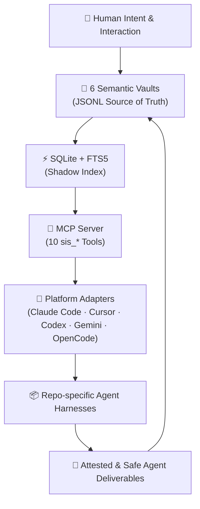
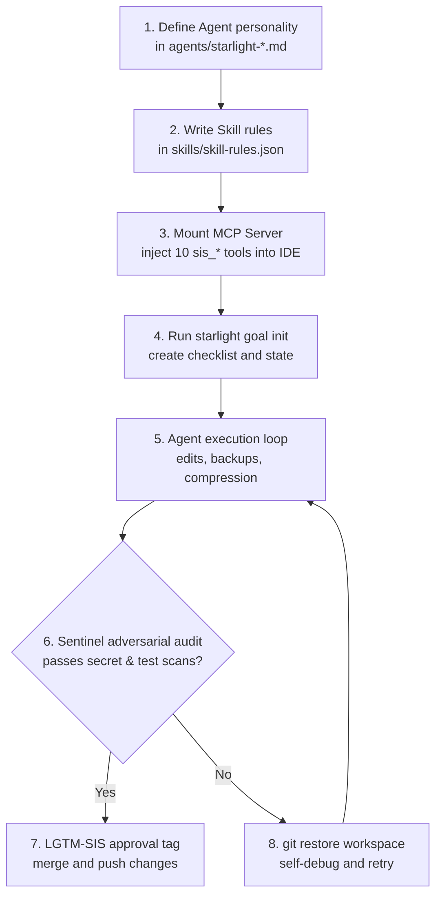

# 🌌 Starlight Intelligence System (SIS)

<div align="center">
  <p align="center">
    
  </p>
  <p align="center">
    <strong>The Sovereign Multi-Agent Substrate & Memory Engine for AI Fleets</strong>
  </p>
  <p align="center">
    <em>One brain, one rulebook, and one unified memory plane shared across every coding agent: Claude Code, Cursor, Codex, Gemini, OpenCode, and Antigravity.</em>
  </p>

  <p align="center">
    <a href="https://github.com/frankxai/Starlight-Intelligence-System/releases"></a>
    <a href="SIP.md"></a>
    <a href="https://starlightintelligence.org/protocol"></a>
    <a href="LICENSE"></a>
    <a href="https://starlightintelligence.org/protocol"></a>
    <a href="https://github.com/frankxai/Starlight-Intelligence-System/actions/workflows/vercel-deploy.yml"></a>
    <a href="https://github.com/frankxai/Starlight-Intelligence-System/stargazers"></a>
  </p>
</div>

---

> [!NOTE]
> **The Ultimate Substrate for Swarm Fleets & Agent Harnesses.**
> What your multi-agent fleet is missing is a shared cognitive model. SIS is designed to solve this, exposing a unified memory plane of **56 specialized agents**, **78 auto-activating skills**, **6 semantic vaults**, an **MCP server**, and a **provenance protocol (SIP)**. It serves as the single source of truth and coordination layer across all IDE clients.

---

## ⚡ 60-Second Start

### 1. Seed the six JSONL vaults (`~/.starlight/vaults`)
```bash
npx -p @arcanea/starlight-intelligence-system starlight init --vaults
```

### 2. Connect Your MCP Client (Claude Code, Cursor, Codex, Gemini...)
Add this to your client config:
```json
{
  "mcpServers": {
    "starlight": {
      "command": "node",
      "args": [
        "node_modules/@arcanea/starlight-intelligence-system/dist/mcp-server.js",
        "--vault-dir", "~/.starlight/vaults"
      ]
    }
  }
}
```

Restart your client. Ten `sis_*` tools are now injected into your sessions.

---

## 🗺️ Architectural Blueprint

The Starlight Intelligence System operates on a two-tier architecture: the sovereign substrate (SIP) and the reference operational build (SIS).



---

## 🛠️ Multi-Agent Swarms & Agent Harnessing

SIS is engineered specifically to build, harness, and run multi-agent fleets:

### 1. What Makes SIS Unique
* **Shared Cognitive Architecture**: Rather than hardcoding distinct personality specs or memory configurations into each individual agent, agents share the same flat, queryable memory vaults and active skill registries.
* **Sovereign Substrate (SIP)**: Verifiable attestation footer (`Built on SIP`), cryptographic-friendly credentials scans, and multi-fleet alliance coordination.
* **Event-Sourced SQLite Hybrid indexing**: Allows memory sync across P2P networks (like Syncthing) using append-only JSONL files indexed locally in SQLite with full-text search.
* **SAGE Self-Healing Loops**: Protects agents against context exhaustion, error accumulation, and repeating failures using checklist state serialization, context compression backups, Sentinel test-audits, and automatic git rollbacks.

### 2. The Swarm Harness Process


### 3. Future Engineering Roadmap
To build out a truly state-of-the-art swarming ecosystem, we are actively engineering:
* **P2P SQLite Vault Syncing (CRDTs)**: Conflict-free state synchronization across multiple developer devices using Syncthing event hooks and SQLite delta tracking.
* **Adversarial Sentinel Guards**: Autonomous hooks checking context outputs for secrets leakages, package integrity, and structural code violations.
* **Smart Context Window Compression**: Dynamic token reduction filters that compress memory vaults based on client-specific window constraints.
* **The Dreaming Background Loops**: Background daemons that synthesize past chat logs, extract developer workflows, and automatically compile them into new reusable skills.

---

## 🌌 What SIS Can Do

Starlight Intelligence System provides complete operational coverage for multi-agent workflows.

### 1. Unified Memory Engine
*   **6 Semantic Vaults**: Store context separated by domain (Strategic, Technical, Creative, Operational, Wisdom, Horizon).
*   **SQLite Shadow Indexing**: Auto-builds a rebuildable FTS5 index over raw JSONL vaults with `bm25` ranking.
*   **Temporal Decay**: Auto-calculates a 90-day confidence half-life for stored memories, forcing stale items to require re-confirmation.
*   **Contradiction Detection**: Trigram-based Jaccard similarity sweeps identify opposing-signal inputs and highlight conflict areas.
*   **Dreaming Daemon**: Background process that digests session transcripts, extracts rules, and promotes them to the vaults.

### 2. Provenance & Attestation Substrate (SIP)
*   **Verifiable Attestation**: Every cross-party artifact carries an explicit `Built on SIP` footer, registered and verified via `/sip-attest`.
*   **Alliance Forging Method**: Framework for 2-5 sovereign agent fleets to coordinate work parameters without collapsing into a single database.
*   **Command Taxonomy**: Four-tier command structure (Protocol, Alliance, Vertical, Sovereign) governing system actions and modifications.

### 3. Multi-Agent Council
*   **56 Specialized Agents**: Named agents across 10 tiers (Leadership, Specialist, Foundation, domain sub-stacks like People, Sound, and Music).
*   **78 Auto-Activating Skill Rules**: Auto-injects domain rules (e.g. `structured-hiring`, `systems-thinking`, `onchain-crypto`) based on prompt context and files modified.
*   **Platform Portability**: Custom adapters format rules and context natively for each LLM client.

### 4. Sandbox & Hardening
*   **Sanitization Gateway (The Veil)**: Local-first PII and credentials scrubbing in background logs.
*   **Empirical Sandbox**: Proof-of-pattern validator that executes and rates code blocks before they write to the Technical Vault.
*   **Active Healing Daemon**: Sentinel process that proactively monitors, formats, and updates the codebase during idle periods.

---

## 🛠️ The Reference Layers

| Layer | Purpose | Key Artifacts | How to Adopt |
| :--- | :--- | :--- | :--- |
| **Substrate (SIP)** | The standard protocol for sovereign intelligence orchestration. | `SIP.md`, `SIS.md`, `ALLIANCE.md`, `STACK.md`, `VOICES.md`, `VERTICALS.md`, `MEMORY.md`, `REGISTRY.md` | Read `SIP.md`, attest with `/sip-attest`, fork specs. |
| **Operational (SIS)** | The reference implementation and runtime engine. | `src/`, `agents/`, `memory/`, `skills/`, `commands/`, `core/` | Install `@arcanea/starlight-intelligence-system`, run MCP server. |

> [!TIP]
> **Getting Started?**
> * For the full runtime setup: Read [SETUP.md](./SETUP.md).
> * To adopt just the markdown substrate spec (no code): Fork the [SIP adoption kit](https://github.com/frankxai/starlight).

---

## 🗃️ The Six Semantic Vaults

| Vault | Symbol | Focus | Example Entry |
| :--- | :---: | :--- | :--- |
| **Strategic** | ◆ | Competitive moats, roadmap decisions, architecture | `"Open Core + Founding Circle beats premium tiers at this stage"` |
| **Technical** | ⬡ | Verified code patterns, database schemas, stack constraints | `"SQLite FTS5 with bm25 beats vector embeddings for <10k entries"` |
| **Creative** | ✦ | Styling guidelines, aesthetic rules, typography, voice | `"Never Cinzel. Space Grotesk display, Inter body."` |
| **Operational** | ▸ | Swarm coordination, workflow execution, check regimens | `"Max 2 worktrees. Digest pattern for terminal output."` |
| **Wisdom** | ◎ | Fundamental principles, axioms, long-term lessons | `"Memory that compounds is intelligence that grows"` |
| **Horizon** | ↗ | Vision statements, human intent logs | `"Build the substrate that makes AI agents continuous"` |

---

## 🔌 Tooling & Command Taxonomies

<details>
<summary>⚡ <b>Operational MCP Tools (sis_*)</b></summary>

| Tool | Action |
| :--- | :--- |
| `sis_vault_search` | Free-text search across vaults |
| `sis_recent_entries` | Retrieve latest entries from specific vaults |
| `sis_stats` | Audit total entry counts per vault |
| `sis_append_entry` | Write new entries into a vault |
| `sis_search` | Keyword + temporal search with tag boosts and staleness penalties |
| `sis_confirm` | Reconfirm/touch an entry's freshness timestamp |
| `sis_invalidate` | Manually expire an entry |
| `sis_contradict` | Flag two conflicting entries |
| `sis_stale` | Scan entries requiring re-confirmation |
| `sis_goal_status` | Retrieve the active SAGE goal checklist and log state |
| `sis_goal_update` | Update status of a SAGE goal checklist task |
| `sis_goal_log` | Append log messages to the active SAGE goal |
</details>

<details>
<summary>📱 <b>Supported Client Adapters</b></summary>

| Client | Configuration Path | Memory Bridge File | Active Context Target |
| :--- | :--- | :--- | :--- |
| **Claude Code** | `~/.claude/settings.json` | `CLAUDE.md` | 200,000 tokens |
| **Cursor** | Cursor Settings -> MCP | `.cursorrules` | 128,000 tokens |
| **Codex** | `~/.codex/config.toml` | `AGENTS.md` | 192,000 tokens |
| **Gemini CLI** | `~/.gemini/settings.json` | `GEMINI.md` | 1,000,000 tokens |
| **OpenCode** | `~/.opencode/config.json` | `AGENTS.md` (compact) | 128,000 tokens |
</details>

<details>
<summary>⚙️ <b>Substrate Command Taxonomy</b></summary>

```bash
# Pressure-test a decision before committing
/luminor-board "Should we migrate to Next.js 16?"

# Forge an alliance under SIP
/alliance-forge trinity "architect, sovereign-creator, protocol-defender"

# Spawn a new vertical under SIS
/vertical-spawn music-intelligence "sound synthesis + dynamic cataloging"

# Attest a completed document or codebase artifact
/sip-attest path/to/shipped-spec.md
```
</details>

---

## 🧪 Testing & Code Quality

Run the local harness guard to ensure all document counts and schemas are in sync:
```bash
npm run agents:harness-check
```

Run compilation, linting, and the complete test suite:
```bash
npm install
npm run build
npm test
```

---

## 📜 License & Attributions

*   **Code (Operational Engine & Commands):** MIT — see [LICENSE](LICENSE).
*   **Substrate Spec Docs (SIP.md, ALLIANCE.md, etc.):** MIT — see [LICENSE](LICENSE).
*   **Arcanea Canon (Mythology, Universe Layers):** CC-BY-NC 4.0, © Arcanea BV.
*   **Trademarks:** `ARCANEA`, `FRANKX`, and `STARLIGHT INTELLIGENCE` are trademarks of Arcanea BV.

---

**Built on SIP** · Starlight Intelligence Protocol · v1.1.1 · v8.3.0 · MIT
