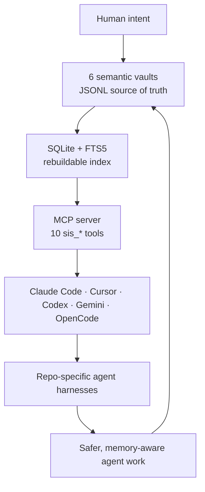

# Starlight Intelligence System

> **The sovereign intelligence substrate — persistent memory, identity, and attested governance for your whole AI fleet.**
>
> One brain and one rulebook shared by every coding agent you run: Claude Code, Cursor, Codex, Gemini CLI, OpenCode, Antigravity. Per-tool memory is now table stakes; what your fleet is missing is **cross-tool, cross-repo, governed, and attested**. That's this repo — 144 agents, 83 auto-activating skills, 6 semantic vaults, an MCP server, and a provenance protocol (SIP). 965 tests keep the claims honest.

[](https://github.com/frankxai/Starlight-Intelligence-System/releases)
[](SIP.md)
[](LICENSE)
[](https://starlightintelligence.org/protocol)
[](https://github.com/frankxai/Starlight-Intelligence-System/actions/workflows/vercel-deploy.yml)
[](https://github.com/frankxai/Starlight-Intelligence-System/stargazers)


---

> [!NOTE]
> **The Ultimate Substrate for Sovereign Agent Armies & Web4 Intelligence Fabrics.**
> SIS is the open protocol (SIP) + reference build for building, governing, and operating production-grade "Mind + Mesh + Steward" agent armies — persistent, attested, Genius-grounded swarms across every surface. The unclaimed category: the operator's full sovereign intelligence estate (not rented vendor agents or brittle glue frameworks). 
> 
> **Ethereum for intelligence**: Open SIP protocol for adoption flywheel + layered value capture (protected canon/encoded-self + commercial Estate Factory delivery). Trinity is instance #1. Factory economics: 80% reuse after first estate.
>
> Exposing: **144 agents**, **83 auto-activating skills**, **6 semantic vaults**, **MCP server**, **provenance (SIP)**, and now the repeatable **Estate Factory** (4-layer blueprint, starlight-estate-os profile, /estate-blueprint + /estate-steward commands, full E2E commissioning workflow).
>
> See `docs/strategic/sip-web4-substrate-strategy.md` (IP/Web4 model), `docs/delivery/estate-army-commissioning-workflow.md` (full client workflow + benefits vs DIY/competitors), `templates/estate-os/` (thin reusable profile), `docs/boards/2026-06-16-estate-factory-web4-positioning-verdict.md` (PROCEED-WITH-REVISE, REVISE items closed).
>
> **The pull**: "Help me set up and run a real, reliable, compounding agent army that acts as an extension of me — with memory that lasts, rules I control, production reliability." SIS + your depth delivers it E2E at world-class standards.

## 60-second start

```bash
# 1. Seed the six JSONL vaults (~/.starlight/vaults)
npx -p @arcanea/starlight-intelligence-system starlight init --vaults
```

```json
// 2. Point any MCP client at them (Claude Code, Cursor, Codex, ...)
{
  "mcpServers": {
    "starlight": {
      "command": "node",
      "args": [
        "node_modules/@arcanea/starlight-intelligence-system/dist/mcp-server.js",
        "--vault-dir", "~/.starlight/vaults"
      ]
    }
  }
}
```

Restart your client: ten `sis_*` tools in every session — the same vaults, from every CLI you run. Full walkthrough below in [Quick start](#quick-start-operational-layer-2-minutes); measured receipts in [BENCHMARKS.md](BENCHMARKS.md).

---

## Two layers, one repo

| Layer | What it is | What lives here | License | Adopt how |
|-------|-----------|-----------------|---------|-----------|
| **Substrate (SIP)** | A six-layer protocol that lets sovereign parties compose intelligence systems without losing sovereignty. | `SIP.md`, `SIS.md`, `ALLIANCE.md`, `STACK.md`, `VOICES.md`, `VERTICALS.md`, `MEMORY.md`, `REGISTRY.md`, `SKILL.md`, `.claude/commands/` | MIT | Read `SIP.md`, attest with `/sip-attest`, fork what you need. |
| **Operational (reference build)** | This repo's working implementation: 144 named agents (7-archetype council + specialist tiers + Hermes search + evaluator + Energy Intelligence + Social Intelligence), 6 semantic vaults, 83 auto-activating skills across 16 domains, MCP server, 14 strategic commands + 100+ slash commands, seven-platform adapters. Frank's daily-driver. | `agents/`, `memory/`, `skills/`, `commands/`, `core/`, `context/`, `src/` (npm package) | MIT | Install `@arcanea/starlight-intelligence-system`, run the MCP server, write to your vaults. |

You can adopt **just the substrate** (fork SIP for your own work), **just the operational layer** (use the MCP server for AI memory), or **the full stack** (Frank's reference build, end to end). They are independent.

> **Operator? Start at [SETUP.md](./SETUP.md)** — covers `private/` instance state, Infisical Path A vs env-var Path B, Windows + Linux cron wiring, cockpit launch, and a smoke test, end-to-end in roughly 30 min.
>
> **New to the protocol?** Don't fork this repo. Fork the **[SIP adoption kit](https://github.com/frankxai/starlight)** — eleven markdown files, no code, [ship your first attested artifact in 60 seconds](https://github.com/frankxai/starlight#readme). Compose upward when you're ready.
>
> **New in v8.3.0** (2026-06-12): First-run experience hardened so the package works for anyone who installs it. `starlight init --vaults` seeds the six JSONL vaults (and the MCP server auto-seeds an empty `--vault-dir` on first boot), so a fresh install is never silently empty. `sis_search` is now honestly described as **keyword + temporal** (no embeddings); a measured retrieval recall@k harness (`npm run eval:retrieval`) grounds the bm25 claim in CI; and an optional `sqlite-vec` semantic layer is roadmapped in [`docs/bring-your-own-model.md`](docs/bring-your-own-model.md). See [`CHANGELOG.md § v8.3.0`](CHANGELOG.md) and [`RELEASING.md`](RELEASING.md).
>
> **New in v8.1.0** (2026-05-17): Composition Layer primitive declared in `STACK.md` — universal IS may compose over its Domain Sub-Stacks via commands at the IS-itself. Wealth IS v0.2 evolved as first composition-layer reference. **Crypto Intelligence v0.1** shipped as third reference Domain Sub-Stack (after People + Sound) with **Houses-as-sub-systems** primitive — House of On-Chain live with 5 commands. `/bless` global skill + chronicle infrastructure initialized. 10-IS taxonomy invariant preserved. See [`CHANGELOG.md § v8.1.0`](CHANGELOG.md) + [`docs/boards/2026-05-17-crypto-investment-spawn.md`](docs/boards/2026-05-17-crypto-investment-spawn.md).

> **2026-06-12 Grok Queen visual + continuous advance (whole SIS):** First-class surfaces (`/starlight-queen` /sq /so /starlight architect/queen) + executable driver making ROUTE→MEASURE→LEARN→RATIFY→LEDGER live. 5 parallel premium visuals (Queen loop+gateway+3D MemPalace, SIS arch, routing heatmap, advance receipt). Routing evo (Grok classes + memory-consolidation-queen + palace-visual-recall). /si now visual surface. Memory deeper (Queen drives consolidation + visual recall + gateway state). Surgical updates across vaults, HARNESS, agents, VAULT_ARCH, docs. This advance Queen-driven end-to-end. Drive with `npm run queen ...`. All Built on SIP. See operational-vault.md [2026-06-12 Queen Advance], tools/queen/queen-advance-2026-06-12.json, commands/starlight-queen.md.

[](https://starlightintelligence.org/protocol)

---

## Why It Matters



| Capability | What It Gives Agents |
| --- | --- |
| Semantic vaults | Durable memory across sessions and tools |
| Temporal confidence | Old knowledge decays unless reconfirmed |
| Contradiction detection | Conflicting memories become visible |
| Platform adapters | Same substrate across Claude, Cursor, Codex, Gemini, OpenCode |
| MCP server | Tool-native access to memory and retrieval |
| Harness checks | Prompt surfaces stay aligned with reality |

## 🛠️ Sovereign Agent Armies & Production Swarms (The Agent Army Substrate)

SIS + the new **Estate Factory** (post 2026-06-16 Board) is the repeatable system to commission and run full "Mind + Mesh + Steward" sovereign intelligence estates / agent armies for principals, alliances, communities.

- **Mind**: Grounded 10-IS (Genius excavation, Second Brain, Brand, Wealth DPI, Creator pipelines, etc.) + Orchestrator as router.
- **Mesh**: Production swarms — 6 orchestration patterns, /si multi-CLI routing (Claude/Codex/Gemini/Antigravity/Grok...), Hermes retrieval, council/Prime synthesis, claws for ops/attestation/sentinel, yolo/hive for autonomy, amplification Claws with voice-lock/frequency caps.
- **Steward**: Ongoing ops, health (evals/drift), evolution, board facilitation. Retainer annuity.

**4-Layer Blueprint** (Persona/Naming, Topology/Swarm shape, Kernel/insight density, Modules/verticals via spawn-domain-stack) + Genius + Freedom Path grounding = the "thin tuned 20%" that makes it *yours*, not generic.

**Reusable 80%**: `templates/estate-os/` profile (file contract, 10-IS, orchestrator harnesses, claws, Memory Bus + Veil, attestation, naming skins, module scaffolds). Fork per client as estate-<name>.

Commands: `/estate-blueprint` (4-layer config + build brief), `/estate-steward` (setup/health/evolve/report for Standing phase), `/estate-army-deploy` (production deploy, Steward runtime harness, scale hooks — see evolutions).

Full E2E + Factory evolutions: `docs/strategic/estate-factory-evolutions.md` (post-REVISE track). See PR #22 for the complete delivery.

Full E2E: Front door → Excavation → Blueprint → SOW (with alliance vs commercial split) → Scaffold (sovereign-spawn or estate-os) → /si-routed build + Pilot → Scale → Handover + Steward retainer.

**Benefits vs DIY/competitors**: True sovereignty + encoded-self protection (SIP §5.7), human-grounded (not commodity), full life stack + domain depth (proven verticals: People/Sound/Music IS/Crypto/Energy), production substrate (not toys), compounding via "Built on SIP" + promotion loop, E2E process with gates/boards at highest standards. Factory: estate #2 fraction of effort.

Trinity: Instance #1 (alliance governance abundant + separate commercial SOW for advanced tech/army). See `docs/delivery/trinity-management-playbook.md`, `docs/delivery/estate-sow-template.md`.

See full: `docs/strategic/sip-web4-substrate-strategy.md`, `docs/delivery/estate-army-commissioning-workflow.md`, upgrades track, hero plan.

Run the local harness guard:

```bash
npm run agents:harness-check
```

---

## The substrate (SIP)

**Starlight Intelligence Protocol** — the contract that lets sovereign parties compose intelligence systems without losing sovereignty. Six layers:

1. **File contract** — canonical names and shapes for `SKILL.md`, `AGENTS.md`/`VOICES.md`, `MEMORY.md`, `CANON.md`, `SOUL.md`, `STACK.md`, `.claude/commands/*`, plus `.arc` / `.nea` / `.skill` extensions.
2. **Attestation protocol** — verifiable "Built on SIP" attribution via `/sip-attest`. Refuses decorative use.
3. **MCP registry standard** — how MCP servers declare, compose, version (`mcp.json` schema).
4. **Command taxonomy** — protocol / alliance / vertical / sovereign tiers with explicit decision rights.
5. **Sovereignty + attribution clause** — the non-negotiable social contract.
6. **Archetype extension** — optional canon adoption (Arcanea archetypes available CC-BY-NC).

**Canonical URL:** [starlightintelligence.org/protocol](https://starlightintelligence.org/protocol) · **Source of truth:** [`SIP.md`](SIP.md) in this repo.

### Substrate files at a glance

| File | What it does |
|------|--------------|
| [`SIP.md`](SIP.md) | The protocol spec (six layers). |
| [`SIS.md`](SIS.md) | Substrate map — verticals, composition rules, what SIS does and doesn't provide. |
| [`ALLIANCE.md`](ALLIANCE.md) | The alliance forging method — how 2-5 sovereign nodes compose without collapsing into one entity. |
| [`STACK.md`](STACK.md) | Recommended sovereign stack (L0-L6). Defaults, not mandates. |
| [`VOICES.md`](VOICES.md) | Five canonical voice archetypes (architect, sovereign-creator, protocol-defender, implementer, overseer). |
| [`VERTICALS.md`](VERTICALS.md) | Public registry of sovereign verticals + alliance class definitions. |
| [`MEMORY.md`](MEMORY.md) | Template for per-instance state. |
| [`REGISTRY.md`](REGISTRY.md) | MCP server registry. |
| [`SKILL.md`](SKILL.md) | Substrate-layer behavior (what AI adopts when working at this layer). |
| `.claude/commands/` | 9 reference slash commands (`/sip-attest`, `/alliance-forge`, `/alliance-reflect`, `/alliance-decide`, `/vertical-spawn`, `/luminor-board`, `/sovereign-signal`, `/openclaw-audit`, `/wealth-dpi`). |

### Forge an alliance, spawn a vertical

```bash
# Pressure-test before committing
/luminor-board "Open-source the agent layer or keep it closed?"

# Forge an alliance under SIP
/alliance-forge trinity "architect,sovereign-creator,protocol-defender,implementer"

# Spawn a vertical IS under SIS
/vertical-spawn anime-legends "anime-aesthetic fiction + character design"

# Attest a shipped artifact
/sip-attest path/to/artifact.md
```

Every cross-party artifact carries the "Built on SIP" attestation block. Silent composition is a breach.

---

## The operational layer (reference build)

This repo also ships Frank's working implementation — the daily-driver intelligence system that runs on top of SIP. Use it directly, fork it, or replace it entirely with your own layer above the substrate.

### Quick start (operational layer, 2 minutes)

**Option 1: As an MCP server (recommended for AI tools)**

First, seed your vault directory so the system has somewhere to read from
(a fresh install has no `~/.starlight/vaults` yet):

```bash
npx -p @arcanea/starlight-intelligence-system starlight init --vaults
# → seeds the six JSONL vaults in ~/.starlight/vaults (welcome entry + public examples)
```

Then point your MCP client at that directory:

```json
{
  "mcpServers": {
    "starlight": {
      "command": "node",
      "args": [
        "node_modules/@arcanea/starlight-intelligence-system/dist/mcp-server.js",
        "--vault-dir",
        "~/.starlight/vaults"
      ]
    }
  }
}
```

Restart Claude Code. You now have ten `sis_*` tools available in every session.
(If you skip the seed step the server still works — it auto-seeds an empty
`--vault-dir` on first boot so the empty state is never silently broken.)

**Option 2: As a library**

```bash
npm install @arcanea/starlight-intelligence-system
```

```ts
import { StarlightIntelligence } from "@arcanea/starlight-intelligence-system";
import { createAdapter } from "@arcanea/starlight-intelligence-system/adapters";

const sis = new StarlightIntelligence();
sis.initialize();

sis.remember({
  content: "Always Read a file before editing — catches stale state",
  category: "pattern",
  tags: ["workflow", "edit-safety"],
  confidence: 0.95,
});

const adapter = createAdapter("claude-code");
const context = await adapter.generate({ vaultDir: "~/.starlight/vaults" });
```

### The six vaults

| Vault | Symbol | Purpose | Example entry |
|---|---|---|---|
| Strategic | ◆ | Business insights, architecture decisions, competitive moats | `"Open Core + Founding Circle beats premium tiers at this stage"` |
| Technical | ⬡ | Implementation learnings, stack decisions, patterns | `"SQLite FTS5 with bm25 beats embeddings for <10k entries"` |
| Creative | ✦ | Design preferences, aesthetic rules, voice, lore | `"Never Cinzel. Space Grotesk display, Inter body."` |
| Operational | ▸ | Workflow patterns, execution lessons, process rules | `"Max 2 worktrees. Digest pattern for terminal output."` |
| Wisdom | ◎ | Deep principles, truths, cross-domain insights | `"Memory that compounds is intelligence that grows"` |
| Horizon | ↗ | Vision statements, append-only ledger of human intentions | `"Build the substrate that makes AI agents continuous"` |

Each vault is a JSONL file. Human-readable. Git-versionable. Greppable.

> **Where memory lives.** The MCP server and `src/retrieval.ts` read **`*.jsonl`
> files in your `--vault-dir`** (default `~/.starlight/vaults`) — that is the one
> source of truth at runtime. The repo ships two example sets for reference only:
> `public-vault/*.jsonl` is the canonical starter content that `starlight init
> --vaults` copies into your vault dir; `memory/vaults/*.md` are human-readable
> narrative snapshots and are **not** read by the engine. Seed once, then your
> own `~/.starlight/vaults` is what counts.

### What the operational layer adds on top of SIP

- **SQLite hybrid retrieval** — `src/retrieval.ts` builds a rebuildable FTS5 shadow index over JSONL vaults with bm25 ranking. Keyword + temporal today (measured recall in CI via `npm run eval:retrieval`); optional `sqlite-vec` semantic layer is roadmapped in [`docs/bring-your-own-model.md`](docs/bring-your-own-model.md).
- **Temporal reasoning** — `src/temporal.ts` adds validity windows and a 90-day confidence half-life.
- **Contradiction detection** — `src/contradiction.ts` finds conflicting entries via word-trigram Jaccard with opposing-signal boosting.
- **Dreaming** — `src/dreaming.ts` processes session transcripts in the background.
- **Five platform adapters** — Claude Code, Cursor, Codex, Gemini CLI, OpenCode share the same vaults.
- **MCP v2** — `src/mcp-server.ts` ships ten tools over JSON-RPC 2.0 stdio.

### MCP tools

| Tool | Description |
|---|---|
| `sis_vault_search` | Free-text search across vaults |
| `sis_recent_entries` | Latest entries from one or all vaults |
| `sis_stats` | Total entry counts per vault |
| `sis_append_entry` | Write a new entry to a vault |
| `sis_entry_types` | List supported vault types and entry categories |
| `sis_search` | Keyword + temporal search (term-overlap score, tag boost, staleness penalty) |
| `sis_confirm` | Touch `lastConfirmed` on an entry |
| `sis_invalidate` | Mark an entry as expired |
| `sis_contradict` | Flag two entries as contradictory |
| `sis_stale` | List entries not confirmed within a threshold |

### Platform adapters

| Platform | Memory file | MCP config | Max tokens |
|---|---|---|---|
| Claude Code | `CLAUDE.md` | `~/.claude/settings.json` → `mcpServers` | 200,000 |
| Cursor | `.cursorrules` | Cursor settings → MCP | 128,000 |
| Codex | `AGENTS.md` | `~/.codex/config.toml` | 192,000 |
| Gemini CLI | `GEMINI.md` | `~/.gemini/settings.json` | 1,000,000 |
| OpenCode | `AGENTS.md` (compact) | `~/.opencode/config.json` | 128,000 |

### The 7 named agents (operational layer)

The reference build maps SIP's 5 voice archetypes to 7 named runtime agents — Orchestrator, Prime, Architect, Navigator, Sentinel, Weaver, Sage. Full registry: [`agents/AGENT_REGISTRY.md`](agents/AGENT_REGISTRY.md).

Voice archetypes are abstract; named agents are specific implementations. Anyone forking SIP can choose entirely different agents above the substrate.

---

## Fork patterns

| If you want to... | Take | Leave |
|------------------|------|-------|
| Adopt SIP for your own creator stack | `SIP.md`, `SKILL.md`, `VOICES.md`, `.claude/commands/sip-attest.md`, `.claude/commands/alliance-forge.md` | Everything in `agents/`, `memory/`, `skills/`, `src/` |
| Use the MCP memory server, no protocol | `src/`, `dist/`, npm package | Substrate spec files |
| Forge an alliance under SIP | `SIP.md`, `ALLIANCE.md`, `VOICES.md`, all 9 commands in `.claude/commands/` | Operational layer |
| Run the full reference build | All of it | Nothing |

---

## Public canonical URL

[`starlightintelligence.org/protocol`](https://starlightintelligence.org/protocol) mirrors `SIP.md`. This repo is the source of truth.

---

## Architecture (operational layer)

```
            ┌─────────────────────────────────────────┐
            │  JSONL vaults  (source of truth)        │
            │  ~/.starlight/vaults/*.jsonl            │
            │  human-readable · git-versionable       │
            └────────────────┬────────────────────────┘
                             │
                             │  rebuildable from JSONL
                             ▼
            ┌─────────────────────────────────────────┐
            │  SQLite + FTS5  (shadow index)          │
            │  bm25 ranking · temporal filters        │
            └────────────────┬────────────────────────┘
                             │
                             │  JSON-RPC 2.0 over stdio
                             ▼
            ┌─────────────────────────────────────────┐
            │  MCP server  (10 sis_* tools)           │
            └────────────────┬────────────────────────┘
                             │
        ┌────────────────────┼────────────────────────┐
        ▼            ▼       ▼       ▼        ▼       ▼
   Claude Code   Cursor   Codex   Gemini   OpenCode   Your tool
```

### Guides

- [Architecture Guide](docs/ARCHITECTURE-GUIDE.md) — full stack map, 10 IS taxonomy, agent architecture, MCP architecture, infrastructure topology, deployment runbook
- [MCP Setup Guide](docs/guides/MCP-SETUP-GUIDE.md) — register the SIS MCP server with every coding agent (Claude Code, Cursor, Windsurf, Codex, Gemini CLI, Antigravity, Hermes) + Railway shared server
- [Hermes + Claude Code + OpenClaw Guide](docs/guides/HERMES-CLAUDE-CODE-GUIDE.md) — dual-stack setup: Hermes on VPS + Claude Code local + OpenClaw on Railway + phone integration
- [Infrastructure Deployment Guide](docs/guides/INFRA-DEPLOYMENT-GUIDE.md) — full 5-surface deployment: Vercel + Railway + VPS + local + phone

---

## Development

```bash
git clone https://github.com/frankxai/Starlight-Intelligence-System.git
cd Starlight-Intelligence-System
npm install
npm run build       # tsc to dist/
npm test            # 82+ orchestrator tests
npm run lint        # tsc --noEmit
```

`src/` is under 3,000 lines of TypeScript with zero runtime dependencies outside `better-sqlite3`. Substrate docs (`SIP.md`, `SIS.md`, etc.) are markdown-only — no build dependency.

---

## License

- **Code (operational layer + substrate-tier commands):** MIT — see [`LICENSE`](LICENSE).
- **Substrate spec docs** (`SIP.md`, `SIS.md`, `ALLIANCE.md`, `STACK.md`, `VOICES.md`, `VERTICALS.md`, `MEMORY.md`, `REGISTRY.md`, `SKILL.md`): MIT, same `LICENSE`. The "Built on SIP" attestation request is a social-layer convention captured in [`NOTICE`](NOTICE), not a license restriction.
- **Arcanea canon (if your fork composes with it):** CC-BY-NC 4.0, © Arcanea BV. Lives in `frankxai/arcanea-ecosystem`; canon is compose-only — not redistributed under this repo's MIT.
- **Trademarks:** ARCANEA, FRANKX, STARLIGHT INTELLIGENCE — registered or in registration, reserved rights.

"Built on SIP" is an attestation phrase, not a trademark. Use of the phrase requires actual SIP composition per `/sip-attest` rules. Full attribution + canon + trademark summary in [`NOTICE`](NOTICE) (Apache-style — `LICENSE` for legal rights, `NOTICE` for propagation conventions).

---

## Related

- [Arcanea](https://arcanea.ai) — Creator platform; canon-defining vertical built on SIS
- [FrankX](https://frankx.ai) — Architect brand; SIP thought leadership
- [Public Vaults](https://starlightintelligence.org) — Browse and fork vaults
- [Protocol page](https://starlightintelligence.org/protocol) — Canonical SIP spec
- [GitHub](https://github.com/frankxai/Starlight-Intelligence-System) — Source, issues, discussions

---

**Built on SIP** · Starlight Intelligence Protocol · v1.1.1 · v8.3.0 · MIT

---

## 🏭 Estate Factory / Web4 Sovereign Intelligence Delivery (New — 2026)

**The product is the repeatable system that delivers a sovereign intelligence estate** (personal Mind + 144-agent-class Mesh + Steward) to any principal/alliance/community on SIP. Trinity AI is instance #1.

**Positioning**: Category owned by Starlight. Program: Olympus. Asset: appreciating, owned intelligence estate — not subscription.

**Architecture**:
- SIS (substrate: protocol, agent model, catalog, design standard, kernels) — consumed, never forked.
- starlight-estate-os (template repo: scaffold, playbook, generator, module scaffolds, naming profiles).
- estate-<client> (per engagement: tuned contracts, data, fleet, brand voice, modules, CEO assets, private strategy).

**The 80/20 reuse boundary** (makes margin): Reusable in template/SIS (SIP layers, 4-layer agent model, naming profiles plain/pantheon/luminor/chess, architecture-options catalog + matrix, registry generator, module scaffolds, engagement playbook, offer/PRD/handover templates). Per-client: their data/vaults/prompts, tuned roles, chosen persona+names, selected topology+kernels, fleet config+integrations, tuned module workflows, SOW/pricing/brand voice, filled offer+handover.

Rule: If it isn't theirs specifically, promote to template/SIS so next estate gets free.

**Repeatable engagement** (one process): Discovery (Mandate) → Blueprint (Mandate) → Pilot (Mind+1st Mesh) → Scale (Full Mesh) → Run (Steward retainer).

**Roles in factory**: Command center (Cowork) thinks/sequences; Architect/Frank (client rel, blueprint, SOW); Claude Code + claws (build from template+brief); Operator/Steward (provisioning, day-2, evolution). Leverage: Frank sells next while current executes itself.

**Tooling**: Claude Code (build executor), Cowork (command center + principal Mind), Hermes (local-mesh envelope), SIP (licensed substrate), open standards (AGENTS.md, Skills, MCP), Local LLM (Ollama/MLX on fleet; frontier on command), Design standard (liquid glass, never all-caps, validated).

**Economics**: Estate #1 amortizes substrate. #2 reuses ~80% → higher margin, faster. Retainer = compounding annuity. Moat = library of reusable estates/modules. Track reuse ruthlessly.

**How SIS absorbs**: Promote client-agnostic to SIS canon (docs/architecture/, docs/delivery/). Trinity consumes from SIS (licensing clean).

**Estate lifecycle**: Prospect → Mandate sprint (Phase I, paid) → fork estate-os → configure 4 layers + fork modules → Claude Code builds (Mind → 1st Mesh → full) → handover → Steward retainer → reusable learnings promoted back.

**SIP as Web4**: Open protocol for self-sovereign intelligence fabrics (like Ethereum for value transfer). Layered: protocol open (MIT, attribution compounds); canon/IP protected (CC-BY-NC, encoded-self non-licensable per SIP §5.7); commercial delivery (factories, retainers, verticals) captures value. Not dumb about open core: adoption flywheel + moat in your unique synthesis (Genius excavation, operated vertical patterns, production harnesses, taste).

See full model, workflow, Trinity split, IP posture, benefits, tech upgrades in the linked strategy + delivery docs above. Board (2026-06-16): PROCEED-WITH-REVISE (REVISE items closed this night — extraction, profile, commands, upgrades track, hero plan, time split).

**Trinity management**: Alliance layer (governance per ALLIANCE.md, abundant Frank architectural) + separate commercial SOW (scoped build for advanced army using substrate + Frank depth). Explicit time split enforced. 

This is how we deliver world-class sovereign agent armies at scale with highest standards. 

**All foundations verified this night**: Harness passed (144 agents, 83 skills, v8.3.0), tests green, SIP/SIS consistent (sovereignty, attestation, 10-IS, encoded-self, no drift), new artifacts integrated with "Built on SIP", excellence on prod branches (main/ship/* clean post-merge/PR).
