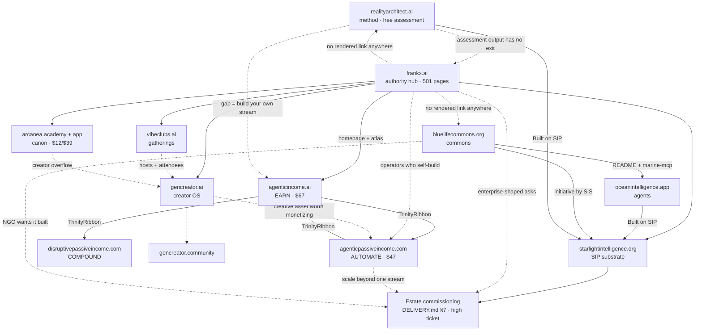

# ICP & FLOW MAP

> Who each property is for, what job they hire it for, how the flow works today, and what the flow has to become.
> Dated 2026-07-25. Every "today" claim cites the audit that verified it — see `audits/`.
> Companion: `POSITIONING_PLAYBOOK.md` (the offer + proof layer), `UPGRADE_ROADMAP.md` (the work order).

**Evidence discipline.** Clusters 1–4 and 6 are grounded in repos present in this checkout. Clusters 5, 7 (academy surface), and 8 have **no repo in this checkout** — their evidence is the Vercel deploy matrix row plus a Sentinel crawl snapshot dated 2026-05-06 (2.5 months stale). Those sections are marked `[thin evidence]` and their ICPs are inferences from live page titles and sibling-repo references, not from source. Verify before acting on them.

---

## 1 · frankx.ai — the authority hub

**Evidence:** `audits/2026-07-25-frankx-deep-audit.md`, `audits/2026-07-25-frankx-route-inventory.md`

**Primary ICP — the in-house operator who has been told to "do AI."**
A senior engineer, architect, or technical lead inside a company that has an AI mandate and no system. They have already run a ChatGPT pilot that impressed nobody, read a dozen agent threads, and installed Claude Code. What they lack is a defensible architecture and the language to defend it upward. They pay for artifacts that make them look competent in a room: reference architectures, assessments they can run on their own org, workshop time.

**Secondary — the technical creator building a personal system.**
Ships content, code, or music solo. Already pays for tools. Wants the operating system around them, not another tool. This is the persona `/agents`, `/prompt-library`, and `/templates` actually serve, and the one GenCreator inherits.

**JTBD:** *"When I have to turn a vague AI mandate into something I can build and defend, I hire frankx.ai to give me the architecture and the artifact so I stop guessing."*

**Current flow.**
Entry is broad and healthy — 501 pages, strong organic surface, and five routes that are genuinely world-class (`/agents`, `/courses`, `/workshops`, `/agentic-ai-center`, `/start-here`). Belief-building works: `/agents` runs on live data counts and states plainly what agents are *not* good at; `/workshops` enforces provenance labels at runtime. Then the flow stops. The header nav (`NavigationMega`) carries 37 routes and **none of the money pages** — workshops, coaching, work-with-me, sprint, shop, founders-circle, inner-circle are all unreachable from the header. `/shop/templates` renders 15 SKUs with **every button disabled "Coming Soon."** `/start-here` promises a "€197, 30-day refund" toolkit that cannot be bought; `data/products.json` routes €97 and €497 products to `/checkout/starter-kit` and `/checkout/command-center`, both hard 404s. Five high-traffic hubs (`/prompt-library`, `/ai-architect-academy`, `/agentic-ai-center`, `/research`, `/vault`) have zero email capture. Zero testimonials sitewide — three testimonial components exist and are imported by nothing.

**Target flow.**
- **Single conversion action:** book a workshop. It is the only offer on this property with a working delivery motion, a defensible price, and a runtime-enforced honesty mechanism already shipped.
- **Proof asset that earns it:** the assessment → architecture brief. Run the assessment, get a named gap and a reference architecture for it. One canonical assessment entry point, not the eight overlapping quizzes the route inventory found.
- **Everything else is a capture step, not a sale.** The 15-SKU template storefront becomes the self-serve floor *after* one payment rail works; until then the buttons stay honest.
- **Handoff:** operator persona who wants to self-build → income trinity. Creator persona → GenCreator. Enterprise-shaped ask → SIS estate commissioning. All three handoffs currently exist only in `data/`, not in rendered links (marine and realityarchitect appear in zero rendered `app/`/`components/` files).

---

## 2 · The income trinity — self-serve revenue

**Sites:** agenticincome.ai (EARN, hub) · agenticpassiveincome.com (AUTOMATE) · disruptivepassiveincome.com (COMPOUND)
**Evidence:** `audits/2026-07-25-income-cluster-audit.md`, `agenticincome/STRATEGY.md`, `agenticpassiveincome/BRAND.md` + `STRATEGY.md`

**Primary ICP — the hour-coupled builder.**
Named in `agenticincome/STRATEGY.md` as "The Builder": a technical or semi-technical creator, developer, or consultant with a Tier-1 agent runtime installed and income still tied to hours. Comfortable with Git. Has tried automating with n8n or a Zapier chain and abandoned it because it broke silently. Will pay for a build plan with honest maintenance numbers — explicitly not for an earnings forecast.

**Secondary — the creator with an asset already worth automating.**
`agenticpassiveincome/STRATEGY.md` defines them precisely: proven skill or body of work, one or more owned surfaces, **5–15 honest maintenance hours per month**. The anti-ICP is stated with equal precision: zero-to-one beginners, zero-hour passive-income seekers, done-for-you buyers.

**JTBD:** *"When my income is still priced in hours, I hire this to pick ONE stream I can actually sustain, get its build plan into my repo, and know the date I stop if it fails."*

**Copy is the strongest in the portfolio and revenue is zero.**

**Current flow.**
Entry via search and the trinity cross-link ribbon (verified: `TrinityRibbon.tsx` + the `network` array in both `lib/site.ts` files — this is the one cross-property link graph that actually renders). Belief-building is excellent: the free Viability Audit and twelve-stream Atlas are positioned as the acquisition product, not a teaser; the Scenario Builder runs browser-local and labels itself a simulation. Then: **checkout does not exist.** Stream Pack 01 ($47) is 100% content-complete. The Blueprint ($67) is fully drafted. `ops/POLAR-SETUP.md` and `FULFILLMENT_RUNBOOK.md` are written. Polar.sh is named merchant of record in both repos. Nobody built the integration. Meanwhile `awesome-agentic-income` carries a "Unlock premium Agent Swarms on Gumroad" CTA that breaks the cluster's own banned-word doctrine and points at an undefined product.

**Target flow.**
- **Single conversion action:** buy Stream Pack 01 ($47). Lowest price, highest completeness, shortest distance to a first real transaction in the entire portfolio.
- **Proof asset that earns it:** the audit's own output. A visitor who finishes the Viability Audit leaves holding their eliminated streams, their honest hours, their failure mode, and their kill date. The pack is the maintained version of the artifact they are already holding.
- **One Polar integration, shared.** Both properties name the same merchant of record. Build once.
- **Handoff:** DPI (COMPOUND) is the portfolio/governance layer above both. frankx.ai should route its self-build operators here — today the homepage links agenticincome.ai (`FrankXProductionHome.tsx`, `MindPalaceAtlas.tsx`) but nothing links the spokes.

---

## 3 · realityarchitect.ai — the method

**Evidence:** `realityarchitect/README.md`, `audits/2026-07-25-verticals-audit.md` (flagship, grade A)

**Primary ICP — the AI tool-user who noticed the reset.**
They use Claude or ChatGPT daily and productively, and every morning starts from zero. They re-explain their context, re-derive the same decisions, and keep no state. They are not looking for prompts. They are looking for the thing that makes yesterday's work available to today.

**Secondary — the agent-runtime user who wants portability.**
Runs Claude Code plus one other harness and is tired of maintaining parallel context. `reality.md` is a portable personal-context standard: eight sections, five protocol verbs, zero lock-in.

**JTBD:** *"When my AI work resets every morning, I hire this to find which of the five moves I'm missing and build that one system this month."*

**Current flow.**
Entry → the manifesto and the Architect's Loop → `/assess` → a locally-generated Markdown architecture brief that never transmits the user's context → fork a starter template. This is the cleanest belief-to-artifact path in the portfolio and it has **no conversion point at all** — MIT, no capture, no offer, no next step beyond "fork it."

**Target flow.**
- **Single conversion action:** adopt `reality.md` — write the file, keep the state directory. The commercial conversion is downstream and deliberate.
- **Proof asset:** the exported architecture brief. It already names the gap; it should also name what it costs to close it and who closes it.
- **Missing link, highest-leverage fix:** the assessment output has no exit. A user who lands on "your gap is move 03, Build" should see the frankx.ai workshop, the income-trinity pack, or SIS estate commissioning depending on gap and scale. Currently the loop closes on itself.
- **Handoff:** this is the natural top-of-funnel for the whole estate. It is also invisible from frankx.ai — `realityarchitect.ai` appears in `data/` only, with zero rendered links.

---

## 4 · Arcanea — arcanea.academy + the app

**Evidence:** `audits/2026-07-25-arcanea-audit.md`

**Primary ICP — the world-builder who wants a coherent universe, fast.**
Writer, game designer, or AI-native creator building a fictional world across text, image, and eventually audio. They have tried keeping canon in Notion and watched it drift. What they want is a canon that holds and tooling that respects it. The strongest surfaces on the site (`/chat`, `/lore`, `/ecosystem` — all graded A) speak directly to them.

**Secondary — the creator-economy participant.**
Arrives for the marketplace and rev-share, not the mythology. Served badly today: rev-share contradicts itself (90%+ on `/creator-economy` vs 70% on store and apps).

**JTBD:** *"When my world keeps drifting out of its own rules, I hire Arcanea to hold the canon so I can keep creating inside it."*

**Current flow.**
Entry is strong and belief-building is world-class on four surfaces. Then the flow hits a wall built out of its own contradictions. `/pricing` shows $0/$12/$39 with **no CTA buttons**, while a complete Stripe checkout/portal/webhook stack sits unused behind `/api/stripe/*` — and the page renders a literal `**40% lifetime discount**` as asterisks. `/studio/store` fires `alert("Stripe Payment of $19 succeeded!")` after a setTimeout and mints a fake on-chain receipt against a Hardhat localhost address. Four different library-collection counts (17 / 20 / 22 / 52) are live simultaneously; three agent counts (13 / 16 / 12) across three surfaces. `lib/facts.ts` exists specifically to prevent this and is imported by three pages.

**Target flow.**
- **Single conversion action:** subscribe at $12. One tier, one button, wired to the checkout that already exists.
- **Proof asset:** the canon itself, rendered honestly. One number per fact, all through `lib/facts.ts`. A book catalog with covers instead of an empty grid; characters as art instead of Unicode glyphs (205 images, 116MB already sit in `public/`).
- **Precondition, not optional:** `/studio/store` is quarantined or deleted before any traffic is driven anywhere near this property. Simulated payment confirmations on a live public domain are not a bug to schedule.
- **Handoff:** Arcanea is the creative expression of the estate, not a revenue engine. It should feed frankx.ai's creator persona and take overflow from GenCreator.

---

## 5 · GenCreator — gencreator.ai + gencreator.community `[thin evidence]`

**Evidence:** deploy-matrix rows; `frankx.ai-vercel-website/data/gencreator-launch-readiness.ts`; Sentinel crawl 2026-05-06 (4 routes: `/`, `/manifesto`, `/playbook`, `/start`; only `/start` carries a distinct title — "Personal AI CoE Starter — Free"). **No repo in this checkout.**

**Primary ICP — the creator who wants a personal AI center of excellence.**
The launch-readiness file states the positioning directly: *"GenCreator helps creators build personal AI operating systems that turn ideas into shipped work, audience, products, and revenue."* Four tracks — create / build / sell / life. The Create track routes to music; the Build track routes to a Claude Code + n8n + Vercel + MCP course. This is a creator who already makes things and wants the system around the making.

**Secondary — the community member.**
gencreator.community is a separate deploy with a separate ICP: someone who wants peers more than curriculum.

**JTBD:** *"When I'm shipping creative work but drowning in my own tooling, I hire GenCreator to give me one operating system for creating, building, and selling."*

**Current flow.**
Four routes, three of which shared a single page title as of the last crawl. `/start` is the only differentiated surface — a free Personal AI CoE Starter. The `LaunchReadinessStatus` type in frankx.ai's own data file enumerates `ready | preview | waitlist | needs-build | paused`, and the brand-order note says plainly: *"AI Architect Academy is delayed until the creator funnel is proven."* The funnel is not yet proven.

**Target flow.**
- **Single conversion action:** claim the Personal AI CoE Starter (free), against a real email capture.
- **Proof asset:** the starter itself, shipped and usable, with an honest status label per the launch-readiness schema.
- **Verify first:** confirm the current route set and whether `/start` captures email before building anything on top of this. The evidence here is 2.5 months old.
- **Handoff:** graduate to frankx.ai courses/workshops for depth, gencreator.community for peers, income trinity when a creative asset is worth monetizing.

---

## 6 · Marine — bluelifecommons.org + oceanintelligence.app

**Evidence:** `blue-life-commons/README.md` + `STRATEGY.md`, `ocean-intelligence-system/README.md`, `audits/2026-07-25-verticals-audit.md` (both flagship, both grade A)

**Primary ICP — the conservation technologist.**
Works at or with an NGO, marine research group, or reef-monitoring project. Has data and no software layer. Needs something they can build a Research-OS on without starting from a blank page. The commons README addresses them by name and the ocean repo hands them 9 MCP connectors, 44+ offline tests, and a daily-refreshed guardian briefing.

**Secondary — the agent builder who needs grounded domain data.**
Wants an MCP server that refuses to invent. `marine-mcp` serves the corpus `grounded or silent` and carries `sources[]` through every response.

**JTBD:** *"When I need ocean facts an agent won't hallucinate, I hire this commons to give me reviewed, cited, machine-readable artifacts."*

**Current flow.**
The best-layered stack in the portfolio: commons (trust) → review-gated MCP (serving) → agents and dashboards (application). Contribution flow is real and CI-gated — sources, ethics, schema, all three checked before merge. Conversion is deliberately not commercial: *"the commons stays free forever — sustainability comes from the work around the knowledge, never from gating it."*

**Target flow.**
- **Single conversion action:** contribute an artifact (species page, region briefing, dataset card, connector). The conversion is a merged PR with the contributor's credit attached.
- **Proof asset:** the guardian briefing. Real output, real citation, real license line, regenerated daily by CI. It demonstrates `grounded or silent` in one screenful.
- **Commercial handoff, explicitly separated:** an NGO that wants the layer built rather than contributed goes to SIS estate commissioning. The commons must never gate to fund this — that boundary is stated in `STRATEGY.md` and should stay stated.
- **This is the reference architecture.** Copy the three-layer shape into music and mind verticals rather than reinventing it.

---

## 7 · Starlight — starlightintelligence.org + .academy

**Evidence:** `Starlight-Intelligence-System/DELIVERY.md`, `CLAUDE.md`, deploy matrix. The `.academy` surface has **no repo in this checkout** `[thin evidence]`.

**Primary ICP — the high-agency principal who wants an owned agent estate.**
DELIVERY.md §7 names them: principals, alliances, and organizations who want "a reliable, compounding, ownable agent army as a true extension — not DIY glue or rented vendor agents." They have already tried DIY and hit the wall where nine tools don't compose. They are buying ownership, not access. Trinity is instance #1.

**Secondary — the sovereign builder forking the substrate.**
Wants their own substrate layer, not Frank's. Takes the MIT fork, rewires it to their entity, attributes SIP. Pays nothing. This is the adoption flywheel and it is load-bearing for the commercial tier above it.

**JTBD:** *"When I need an agent system that is genuinely mine and still compounds, I hire Starlight to commission the estate and steward it."*

**Current flow.**
`/intake` triages into four routes; `/welcome` orients; Concierge takes the builder track and Envoy the zero-terminal creator track. Above that sits a real ladder: stamped artifact (free) → fork (free, MIT) → vertical scaffold → alliance forge → board session → custom advisory → **full estate commission (§7): Blueprint 1–2 weeks, Pilot 2–6 weeks, Steward retainer ongoing.** The ladder is documented with genuine rigor. What it lacks is a public commercial surface — DELIVERY.md is a repo file, and `/intake` assumes someone already inside.

**Target flow.**
- **Single conversion action:** book the estate conversation. Not a checkout — a scoped conversation that produces a 4-layer Blueprint.
- **Proof asset:** the Blueprint itself, and SIS's own integrity record. This is the only repo in the entire portfolio whose documented counts match its filesystem exactly (88 skills / 144 agents / 28 commands, enforced by live conformance harnesses; the prior baseline is in `audits/2026-07-25-registry-sweep.md`). Against a portfolio where other surfaces have drifted, "our registry is accurate and we can show you the receipt" is a real and rare claim.
- **Handoff:** this is the top of the ladder. Everything below it — frankx.ai workshops, income packs, realityarchitect assessment — should have a visible route up to it for the buyer whose problem is bigger than a $47 pack.

---

## 8 · vibeclubs.ai `[thin evidence]`

**Evidence:** deploy-matrix row; Sentinel crawl 2026-05-06 (3 routes: `/`, `/clubs`, `/sessions` — all three sharing the title "Vibeclubs — Host a vibeclub", none carrying a meta description); ACOS `vibeclub-host-coach` agent. **No repo in this checkout.**

**Primary ICP — the host.**
Someone who wants to run a small, high-signal gathering — physical or virtual — for creators working with AI. They are not looking for a platform; they are looking for a format and permission to run it.

**Secondary — the attendee.** Wants to find one nearby and show up.

**JTBD:** *"When I want to gather good people around building with AI, I hire Vibeclubs to hand me the format so I don't have to invent one."*

**Current flow.**
Three routes, one shared title, no per-route metadata. `/clubs` and `/sessions` imply a directory and a schedule; whether either holds real data is unverified from this checkout. Treat as pre-product.

**Target flow.**
- **Single conversion action:** apply to host. One form, one reviewed decision.
- **Proof asset:** one run-of-show a host can execute without asking a question. The host-coach agent already encodes the blueprint framework — publish the artifact it produces.
- **Precondition:** give the three routes distinct titles and descriptions before any traffic. A three-page site with one title is not indexable and reads as abandoned.
- **Handoff:** hosts and attendees are the warmest possible audience for GenCreator and frankx.ai workshops. This is a top-of-funnel community asset, not a revenue property.

---

## Cross-property graph

Solid = link renders in production today (verified). Dashed = the handoff the strategy requires and no link exists.

**What the graph says.** The two link clusters that work — the income trinity ribbon and the marine three-layer stack — are the two clusters with the clearest single owner and the clearest single job. Everything else is a hub-and-spoke from frankx.ai with no return path and no lateral edges. The three highest-value missing edges, in order:

1. **realityarchitect assessment → an offer.** The best free artifact in the portfolio currently converts to nothing.
2. **frankx.ai → income trinity spokes.** The hub links the trinity hub and neither spoke; the $47 product with completed content is two clicks further away than it should be.
3. **Anything → estate commissioning.** The highest-ticket offer in the portfolio has no inbound path from any property that generates traffic.
