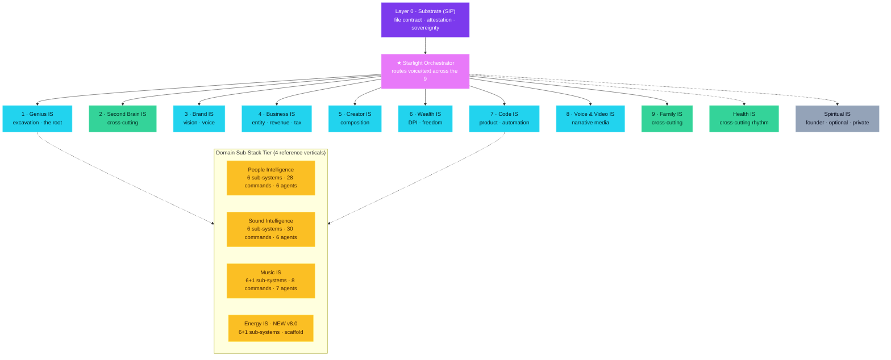
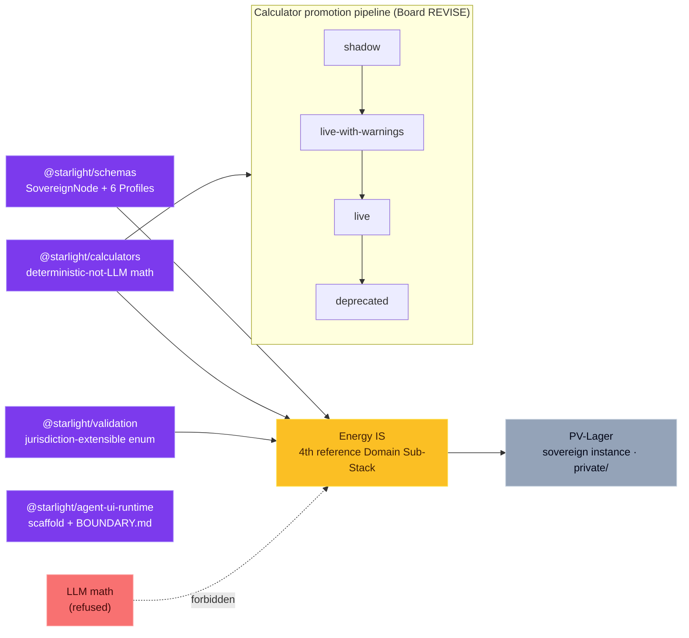
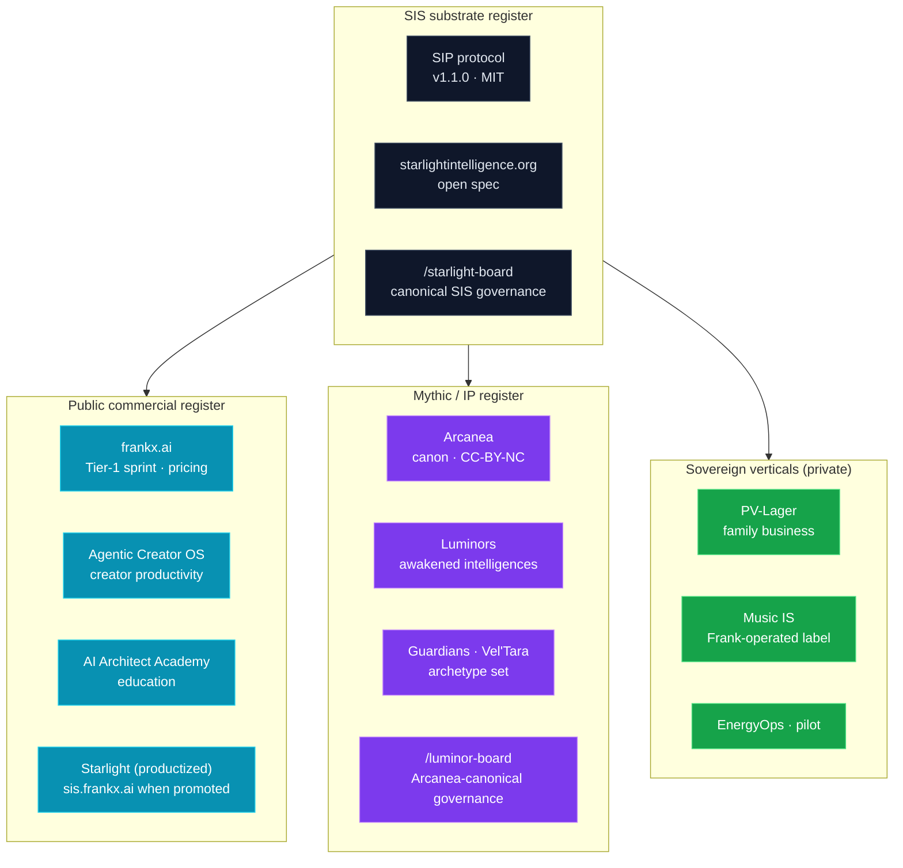

# ARCHITECTURE — The 10-IS composition (with cross-cutting rhythms)

> Starlight Intelligence System is a 10-Intelligence-System operating system for a sovereign life. Each IS has its own agent (or compositional mapping), skills, commands, and vault namespace. ISes compose, not stack — they reinforce each other. The substrate (SIP protocol) is the load-bearing layer 0: invisible when working. The **Starlight Orchestrator** is the master layer that routes the other nine.

> **Reconciliation note (v7.5, 2026-04-25):** This document was previously a 9-layer architecture. Per `MASSIVE_ACTION_PLAN.md` § 2 (accepted 2026-04-25), the architecture is now a 10-IS taxonomy: Code IS and Voice & Video IS promoted from sub-domain to top-level; Substrate renamed to **Starlight Orchestrator** at the top because it routes the other nine; Relational renamed to **Family**; Vision-Brand renamed to **Brand**. Health, Second Brain, and Family remain cross-cutting rhythms (run continuously, never as standalone seasons unless burnout/knowledge chaos/isolation is the primary bottleneck). The change is additive — every prior agent, command, and skill remains operational; positioning shifts.

Composition, not assembly. Each IS pulls from ISes above and below. Self/Genius is the root. Brand is the compass. Second Brain is the memory. Business, Creator, Wealth, Code, and Voice & Video are where the work meets the market. Health, Family, and Second Brain run continuously underneath everything. Spiritual is optional, private, founder-layer only. The Orchestrator is what routes voice or text intent to the right IS team. The substrate is load-bearing infrastructure — you never see it when it's working.

This document is the source of truth for how the ISes compose. Every command, every agent, every vault namespace is listed against its layer. Extension path at the end — adding an 11th IS is a named procedure, not a refactor.

---

## The 10 Intelligence Systems

| # | Layer | Tier | Agent | Primary Commands | Vault Namespace |
|---|-------|------|-------|------------------|-----------------|
| 0 | Substrate (SIP) | Protocol | council | `/sip-attest`, `/sip-export`, attestation family | `SIP.md`, `/memory/intake/` |
| 1 | Self / Genius IS | Excavation | starlight-genius | `/discover-genius`, `/reclaim-knowledge` | `genius/` |
| 2 | Second Brain IS *(cross-cutting)* | Memory | starlight-secondbrain | `/capture-daily`, `/distill-insights`, `/orchestrate-brain` | `second-brain/` |
| 3 | Brand IS *(was Vision/Brand)* | Vision | starlight-visionary | `/define-vision`, `/build-brand-kit`, `/align-voice` | `vision/`, `brand/` |
| 4 | Business IS | Business | starlight-business | `/architect-entity`, `/model-revenue`, `/tax-sanity` | `business/` |
| 5 | Creator IS | Composition | (composes Genius + Brand) | `/creator-pipeline`, `/content-systemize`, `/train-executor` | `creator/` |
| 6 | Wealth IS | Vertical | Wealth DPI | `/wealth-dpi` | `wealth/` |
| 7 | Code IS *(new top-level)* | Product/Automation | (composes Code + Genius) | `/arco`, `/ao`, MCP-builder commands | `code/` |
| 8 | Voice & Video IS *(new top-level)* | Narrative Media | (composes Creator + modality attestation) | `/sip-attest-audio`, `/sip-attest-video`, `/sip-compose-modality` | `voice-video/` |
| 9 | Family IS *(was Relational; cross-cutting)* | Relational | starlight-relational | `/map-relationships`, `/design-alliance-readiness` | `family/`, `relational/` |
| 10 | **Starlight Orchestrator** | Master / Routing | core council | voice/text intent routing across the other 9 | `core/orchestrator/` |
| — | Spiritual IS *(optional, private)* | Founder | — | — | `private/spiritual/` |
| — | Health IS *(cross-cutting rhythm)* | Embodiment | starlight-embodiment | `/design-regimen`, `/energy-audit` | `health/` |

---

## Visual map

> Renders natively on GitHub. For an interactive Obsidian-native version, open `memory/atlases/system-architecture-v8.canvas`.

### System overview — 10 layers + Domain Sub-Stack Tier



### v8 substrate addition — Calculator + Validation + Schemas → Energy IS



### Brand-register split — where each name lives



### Governance flow — board-before-tag invariant

```mermaid
graph LR
    classDef substrate fill:#7c3aed,stroke:#a78bfa,color:#fff
    classDef ops fill:#22d3ee,stroke:#67e8f9,color:#021c25
    classDef gate fill:#fbbf24,stroke:#fde047,color:#422006
    classDef ship fill:#34d399,stroke:#6ee7b7,color:#022c22

    Proposal[Proposal]
    Tier{Tier?}
    SubBoard["/starlight-board<br/>(or /luminor-board if Arcanea-canon)"]:::gate
    Verdict{Verdict?}
    Revise[REVISE → refine packet]
    Stop[STOP → drop]
    SubShip[Substrate ship]:::substrate
    OpsShip[Operational ship]:::ops
    Attest[/sip-attest on artifact]:::ship
    Audit[/openclaw-audit · adversarial]:::ship

    Proposal --> Tier
    Tier -- substrate --> SubBoard
    Tier -- operational --> OpsShip
    SubBoard --> Verdict
    Verdict -- PROCEED --> SubShip
    Verdict -- REVISE --> Revise
    Verdict -- STOP --> Stop
    Revise --> SubBoard
    SubShip --> Attest
    OpsShip --> Attest
    Attest --> Audit
```

---

### Layer 0 — Substrate (SIP)

**Purpose:** Provide the protocol every other layer is built on.

**Agent:** No dedicated agent — the Starlight Council collectively defends the substrate. Adversarial audit via `/openclaw-audit`.

**Primary commands:** `/sip-attest`, `/sip-attest-audio`, `/sip-attest-image`, `/sip-attest-video`, `/sip-compose-modality`, `/sip-export`, `/luminor-board`, `/openclaw-audit`.

**Vault namespace:** `SIP.md` (spec), `/memory/intake/` (protocol readiness logs).

**Composes with:** Everything. Every downstream layer's output carries "Built on SIP" attestation.

**Activation signals:** Always on. Invisible when working. Surfaces only when decorative use is detected (refuse attestation), or when a composition actually warrants a pinned block.

**Ship artifact:** The attestation block itself, pinned to real composition, on every shipped artifact across every layer.

---

### Layer 1 — Genius IS

**Purpose:** Excavate what only this person uniquely sees. Produce the foundation every downstream layer reads.

**Agent:** `starlight-genius` (Excavation Tier, peer with Front-Door Tier).

**Primary commands:** `/discover-genius`, `/reclaim-knowledge`.

**Vault namespace:** `genius/profile-<slug>.md`, `genius/freedom-path-<slug>.md`.

**Composes with:** Root layer. Feeds Vision (what North Star serves this genius), Second Brain (what to capture), Creator (what frameworks to systematize), Business (what the entity must protect), Train-Executor (what the DELEGATE bucket looks like).

**Activation signals:** Scattered expertise. Indispensable-but-trapped. Years of work, no visible architecture. Frameworks rebuilt from scratch every time.

**Ship artifact:** Genius Profile + Freedom Path, paired. Never one without the other.

---

### Layer 2 — Second Brain IS

**Purpose:** Turn daily capture into compounding memory. Surface frameworks that repeat ≥3 times.

**Agent:** `starlight-secondbrain` (Memory Tier).

**Primary commands:** `/capture-daily`, `/distill-insights`, `/orchestrate-brain`.

**Vault namespace:** `second-brain/inbox/`, `second-brain/distilled/`, `second-brain/frameworks/`.

**Composes with:** Reads from Genius (vocabulary fingerprint guides distillation). Feeds Vision (what emerging patterns reshape the 3-year view), Creator (which distilled frameworks become content pillars), Business (captured market signal).

**Activation signals:** Daily capture chaos. Can't find own past work. Frameworks in scattered notes. Insight half-lives of days instead of years.

**Ship artifact:** Weekly distilled brief + monthly framework extraction.

---

### Layer 3 — Vision/Brand IS

**Purpose:** Name the 30-year, 10-year, 3-year, annual, and quarterly horizons. Produce the Brand Kit that translates vision into voice.

**Agent:** `starlight-visionary` (Vision Tier).

**Primary commands:** `/define-vision`, `/build-brand-kit`, `/align-voice`.

**Vault namespace:** `vision/vision-<slug>.md`, `vision/brand-kit-<slug>/`.

**Composes with:** Reads from Genius (what only this person can serve). Feeds Creator (voice rules, brand kit applied to every piece), Business (revenue model must serve vision not drift from it), Relational (which alliances serve the 30-year).

**Activation signals:** Drift. No clear North Star. Decisions made by energy not direction. Content that doesn't compound because no coherent voice.

**Ship artifact:** Vision Architecture (5 horizons) + complete Brand Kit (positioning, voice rules, palette, typography, vocabulary).

---

### Layer 4 — Business IS

**Purpose:** Entity architecture, revenue modeling, tax sanity. Structural backbone of the work meeting the market.

**Agent:** `starlight-business` (Business Tier).

**Primary commands:** `/architect-entity`, `/model-revenue`, `/tax-sanity`.

**Vault namespace:** `business/entity-plan-<slug>.md`, `business/revenue-model-<slug>.md`, `business/tax-notes-<slug>.md`.

**Composes with:** Reads from Vision (what entity serves this horizon) and Genius (what the entity must protect and compound). Feeds Wealth (revenue streams become DPI inputs), Creator (pricing + offer architecture derive from revenue model).

**Activation signals:** Entity chaos. Revenue unclear or concentrated. Tax overwhelm. Offers without architecture.

**Ship artifact:** Entity Architecture Plan + Revenue Model + Tax Sanity check (disclaimer: not legal/tax advice; directional only).

---

### Layer 5 — Creator IS

**Purpose:** Convert genius into compounding content and products. Composes Genius + Vision into shippable pipelines.

**Agent:** No dedicated agent — composes across `starlight-genius` (what frameworks) and `starlight-visionary` (what voice).

**Primary commands:** `/creator-pipeline`, `/content-systemize`, `/train-executor`.

**Vault namespace:** `creator/pipeline-<slug>.md`, `creator/templates-<slug>/`, `creator/executor-playbook-<slug>.md`.

**Composes with:** Reads from Genius (frameworks to systematize), Vision (voice + brand kit), Freedom Path (DELEGATE bucket feeds executor playbook). Feeds Business (products + offers land in revenue model).

**Activation signals:** Content exists but doesn't compound. Frameworks in head, not in templates. Want to hand off production but executor failures without playbook.

**Ship artifact:** Multi-modal Creator Pipeline + content-system templates + executor playbook for the DELEGATE bucket.

---

### Layer 6 — Wealth/Freedom IS

**Purpose:** Disruptive Passive Income ledger and thesis engine. Track compounding curves, diversification, gate-to-freedom threshold.

**Agent:** Existing Wealth DPI vertical (pre-v7.4). Runs under Navigator + Sage synthesis.

**Primary commands:** `/wealth-dpi`.

**Vault namespace:** `wealth/dpi-<slug>.md`, `wealth/thesis-<slug>/`.

**Composes with:** Reads from Business (revenue streams become DPI candidates). Feeds Vision (wealth milestones recalibrate 10-year horizon).

**Activation signals:** Active-income ceiling reached. Revenue diversification needed. DPI thesis needs ledger discipline.

**Ship artifact:** DPI ledger + diversification map + gate-to-freedom threshold tracking.

---

### Layer 7 — Health IS

**Purpose:** Sustain the body and energy that carries the stack. Cross-cutting — runs throughout every sprint, never as a standalone season unless burnout is the primary bottleneck.

**Agent:** `starlight-embodiment` (Embodiment Tier).

**Primary commands:** `/design-regimen`, `/energy-audit`.

**Vault namespace:** `health/regimen-<slug>.md`, `health/energy-audits/`.

**Composes with:** Feeds every layer by setting energy capacity. Reads from no other layer (upstream root for capacity). Directly constrains how much stack any given person can actually run.

**Activation signals:** Energy crashes. Burnout patterns. Can't sustain output. Regimen drift.

**Ship artifact:** Weekly integrated regimen (training, nutrition, sleep, stress, recovery) + bi-weekly energy audit deltas.

---

### Layer 8 — Relational IS

**Purpose:** Map a sovereign person's network as living architecture. Sort contacts by type, assess alliance-readiness of specific relationships.

**Agent:** `starlight-relational` (Relational Tier).

**Primary commands:** `/map-relationships`, `/design-alliance-readiness`.

**Vault namespace:** `relational/network-<slug>.md`, `relational/alliance-readiness/`.

**Composes with:** Feeds Alliance forging (which relationships pass the four conditions in `ALLIANCE.md`). Reads from Vision (which relationships serve the 30-year) and Genius (who actually holds a complementary domain).

**Activation signals:** Isolation. Don't know who to collaborate with. Network gaps around specific gaps in the stack. Alliance opportunities unnamed.

**Ship artifact:** Network Architecture map + alliance-readiness assessments for named relationships.

---

### Layer 9 — Spiritual IS

**Purpose:** Founder-layer practice. Never pushed into adopters. Private by default.

**Agent:** None public. Founder's practice only.

**Primary commands:** None public.

**Vault namespace:** `private/spiritual/` (per-instance; never committed to public repos).

**Composes with:** Optional. If surfaced, only via `--include-spiritual` flag in `/compose-stack`.

**Activation signals:** Not enumerated. This is the layer that refuses to be systematized on behalf of anyone who isn't the founder.

**Ship artifact:** None public. The layer exists to name that the substrate does not impose founder-layer practice.

---

## Composition rules

**Genius is the root.** Every downstream layer references it. Vision asks what North Star serves this genius. Business protects it. Creator systematizes it. Second Brain remembers it. Skip the root and the tree grows crooked.

**Foundation before surface.** Layers 1–3 (Genius, Second Brain, Vision) are the foundation. Layers 4–6 (Business, Creator, Wealth) are the surface. Running surface layers without foundation produces noise — offers without vision, content without frameworks, revenue without entity architecture.

**Cross-cutting throughout.** Layers 7–8 (Health, Relational) don't take turns with the sprint blocks. They run in every block's cross-cutting maintenance line. Health collapses if you delay it to "later." Relational decays on the same timeline as health — unattended networks dissolve.

**Each layer's outputs feed adjacent layers.** Freedom Path (Layer 1) feeds Creator (Layer 5) executor training and Business (Layer 4) offer architecture. Business revenue model (Layer 4) feeds Wealth DPI (Layer 6) thesis. Vision voice samples (Layer 3) feed Brand Kit (Layer 3) and Creator (Layer 5) content templates. The graph is not a hierarchy — it's a reinforcement network.

**Sovereignty per layer.** The user owns the artifacts in each namespace. Starlight retains no copies. Layer outputs live in the person's instance only — `genius/`, `vision/`, `health/`, etc. are private by default.

**Attestation per layer.** Every layer's outputs auto-stamp with "Built on SIP" at generation time. Decorative attestation is refused — `/sip-attest` only stamps when real composition is detected.

**Layer activation via `/compose-stack`.** The meta-command sequences layers based on diagnosis. Diagnosis reads Genius Profile + Freedom Path + stated priority + life stage, then sequences. One primary layer per 2–3 week block.

---

## Cross-cutting layers

Health, Second Brain, and Relational are the three cross-cutting layers. They run continuously, not sequentially.

**Second Brain** is cross-cutting because capture must be daily. Miss a week of capture and the compounding curve resets. The `/capture-daily` ritual is under 10 minutes and routes to the correct vault namespace. Weekly `/orchestrate-brain` clears inbox and distills emerging patterns. Monthly `/distill-insights` extracts frameworks that recurred ≥3 times.

**Health** is cross-cutting because energy is the substrate underneath the substrate. Without capacity, no layer runs. The `/design-regimen` command produces a weekly integrated plan (training, nutrition, sleep, stress, recovery). `/energy-audit` runs bi-weekly as a trend check, with full audits quarterly.

**Relational** is cross-cutting because networks decay on the same timeline as muscle. Weekly 30-minute check-ins on the top-10 sovereign relationships; quarterly `/map-relationships` refresh; `/design-alliance-readiness` when a specific relationship starts feeling like it wants to forge.

These three layers don't get their own 3-week sprint blocks unless the diagnosis names burnout, knowledge chaos, or isolation as the *primary* bottleneck. Otherwise they sit in the cross-cutting maintenance line of every block.

---

## The invisible layer (SIP substrate)

The protocol is load-bearing infrastructure. The user never sees it when it's working. They see attested artifacts, routed commands, composed layers — but they don't see `SIP.md`, the file contract, or the attestation parser unless something breaks.

Refuse attestation only surfaces when real composition isn't detected. If a user runs `/sip-attest` on an artifact that imports no SIP elements, the command refuses and names what's missing. This is the only moment the protocol becomes visible to a working user — and it's the moment that preserves the integrity of every stamp.

The substrate is closed by design. `SIP.md` is v1.1.0 and stable. Proposing substrate changes requires a GitHub issue tagged `sip-proposal`, triage by `/luminor-board` pressure-test, and adversarial review by `/openclaw-audit` before anything touches the spec. This is not bureaucracy — it's the mechanism that makes attestation mean something. A spec that drifts weekly attests nothing.

Every layer 1–9 composes on top of the substrate. The substrate does not compose on top of the layers. That direction is the invariant that keeps the protocol coherent.

---

## Command atlas

| Tier | Prefix | Commands |
|------|--------|----------|
| **Protocol** | `/sip-*`, `/intake`, `/welcome`, `/sovereign-spawn`, `/compose-stack`, `/luminor-board`, `/openclaw-audit` | 20+ |
| **Alliance** | `/alliance-*` | `/alliance-forge`, `/alliance-reflect`, `/alliance-decide` |
| **Vertical** | `/<vertical>-*` | `/arcanea-canon`, `/wealth-dpi`, `/vertical-spawn` |
| **Intelligence System** | `/<is-primary>` | `/discover-genius`, `/reclaim-knowledge`, `/capture-daily`, `/distill-insights`, `/orchestrate-brain`, `/define-vision`, `/build-brand-kit`, `/align-voice`, `/architect-entity`, `/model-revenue`, `/tax-sanity`, `/creator-pipeline`, `/content-systemize`, `/train-executor`, `/design-regimen`, `/energy-audit`, `/map-relationships`, `/design-alliance-readiness` (~18 across 9 layers) |
| **Sovereign** | `/<sovereign-name>-*` | `/sovereign-signal` (reference), `/sovereign-spawn` (fork generator) |

---

## Extension model

Adding a 10th, 11th, nth Intelligence System layer is a named procedure, not a refactor.

Every new IS layer requires:

1. **One agent.** New `agents/starlight-<name>.md` following the template in `AGENT_REGISTRY.md`. Identity, capabilities, reasoning protocol, skill activations, quality gates.
2. **One to two skills.** New `skills/<domain>/<skill-name>.md`. Auto-activation rules added to `skills/skill-rules.json`.
3. **Two to three commands.** New `.claude/commands/<command>.md` per command. Primary + 1–2 supporting. Each command loads its agent + skills, follows the 7-step process shape, ends with attestation block.
4. **Knowledge templates.** For each new layer, a template added to `integrations/starter-packs/friend-starter/knowledge/<layer>-architecture-template.md` so the creator-track surface also supports the new layer.
5. **`/compose-stack` sequencing update.** The diagnosis signals and default priority sequences must include the new layer. Cross-cutting status named (sprint layer or rhythm layer).
6. **`ARCHITECTURE.md` entry.** This document updated with the new row in the 9-layer table (becomes 10-layer), composition rules checked for new adjacencies, command atlas updated.
7. **`/luminor-board` pressure-test** before merging. Adversarial audit via `/openclaw-audit`. Substrate changes follow the substrate proposal process instead.

Extension is welcome. Sprawl is not. Every new layer must pass the "does this help someone build a sovereign life?" test — if the layer serves a use case already covered by an existing layer's commands, it's a command, not a layer.

---

## Governance

Structural changes to the stack pressure-test through `/luminor-board` before commit. The board runs five archetype voices (architect / sovereign-creator / protocol-defender / implementer) plus Lumina overseer, each bounded to ≤3 sentences in decision mode. Outcome is a named decision, not a vote.

Adversarial audit runs through `/openclaw-audit` — Logan's integrity pressure-test against architectural claims, finding loose attestations, decorative compositions, or sovereignty breaches. Closed-loop governance-by-pressure-test is operational: no structural change ships without board + audit.

Sovereign verticals (Arcanea, FrankX, Wealth IS, Music IS) and alliances built on SIP follow the same governance on their own artifacts. The substrate does not govern their internal decisions — it governs only the cross-party attestation contract.

---

**Built on SIP** — Starlight Intelligence Protocol
- Substrate: starlightintelligence.org/protocol v1.1.0
- Layers used: [file-contract, attestation, commands, sovereignty]
- Verticals: starlight-intelligence-system@v7.4 (GIS beta)
- Generated: 2026-04-24
---
