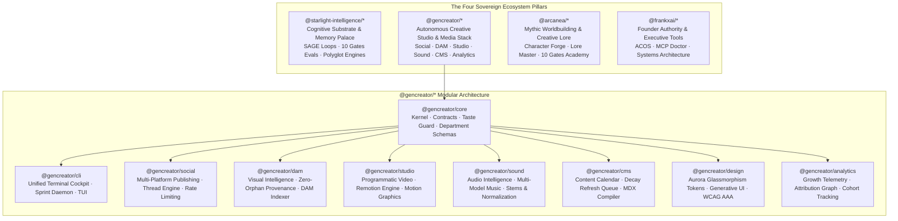
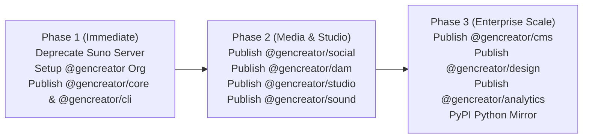

# GenCreator Sovereign Ecosystem & Package Architecture Master Plan

> **The Sovereign Creative Engine · Autonomous Media Architecture · Enterprise Creator Stack**  
> *Author: FrankX × GenCreator Architecture Swarm*  
> *Specification Version: GenCreator v1.0 / SIP v1.1.1*  
> *Target Namespace: `@gencreator/*` (`https://www.npmjs.com/org/gencreator`)*

---

## Executive Summary

The creator economy has been fragmented across dozens of disconnected SaaS subscriptions: Buffer/Hootsuite for social scheduling, Typefully/Hypefury for thread formatting, Brandfolder/Bynder for Digital Asset Management (DAM), Descript/CapCut for editing, Remotion for programmatic video, Substack/Ghost for CMS publishing, and Google Analytics/PostHog for metrics.

**GenCreator** transforms this fragmented landscape into a unified, autonomous, agent-native creative operating system. By packaging these capabilities into a modular, production-grade `@gencreator/*` suite on npm, we establish the definitive developer and creator standard for AI-native media production, distribution, and attribution.



---

## 1. Org & Namespace Architecture: The 4 Sovereign Pillars

| Pillar | NPM Scope | Target Persona | Core Job To Be Done | Reference Stack |
| :--- | :--- | :--- | :--- | :--- |
| **Starlight Intelligence** | `@starlight-intelligence/*` | AI Architects, Engineers, Enterprise Swarms | Cognitive persistence, 6-vault memory, SAGE self-healing, model protocol routing | `Starlight-Intelligence-System`, `starlight-memory` |
| **GenCreator** | `@gencreator/*` | Content Creators, Media Labs, Growth Hackers, Agencies | End-to-end media production, multi-platform publishing, DAM, sound, video, analytics | `GenCreator-OS`, `GenCreator-Studio`, `agentic-creator-os` |
| **Arcanea** | `@arcanea/*` | Worldbuilders, Game Designers, Authors, Storytellers | 10 Gates Academy, Guardian personas, mythic world-graph, character forge | `arcanea`, `arcanea-ai-app` |
| **FrankX** | `@frankxai/*` | Founders, Executive Teams, Power Builders | Curated personal tools, bespoke MCP diagnostics, authority CLI | `mcp-doctor`, `agentic-creator-os` |

---

## 2. The 9-Package GenCreator Suite Specification

### Package 1: `@gencreator/core` — The Creator Kernel & Contract Layer
* **Role**: Foundation package containing all TypeScript interfaces, department schemas, and quality gates. Zero native dependencies; edge-compatible.
* **Core Capabilities**:
  - **Department Definitions**: Strongly typed roles for `Business`, `Content`, `Design`, `Dev`, and `Marketing`.
  - **Taste Guard Runtime**: Deterministic anti-slop filters, tone calibration, and brand voice verification.
  - **Execution State & Checkpoints**: Serialization protocol for creator sprints and tasks.
* **Key Export**:
  ```typescript
  import { defineCreatorJob, TasteGuard, DepartmentRole } from '@gencreator/core';
  ```

---

### Package 2: `@gencreator/cli` — Master Terminal Cockpit
* **Role**: The unified CLI and TUI dashboard for creator operations.
* **Bin Command**: `gencreator` (and `npx @gencreator/cli`).
* **Core Capabilities**:
  - `gencreator sprint`: Launch autonomous multi-agent creation sprints.
  - `gencreator status`: Real-time dashboard showing social schedule, render queue, and memory sync.
  - `gencreator publish`: One-command multi-platform distribution.
  - Interactive Ink / Blessed terminal UI for keyboard-driven creation.

---

### Package 3: `@gencreator/social` — Universal Social Distribution & Automation
* **Role**: Enterprise-grade multi-platform social media publishing, scheduling, and browser automation engine.
* **Supported Platforms**:
  - **X / Twitter**: API v2 threads, media uploads, poll handling, auto-retweets, quote tweets.
  - **LinkedIn**: Organization and personal profile posting, carousel PDFs, rich markdown conversion.
  - **Instagram / Threads**: Graph API carousel generation, vertical reels metadata, caption hashtag optimization.
  - **Farcaster**: Neynar / Hubble hub publishing, frame creation, channel targeting.
  - **YouTube**: Community posts, video metadata updates, Shorts uploading.
  - **Postiz & Blotato Bridges**: Headless self-hosted social publishing server integrations.
* **Core Capabilities**:
  - Smart rate-limiting with exponential backoff and jitter.
  - Character budgeting per platform with automatic smart-threading.
  - Code-to-image snippet rendering with syntax highlighting.
* **Key Export**:
  ```typescript
  import { SocialDistributor, Platform } from '@gencreator/social';

  const social = new SocialDistributor();
  await social.publish({
    content: "Why top AI labs build modular primitives...",
    platforms: [Platform.X, Platform.LINKEDIN, Platform.FARCASTER],
    media: [heroImageBuffer]
  });
  ```

---

### Package 4: `@gencreator/dam` — Digital Asset Management & Visual Intelligence
* **Role**: The media indexing, search, and storage backbone for AI-generated visual assets.
* **Core Capabilities**:
  - **Zero-Orphan Provenance**: Cryptographically links every image/video file to its generating prompt, seed, model checkpoint, and author.
  - **Multi-Cloud Storage Projections**: Unified interface across local NVMe, Supabase Storage, AWS S3, Cloudinary, and Cloudflare R2.
  - **Aesthetic Scoring & Auto-Tagging**: Extracts dominant color palettes, aspect ratios, mood descriptors, and suitable layout placements.
  - **SQLite FTS5 Asset Graph**: Fast full-text and tag search across 100,000+ local assets in sub-5ms.

---

### Package 5: `@gencreator/studio` — Programmatic Video & Motion Graphics
* **Role**: Headless video production engine built on Remotion and WebGL shaders.
* **Core Capabilities**:
  - **Dynamic Template Presets**: 9:16 Shorts/Reels/TikTok, 16:9 YouTube Long-Form, 1:1 Square Feed.
  - **Automated Caption Burner**: Whisper/SRT timestamp synchronization with kinetic word-level highlight animation.
  - **Audio-Reactive Visualizers**: Real-time waveform, spectrum, and pulse bars driven by track audio stems.
  - **Headless Cloud Rendering**: One-command bundling to AWS Lambda or serverless video rendering clusters.

---

### Package 6: `@gencreator/sound` — Audio & Music Intelligence (Consolidated)
* **Role**: Enterprise audio and music engine. Replaces single-tool wrappers with a multi-model audio pipeline.
* **Core Capabilities**:
  - **Multi-Provider Dispatch**: Unified adapter for Suno, Udio, ElevenLabs (Voice Cloning & SFX), and local MusicGen/Audiocraft.
  - **Audio Engineering Pipeline**: Stems separation (Vocals, Drums, Bass, Instruments), key/BPM auto-detection, and broadcast loudness normalization (-14 LUFS for streaming).
  - **Rights & ISRC Metadata**: Cryptographic provenance and metadata packaging for official music distribution.

---

### Package 7: `@gencreator/cms` — Autonomous Content Strategy & Publishing
* **Role**: Editorial strategy, editorial calendars, and dynamic MDX publication engine.
* **Core Capabilities**:
  - **Decay Refresh Queue**: Identifies published high-traffic articles suffering from factual decay or broken links and schedules automatic updates.
  - **MDX Super-Compiler**: Generates interactive React/Next.js blog pages with live code execution blocks, SEO JSON-LD schema, and OpenGraph cards.
  - **Multi-Destination Sync**: Simultaneous export to Ghost, WordPress, Substack, Vercel Next.js, and Resend email newsletters.

---

### Package 8: `@gencreator/design` — Web Design & Generative UI System
* **Role**: The visual language and component engine powering creator web properties.
* **Core Capabilities**:
  - **Design Token Kernel**: Pre-configured CSS/Tailwind tokens for Aurora glassmorphism, typography scales, spacing grids, and high-contrast dark themes.
  - **Generative UI Bridge**: Native integration with v0 and Claude for code component generation adhering to WCAG AAA accessibility.
  - **Visual QA Gate**: Automated headless browser testing to flag visual regressions, layout shifts (CLS), and mobile breakpoint clipping.

---

### Package 9: `@gencreator/analytics` — Growth Telemetry & Attribution Graph
* **Role**: Privacy-focused creator growth metrics and audience intelligence.
* **Core Capabilities**:
  - **Unified Audience Graph**: Correlates followers and engagement across X, LinkedIn, YouTube, and website traffic.
  - **Topic Compounding Score**: Calculates which content themes yield compounding long-term traffic versus short-lived spikes.
  - **Feedback Ingestion Loop**: Feeds audience comments and questions directly into the `@gencreator/cms` prompt queue for next-sprint ideas.

---

## 3. NPM Org Configuration (`gencreator`)

To enable seamless publishing to `https://www.npmjs.com/settings/gencreator/packages`:

1. **Default Visibility**:
   - Go to `https://www.npmjs.com/settings/gencreator/packages`
   - Set **Default package visibility** to: **Public**  
     *(NPM organizations default to Private, which triggers 402/403 errors unless explicitly overridden or on paid plans).*

2. **Access Token Permission**:
   - Go to `https://www.npmjs.com/settings/frankxai/tokens`
   - Select your active publishing token (`npm_5s8vmq...`)
   - Under **Organization access**, add `gencreator` with **Read and Write** permissions.
   - Click **Save**.

---

## 4. Phase-by-Phase Execution Roadmap



1. **Immediate Execution**:
   - Deprecate `@frankxai/suno-mcp-server` across all versions (Completed).
   - Configure public visibility on `https://www.npmjs.com/settings/gencreator/packages`.
   - Scaffold and publish `@gencreator/core` and `@gencreator/cli`.
2. **Media & Studio Deployment**:
   - Package the proven social adapters from `agentic-creator-os/mcp-servers/social` into `@gencreator/social`.
   - Package VIS 3.0 asset indexing from `visual-intelligence` into `@gencreator/dam`.
   - Package Remotion pipelines from `GenCreator-OS` into `@gencreator/studio`.
   - Package audio intelligence into `@gencreator/sound`.
3. **Ecosystem Domination**:
   - Launch public documentation at `gencreator.ai/docs`.
   - Release the Python PyPI client (`pip install gencreator-sdk`).
