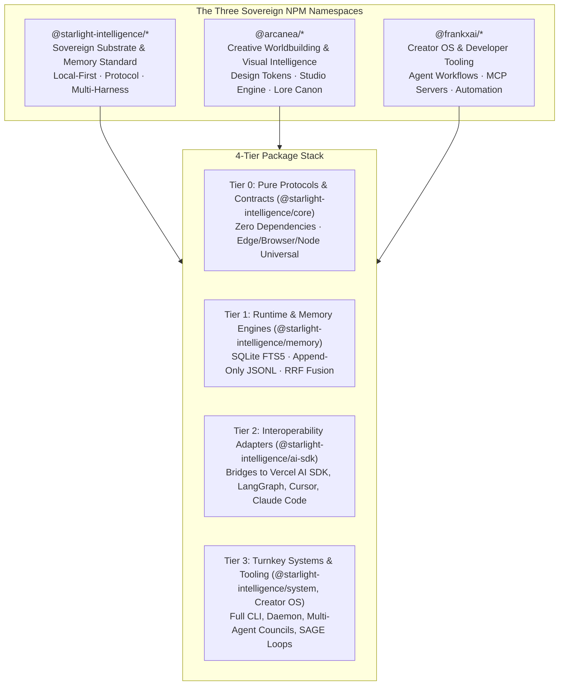
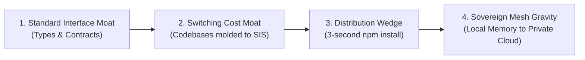

# Starlight & Arcanea NPM Ecosystem Strategy & Frontier Architecture Blueprint

> **Sovereign Substrate · Multi-Harness Symmetry · Enterprise Memory Standard**  
> *Author: FrankX × Starlight Systems Architecture*  
> *Date: October 2026*  
> *Specification Version: SIP v1.1.1 / SIS v8.3.0*

---

## Executive Summary

This document establishes the strategic, organizational, and technical blueprint for how **Starlight Intelligence Systems**, **Arcanea**, and **FrankX** structure, publish, and scale their npm packages to build durable technological moats, achieve developer mindshare, and establish sovereign AI leadership alongside top AI labs (Vercel, Anthropic, OpenAI, LangChain, and Mastra).

---

## 1. Competitive Teardown: How Top AI Labs Organize NPM Packages

Top AI engineering organizations do not distribute single monolithic codebases. They design modular package topologies engineered for specific strategic outcomes:

### A. Vercel (`ai`, `@ai-sdk/*`) — The Provider-Agnostic Abstraction Wedge
* **Structure**:
  * `ai`: Core orchestration kernel (streaming lifecycle, `generateText`, `streamText`, `generateObject`, tool calling).
  * `@ai-sdk/<provider>`: Isolated provider adapters (`openai`, `anthropic`, `google`, `deepseek`, `groq`, `mistral`, `amazon-bedrock`).
  * `@ai-sdk/<framework>`: Frontend bindings (`react`, `vue`, `svelte`, `solid`).
* **Why**: Prevents bloated dependency trees. An engineer using Claude 3.7 never installs the OpenAI or Google SDKs.
* **The Strategic Moat**: **Zero vendor lock-in at the model layer, but 100% lock-in to the Vercel Edge Runtime & Streaming Lifecycle.** Vercel commoditized the underlying LLMs while becoming the indispensable highway for streaming UI.

### B. Anthropic (`@modelcontextprotocol/*`, `@anthropic-ai/sdk`) — The Protocol Standard
* **Structure**:
  * `@anthropic-ai/sdk`: Highly optimized, generated via Stainless from OpenAPI specs. Zero runtime bloat, SSE stream parsers, strict types.
  * `@modelcontextprotocol/sdk`, `@modelcontextprotocol/inspector`: Open JSON-RPC client/server protocol over `stdio` and `SSE`.
* **Why**: Anthropic decoupled the MCP protocol from Claude branding. Because the SDK is neutral, lightweight, and open, competitors (Cursor, Windsurf, Zed, Gemini CLI, Antigravity) adopted it natively.
* **The Strategic Moat**: **Controlling the protocol means controlling the ecosystem's nervous system.** When everyone writes MCP servers, Anthropic models inherently operate with the richest tool surface on Earth.

### C. LangChain / LangGraph (`@langchain/core`, `@langchain/langgraph`) — The State-Machine & Telemetry Wedge
* **Structure**:
  * Split after developer backlash: `@langchain/core` (Runnable interfaces, base messages), `@langchain/community` (community integrations), and `@langchain/langgraph` (cyclic graph state machines).
* **Why**: Separated stable core contracts from third-party wrappers that frequently break.
* **The Strategic Moat**: **The Telemetry Trojan Horse.** Developers build locally with free open-source LangGraph packages, but to monitor, debug, and evaluate multi-agent loops in production, enterprises subscribe to LangSmith ($$$ B2B SaaS).

### D. Mastra (`@mastra/core`, `@mastra/evals`, `@mastra/memory`) — The TypeScript-First Challenger
* **Structure**:
  * Built natively for full-stack Next.js/Node engineers who rejected Python-first frameworks (CrewAI, AutoGen). Modularized into agents, workflows, evals, and memory.
* **Why**: Modern web applications and agentic full-stack SaaS are written in TypeScript, not Python.

---

## 2. What Moats NPM Distribution Builds

1. **The Standard-Setting / Interface Moat**:
   Whoever defines the interface (`VaultEntry`, `MemoryQuery`, `HarnessBridge`, `AttestationFooter`) controls the mental model of developers. Once an enterprise models their memory and agent state around your schemas, migration costs are astronomical.
2. **The Frictionless Distribution Wedge**:
   `npm install` takes 3 seconds. It bypasses security gatekeepers, enterprise procurement, and sales meetings. A developer experiments locally in an hour; six months later, the company runs their entire autonomous fleet on it.
3. **The Sovereignty Moat (Starlight's Unique Advantage)**:
   Proprietary SDKs funnel data into closed vendor clouds. In an era where enterprises and creators demand data ownership, privacy, and local-first autonomy, **Starlight Intelligence Protocol (SIP) provides verifiable sovereignty**. You own your memory vaults; no proprietary cloud holds your intelligence hostage.

---

## 3. Honest Reality Check: Starlight Engineering Inventory

### What We Already Have (Elite Engineering)
* **Hybrid Semantic Memory Substrate**: Append-only JSONL event sourcing + SQLite FTS5 full-text indexing + Reciprocal Rank Fusion (RRF) + 90-day temporal half-life decay. Far superior to naive vector RAG that forgets context or hallucinates.
* **Multi-Harness Symmetry Across 10 Harnesses**: Simultaneous, seamless context coordination across Claude Code, Cursor, Codex, Gemini CLI, OpenCode, Antigravity, Grok, and Hermes.
* **The Veil & Sanitization Gateway**: Local-first PII and secret scrubbing ensuring zero private data leakage.
* **SAGE Self-Healing Loops**: Goal serialization, automated checklist tracking, Sentinel audits, and git rollbacks.

### Where We Must Think & Work Harder (Gaps to Top AI Labs)
1. **Monolithic Weight vs. Featherlight SDK**:
   * *Current*: SIS is an operational power suite packed with CLI tools, scripts, and daemon runners.
   * *Need*: A micro-SDK (`@starlight-intelligence/core`) with 0 external dependencies that runs anywhere—Node, Deno, Bun, Cloudflare Workers, or Next.js Edge.
2. **Ecosystem Interoperability**:
   * *Current*: Starlight is an insular, sovereign universe.
   * *Need*: Bridges to the outside world—specifically `@starlight-intelligence/ai-sdk` (so Vercel AI SDK users can use Starlight memory in one line of code) and `@starlight-intelligence/mcp`.
3. **Developer Experience (DX) & Documentation**:
   * *Current*: Markdown documentation files inside repositories.
   * *Need*: An authoritative, interactive developer portal (`starlightintelligence.org/docs`) with live memory palace visualizations, copy-paste snippets, and TypeDoc references.
4. **Transparent Empirical Benchmarks**:
   * *Current*: Internal testing and qualitative validation.
   * *Need*: Rigorous public evals comparing Starlight Memory against Mem0, LangMem, and LangGraph Store on latency, retrieval precision, and token consumption.

---

## 4. The 3-Phase Master Roadmap

### Phase 1: Foundation & Decomposition (Days 1–30)
* [x] **Audit & Re-scoping**: Standardize all packages under `@starlight-intelligence`, `@arcanea`, and `@frankxai`.
* [x] **Tarball Dry-Run & Whitelisting**: Ensure zero secret or private vault leakage (`PACK READY`).
* [ ] **Publish Base Suite**:
  * `@starlight-intelligence/system@8.3.0`
  * `@starlight-intelligence/memory@0.2.0`
  * `@starlight-intelligence/creator-mcp@0.1.0`
  * `@frankxai/agentic-creator-os@15.0.0`
  * `@frankxai/suno-mcp-server@0.1.0`
  * `@arcanea/starlight-intelligence-system@8.3.0` (Backward-Compatibility Shim)
* [ ] **Carve out `@starlight-intelligence/core`**:
  * Pure TypeScript interfaces: `VaultEntry`, `MemoryFilter`, `SIPAttestation`, `HarnessBridge`.
  * Zero runtime dependencies, universal edge compatibility.
* [ ] **Automated GitHub Actions OIDC Releases**:
  * Implement `@changesets/cli` and automated publishing with npm provenance.

### Phase 2: Interoperability Bridges & Developer Ergonomics (Days 30–90)
* [ ] **Vercel AI SDK Memory Provider (`@starlight-intelligence/ai-sdk`)**:
  * Enable Next.js developers to inject sovereign Starlight memory into `streamText` / `generateText`.
* [ ] **First-Class MCP Suite (`@starlight-intelligence/mcp`)**:
  * Standalone, plug-and-play MCP server for Starlight vaults, memory recall, and council orchestration.
* [ ] **Launch Documentation Hub (`starlightintelligence.org/docs`)**:
  * Nextra / Fumadocs powered interactive documentation with search, API playground, and visual memory diagrams.

### Phase 3: Authority, Thought Leadership & Protocol Standardization (Days 90–180)
* [ ] **The Empirical Memory Benchmark**:
  * Benchmark multi-turn recall precision, latency, and context token efficiency vs Mem0 and LangMem.
  * Publish whitepaper on `starlightintelligence.org/research/`.
* [ ] **Formalize the Starlight Intelligence Protocol (SIP) RFC**:
  * Position SIP as the open, vendor-neutral standard for sovereign AI agent memory.
* [ ] **Sovereign Mesh P2P Synchronization (`@starlight-intelligence/mesh`)**:
  * End-to-end encrypted synchronization across local devices and private servers.

---

## 5. Master Package Topology Directory

| Package Name | Organization | Version | Scope & Responsibility |
| :--- | :--- | :--- | :--- |
| `@starlight-intelligence/system` | `@starlight-intelligence` | `8.3.0` | Central intelligence engine, CLI, and multi-agent coordination. |
| `@starlight-intelligence/memory` | `@starlight-intelligence` | `0.2.0` | Event-sourced SQLite FTS5 memory server and session store. |
| `@starlight-intelligence/creator-mcp` | `@starlight-intelligence` | `0.1.0` | Bundled creator intelligence MCP tools. |
| `@starlight-intelligence/core` *(Planned)* | `@starlight-intelligence` | `1.0.0` | Zero-dependency TypeScript interfaces, SIP contracts, and hashing. |
| `@starlight-intelligence/ai-sdk` *(Planned)* | `@starlight-intelligence` | `0.1.0` | Vercel AI SDK memory provider and context injection adapter. |
| `@arcanea/starlight-intelligence-system` | `@arcanea` | `8.3.0` | Backward-compatibility shim redirecting legacy consumers. |
| `@arcanea/design-system` | `@arcanea` | `0.3.0` | Aurora Glassmorphic tokens, UI components, and theme rules. |
| `@frankxai/agentic-creator-os` | `@frankxai` | `15.0.0` | Comprehensive Creator OS workflows, skills, and templates. |
| `@frankxai/suno-mcp-server` | `@frankxai` | `0.1.0` | Suno AI music creation and generation MCP server. |
