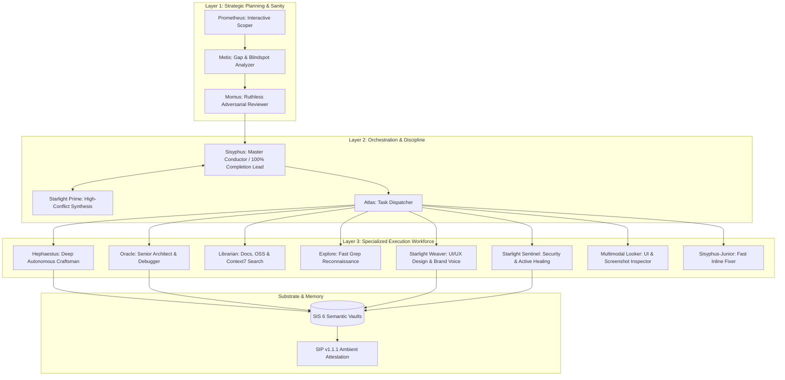

# Starlight Swarm Intelligence: Full Absorption of Oh My OpenAgent (oMo) into SIS & Antigravity

> **Canonical Architecture Document**  
> **Author:** Antigravity (Google DeepMind Agentic Coding Fleet)  
> **Substrate:** Starlight Intelligence System (SIS v8.3.0) & Protocol (SIP v1.1.1)  
> **Target Environments:** Google Antigravity, Claude Code, OpenAI Codex, Hermes, xAI Grok, OpenCode  
> **Status:** Approved Sovereign Architecture  

---

## 1. Executive Context & The Paradigm Shift

Modern AI coding has transitioned from single-turn chat completion to **autonomous multi-agent swarms**. However, most developers and teams are caught in one of two failure modes:
1. **Single-Vendor Lock-in**: Forcing one model (e.g., Claude alone or GPT alone) to perform every role—from high-level planning and conversation to low-level AST refactoring and visual QA. This leads to high costs, token bloat, and cognitive misfit.
2. **Shallow Swarms**: Spawning unstructured subagents that hallucinate completion, create race conditions on file edits, and abandon tasks when context windows get compacted.

**Oh My OpenAgent (oMo)** (formerly `oh-my-opencode` by `code-yeongyu` / Sisyphus Labs) pioneered the concept of the **multi-model discipline team** with specialized discipline agents (Sisyphus, Prometheus, Metis, Momus, Hephaestus, Oracle, Librarian, Explore) and the unrelenting `ultrawork` loop.

**The Starlight Intelligence System (SIS)** is the sovereign estate substrate built on **SIP v1.1.1**, featuring 6 federated semantic vaults, SQLite hybrid retrieval, attestation, and multi-platform adapters.

This document defines the **synthesis and full absorption** of oMo's breakthrough patterns into the Starlight Intelligence System and Google Antigravity's native agent runtime.

---

## 2. Comparative Matrix: oMo vs. SIS vs. The Unified Starlight Swarm

| Capability | Oh My OpenAgent (oMo) | SIS (Pre-Absorption) | Unified Starlight Swarm (SIS + oMo + Antigravity) |
| :--- | :--- | :--- | :--- |
| **Orchestration Discipline** | Sisyphus 100% completion rule | Single-agent execution / task queue | **Sisyphus Discipline Engine**: Resumable state machine (`boulder-state`) + 100% completion gate. |
| **Pre-Flight Planning** | Prometheus (Planner) + Metis (Gaps) + Momus (Adversary) | Single-pass prompt planning | **The 3-Layer Planning Triad**: Interactive interview → Gap analysis → Ruthless adversarial review. |
| **Memory & Persistence** | Flat JSONC / local cache | 6 Semantic Vaults + SQLite hybrid retrieval + SIP attestation | **Enterprise Cognitive Memory**: Vaults (Strategic, Technical, Creative, Operational) + instant hybrid vector/BM25 retrieval. |
| **Swarm Runtime** | OpenCode plugin / Codex Light | Platform adapters (Claude, Codex, Grok, Agy) | **Antigravity Native Multi-Agent Swarm**: Concurrent `define_subagent` / `invoke_subagent`, Agent Manager, native browser automation, and 1M+ token Gemini backbone. |
| **Model Matching Routing** | Claude (PM) vs GPT (Deep Code) | Model routing table in `AGENTS.md` | **Dynamic Persona-to-Model Engine**: Hard cognitive alignment for all 11 disciplines across all providers. |
| **Editing Reliability** | `hashline_edit` (hash-anchored lines) | Regex / exact substring replacement | **Hashline Guard + AST-Grep (`sg`)**: Eliminates stale-line collisions and enables structural AST refactoring. |
| **Visual / Multimodal** | Multimodal Looker | External inspection | **Antigravity Native Multimodal**: Native `generate_image`, NanoBanana, Veo pipelines, and browser visual capture. |

---

## 3. The Three-Layer Agent Architecture



### Layer 1: Planning (Think Before Acting)
1. **Prometheus (`starlight-prometheus`)**:
   - *Role*: Interactive discovery & scoping architect.
   - *Behavior*: Interviews the user/caller to unpack underspecified requirements, clarify edge cases, define explicit success criteria, and produce structured phase roadmaps.
2. **Metis (`starlight-metis`)**:
   - *Role*: Gap analyzer and pre-execution reality checker.
   - *Behavior*: Analyzes Prometheus's draft plans to surface unstated assumptions, missing failure modes, hidden API rate limits, and cross-repo dependencies.
3. **Momus (`starlight-momus`)**:
   - *Role*: Ruthless adversarial reviewer.
   - *Behavior*: Challenges the plan from a critic's perspective. Evaluates whether the verification criteria are truly automated or fake, whether complexity is justified, and blocks execution until all critiques are addressed.

### Layer 2: Orchestration (Drive to 100%)
1. **Sisyphus (`starlight-sisyphus`)**:
   - *Role*: Lead discipline orchestrator.
   - *Core Rule*: **Never stop at 80% or 95%. Drive the task to 100% completion with verified build, tests, and diagnostics.**
   - *Behavior*: Manages subagent concurrency, coordinates handoffs, recovers from agent failures, and persists intermediate state to the operational vault.
2. **Atlas (`starlight-atlas`)**:
   - *Role*: Conductor and task dispatcher.
   - *Behavior*: Translates approved roadmap phases into parallel execution work units.
3. **Starlight Prime (`starlight-prime`)**:
   - *Role*: Multi-agent conflict resolution and master synthesizer.
   - *Behavior*: Reconciles differing technical proposals into a singular, unified architectural outcome.

### Layer 3: Specialized Workers (Principle-Driven Execution)
1. **Hephaestus (`starlight-hephaestus`)**:
   - *Role*: Deep autonomous builder.
   - *Brain*: GPT-5.6 Sol / Claude Sonnet.
   - *Behavior*: Takes a high-level component spec and writes robust, production-grade code without needing hand-holding.
2. **Oracle (`starlight-oracle`)**:
   - *Role*: High-IQ consulting architect & root-cause debugger.
   - *Brain*: High-reasoning tier (GPT-5.6 Sol / Claude Opus).
   - *Behavior*: Read-only inspection of tough bugs, race conditions, type system puzzles, and distributed system trade-offs.
3. **Librarian (`starlight-librarian`)**:
   - *Role*: Knowledge, documentation, and external research specialist.
   - *Behavior*: Queries Context7 MCP, GitHub code search, web documentation, and internal memory vaults.
4. **Explore (`starlight-explore`)**:
   - *Role*: High-speed codebase reconnaissance.
   - *Behavior*: Fast ripgrep/grep_search across explicit project boundaries to locate patterns, usages, and symbols.
5. **Starlight Weaver (`starlight-weaver`)**:
   - *Role*: Design system, UI/UX aesthetics, and brand voice guardian.
   - *Behavior*: Enforces anti-slop rules, design tokens (`.arcanea/config/design-tokens.yaml`), and glassmorphic styling.
6. **Starlight Sentinel (`starlight-sentinel`)**:
   - *Role*: Security auditor, OpenClaw scanner, and active healing engine.
   - *Behavior*: Verifies zero secret leaks, enforces permission boundaries, and runs regression suites.
7. **Multimodal Looker (`starlight-looker`)**:
   - *Role*: Vision and visual QA specialist.
   - *Behavior*: Inspects generated UI renders, screenshots, and visual assets against the 30-point quality gate.
8. **Sisyphus-Junior (`starlight-junior`)**:
   - *Role*: Fast inline executor.
   - *Behavior*: Handles simple 1-file fixes, lint errors, and typo corrections without spinning up a heavy subagent swarm.

---

## 4. The Cognitive Model Personality Matrix

Different foundation models possess distinct cognitive architectures. Matching the wrong model to a role destroys workflow efficiency:

| Model Family | Cognitive Style | Best Suited Roles | Avoid In These Roles |
| :--- | :--- | :--- | :--- |
| **Claude (Opus 3.7 / Sonnet 3.7)** | **Mechanics-Driven**: Flawlessly follows long, nested procedural prompts (>1000 lines), maintains stateful conversational context, communicates with clarity. | `Sisyphus` (Lead), `Atlas`, `Metis`, `Starlight Prime`, `Weaver` | Standalone isolated black-box code hammering without feedback. |
| **GPT-5.x (Sol / Terra)** | **Principle-Driven**: Excels at high-autonomy problem solving, XML-structured decision trees, and multi-file reasoning when given high-level goals rather than rigid recipes. | `Hephaestus` (Deep Builder), `Oracle` (Consultant), `Momus` (Adversary) | Conversational multi-turn conversational micromanagement. |
| **Gemini (3.7 Flash High / 3.7 Pro)** | **High-Context & Multimodal SOTA**: Unmatched 1M-2M token context grokking, structural diff comprehension, image/UI reasoning, and high-throughput parallel execution. | `Antigravity Orchestrator`, `Librarian`, `Multimodal Looker`, `Explore`, Global Repository Auditor | Low-context narrow bash command loops. |
| **Kimi K3 / GLM 5.2** | **Scalable Claude Alternative**: High instruction-following compliance and multi-turn stability at low cost. | `Sisyphus Fallback`, `Atlas Fallback`, `Metis Fallback` | Final high-stakes security/architecture sign-off. |
| **MiniMax M2.7 / Qwen 3.7** | **High-Speed Utility**: Fast text processing, token-efficient extraction. | `Explore` (Grep), `Librarian` (Doc scanning), Utility filters | `Sisyphus` (Never use as main orchestrator). |

---

## 5. Advanced Developer Tooling Upgrades

### A. Hashline Guard (`hashline_edit`)
When multiple agents work concurrently in the same repository, traditional line-number edits cause race conditions:
- **Problem**: Agent A adds 10 lines at line 20; Agent B tries to edit line 30 but changes line 40 instead.
- **Solution**: Every editable line range includes a cryptographic content hash of the target block before and after modification. If the content hash does not match, the tool fails fast and triggers an automatic re-fetch rather than corrupting the file.

### B. AST-Grep (`sg`) Integration
- Language-aware Abstract Syntax Tree pattern matching (`sg -p 'function $NAME($$$ARGS) { $$$ }'`).
- Enables precise semantic refactoring across TypeScript, Rust, Python, and Go without regex brittleness.

### C. Context7 Mandatory Auto-Hook
- All external library lookups, SDK specs, and framework version checks automatically route through Context7 MCP (`@upstash/context7-mcp`) or live web search before writing code.

### D. Anti-Slop Visual QA Gate
- 30-point evaluation for any visual UI surface:
  - 26-30: Ship to production.
  - 22-25: Iterate with `starlight-weaver` and `starlight-looker`.
  - <22: Reject and restart.

---

## 6. Antigravity Native Implementation Guide

In Google Antigravity, we utilize native primitives to manifest the full swarm:

```typescript
// Example: Defining the Sisyphus Lead in Antigravity
define_subagent({
  name: "starlight-sisyphus",
  systemPrompt: `
# Starlight Intelligence — Sisyphus Discipline Orchestrator
Role: Lead conductor driving complex workflows to 100% completion.
Protocol: .antigravity/swarm-protocol.md
Discipline: Sisyphus never abandons a task. Verify all files compile, lint passes, and tests run.
`,
  toolsAllowlist: ["view_file", "grep_search", "find_by_name", "write_to_file", "replace_file_content", "run_command", "invoke_subagent", "manage_task"],
  model: "inherit"
});
```

To run the full `/ultrawork` pipeline:
1. **Plan**: `invoke_subagent("starlight-prometheus", goal)`
2. **Gap Analysis**: `invoke_subagent("starlight-metis", plan)`
3. **Adversarial Gate**: `invoke_subagent("starlight-momus", plan + gaps)`
4. **Execution Swarm**: `invoke_subagent(["starlight-hephaestus", "starlight-weaver", "starlight-sentinel"], tasks)`
5. **Verification & Memory Commit**: Run diagnostics, update `memory/vaults/`, and emit SIP-attested artifacts.

---

## 7. Provenance & Ambient Attestation

*Built on the sovereign substrate of the Starlight Intelligence Protocol (SIP v1.1.1)*  
*Substrate:* `starlightintelligence.org/protocol`  
*Layers:* `[file-contract, attestation, sovereignty, 3-layer-swarm, model-matrix, hashline-guard, ast-grep]`  
*Verticals:* `.antigravity`, `Starlight-Intelligence-System`, `agentic-creator-os`  
*Generated:* 2026-08-25  
