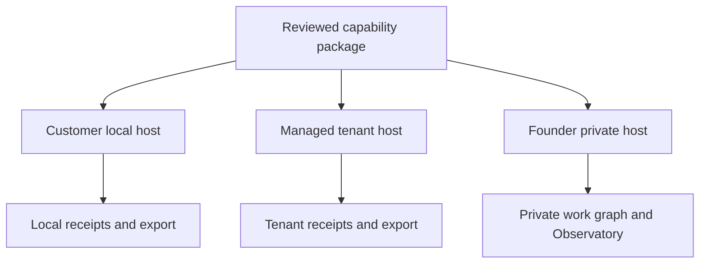
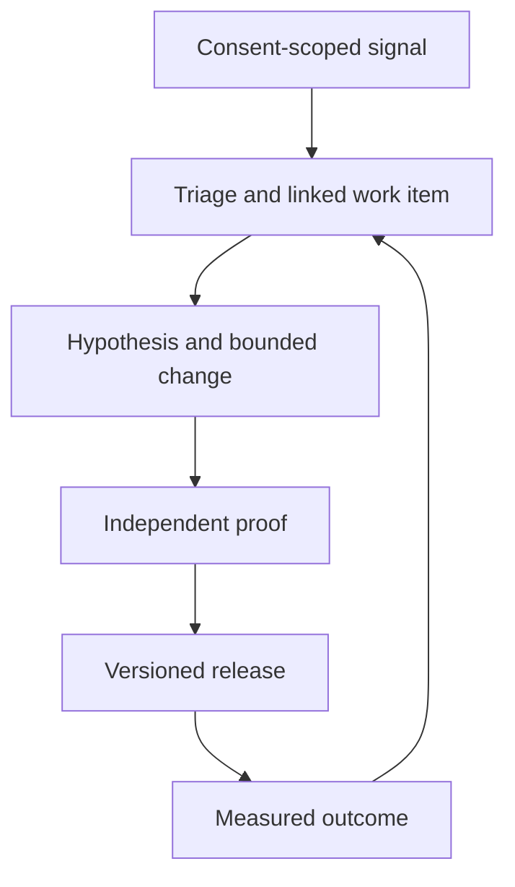

# Starlight production and sovereign runtime plan

**Status:** operational architecture proposal, 2026-09-26. No SIP amendment, production deployment, supported customer install, or portfolio placement decision is asserted here.  
**Owner:** SIS reference implementation and capability contracts. Portfolio admission and cross-brand routing stay with [agentic-ops topology #29](https://github.com/frankxai/agentic-ops/issues/29) and [creative lineage draft PR #72](https://github.com/frankxai/agentic-ops/pull/72).  
**Read with:** [Foundry](STARLIGHT-INTELLIGENCE-FOUNDRY.md), [graph contract](../graph-engineering/CONTRACT.md), [work graph](operational-work-graph.md), and the proposed [agent-platform beta PR #203](https://github.com/frankxai/Starlight-Intelligence-System/pull/203).

## Decision

One portable capability definition may run in three **separately owned** execution envelopes. An installation never inherits the founder's memory, credentials, policy, scheduler, customers, or permissions. A cloud service is an optional host for a customer's own instance, not an automatic extension of the founder's local estate.

| Envelope | Execution and authority | Data | Day-2 operator |
|---|---|---|---|
| Founder | Existing local SIS/Queen, private agentic-ops event writer, machine-scoped harnesses; the Command Center projects state | Sovereign local memory, private files, personal credentials in host secret stores; cloud projections/export by deliberate sync | Frank and nominated private stewards |
| Customer local / self-hosted | Versioned SIS package, skill/agent projection and chosen host runner in the customer's device or infrastructure | Customer-owned vault, file store, queue/checkpoints and keys; offline possible within proven capabilities | Customer; support only on explicitly shared diagnostics |
| Customer managed | Versioned package and host adapter in a dedicated tenant context; authenticated API and bounded workers | Tenant-scoped durable records, object storage, encryption context, audit events, backup and export | Named managed-service operator under published support terms |

These envelopes share **contracts, conformance fixtures, package hashes and export semantics**. They do not share a live database. The founder estate may dog-food a release; a customer's install receives only reviewed public package bytes and the customer's own configuration.

## Ownership and boundaries

| Truth or function | Current owner | Required runtime behavior |
|---|---|---|
| Portfolio product admission, studio and release governance | `agentic-ops` reviewed Registry | SIS consumes a pinned projection; it does not mint a parallel brand or control plane |
| SIP and public Foundry/graph/work-event contracts | This repository | Version, test and document compatibility; substrate changes pass the Starlight Board before commit/tag |
| Private founder work events and machine bus | Private `agentic-ops` / local `~/.starlight` | One append-only writer per event stream; export redacted references only |
| Memory authority | Customer's sovereign local core or declared instance owner | Session state and remote embeddings are projections; promotion follows stable claim, evidence, classification, contradiction check, approval and reversible projection |
| Agent fleet deployment policy | `starlight-agent-config` for the founder; customer instance policy for an adopter | Host enforces grants. An agent file, A2A card or MCP tool description cannot escalate them |
| Sessions and host execution | Originating harness and its authenticated runner | Persist run/cost/identity evidence, not copied private transcript bodies |
| Product experience and canon | Owning brand/product repositories | SIS exposes a portable adapter and receipts; GenCreator owns creator UX and Arcanea owns canon |

SIS's four graph layers remain the limit: A work/loop graph, B promoted memory/truth, C disposable code index for an active repo, D founder World/drive. The capability graph is procedural discovery. A product may have a typed domain index when knowledge is itself the product; it is a derived projection with provenance, never a new estate memory authority. [PR #196](https://github.com/frankxai/Starlight-Intelligence-System/pull/196) proposes separating public ontology fixture from private estate instance and is still a draft; production must not ship a founder portfolio fixture as customer state.

## Runtime paths

### Founder local and cloud

1. A machine owns its own private credentials, local files and hardware access. Local vault/event logs use the current SIS gateway and memory-provider interfaces; any remote provider is an explicitly authorized adapter. Personal source material does not transit through a general customer API.
2. A private outbox sends only allowlisted, classified event references or assets to designated cloud services. It records source revision/hash, idempotency key, destination, consent/policy snapshot, attempt and acknowledgement. On failure it resumes without replaying an external effect blindly. No observer impersonates a peer device.
3. Back up local authoritative logs, vaults, media masters and configuration separately from disposable indexes. Test restore on a clean device, including keys, tombstones, version compatibility and a projection rebuild. A synced folder is not a restore test.
4. The Command Center stays a read-only Observatory until a separately admitted operator action has authenticated identity, an action-time grant, an audit receipt and rollback path. It must not become a competing event writer.

### Customer local / self-hosted

- **Install:** pinned, signed or hash-verified distributable; `doctor → plan → inspect grants → opt-in install → host-specific verification → rollback`. [PR #203](https://github.com/frankxai/Starlight-Intelligence-System/pull/203) demonstrates an offline, repository-scoped Claude Code projection. Its fixture and `installed-not-host-verified` state do not prove a live agent, Codex installer, remote MCP server or multi-OS production release.
- **Storage:** instance-local event log and rebuildable SQLite/search index for a single-user first proof; production multi-user self-hosting needs an explicitly selected durable store, migrations, access control, backup/restore and recovery tests. Content-address attachments and pin source hashes. Local file scans require user-selected roots, minimal OS permission and no hidden global watcher.
- **Sync:** use immutable IDs, revisions and idempotent events for portable exports. Never resolve concurrent edits to canon, approval, rights or user text by silent last-write-wins. Report a conflict with both versions, actor and evidence; the owning user decides.
- **Exit:** export source files, licensed assets, authored graph facts with provenance, agent/skill packages, receipts and redaction/tombstone history in documented portable formats. Verify round-trip into a clean instance; uninstall leaves user content intact.

### Managed customer

- Authenticate the human and the service identity separately. Every query, job, file URL, vector projection, cache key, webhook and trace carries a tenant boundary derived from the trusted session, never from model-authored text. Prove cross-tenant denial with adversarial tests.
- Keep durable business state and entitlements in the owning product's database; blob/media versions and rights follow the portfolio media fabric. Queue durable work with a single workflow owner per process, idempotent effects, retry/backoff, dead-letter inspection and action-time human gates. A Vercel request should not silently become an unbounded agent daemon.
- Keep tenant keys in a managed secret system; use least-privilege scoped tokens for MCP and provider calls. Avoid credentials in agent packs, logs, package tarballs, screenshots and browser clients. Expose audit/export/deletion controls to the customer; define retention and incident response before general availability.
- Measure p95 latency, task completion, verifier disagreement, cost per accepted outcome, queue age, tool failures, retrieval quality and restore time per tenant and release. Set thresholds against a measured pilot baseline before claiming an SLO.

A managed deployment is a **separate product readiness gate**. GitHub main, a green preview, an npm tarball and a passing local fixture each prove different things.

## Shipped agent teams versus the development team

**Development fleet** is an internal production process: an architect/owner admits the task envelope; source researcher grounds volatile claims; builder edits one owning repo; independent checker tests behavior, rights and security; experience critic reviews real rendered artifacts; release steward verifies environment and receipts; support analyst closes the observed customer loop. Queen routes bounded work; Foundry resolves capabilities. Every lane has a claimable task, tool and spend ceiling, stop condition, output artifact, evidence URI, and distinct execution identity. The maker cannot self-certify completion. Parallel workers may research independent domains, but one writer owns each repo and changes converge through review.

**Customer-shipped team** is a reviewed package of optional, visible capabilities. The minimum useful product is one scoped skill with explicit inputs and proof. Promote to a persistent agent only when stable decision rights, distinct memory, a constrained tool boundary, ownership transfer, or a recurring trigger requires one (Foundry's necessity gate). A customer can inspect roles, tools, data sources, model/provider binding, cost ceiling, activity log and permissions; pause, revoke, export and remove them. Starter routes may include researcher, maker, critic and verifier, but those are role contracts, not always-on processes or a replicated founder personality. Neither a declarative roster nor a mock run counts as an operational team.

Use Foundry `Task Envelope → capability resolution → package → host binding → execution → independent proof → evolution proposal → re-proof → ratified memory`. The host owns admission, OAuth/tool policy and spending. MCP exposes bounded capabilities and resources; A2A is only for a verified interoperable exchange across independently operated agents. An A2A discovery card or skills plugin alone is not proof of that exchange. The exact host, OS, package digest, version, scopes and verifier evidence are recorded in the release receipt.

## Interfaces and implementation placement

| Surface | SIS responsibility now | Product responsibility and promotion trigger |
|---|---|---|
| CLI / Codex / Claude Code | Node/TypeScript package, typed Foundry contracts, local gateway, scoped host projections and conformance suite | Product skill packs compose the contract. Host adapters require real install, enforcement, update and rollback tests on supported OSes |
| Web | Protocol, research and console surfaces in this repo may explain or inspect SIS contracts | Brand web apps own customer journeys; portfolio default is Next.js/Vercel with server-owned secrets and authenticated database access. A product claims a deployment only after route, authorization, accessibility and receipt checks |
| Founder desktop | Expose private work-graph read projection to existing Command Center Electron Observatory | Native file/library actions are admitted separately. Do not fork a second desktop launcher inside SIS |
| Customer desktop | Portable local API/export and file connector proposal; no committed GUI shell here | Only build native companion after bulk import, OS integration or offline work is proven impossible or materially poor in web/CLI. Compare reuse of existing Electron Suite against a smaller Tauri shell on actual memory, updater, signing and accessibility evidence |
| Mobile | Compact, authenticated status/approval and content-reading contracts | Responsive web/PWA first. Native iOS/Android only when camera/audio, OS share, push or offline editing has a measured product job and lifecycle owner |

Shared type contracts are TypeScript/JSON Schema in the existing package. The desktop shell, mobile framework, cloud workflow product and vector engine are **implementation choices at their owning repository**, not additions to SIP by popularity. Introduce Rust/Python only for a measured native/performance/model integration need, with an explicit packaging and support owner. Repository action surfaces remain host-enforced and customer-visible.

## Feedback becomes evidence

1. Collect distinct signals: user-reported confusion and correction, accessibility defect, support ticket, abandonment, completion, export success, refund, cost, latency and model failure. Link each to product/version/cohort and an evidence reference with privacy class. Customer prose stays in its authorized system; the work graph receives a minimum necessary reference.
2. Triage into a single accountable product repo and objective. Specify who can reproduce the issue, the baseline, a falsifiable improvement, a required taste/factual/behavioral/security lane, and stop conditions. Give factual corrections priority over optimization.
3. Build against a pinned source and an owned artifact. An independent checker uses a frozen evaluation set plus adversarial cases (revoked grant, stale source, cross-tenant read, conflicting revision, inaccessible output, high cost). Human judges review narrative/visual taste with blind pairwise evidence where worth the expense.
4. Release one versioned package or product change through preview and staged exposure. Observe completion and quality by cohort, not just generated volume. Roll back or disable a failing version while retaining audit evidence.
5. Promote only stable, sourced, privacy-classed lessons into semantic memory after contradiction and staleness review. Keep raw feedback, ephemeral runs and model inferences out of the six durable vaults.

## Release train and operator duties

| Gate | Evidence required |
|---|---|
| Contract | Exact source commit, versioned package/schema, ownership matrix, host and OS matrix, migration rule, data/permission boundaries |
| Local pilot | Fresh installation, negative tool permission, offline/read-only path, update, uninstall, corrupted/outdated state, restore, cross-platform smoke where supported |
| Managed pilot | Tenant isolation, auth, webhook idempotency, queue replay, backup/restore, cost circuit breaker, incident and support drill |
| Experience | Actual rendered web/desktop/mobile viewport, keyboard/screen-reader path, artifact export and open test, source/rights and visual judgment |
| Agents | Independent maker/checker identities, trace and spend, revoked/stale approval denial, prompt injection fixture, host-enforced grants, human action gate |
| Release | GitHub CI and deployment URL tied to commit/digest; scoped receipt and named on-call owner; product Registry admits the offer and channel before sales claims |

**Sequence:** (1) converge existing Foundry, graph, ontology and beta drafts without protocol drift; (2) prove one founder-only private work item through GitHub check, optional Vercel preview and independent verification; (3) validate one customer local team install and complete export/restore on supported hosts; (4) only then pilot a managed isolated tenant; (5) feed a real customer correction through issue, evaluation, release and measured outcome. The [cross-brand World Seed packet](https://github.com/frankxai/agentic-ops/pull/72) can exercise an asset reference, rights state and export without moving Arcanea canon into SIS.

## Open decisions and explicit non-claims

- Portfolio #29 chooses the interop envelope's canonical owner. This document binds SIS to existing identifiers and receipts; it does not ratify a new cross-party standard. Any SIP file-contract/attestation change invokes the Starlight Board before commit.
- [Convergence v4 PR #192](https://github.com/frankxai/Starlight-Intelligence-System/pull/192) is stacked on #189 and contains broader strategy proposals, including receipt and memory-log changes that still require Board review. Its numbers and signed proof cannot be treated as mainline release evidence.
- [Ontology split PR #196](https://github.com/frankxai/Starlight-Intelligence-System/pull/196) is a draft and reports known validator errors. Do not use its private estate branch as public package content.
- [Agent beta PR #203](https://github.com/frankxai/Starlight-Intelligence-System/pull/203) is a draft. Its fixture, Claude Code projection and example A2A card are bounded implementation evidence. Live host enforcement, Codex/cloud adapters and three-OS install remain release gates.
- No production service, managed tenant, remote MCP endpoint, native mobile/desktop customer app, live A2A exchange, signing key, or customer feedback telemetry was created by this document.

Built on SIP — operational reference plan. This sentence identifies actual composition of SIS contracts; it is not a signed release receipt.
