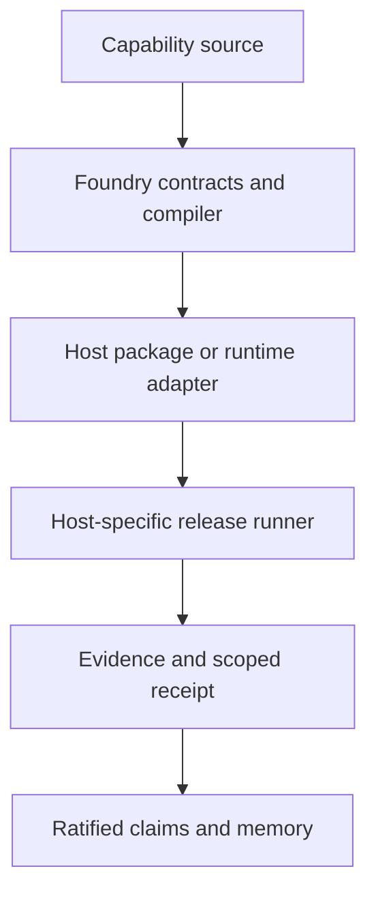

# Starlight Intelligence Foundry

Status: v0.1 operational kernel
Date: 2026-07-28
Owner: Starlight Queen / Foundry
Scope: operational layer; no SIP substrate contract change

## Decision

Starlight is capability-first and skills-first.

ChatGPT is a conversational host. Codex is a repository-native engineering host. The Agents SDK is a programmable orchestration runtime. Slack, voice, API, and other channels are separate Workspace Agent or runtime adapters; installing one public plugin does not activate those channels. SIS provides shared capability contracts, governance, evidence, and ratified memory.



The system does not treat “agent” as a synonym for prompt, persona, or intelligence. An agent is a persistent policy boundary. Everything else is a skill, deterministic tool, or temporary task worker.

## Current OpenAI surface

OpenAI uses one public Plugins Directory for reviewed publication, but package installation, workspace distribution, ChatGPT execution, and Codex execution are distinct assurance surfaces:

| Surface | Artifact or action | Evidence boundary |
|---|---|---|
| Local/repository plugin | Portable package plus `.codex-plugin/plugin.json` | Package preflight and clean local loader lifecycle |
| Workspace marketplace | Admin-synchronized GitHub marketplace | Admin policy, sync, install, update, and removal receipt |
| Universal Plugins Directory | OpenAI Platform upload and review | Source preflight profile, skill safety/security scan for skills or tool scan for MCP, review outcome, listing URL |
| ChatGPT runtime | Installed published or workspace plugin | Separate activation, behavior, permissions, and uninstall receipt |
| Codex runtime | Installed published, workspace, or local plugin | Separate activation, behavior, update, and uninstall receipt |

Portable Agent Plugins is the cross-host source contract. It is not proof of OpenAI directory acceptance. OpenAI currently exposes no standalone public submission validator; Foundry therefore runs a docs-derived package preflight and keeps Platform upload, the OpenAI skill safety/security scan, review, and connected-host runs as external gates for this skills-only candidate. MCP tool scanning is a separate future path.

The repository therefore ships `plugins/starlight-foundry` as a skills-only v0.1 candidate. Its portable schema and OpenAI package preflight run locally and in CI. A remote MCP server is intentionally absent until a deployed endpoint, authentication model, privacy contract, and runtime tests exist.

Workspace Agent publication, schedules, channels, and API triggering remain a separate governed deployment target. Availability depends on workspace and plan configuration; a compiled Agent Pack is not proof that a Workspace Agent was published.

OpenAI plugin commerce is also a separate policy boundary. Current policy permits physical-goods commerce but forbids selling or promoting digital products, services, subscriptions, credits, or upgrades inside a plugin. Starlight services may be sold through Starlight's own B2B channel, and a plugin may consume an existing entitlement, but the OpenAI projection cannot become a checkout or upgrade funnel.

Primary references:

- [Build skills](https://learn.chatgpt.com/docs/build-skills)
- [Build plugins](https://learn.chatgpt.com/docs/plugins)
- [Plugin guidelines](https://developers.openai.com/plugins/app-guidelines)
- [Submit plugins](https://developers.openai.com/plugins/deploy/submission)
- [Workspace Agent authentication](https://developers.openai.com/workspace-agents/authentication)
- [OpenAI Agents SDK](https://openai.github.io/openai-agents-python/)

## Cross-ecosystem capability release plane

The product extension is **Starlight Capability Foundry**: one source capability becomes host-specific, testable release artifacts plus evidence-scoped claims. It is a release and assurance plane, not a second compiler and not a generic marketplace.

Authority remains split deliberately:

| System | Authority |
|---|---|
| SIS Foundry | Source contracts, deterministic compiler, proofs, platform receipts, and evolution proposals |
| Agentic Intelligence System | Discovery, routing, operational control plane, and future receipt index |
| `starlight-creator-mcp` | First production remote MCP runtime and reference product |
| `starlight-evals` | Cross-host behavior, safety, tool-selection, and regression corpus |
| Host adapters | Packaging and validation for exactly one host surface |
| Starlight Exchange (later) | Catalog and commercial discovery built only after release reliability is proven |

The portable source contract follows Agent Plugins 1.0.0: root `plugin.json`, `skills/*/SKILL.md`, optional root `mcp.json`, and extension directories for host-specific data. Native overlays are generated only for declared targets. OpenAI uses `.codex-plugin/plugin.json` plus optional `.mcp.json`; Claude Code uses `.claude-plugin/plugin.json` plus optional `.claude-mcp.json`.

Publisher name, homepage, repository, license, and optional keywords are explicit Plugin Pack inputs. The compiler must never silently attribute third-party packages to Starlight. Remote MCP URLs must use HTTPS and contain no user information, query parameters, or fragments; credentials belong in host secret stores and OAuth flows, never packages.

### Release claim state

Every public statement is scoped to one host surface, version, channel, OS, architecture, plan, locale, artifact digest, and evidence TTL:

```text
documented -> compatible -> verified -> published -> supported
                          \-> degraded
           \-> blocked / unsupported
```

- `documented`: official material describes the integration shape.
- `compatible`: Starlight can compile the declared package shape.
- `verified`: an evidenced passing check exists in the named host environment. Public copy renders this as **Tested by Starlight** and never implies OpenAI verification, endorsement, or support without explicit host evidence.
- `published`: a release or approved listing URL exists.
- `supported`: verified and published, with a named operational owner and no applicable failing check.
- `degraded`, `blocked`, and `unsupported`: limitations are explicit and cannot be promoted by marketing copy.

`platform-release-receipt.schema.json` defines the structural receipt. Semantic validation binds the registry ID to its exact surface and adapter tier, binds every claim to that surface, and validates a deterministic digest of the complete receipt except its attestation object. It also rejects strong claims without overlapping passing evidence, unknown registry hosts, blocked distribution, missing release URLs, unowned support, subject mismatch, and dangling evidence. Structural validation does **not** authenticate a signature. Until the external verifier lands, the local receipt validator rejects every `verified`, `published`, and `supported` promotion with `ATTESTATION_VERIFIER_REQUIRED`. The claim engine must verify Sigstore/GitHub OIDC evidence or a named human review record against the signed statement before emitting a public claim.

### Evidence runner

A release job creates an immutable bundle under `evidence/<subject>/<version>/<host>/<run-id>/`:

- environment fingerprint and installed versions;
- install, discovery, positive, negative-auth, update, and uninstall transcripts;
- JUnit and trace output;
- redacted screenshots and a short recording when host UI matters;
- listing snapshot and review state when distribution is claimed;
- artifact, SBOM, and evidence SHA-256 digests;
- an attestation verification URL and the platform receipt.

Headless checks may run in CI. Host login, OAuth consent, billing, tenant policy, marketplace forms, reviewer dialogue, and final publish remain explicit human gates. No agent may claim that these occurred without evidence.

Internal test evidence, a portal- or reviewer-requested recording, and public directory screenshots are different artifact classes. A no-UI skills plugin submits no screenshots. Future MCP evidence follows the then-current portal request; current official documentation does not make a demo recording universally mandatory. Screenshots are added only when the scanned product actually exposes custom UI.

The full decision, host matrix, GTM design, 90-day delivery plan, and Codex continuation prompt are in:

- `docs/specs/2026-08-31-starlight-capability-foundry.md`
- `docs/handovers/2026-08-31-starlight-capability-foundry-codex.md`
- `foundry/platforms/host-capabilities.v1.json`

## Control-plane boundaries

| Component | Owns | Must not own |
|---|---|---|
| Intent Contract | Definition of done, constraints, permissions, proof | Runtime implementation |
| Capability Graph | Discoverable skills, agents, relationships, lifecycle | Silent selection |
| Foundry | Validation, compilation, packaging | Autonomous permission expansion |
| Queen | Routing, topology, approvals, ratification | Pretending suggested work executed |
| Execution Mesh | Runtime work and spans | Promotion verdict |
| Taste Engine | Qualitative hard gates and judge policy | Factual or security override |
| Proving Ground | Evidence lanes and receipts | Changing acceptance tests after failure |
| SIS memory | Ratified decisions and preference evidence | Unreviewed self-modification |

## Canonical compilation flow

```text
Intent
  -> Task Envelope
  -> Capability Resolution
  -> Kind-specific Pack
  -> Compiled Capability Package
  -> Runtime Execution
  -> Evidence Receipt
  -> Evolution Proposal
  -> Re-proof
  -> Ratified Memory
```

The deterministic compiler validates model-authored contracts. It does not claim to replace model judgment. The capability resolver selects only explicit required and preferred capabilities. Lexical suggestions are visible discovery hints and require model or operator confirmation.
`allowCreation` authorizes creation of the requested package itself; dependencies must already be materialized and explicitly selected.

## Task Envelope

`foundry/contracts/task-envelope.schema.json` carries:

- objective and deliverables;
- vertical, audience, artifacts, and references;
- stakes and reversibility;
- autonomy and approval points;
- hard constraints and budget;
- evidence freshness and required lanes;
- tool, memory, external-write, and destructive-action permissions;
- required, preferred, forbidden, and creatable capabilities;
- structured completion tests;
- deployment targets.

The Queen prefers `route-envelope`:

```bash
node tools/queen/driver.mjs route-envelope <task-envelope.json>
```

The old keyword classifier remains a labeled compatibility fallback. It is not the cognitive control plane.

## Capability packages

| Pack | Contract | Core gate |
|---|---|---|
| Skill | `skill-pack.schema.json` | Reusable procedure, bounded activation, step-level proof |
| Agent | `agent-pack.schema.json` | At least one persistent autonomy boundary |
| Swarm | `swarm-pack.schema.json` | Distinct roles, state policy, conflict owner, termination |
| Vertical | `vertical-pack.schema.json` | Recurring domain constraints and evaluation |
| Plugin | `plugin-pack.schema.json` | Materialized validated skills and real deployment surface |

Every compiled package contains:

```text
package/
├── task-envelope.json
├── <kind>-pack.json
├── capability-resolution.json
├── foundry-manifest.json
├── README.md
└── <kind-specific artifacts>
```

The manifest records SHA-256 digests for compiler-produced artifacts. The prover fails on changed, missing, or unexpected package files.
Pack deployment, tool, and memory permissions must be subsets of the Task Envelope; the compiler fails closed on attempted expansion.

## Agent necessity

At least one must be true:

1. stable decision rights;
2. distinct memory scope;
3. constrained tool or permission boundary;
4. genuine ownership transfer;
5. ongoing schedule, channel, or API trigger.

If all are false, compilation fails and the correct result is a Skill Pack or temporary worker.

This keeps the existing named-agent library available as a rich compatibility and domain layer while moving new routing from identity-first to capability-first.

## Swarm topology

Supported pack-level topologies:

- `manager-workers`;
- `handoff`;
- `agents-as-tools`;
- `parallel-merge`;
- `debate-synthesize`.

A swarm is justified only when work is genuinely separable, evaluation needs independence, latency materially improves, or permissions need isolation. Every swarm declares:

- role-level capabilities and decision rights;
- produced artifacts;
- shared-state schema and write policy;
- conflict owner and method;
- success conditions;
- stop conditions;
- maximum rounds.

The v0.1 compiler packages this graph. Live Agents SDK dispatch and trace ingestion are phase 2.

## Taste Engine

A Taste Profile contains:

- artifact type and audience;
- production constraints and candidate policy;
- hard rejection gates;
- weighted dimensions with observable excellence and failure;
- reference exemplars and anti-exemplars with rationales;
- pairwise preferences and accepted judgment rationales;
- blind comparison policy;
- minimum independent judges;
- producer-judge separation;
- synthesis owner.

Production sequence:

```text
candidate hypotheses
  -> deterministic artifact gates
  -> blind pairwise comparison
  -> domain critic
  -> adversarial review
  -> separate synthesis
  -> acceptance tests
```

Not every artifact needs multiple candidates or multiple judges. The Task Envelope declares when taste is a required lane. If required judge evidence is absent, the package remains `experimental`.

## Proving Ground

Evidence lanes:

| Lane | Proves |
|---|---|
| Static | Schema, shape, required files, deterministic policy |
| Behavioral | The procedure or runtime performs the intended behavior |
| Factual | Claims are current, sourced, and correctly scoped |
| Artifact | Output opens, parses, renders, or executes natively |
| Taste | Domain quality clears hard gates and independent judgment |
| Security | Permissions, secrets, privacy, destructive behavior |
| Economic | Cost, latency, throughput, and budget |
| Drift | Registry, adapter, dependency, and deployment consistency |

Verdicts:

- `validated`: all declared required lanes passed;
- `experimental`: required proof is pending;
- `revise`: a required test failed;
- `rejected`: a critical security test failed.

Command tests use argv with `shell: false`, require `--execute-commands`, and must be explicitly allowed by the Task Envelope.

## Evolution

`/evolve` does not self-modify the system. It maps a real failed or pending test to the smallest responsible layer and emits `apply: false`.

| Lane | Default responsible layer |
|---|---|
| Static | Contract or compiler |
| Behavioral | Procedure or runtime |
| Factual | Evidence policy |
| Artifact | Renderer or packaging |
| Taste | Taste Profile |
| Security | Permission or guardrail |
| Economic | Routing or budget |
| Drift | Registry or adapter |

Durable memory is updated only after the revised package passes its required proof.

## Command surface

```text
/forge skill <brief>
/forge agent <brief>
/forge swarm <brief>
/forge vertical <brief>
/forge plugin <brief>

/prove <package-or-artifact>
/evolve <package-or-receipt>
```

Legacy `/agent-creator` and `/workflow-skill-creator` commands route to Foundry and remain deprecated compatibility aliases.

## Runtime commands

```bash
# Inspect contracts and examples
node tools/foundry/cli.mjs validate foundry/examples/research-brief.task-envelope.json

# Derive the live graph
node tools/foundry/cli.mjs graph --out /tmp/starlight-capability-graph.json

# Compile
node tools/foundry/cli.mjs forge \
  --envelope foundry/examples/research-brief.task-envelope.json \
  --pack foundry/examples/research-brief.skill-pack.json \
  --out /tmp/research-brief-forge

# Prove
node tools/foundry/cli.mjs prove /tmp/research-brief-forge

# Propose the smallest evolution
node tools/foundry/cli.mjs evolve \
  /tmp/research-brief-forge/evidence-receipt.json \
  --out /tmp/research-brief-forge/evolution.json
```

## “Superintelligence” as protocol

The `/superintelligence` posture should guarantee:

1. explicit unknowns and decision variables;
2. memory retrieval before generation when relevant;
3. current primary-source grounding for unstable claims;
4. independent hypotheses when ambiguity matters;
5. model and tool routing from demonstrated performance;
6. parallelism only for separable work;
7. builder, critic, and verifier separation when required;
8. executable or artifact-native proof;
9. visible uncertainty and unresolved assumptions;
10. ratified learning written back only after proof.

No phrase in a prompt can substitute for tools, permissions, evidence, tests, or feedback.

## v0.1 boundaries

Built now:

- typed contracts for envelopes, packs, taste, graph, manifests, and receipts;
- dependency-free compiler, resolver, prover, and evolution proposer;
- typed Queen envelope route;
- four portable Foundry skills;
- portable Agent Plugin core with skills-only OpenAI/Codex and Claude compatibility overlays;
- compatibility migration for legacy creators;
- conformance, exact-target provenance, ancestor/output symlink rejection, forbidden .git/node_modules subtree rejection, receipt-scope and statement-integrity, traversal, taste-pending, graph, and parity tests.

Not claimed:

- deployed remote MCP service;
- published Workspace Agent;
- live Agents SDK swarm dispatch;
- cryptographically verified release and judge attestations;
- continuous autonomous self-advancement;
- npm release parity.

Those require separate deployment authority, credentials, runtime traces, and release governance.

## Phase 2

1. Add an authenticated remote MCP service for Foundry contracts, registries, receipts, and trace ingestion, using `starlight-creator-mcp` as the first reference runtime.
2. Compile Agent Packs into Agents SDK runtime definitions with guardrails, sessions, handoffs, and trace IDs.
3. Add signed or workspace-attributed human and model judge evidence.
4. Benchmark routing by task class, model, cost, latency, and outcome.
5. Promote plugin and skill versions only from longitudinal receipts.
6. Repair npm distribution drift after release review.

The next proof is not a larger agent catalog. It is one intent compiling into one portable, governed, proven capability that behaves coherently across ChatGPT and Codex.
