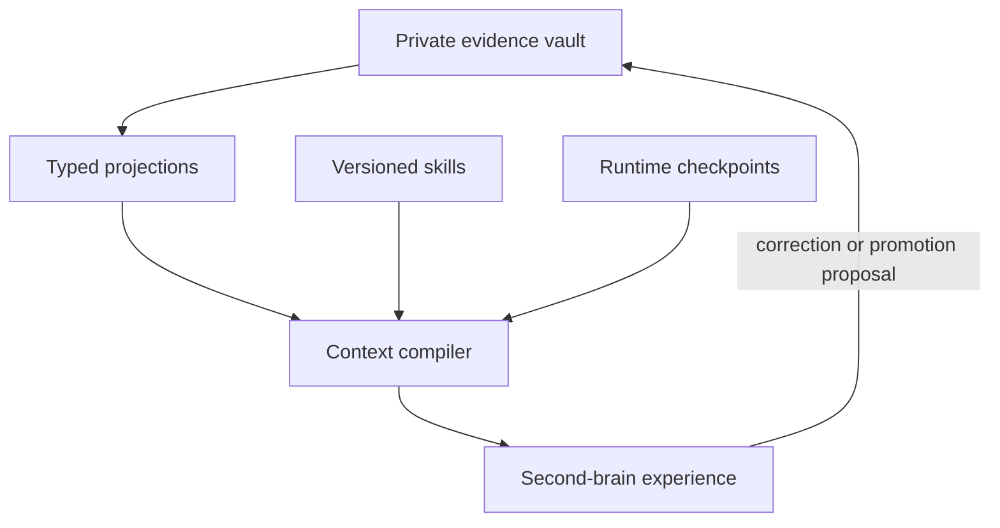

# Starlight Portfolio Topology

Status: canonical role map

Audit cutoff: 2026-08-12

Machine-enforced upstream companion: [`context/empire/upstreams.json`](../../context/empire/upstreams.json)

Decision record: [`docs/boards/2026-08-12-starlight-estate-convergence.md`](../boards/2026-08-12-starlight-estate-convergence.md)

## Governing rule

One kind of truth has one authority. Repositories may implement, project, distribute, or present that truth, but may not silently redefine it.

The connected GitHub estate is larger than a single architecture document: 367 repositories were visible at the audit cutoff. This map covers the Starlight intelligence and operations core. `context/empire/portfolio-mesh.*` remains the broader generated portfolio inventory; dated audits remain evidence, not current control-plane authority.

## Canonical layers

| Layer | Canonical authority | What it owns | What it must not own |
|---|---|---|---|
| Protocol and substrate | `frankxai/Starlight-Intelligence-System` | SIP, shared contracts, attestation, policy, reference implementation, canonical topology | Product-specific UI, private user evidence, vendor-specific runtime authority |
| Portable procedures | `frankxai/starlight-agent-skills` | Tested Agent Skills, activation metadata, release artifacts | Durable run state, secrets, private memories |
| Memory contract and projections | `frankxai/starlight-memory` | Typed memory API, provider router, local reference implementation, rebuildable projections | Consent/deletion authority for private evidence |
| Private evidence | `frankxai/starlight-private-memory` | Encrypted raw evidence, consent, ACL, retention, deletion ledger | Public schemas, product UI, globally shared derived beliefs |
| Second-brain experience | `frankxai/second-brain-os` | Public workflows, Obsidian templates, cited reflection, correction/export/forgetting UX | A second canonical memory database |
| Curated private brain | `frankxai/second-brain-vault` | Human-curated private notes and views | Runtime checkpoints or cross-tenant projections |
| Runtime | `frankxai/starlight-swarm` | Bounded governed execution, routing, receipts, runtime provenance | Protocol ownership or private evidence authority |
| Pack distribution | `frankxai/starlight-agentic-os` | Pack registry, certification, compatibility, distribution | Fleet truth or live secrets/configuration |
| Fleet operations | `frankxai/agentic-ops` | Live repo/agent registry, lifecycle, security, secrets policy, operational ownership | Public procedure source or product UI |
| Public doctrine sync | `frankxai/agentic-ops-hub` | Sanitized doctrine, config-sync contracts, public operating patterns | The live private fleet registry |
| Installed fleet configuration | `frankxai/starlight-agent-config` | Generated and reviewed installed-agent configuration | Canonical policy, raw secrets, experimental branch aggregation |
| Evaluations | `frankxai/starlight-evals` (target authority); SIS consumes versioned releases and retains migration receipts | Contract, safety, memory, cost, and task-quality gates; publishable scorecards | Runtime or memory authority |
| Upstream laboratory | `frankxai/starlight-agent-lab` | Quarantined adapter experiments and reproducible comparisons | Production dependencies without promotion gates |

## Repository disposition

| Repository | Present life | Decision |
|---|---|---|
| `frankxai/Starlight-Intelligence-System` | Active canonical substrate | Protect `main`; accept only contract-level or reference-implementation changes with Board and eval gates |
| `Arcanea-Labs/Starlight-Intelligence-System` | Stale 2025 duplicate | Add a redirect README, recovery tag, then archive; never merge its history into canonical SIS |
| `frankxai/starlight-agent-skills` | Healthy portable execution layer | Keep independent; publish versioned packs and conformance metadata |
| `frankxai/starlight-memory` | Healthy public memory contract/router | Evolve into typed projection fabric; keep providers behind ports and acceptance tests |
| `frankxai/starlight-private-memory` | Private evidence substrate | Make the sole authority for consent, retention, raw-source hashes, and deletion truth |
| `frankxai/starlight-memory-vault` | Private cross-device coding-agent memory | Keep as machine-generated episodic memory; namespace it separately from human-curated notes and high-sensitivity evidence |
| `frankxai/second-brain-os` | Public second-brain template/runtime | Keep as experience layer; consume `starlight-memory` contracts |
| `frankxai/second-brain-vault` | Private Obsidian content | Keep as curated human view; do not make it an agent runtime store |
| `frankxai/starlight-knowledge-tree` | Knowledge-graph projection | Fold its unique graph/query primitives into `starlight-memory`; retain only as a projection UI if independently valuable |
| `frankxai/starlight-agentic-os` | Pack registry/certification | Keep; clarify that it certifies artifacts but does not operate the live fleet |
| `frankxai/starlight-swarm` | Governed queen/worker runtime | Keep; require one isolated worktree/sandbox per writing agent and authoritative completion receipts |
| `frankxai/starlight-swarm-bus` | Declared deprecated bus | Add redirect and archive after confirming no consumers; use the active token-tracker/swarm-bus path |
| `frankxai/agentic-ops` | Private Empire Registry and lifecycle plane | Keep as fleet source of truth |
| `frankxai/agentic-ops-hub` | Public doctrine/config distribution | Keep as sanitized downstream of `agentic-ops`; prevent reciprocal SSOT claims |
| `frankxai/starlight-agent-config` | Installed fleet configuration | Repair stacked branch chain; generate from canonical contracts; never merge the 1,594-file branches blindly |
| `frankxai/starlight-evals` | Real harness currently described as a public mirror | Promote to the independent eval authority; migrate source deliberately, refresh scorecards, and leave release receipts in SIS |
| `frankxai/starlight-agent-lab` | Near-empty neutral sandbox | Repurpose as the only quarantined location for volatile harness/provider comparisons; archive if no experiment lands in the next evaluation cycle |
| `frankxai/starlight-command-center` | Active Electron cockpit candidate | Promote as the canonical operator UI only after stacked PRs are flattened and contracts are stable |
| `frankxai/hermes-cockpit` | Hermes-specific lightweight registry/UI | Keep as an adapter surface, never universal control-plane authority |
| `frankxai/starlight-command` | Older broad cockpit | Extract unique capabilities into command center or ops, add redirect, recovery tag, then archive |
| `frankxai/StarlightOS` | Small private productization shell | Freeze until the command-center/product boundary is explicitly decided |
| `frankxai/starlight-intelligence` | Public reference/product shell with default Vite README | Repair immediately: become a thin workbench consuming SIS, or redirect/archive; it must not look canonical |
| `frankxai/agent-registry` | Empty public name reservation | Redirect to the `agentic-ops` registry contract or `starlight-agentic-os` pack catalog, then archive |
| `frankxai/starlight-agent-army-architecture` | Architecture/playbook corpus | Migrate unique durable doctrine into SIS/ops docs, then freeze or archive |
| `frankxai/agentic-operating-system-standard` | Coherent public schemas, modules, validation, and examples | Keep as canonical public operating-system standard; never place live fleet state here |
| `frankxai/starlight-cosmos-engine` | Domain content engine | Keep downstream of Starlight contracts; no orchestration authority |
| `frankxai/starlight-gravity-engine` | Domain/community engine | Keep downstream; no protocol or memory authority |

## Memory ownership

- Evidence is immutable source material plus policy. It may be superseded or tombstoned, not silently rewritten.
- Claims, embeddings, graphs, summaries, beliefs, and observations are rebuildable projections with provenance.
- Runtime checkpoints and provider conversation state are transient execution continuity.
- Skills are procedural memory and enter the trusted layer through tests and review.
- The second brain exposes citations, timelines, conflicts, corrections, sharing, export, and forgetting.

## Branch convergence contract

For every non-default branch:

1. Enumerate unique commits against the current default branch.
2. Classify it as `adopt`, `supersede`, `archive`, or `investigate`.
3. For `adopt`, cherry-pick the smallest coherent commits onto a fresh branch created from current `main`.
4. Run the repository-native lint, type, tests, build, security, and dry-run gates.
5. Open a reviewable PR that names the source branch and superseded PRs.
6. Merge only with an immutable expected head SHA and protected-branch checks.
7. Close superseded PRs and retain a recovery tag before branch deletion or repo archive.

Stacked PRs are flattened from the bottom up. Generated files are regenerated from their canonical input; they are not resolved by hand during a conflict.

## External upstream contract

- Standards such as MCP, ACP, Agent Skills, and `AGENTS.md` are implemented through conformance tests, not forks.
- Runtime dependencies are pinned with lockfiles and promoted through contract, security, cost, and eval gates.
- Meta-harnesses such as Ruflo, Oh My OpenAgent, and Omnigent stay in the lab. Individual primitives may be adopted through an ADR; their histories are never merged wholesale.
- Memory vendors produce projections, rankings, or compacted context. Only Starlight owns evidence, consent, access policy, and deletion truth.
- Each upstream record must include source, version or tracking rule, adoption mode, owner, risk notes, and verification date.

## Update rhythm

- Weekly: dependency and release diff; open automated review PRs only when pins change.
- Monthly: branch classification and stale-PR sweep.
- Quarterly: authority-map review, recovery-tag/archive wave, and Starlight-native harness/memory benchmark.
- On every provider upgrade: schema rehearsal, export/delete verification, privacy isolation, regression eval, latency/cost comparison, and rollback proof.
