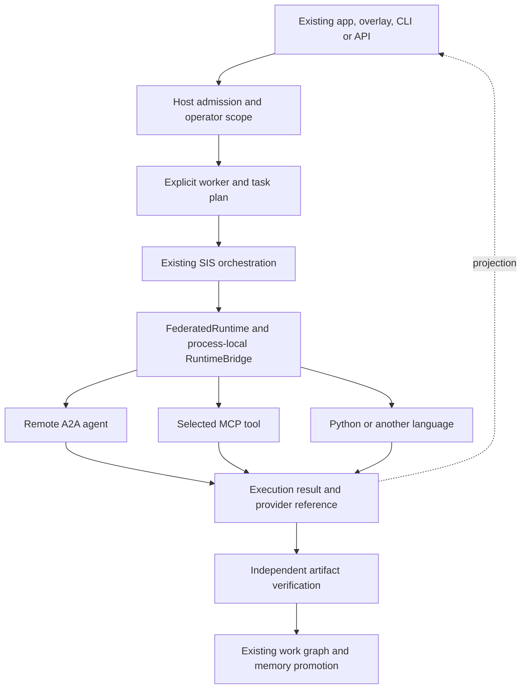

# Agent federation for Starlight

Status: local operational implementation, September 12, 2026. External provider pilots and deployment remain open. SIP protocol and canonical memory authority are unchanged.

Starlight can coordinate a bounded batch across registered agent workers through a common execution API. The app, overlay, CLI and MCP host can consume the same plan and result format. Workers retain their own language and framework. Operator admission, credentials, canonical memory and artifact acceptance stay in their existing owners.

## What is implemented

`FederatedRuntime` is the preferred entry point. It composes the capability planner in `src/federation.ts` with the integrated `RuntimeBridge` lifecycle. The full batch is validated and captured before dispatch. One bridge owns task deduplication, submission ceilings and process-local capacity across simultaneous batches. Results retain input order and distinguish completed, failed, unknown and rejected work. `asExecutor()` connects to the existing SIS orchestration engine; `createFederationTool()` supplies an async `sis_federate` handler for an authenticated host.

`AgentFederation` remains available for compatibility with callers that own their lifecycle already. Its `run()` uses the existing `runSwarm` pool and has batch-local limits. New app/API integrations should use `FederatedRuntime` and the established host's admission boundary.

| Connection | Implemented behavior | Compatibility boundary |
|---|---|---|
| A2A | `message/send`, `tasks/get`, immediate messages, task polling, response limits, task identity checks | Text-only JSON-RPC **0.3.0**, with a configured endpoint |
| MCP | Invoke a selected tool through an initialized client supplied by the host; map arguments and normalize text/structured results | Host pins and owns the actual SDK connection |
| Language worker | Absolute executable/cwd, explicit environment, shell-free spawn, bounded output, versioned JSON lines | Real Python example; other languages must pass the envelope tests |
| Custom runner | Existing `AgentRunner` callback | Caller owns its implementation, permissions and cancellation behavior |

This change adds no runtime dependency and copies no upstream source. The existing synchronous SIS MCP server is unchanged; registration of the async federation tool belongs in a suitable host.

## Architecture and ownership



SIS owns reusable execution adapters and contracts. The existing command center owns the operator experience. The established swarm/workflow runtime owns durable execution and fleet admission. Private work events remain in the existing private ledger. Canonical memory receives reviewed evidence rather than every provider transcript. See [operational work graph](operational-work-graph.md).

The integration benchmark is a unified agent-platform API such as the estate's existing LiteLLM agent control-plane track. The improvement to measure is a single admitted workload crossing providers with explicit context boundaries, recoverable provider references and independently accepted artifacts. No comparative product-performance claim has been measured.

## Upstream absorption decisions

These immutable revisions were inspected on September 12, 2026. They are research snapshots, not installed package pins. Additional entries extend the existing [upstream registry](../../context/empire/upstreams.json); its older `audit_cutoff` remains unchanged because the earlier records were not all re-audited.

| Source | Observed license | What Starlight adopts |
|---|---|---|
| [A2A 0.3.0 types](https://github.com/a2aproject/A2A/blob/8d57eba286de756176892518a8fc39b0ac2ccefb/types/src/types.ts) | Apache-2.0 | Implemented text JSON-RPC transport. Main was separately inspected at `6d6640c29b102f7a8d23784901351b5d2454fe71`; it does not define this adapter's compatibility. |
| [MCP TypeScript SDK](https://github.com/modelcontextprotocol/typescript-sdk/tree/b65426158ed9f29aea8ef3dc09ca22d7d9d6f970) | Transition from MIT to Apache-2.0; some MIT contributions remain; non-spec docs CC-BY-4.0 | Implemented host-owned client boundary. Check applicable file notices before any future source copying. |
| [Agent Client Protocol](https://github.com/agentclientprotocol/agent-client-protocol/tree/f1293d8e43d09a6745ff8fe717f9acd8299591b7) | Apache-2.0 | Proposed editor/overlay session adapter, keeping interactive coding permissions distinct from remote task delegation. |
| [LangGraph](https://github.com/langchain-ai/langgraph/tree/e539ac122f4126f6dd850581c1494948cf620e31) | MIT | Optional worker-local graph, checkpoint and interrupt implementation. No new estate scheduler. |
| [OpenHands Software Agent SDK](https://github.com/OpenHands/software-agent-sdk/tree/9df0ca59bb8110c5294a508fb6761d91d043e6a3) | MIT | Proposed coding-worker pilot through its Agent Server API and workspace boundary. No live adapter or sandbox claim. |
| [Temporal TypeScript SDK](https://github.com/temporalio/sdk-typescript/tree/e37ed88b7c71dc35c022464d095bca69a9b2dcd3) | MIT | Proposed durable activities in the existing runtime plan; persist provider IDs and reconcile before retrying effects. |
| [Pydantic AI](https://github.com/pydantic/pydantic-ai/tree/86b250f3d5e26f4cb25617a82904c720f690193d) | MIT | Optional typed Python agent behind the demonstrated worker boundary. Exact package pin and real-provider evaluation still required. |
| [Tauri](https://github.com/tauri-apps/tauri/tree/d0f38df06a2f4406b388a336694aa18b3c6bf1a9) | MIT or Apache-2.0 per README | Research candidate for measured native needs. Preserve the existing command-center shell; no parallel app rewrite. |

Protocol details were checked against the [A2A 0.3.0 specification](https://a2a-protocol.org/v0.3.0/specification/). MCP connection ownership follows the [official client guidance](https://modelcontextprotocol.io/docs/2026-07-28/develop/build-client).

## Use from the app or an agent host

Application bootstrap supplies the approved endpoint, credentials and routing. Task JSON cannot register a new worker, install a tool or choose an executable.

```ts
import {
  FederatedRuntime, createA2ARunner, createFederationTool,
} from '@arcanea/starlight-intelligence-system/federation';

const federation = new FederatedRuntime([{
  id: 'remote-reviewer',
  transport: 'a2a-0.3',
  capabilities: ['code-review'],
  runner: createA2ARunner({
    endpoint: configuredAgentUrl,
    headers: () => ({ Authorization: `Bearer ${configuredAgentToken}` }),
    onTask: reference => savePrivateProviderReference(reference),
  }),
}], { concurrency: 2, timeoutMs: 60_000, maxTasks: 16, maxRuns: 100 });

const tasks = [{ id: 'review-1', capability: 'code-review', prompt: approvedReviewInput }];
const routes = federation.plan(tasks); // No worker call.
const result = await federation.run(tasks, { signal: requestAbortSignal });

engine.setExecutor(federation.asExecutor({
  'starlight-sentinel': { capability: 'code-review', workerId: 'remote-reviewer' },
}));

const tool = createFederationTool(federation);
// Register tool.definition and tool.handle in the authenticated host's async MCP server.
// Explicit operation: { operation: 'plan' | 'run', tasks }.
```

These identifiers are illustrative configuration, not a deployed endpoint. The executor forwards the explicit input and task ID; it does not forward the orchestration engine's recalled memory or arbitrary context.

For MCP, supply a callback that calls your initialized client's actual tool method and forwards the signal. Use `argumentsForTask` to match the tool schema. The host owns initialization, authentication, connection reuse and shutdown. The included MCP tests use a callback fixture and do not establish compatibility with a particular authenticated server.

## One lifecycle, explicit host authority

The portable-runtime source is integrated under `src/runtime-bridge/`. Its A2A composition test is required and no longer loads a peer checkout. Direct SDK/custom HTTP integrations can use the lower-level [RuntimeBridge contract](portable-agent-runtimes.md); ordinary federation callers use the facade above. There is one in-process lifecycle per facade and no transport retry loop.

Before invoking a capable transport, the registered runner must obtain authority from the existing host. Construction, route selection and a valid task envelope do not grant it. A host adapter has this shape:

```ts
const admittedRunner = async (task, signal) => {
  const admission = await existingHost.admit(task.id, signal);
  if (!admission.allowed) return { output: 'Host denied this task', exitCode: 1 };
  return configuredTransport(task, signal);
};
// Register admittedRunner as the worker's runner, from trusted bootstrap code.
// The host owns the durable lease, spend reservation and outcome reconciliation.
```

The host-admission fixture proves denial causes zero transport effects and replay does not resubmit. It does not prove the estate's actual admission service. A timeout must not release a remote spend/lease reservation until that service reconciles the outcome. Persisted caller IDs belong in `submit()` or `run()`; `asExecutor()` generates a new ID for each engine invocation.

MCP has two explicit contracts: `createMcpToolRunner()` maps an existing synchronous tool's schema into an `AgentRunner`; `createMcpWorkerRuntime()` requires a `starlight.worker.v1` result by default. They share `RuntimeBridge` execution state through the facade/direct bridge respectively. Do not nest both adapters around the same call. Asynchronous MCP task handles are rejected; a queued acknowledgement is never accepted as completed work.

## Compatibility with the existing hand contract

The source of `starlight.hand.v1` remains `starlight-swarm/src/swarm/hand-contract.ts`. It describes a read-only, scheduled Queen hand with mission outcomes, denied capabilities, memory policy, numeric execution budgets, phases and independently verified receipts. `starlight.worker.v1` describes one transport invocation. These contracts are not interchangeable, so no automatic conversion or new authoritative hand parser is introduced here.

| Existing hand field | Invocation mapping and owner |
|---|---|
| `id`, schedule occurrence | Host persists a unique invocation ID; hand ID alone is insufficient for repeated runs |
| `mission.outcome`, `done_when` | Host selects an explicit prompt; acceptance criteria remain with the independent verifier |
| `runtime`, `capabilities`, `enabled`, `mode` | Host admits a registered worker; the hand cannot supply an endpoint or executable |
| `execution`, `schedule.max_runs` | Host enforces durable limits and spend; bridge limits are additional local ceilings |
| `memory`, `human_gates` | Host applies permissions and context selection; no implicit vault forwarding |
| `receipt.required_artifacts`, `verifier` | Host records and verifies artifact references; worker exit alone does not satisfy them |

The read-only hand schema denies `shell_exec`, `file_write`, `external_send`, `publish`, `spend` and `secrets`. The generic process adapter grants none of those permissions and is not a sandbox; do not attach it to a hand without the existing host's execution policy. Binding a real hand to a durable activity remains tracked in #147 and the existing swarm authority work.

## Languages and skills

| Surface | Default | Reason to add another runtime |
|---|---|---|
| Skills and agent instructions | Portable Markdown plus declared inputs, outputs, permissions and evidence | Add executable code only for deterministic operations |
| App, API and routing | Existing TypeScript | Share current types and host integration |
| Data, research and model workers | Python | Use its typed agent/scientific libraries behind a stable boundary |
| Persistent worker services | Existing TypeScript/Python first | Go only where deployment cost or process behavior earns it |
| Native integration | Existing app shell | Rust only for a measured native or isolation requirement |
| Portable deterministic tools | Existing tested scripts | Evaluate WASI after explicit CPU, memory and host-import limits are testable |

The process request is one UTF-8 line: `{"version":"1.0","id":"task-1","prompt":"..."}`. The response is exactly one line with matching version/id, textual `output` and an integer `exitCode`, followed by process exit. Stdout is reserved for the result; stderr is drained and bounded. Environment variables must be supplied by the operator. This envelope is not MCP or ACP.

## App and platform acceptance sequence

1. Register these adapters in the existing authenticated host. Keep endpoint credentials server-side and apply scope, spend and total-concurrency admission before execution.
2. Bind the existing command-center view to a sanitized runtime projection. Show selected worker, elapsed time, provider task reference, pending input, artifacts and verification as distinct facts.
3. Pilot one real A2A service and one established MCP connection. Record their versions, authentication result, task/artifact evidence, latency and actual provider usage.
4. Add durable reconciliation through the established workflow runtime. Test a crash after submission: resume by provider task ID without duplicating an effect.
5. Add ACP for interactive editor sessions and OpenHands for isolated coding workloads only when those specific use cases are admitted.

These steps remain open in the [estate swarm upgrade track](../strategic/estate-swarm-upgrades-track.md). No app route or UI deployment is part of this increment.

## Limits and verification

The A2A client supports only the stated text JSON-RPC 0.3.0 subset. Discovery, streaming, files, push callbacks, multi-turn continuation, cancellation RPC and newer protocol-version negotiation are not implemented. A local deadline stops waiting; it does not prove a remote task stopped. Persist `onTask` references and reconcile unknown outcomes before retrying effects.

A matching A2A task in `failed`, `canceled` or `rejected` is a confirmed failed execution and releases its local reservation. `input-required`, `auth-required`, `unknown` and invalid responses remain unresolved. Provider diagnostics are never copied into a failure receipt. Integration tests exercise each terminal failure followed by a successful new task at concurrency one.

In `FederatedRuntime`, simultaneous batches share the bridge's capacity. Unknown outcomes retain their reservation and pause the affected runtime. There is no hidden queue across callers; excess work is returned as `rejected`. The snapshot separates active local waits, reserved capacity and unresolved calls. These counters do not enforce fleet-wide concurrency, monetary budgets or remote process isolation. A provider ignoring abort can continue remotely. The process adapter terminates its direct child; it is not a process-tree supervisor or sandbox.

The bridge permits deadlines from 1 to 300,000 ms and at most 10,000 lifetime submissions. Request and terminal-response JSON envelopes are capped at 64 KiB, including escaping and metadata. A transport's larger `maxOutputBytes` setting does not raise that envelope cap. Oversized remote output produces an unknown outcome; use host-managed artifact references for large results.

Results contain task output and need the host's privacy controls. A successful worker exit remains execution evidence; artifact acceptance belongs to an independent check. The MCP facade marks a failed batch as `isError` while preserving its results.

In a clean checkout, run `npm ci --ignore-scripts --include=dev`, `npm run test:federation`, `npm run verify:federation-package` and `npm run demo:federation`. This focused install omits native lifecycle scripts because these tests and the federation package slice use no native SQLite module; it is not a full application installation. Set `STARLIGHT_TEST_PYTHON` and `STARLIGHT_PYTHON` to absolute Python executable paths. Set `STARLIGHT_REQUIRE_PYTHON=1` to fail if the test interpreter is missing.

The dedicated `federation-check.yml` matrix targets Ubuntu with Node 22/Python 3.11, Ubuntu with Node 24/Python 3.13, and Windows with Node 24/Python 3.13. Node 22 and 24 are the selected LTS targets; Node 20 is already EOL in the [official release table](https://nodejs.org/en/about/previous-releases). The root package's older engine range is not a federation support claim. CI uses the committed lockfile, pinned action revisions, read-only repository permissions, no provider credentials, one matrix job at a time and a ten-minute job limit. Draft PRs run these checks. The matrix is configured, with successful clean-CI evidence still required.

`verify:federation-package` emits only the federation dependency slice and verifies both package subpath exports, declarations, MCP facade execution and replay deduplication. It does not validate the full root package or constitute permission to publish a partial build.

On September 12, 2026, all 71 focused tests passed with no skips, including real Python execution and existing swarm regressions. The Python/MCP-fixture demo completed two tasks and replayed them without new submissions. Strict focused TypeScript checks and the emitted package subpath/declaration smoke check passed. A separate session checked six A2A terminal/unresolved cases against hashed source; this was scoped independent verification, not a second-provider release review.

Local source tests used Node 24 native TypeScript and an in-memory resolver because this checkout has no `node_modules`. Static checking and package emission used an available TypeScript 6 compiler, separate from the lockfile's CI toolchain. The package smoke check imported emitted JavaScript without that source resolver. No external model was called. Clean-CI verification, the full build and independent second-provider release review remain outstanding. No deployment was attempted; loopback was used only for disposable transport tests and every test server stopped. Live-provider, durable recovery, app and Vercel acceptance remain in [goal #143](https://github.com/frankxai/Starlight-Intelligence-System/issues/143).

Built on SIP — operational reference implementation.
