# Shared brand workflow

This operational module turns a compact product intent into a resumable workflow on
the existing loop and work graphs. It adds no scheduler, model dependency, or service.
An existing host supplies execution, durable storage and authenticated evidence.

## Architecture

Keep reusable continuity, graph execution and evidence checks in SIS. Keep brand
strategy, canon, design references, acceptance criteria and product code in their
own repositories. Supply private source pointers through a private intent packet;
do not copy private conversations into this public repository.

```mermaid
flowchart LR
  Sources[Original feedback and current repo state] --> Intent[Versioned intent packet]
  Intent --> Recover[Recover]
  Recover --> Research[Research]
  Research --> Design[Design]
  Design --> Build[Build]
  Build --> Refine[Refine]
  Refine --> Check[Engineering checks]
  Check --> Verify[Independent verification]
  Verify --> Evidence[Durable evidence]
  Evidence --> Next[Next admitted task]
```



The template requires observable behavior, engineering and design criteria, plus a
named product/design reference. Criteria start without evidence. Passing a stage
requires a receipt; final verification must cover every criterion. This is a
product-workflow template, not a required ceremony for every tiny code edit.

`compileBrandWorkflow` validates and snapshots a contract, then builds a seven-node
chain using `compileLoopGraph`. `inspectBrandWorkflow` replays its receipt prefix
through `runLoopEngine`, producing the existing work-graph event format. The latter
is a structural check; it cannot authenticate evidence on its own.

## Contract example

The following is synthetic. Actual acceptance criteria must describe the chosen
product, buyer and user journey precisely enough for a reviewer to falsify them.

```json
{
  "schema": "starlight.brand-workflow.v1",
  "workId": "studio-save-reopen",
  "brand": "sample-studio",
  "repository": "example/studio",
  "intent": {
    "revision": "feedback-2",
    "outcome": "A creator can save a draft and reopen the same content",
    "sourceRefs": ["intent://private-source/turn-2"]
  },
  "criteria": [
    {"id": "save", "kind": "behavior", "description": "Reopen a saved draft in a new session without content loss"},
    {"id": "tests", "kind": "engineering", "description": "Persistence regression checks and relevant type checks pass"},
    {"id": "design", "kind": "design", "description": "Reviewer can find save, reopen and error recovery on phone and desktop"}
  ],
  "references": [{"name": "Chosen product reference", "url": "https://example.com/reference"}],
  "constraints": ["Preserve existing drafts; do not publish during this workflow"],
  "maker": {"actorId": "maker-1", "provider": "provider-a"},
  "checker": {"actorId": "checker-1", "provider": "provider-b"},
  "maxAttempts": 3,
  "contextBudgetChars": 8000
}
```

The context bound measures JSON characters, not model tokens. Oversized contracts
fail validation; acceptance criteria are never silently truncated. Use small source
references and retrieve relevant source passages separately. This module does not
index conversations, resolve superseded feedback, or grant access to unseen chats.

## Run and resume

```sh
npm run brand:workflow -- plan /private/contract.json
npm run brand:workflow -- inspect /private/contract.json /private/journal.json <current-artifact-sha256>
npm run test:brand-workflow
```

The CLI only reads. A complete inspection is labelled `structurally-complete` with
`authentication: not-checked`; it is not a release approval.

For execution, bind `BrandWorkflowHost` to an existing harness and call
`runBrandWorkflow(host, 1, signal)` from one admitted wake. One wake dispatches at
most the supplied 1–7 stages. Each dispatch reserves `inFlight` through atomic
compare-and-swap before invoking an effect. A later wake loads the saved journal
and resumes after its validated receipts.

The package exposes a focused `@arcanea/starlight-intelligence-system/brand-workflow`
entry point so hosts can import this workflow without loading the full SIS index.

Each receipt binds the contract, stage, attempt operation ID, actor/provider,
artifact digest and evidence reference. Engineering check evidence must cover all
engineering criteria; independent verification must cover all criteria. The check
and verification stages must inspect the artifact produced by refinement, unchanged.

Changed intent invalidates the old journal. Changed artifact bytes invalidate old
evidence. A missing response, failed save, or pending reservation requires host
reconciliation; an uncertain effect is never automatically repeated. Failed stages
remain recorded. Repair starts a newly admitted attempt with its own journal and
operation IDs, preserving the previous attempt as evidence.

## Host responsibilities

The host is the trust boundary. A hash proves equality of inputs, not authorship or
quality. Different provider strings alone do not establish independent review.

- Authenticate every restored and newly returned receipt against the real execution
  identity; resolve its evidence and verify its association with the operation ID.
- Implement atomic compare-and-swap and exclusive repository/artifact leases. The
  single-writer filesystem test is a fixture, not a production storage adapter.
- Admit attempts monotonically across restarts and enforce `maxAttempts`; callers
  must not reset the attempt counter to escape the budget.
- Enforce actual elapsed time, spend and cancellation in execution. Graph cost units
  are ordinal stage weights, not measured money. The optional abort signal is passed
  to the executor; the library cannot terminate a remote effect itself.
- Re-read current decisions and compute an artifact digest from an explicit manifest
  of all relevant bytes, including applicable untracked files. Do not substitute a
  model-written summary or a branch name for artifact identity.
- Hold the lease between the last freshness check and the effect. Checks alone cannot
  prevent an external writer from changing files immediately after a read.
- Persist evidence privately where appropriate. Sanitize any public event projection.
  The admission timestamp used during replay is not each stage's measured execution time.
- Store the latest inspection status alongside graph events. A newly blocked
  inspection returns no events; it does not retroactively retract an earlier
  completion in an external append-only event store. Never treat old completion as
  current certification after intent/artifact drift.
- Preserve deployment, posting, spending and destructive-action approval boundaries
  in the host. No action permissions are granted by this template.

## Evidence and adoption

### Durable local host

`BrandWorkflowStore` implements local admission, storage and evidence verification
behind `BrandWorkflowHost`. Pass an open SQLite connection with `exec` and
`prepare/get/run` methods. It supports the existing `better-sqlite3` dependency and
Node's `DatabaseSync`; the package itself imports neither driver at startup.

The store uses immediate transactions, WAL and full synchronization. It atomically
reserves a stage and its budget before dispatch, then records dispatch separately so
a repeated delivery cannot execute the same reservation twice. Lease generations
reject expired writers. Unresolved operations hold further work on the same resource.
Use one canonical resource identity and the same local database for all cooperating
adapters; these leases cannot control unrelated editors or another database.

Budgets are explicit integer micro-USD amounts: 1,000,000 units equal one US dollar.
Both the database-wide ceiling and work/attempt ceilings survive restart. Unknown
usage retains its reservation and prevents progress. Reported overages retain the
actual amount and halt; the provider adapter must also enforce provider-side output
and spending limits. A local reservation cannot cap a remote provider's bill.

Each registered principal has an Ed25519 public key. Shared signing keys across
principal IDs, silent rebinding and reactivation of revoked identities are refused.
Workers sign `brandOutcomePayload({ receipt, costMicroUsd, usageRef })`. Signatures
cover the attempt, artifact and usage together; raw model text cannot mint a valid
outcome. Provision signing keys in independently controlled workers, and bind their
provider identity to authenticated runtime configuration. Cryptography alone cannot
prove model diversity or honest usage reporting by a compromised signer.

The host adapter supplies `execute`, current contract/artifact reads and capacity
admission. Its execution context includes an abort signal, a numeric cost ceiling
and a callback to persist a provider request reference. Timeouts retain an unresolved
operation; they do not establish remote cancellation. Recover the actual outcome
using that reference, verify current intent/artifacts, acquire the current lease and
call `settle` explicitly. Every usage report is retained during reconciliation.
Preserve the database and signing-key custody; deleting either destroys continuity.

Unknown costs and reported overages hold new dispatch across the whole store,
including operations reserved before the report arrived. Reservations count against
available budget until a signed outcome supplies actual usage. A known correction
can settle the operation; usage reports remain in the history.

If execution never started, `abandonUndispatched(workId, attemptId, expectedDigest,
lease, reason)` atomically releases that reservation. It refuses dispatched effects,
stale journals and a different resource owner. The old attempt retains its in-flight
journal and an abandonment reason; a fresh attempt consumes the next ordinal.
Use this after feedback changes between reservation and dispatch. A timeout after
dispatch still requires recovery of the real provider outcome.

Regression cases include closed-connection restart, separate-process CAS contention,
fencing, cross-work budget exhaustion, lost effects, cancellation, signed usage
reconciliation and revoked identities. Fixtures use generated keys and synthetic
provider identities. Authenticated live-provider acceptance remains a separate gate.

Tests exercise real file save/refine/reopen across separate runner calls as well as
feedback drift, artifact drift, cross-attempt replay, missing criterion evidence,
capacity holds, cancellation and uncertain effects. Test receipts use mock identity
authentication; they are not evidence of a live cross-provider product review.

Before activation, implement one host adapter against the existing runtime and prove:
crash/restart recovery, concurrent-writer exclusion, authenticated independent review,
budget exhaustion and superseded-feedback rejection on one real product journey.
Then reuse that tested adapter for additional brand packs. This change alone does
not establish estate-wide automation or product release readiness.

## Upstream mechanisms adopted

Research checked on 2026-09-15. These are selected mechanisms, not a claim that SIS
matches or outperforms these projects, and no upstream harness was installed.

| Primary source | Useful mechanism | Application here |
|---|---|---|
| [Karpathy autoresearch](https://github.com/karpathy/autoresearch/blob/master/program.md) | Bounded experiments against a protected evaluator | Freeze acceptance per attempt; bound stage dispatch; keep evidence before accepting progress |
| [Ruflo status](https://github.com/ruvnet/ruflo/blob/main/docs/STATUS.md) | Routing, shared memory, bounded federation and verification witnesses | Reuse graph and identity infrastructure; require host-authenticated evidence. Its dated status is not our runtime proof |
| [Oh My OpenAgent](https://github.com/code-yeongyu/oh-my-openagent) | Continuation, separation of execution concerns and stale-read protection | Resume durable work; bind decisions and artifacts to digests; keep adapters outside the kernel |
| [Hermes Agent](https://github.com/NousResearch/hermes-agent) | Session search, persistent memory and reusable skills | Recover compact source-linked intent through existing memory/runtime surfaces; no duplicate scheduler |
| [OpenAI harness engineering](https://openai.com/index/harness-engineering/) | Repository knowledge and executable constraints | Version workflow code and acceptance contracts, with deterministic checks in CI |
| [Anthropic long-running harnesses](https://www.anthropic.com/engineering/effective-harnesses-for-long-running-agents) | Incremental progress and explicit feature verification | Start without passing evidence; save each stage; verify the full outcome before completion |

### Code reuse and commercial distribution

License evidence checked on 2026-09-15. This is a scoped adoption record; dependency,
asset, trademark and other rights still require review for the actual bundle.

| Project | Observed root license | Adoption decision |
|---|---|---|
| [Ruflo](https://github.com/ruvnet/ruflo/blob/main/LICENSE) | MIT; license blob `5c4718198a4156beacc780980077043a98b0dd6a` | Eligible for reviewed code reuse with required notices; keep this workflow implementation original |
| [Hermes](https://github.com/NousResearch/hermes-agent/blob/main/LICENSE) | MIT; license blob `75410e73319c72cd3e991a501c5455eb78f38375` | Prefer an existing runtime adapter; review dependencies before redistribution |
| [Codex](https://github.com/openai/codex/blob/main/LICENSE) | Apache-2.0; license blob `4606e72e042564097e8780d66c1d4dcb611869bd` | Integrate through supported interfaces; preserve applicable license/notice and modification obligations when distributing code |
| [OmO](https://github.com/code-yeongyu/oh-my-openagent/blob/dev/LICENSE.md) | Sustainable Use License 1.0; license blob `5982a8720a1cb87c26a36bb31d5019f119841769` | Reference its public mechanisms. Do not bundle its implementation into paid products under an assumed MIT grant; review the exact use or obtain suitable permission |
| [Autoresearch](https://github.com/karpathy/autoresearch) | README states MIT; standalone license endpoint did not return a license during this audit | Use the bounded-experiment principle. Resolve the exact license/notice before redistributing source |
| [Postiz](https://github.com/gitroomhq/postiz-app/blob/main/LICENSE) | AGPL-3.0-or-later | Preserve the existing posting integration; examine source-offer and other obligations before distributing or operating modifications |

The EU Software Directive distinguishes protected program expression from underlying
ideas and principles. That supports independently implemented mechanisms, while
leaving other rights and contractual obligations relevant. Avoid copying distinctive
code or prose into a commercial package merely because its repository is public.
See [Directive 2009/24/EC, Articles 1 and 8](https://eur-lex.europa.eu/eli/dir/2009/24/oj/eng).

For a release, record the exact source revision, license evidence, copied files,
modifications, required notices and distribution mode in the existing upstream or
product provenance record. Learning a pattern and redistributing an implementation
are separate entries. This workflow imports no source from the projects above.
