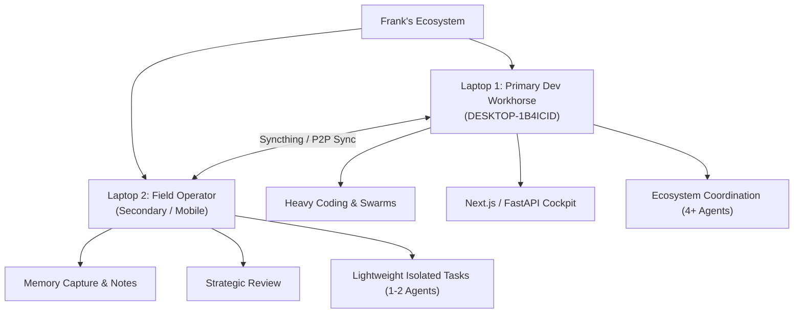

# Multi-Laptop Operating & Alignment Strategy

This strategy document governs the dual-laptop intelligence ecosystem for Frank's Windows workstations. It defines clear roles, sync boundaries, and recovery mechanisms for both machines.

---

## 1. Machine Classifications

To optimize local resource utilization and ensure secure, collision-free operations, the active laptops are divided into two distinct roles:



### Laptop 1: Primary Dev Workhorse (DESKTOP-1B4ICID)
*   **Role:** Heavy Development, Multi-Agent Orchestration, and Local Server Executions.
*   **Primary Tasks:** Next.js dashboard/console serving, FastAPI voice sidecars, heavy model evaluations, Playwright browser automation, and running parallel agent swarms.
*   **Target Repo Footprint:**
    *   [Starlight-Intelligence-System](file:///C:/Users/frank/Starlight-Intelligence-System) (`clsis` / `stsis` - Claude / Starlight)
    *   [Arcanea](file:///C:/Users/frank/Arcanea) (`cla` / `agyarc` - Claude / Antigravity)
    *   [FrankX](file:///C:/Users/frank/FrankX) (`cfx` / `agyfx` - Claude / Antigravity)
    *   [agentic-creator-os](file:///C:/Users/frank/agentic-creator-os) (`acos` - Codex)
*   **Resource Safeguard:** Maintain $\ge 2048$ MB free RAM and $\le 5$ concurrent Claude/Codex agent processes.

### Laptop 2: Field Operator (Secondary / Mobile Companion)
*   **Role:** Memory Capture, Strategic Planning, Documentation, and Isolated Field Tasks.
*   **Primary Tasks:** Markdown-first voice-session capture, strategic vault curation, documentation testing, and lightweight code verification.
*   **Target Repo Footprint:**
    *   [Starlight-Intelligence-System](file:///C:/Users/frank/Starlight-Intelligence-System) (`clsis` - Claude)
    *   [FrankX](file:///C:/Users/frank/FrankX) (`cfx` / `agyfx` - Claude / Antigravity)
*   **Resource Safeguard:** Spawns minimal agents to prioritize battery life and offline capability.

---

## 2. Sync & Environment Doctrine

Both laptops are synchronized via a secure P2P/Syncthing framework. To prevent conflicts and secure critical credentials, the following rules apply:

1.  **Append-Only Event Logs:** Memory vaults (Strategic, Technical, Creative, Operational, Wisdom, Horizon) write append-only logs. This ensures Syncthing handles synchronization without merge conflicts.
2.  **Sovereign Credentials:** Raw API keys and database secrets must never be committed to Git. Local secrets must live in `Starlight-Intelligence-System/private/.env.local` or `.env` which are gitignored.
3.  **Local Settings Exemption:** Machine-specific settings (like host paths or local model parameters) live in local override files and are omitted from upstream pushes.

---

## 3. Session Recovery & Post-Reboot Lifecycle

When a computer restarts, follow this unified script sequence to restore the active developer state and launch the respective agents in their targets.

### The Recovery Path

1.  **Launch Windows Terminal:** Start Windows Terminal (`wt.exe`).
2.  **Run the Session Restarter:** From your shell, run:
    ```powershell
    pwsh -File C:\Users\frank\Starlight-Intelligence-System\scripts\restart-all-agents.ps1 -Action Start
    ```
    This script will:
    *   Identify the host machine (`$env:COMPUTERNAME`).
    *   Inspect running processes to avoid duplication.
    *   Automatically spawn a new tab in Windows Terminal for each configured repository.
    *   Launch the target agent inside each tab (`clsis`, `agyarc`, `agyfx`, `acos`).
3.  **Visualize Status:** Open [agent-control-center.html](file:///C:/Users/frank/Starlight-Intelligence-System/cockpit/agent-control-center.html) in your browser. This dashboard reads [agent-status-data.js](file:///C:/Users/frank/Starlight-Intelligence-System/cockpit/agent-status-data.js) (updated by the restarter) to show which agents are running, their PIDs, and active commands.

### Background Watchdogs

*   **Agent Watchdog:** Runs via Task Scheduler to prune orphaned background processes older than 4 hours and free blocked development ports.
*   **Machine Sentinel:** Scans daily to ensure real-time protection, scheduled tasks, and firewall rules are active.
