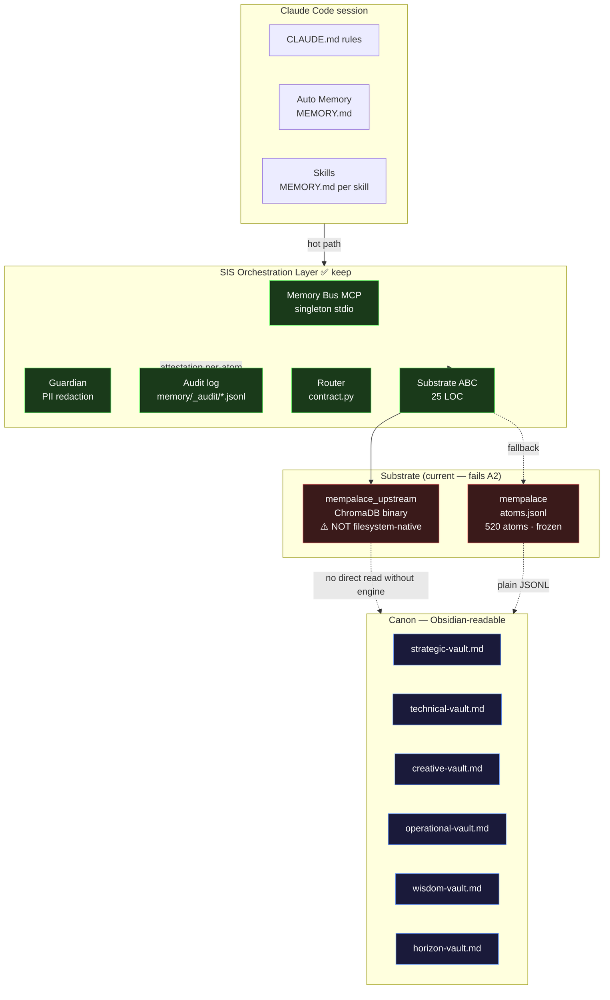
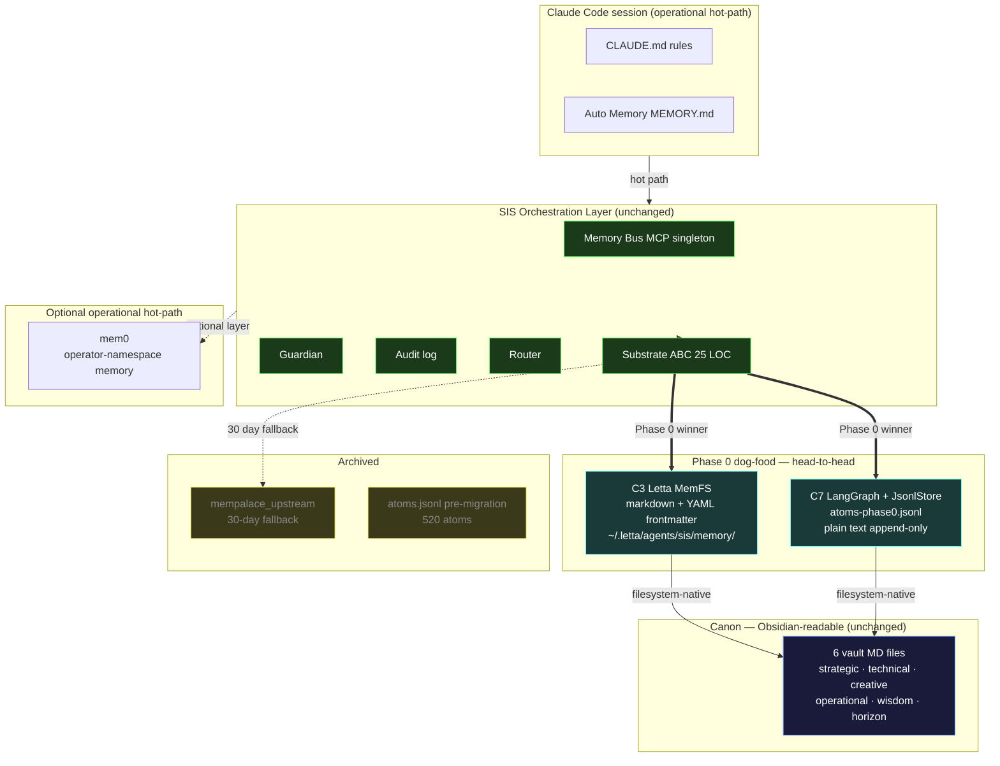
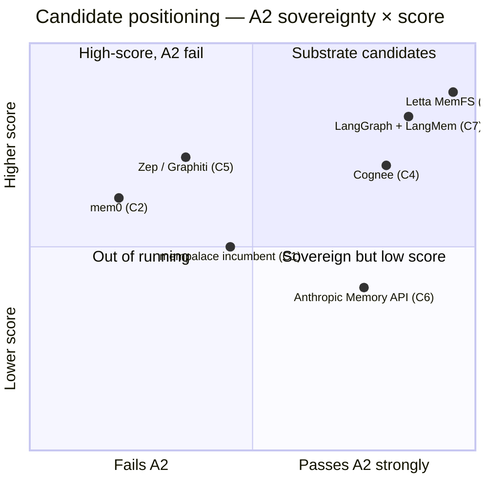
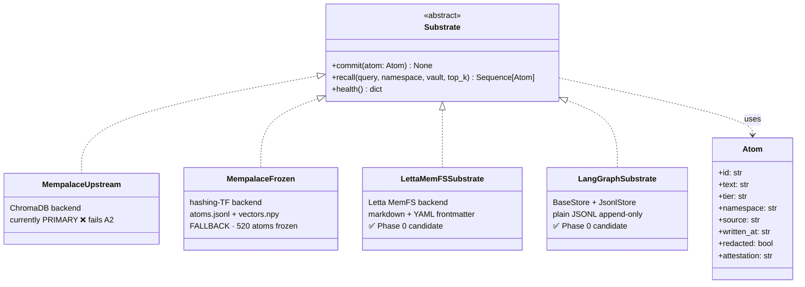

# Memory Foundation — Architecture Overview

**Date:** 2026-05-20
**Companion to:** `synthesis.md` (full research artifact)
**Purpose:** Mermaid-rendered diagrams of the memory architecture (current + post-Phase-0). Renders inline on GitHub + site detail page.

---

## Current state (2026-05-20)

**Diagnosis:** The substrate layer fails A2 (filesystem-native). Orchestration layer is sound — keep it. Canon is sovereign and readable. The fix is at the substrate slot only.

---

## Post-Phase-0 target

**Resolution:** Phase 0 winner replaces the substrate slot. A2 axiom restored — every atom is filesystem-readable plain text without engine. ChromaDB demoted to 30-day fallback. mem0 becomes optional operational hot-path layer above the substrate, NOT a substrate replacement.

---

## Decision matrix as visual

C3 and C7 are the only candidates in the top-right quadrant (high A2 + high score). Phase 0 dog-food resolves the tie. Anthropic Memory API is REJECTED separately on A5 (model lock-in) regardless of its position here.

---

## Substrate ABC contract (current — kept across Phase 0)

The Substrate ABC is the architectural property that makes this whole research cycle low-risk. **Swapping substrate = writing one new subclass.** ~200-300 LOC. Reversible.

---

*Built on SIP — 2026-05-20 · Mermaid renders inline on GitHub + on site detail page · Pair with synthesis.md*
