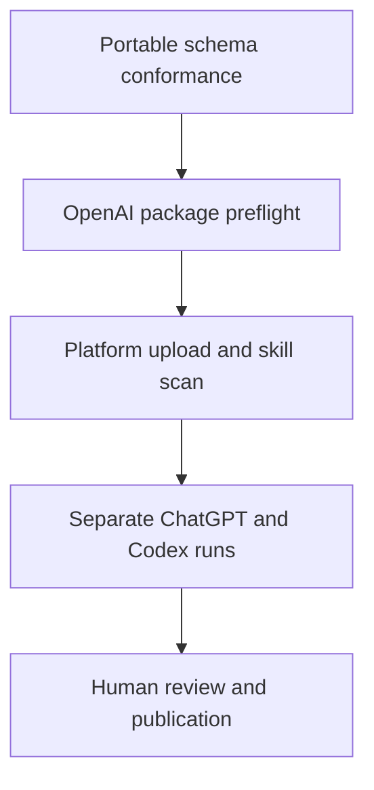

# OpenAI plugin release and submission runbook

Status: locally preflight-ready; external OpenAI and connected-host gates pending  
Candidate: `plugins/starlight-foundry` 0.1.0  
Rules reviewed: 2026-09-01; mandatory re-review by 2026-10-01

## Current truth

The checked-in candidate is a skills-only package. It has a portable Agent Plugins manifest, OpenAI overlay, four skills, listing icons, a submission profile, and no MCP server or custom UI. Its skills work in two explicit modes:

- a marketplace install designs Task Envelopes and packs, then reports compilation as `pending-runtime`;
- an SIS workspace may invoke the checked-in Foundry compiler and prover.

The repository currently proves portable schema conformance and an OpenAI docs-derived package preflight. It has not proved OpenAI Platform upload, the OpenAI skill safety/security scan, ChatGPT runtime, Codex runtime, directory review, publication, or support.



## Automated release checks

Run from the SIS repository root:

```bash
npm ci
npm run foundry:toolchain:install # isolated native validators; requires Node.js >=22
npm run foundry:plugin:check
npm run foundry:conformance
npm run foundry:submission:check
npm run foundry:loader:codex
npm run foundry:validator:claude
npm run test:foundry
npm run lint
npm run build
git diff --check
```

`foundry:conformance` checks the package against byte-pinned Agent Plugins 1.0.0 schemas using Ajv 8.20.0. It verifies the cached schema digests before compilation. `foundry:submission:check` validates the submission profile and the freshness-bounded OpenAI rules. `foundry:loader:codex` runs the pinned official Codex 0.152.0 add/discover/install/list/remove lifecycle in a disposable home. `foundry:validator:claude` runs Claude Code 2.1.252's official strict native package validator. None creates a directory, ChatGPT, connected Claude, publication, or support claim.

CI uploads `agent-plugin-conformance.json`, `openai-plugin-preflight.json`, `codex-loader-smoke.json`, and `claude-validator-smoke.json`. Treat loader and native-validator reports as exact local evidence only, not as portal, connected ChatGPT/Claude, public-directory, or supported-runtime receipts.

## OpenAI evidence surfaces

| Registry ID | Surface | Required proof | Cannot substitute |
|---|---|---|---|
| `openai-plugin-local` | Local/repository package | Pinned conformance, preflight, add/list/remove lifecycle | Directory approval |
| `openai-workspace-marketplace` | Workspace marketplace | Admin sync, policy, install, update, removal | Public directory listing |
| `openai-universal-plugins-directory` | Universal Plugins Directory | Verified publisher, upload, current scan, review outcome, listing URL | ChatGPT or Codex runtime proof |
| `openai-chatgpt-runtime` | ChatGPT runtime | Exact plan/region/version, activation, positive and boundary cases, removal | Codex runtime proof |
| `openai-codex-runtime` | Codex runtime | Exact client/version/OS, activation, positive and boundary cases, update/removal | ChatGPT runtime proof |

These IDs are deliberately one-to-one. Mint and promote a receipt only for the exact registry ID exercised by its evidence; never reuse a local-package, workspace, directory, ChatGPT, or Codex result for a sibling surface.

The Anthropic registry applies the same boundary: `anthropic-claude-code-plugins`, `anthropic-claude-connectors`, and `anthropic-mcp-apps` require separate receipts. A native validator result for Claude Code cannot become connector-review or MCP Apps runtime evidence.

## Submission dossier

The source dossier is `plugins/starlight-foundry/submission/openai/profile.json`. Keep it free of credentials and internal OpenAI technical IDs. It may describe only source-controlled preflight states: `draft`, `preflight-ready`, `external-gates-pending`, or `blocked`. It never advances to `submitted`, `approved`, or `published`; those are external strong states and belong only in a digest-bound platform release receipt accepted by the live attestation verifier. Complete these gates before asking that verifier to mint or accept such a receipt:

1. Select and verify the real publisher: Frank Riemer as an individual, or a genuinely formed and verified business.
2. Confirm Apps Management Write / `api.apps.write` in the verified organization.
3. Publish one consistent privacy, terms, and support set naming the same controller. Do not use pending or contradictory entity details.
4. Re-run the official-source review if the local rules date has expired.
5. Upload through the OpenAI Platform and retain the current skill safety/security scan result. Use Scan Tools only for a future MCP-backed candidate.
6. Run the five positive and three negative review cases in the dossier.
7. Complete separate ChatGPT and Codex lifecycle runs in authorized clean profiles.
8. Redact, hash, and review all evidence.
9. Let Frank approve submission, reviewer responses, and final publication.

For the current skills-only/no-UI candidate, submit no screenshots or recording. If an MCP server is added later, create a separate profile and follow the then-current portal requirements; recordings remain conditional on an explicit portal/reviewer request or an internal evidence plan, not a presumed universal requirement.

## MCP-backed Starlight Creator lane

`starlight-creator-mcp` is not yet the public runtime. Its current server is localhost/BYOK, has a global bearer token, shared local state, unsafe cloud path inputs, and tool annotations that do not consistently match side effects.

The public projection requires, in order:

1. A fixed reviewed tool profile with truthful annotations and tenant-safe schemas.
2. A production HTTPS streamable-HTTP endpoint with OAuth 2.1, tenant isolation, quotas, redacted errors, retention/deletion, health metadata, immutable build provenance, and rollback.
3. A submission snapshot with exactly five positive and three negative cases, explicit annotation justifications, a current MCP tool scan, reviewer access, and any media explicitly requested by the portal or reviewer.
4. A real optional UI only after text fallback works. Add screenshots only if the current scan finds custom UI.

Do not expose local filesystem imports, raw provider/job identifiers, arbitrary composites, licensing mutation, metrics CSV paths, or customer prompts/media in the first public profile. Do not collect provider API keys through ChatGPT.

## Evidence and media operations

The agentic release team uses a disposable profile or staging tenant and records:

- exact package, commit, artifact digest, host ID, client version, plan, locale, OS, and architecture;
- install, discovery, success, boundary/negative-auth, update, uninstall, and cleanup results;
- immutable transcript, trace, JUnit, redaction report, and artifact hashes;
- listing and review state only when observed in the real host;
- a proposed receipt that remains `compatible` until cryptographic attestation and connected-host proof pass.

Internal evidence, reviewer recordings, and public screenshots are separate assets. Redact secrets, email addresses, tenant and account identifiers, customer data, prompts/media, browser notifications, and unrelated chrome before hashing. Never attach raw captures to a public issue.

## Claims and public copy

Use these exact boundaries:

| Internal state | Public wording |
|---|---|
| `compatible` | Package validates locally |
| `verified` | Tested by Starlight on the named environment |
| `published` | Listed at the linked reviewed directory URL |
| `supported` | Reserved for a future verifier that binds a named Starlight owner, exact support scope, limitations, policy, evidence, and expiry; never implies host support |

Never claim OpenAI verification, endorsement, or support unless explicit host evidence authorizes the exact wording. A GitHub merge signature, portable schema pass, portal upload, or directory listing does not provide that authority.

## GTM and commerce boundary

Use the public plugin only for genuinely useful free capability execution or access to an entitlement the user already has. It must not act as an acquisition funnel or contain upgrade, pricing, purchase, promotion, transactional link, plan-comparison, or checkout paths for Starlight digital services. Direct B2B sales remain an outside-the-plugin company activity.

Sell Launch Sprints, Release Cloud, and Enterprise directly through Starlight's website, proposals, or invoices. Prioritize governed private workspace marketplaces as the first B2B wedge. Starlight Exchange may transact only on Starlight-owned or host-policy-permitted channels; OpenAI remains a distribution and entitlement-consumption surface.

## Rollback and stop conditions

- If preflight rules expire, fail CI and review current official documentation; never extend the date silently.
- If a scan or host run fails, keep the prior claim or downgrade it; do not rewrite evidence.
- If legal identity, role, account, billing, domain, consent, or final publication is missing, stop and issue a human gate packet.
- If a package or evidence digest changes, invalidate the affected receipt and rerun from build.
- Uninstall test candidates and revoke test access after evidence capture.

## Primary sources

- https://developers.openai.com/plugins
- https://developers.openai.com/plugins/build/plugins
- https://developers.openai.com/plugins/app-guidelines
- https://developers.openai.com/plugins/deploy/submission
- https://developers.openai.com/plugins/deploy/app-review
- https://developers.openai.com/plugins/deploy/submission-errors
