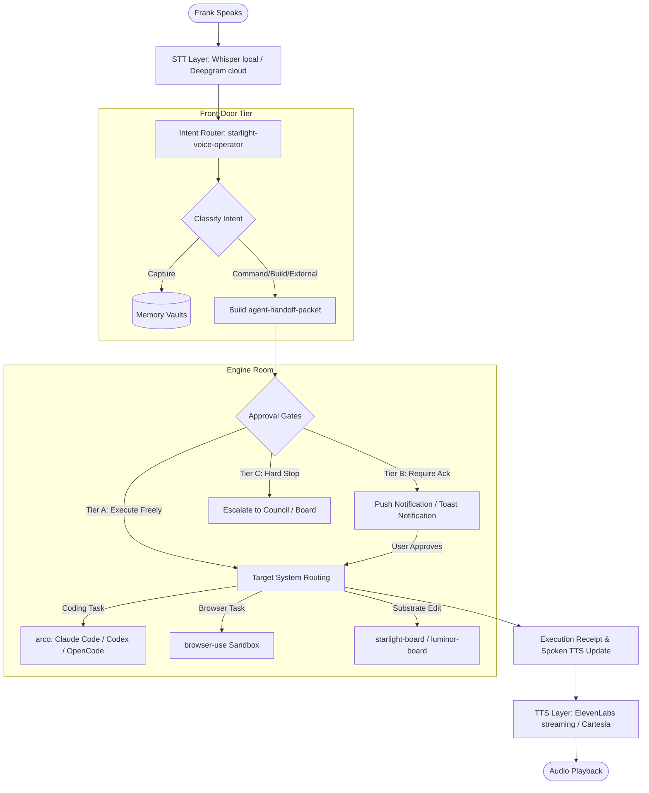

# Starlight & Arcanea Voice Cockpit — E2E Jarvis Architecture, State, and Roadmap

This document compiles all research, plans, and architectural definitions regarding the **Starlight Voice Operator**, **Arcanea Voices**, and **Jarvis-grade personal AI setups** active on this machine.

---

## 1. End-to-End (E2E) Architecture & Flow

The E2E system is designed around the premise that **"Voice is the cockpit, Superintelligence is the engine room, and the Handoff Packet is what they share."**



### The End-to-End Flow
1. **Audio Input**: Frank speaks (via local mic, headset, or room array).
2. **Transcription (STT)**: Transcribed in 80–500ms using local `faster-whisper` (large-v3) or cloud Deepgram Nova-3 fallback.
3. **Intent Routing**: The `starlight-voice-operator` agent (Front-Door Tier) classifies the utterance into exactly one of seven classes (Capture, Command, Build, Search, Organize, Reflect, External) in <2s of reasoning.
4. **Handoff Contract**: For executable tasks, the operator builds a structured `agent-handoff-packet` (YAML contract).
5. **Approval Gates**:
   - **Tier A (Free)**: File reads, search, local note creation, and diagnostic scripts run immediately.
   - **Tier B (Ack)**: Destructive actions, sending messages, publishing, code merges, or financial tasks send a push/toast notification and wait for Frank.
   - **Tier C (Escalate)**: Substrate-level edits or high-risk tasks invoke the `starlight-board` or Council.
6. **Execution**: The packet dispatches to the correct backend (e.g., coding agents via `arco`, browser automation via `browser-use`, or vault writes).
7. **Speech Output (TTS)**: The execution result is synthesized into a spoken response (≤2 sentences) using ElevenLabs Turbo v2.5 streaming or Cartesia Sonic-2 and read back.

---

## 2. Voice Operator & Substrate Voices

The system differentiates between **Operational Frontends** (intent routers) and **Substrate Archetypes** (governance/reasoning voices).

### The Voice Operator (`starlight-voice-operator`)
- **Role**: Located in the **Front-Door Tier**. Acts as the cockpit interface.
- **Posture**: Quiet executive operator. Speaks in ≤15s short replies, leads with action, avoids AI-hedging slop.
- **Handoff Packet Contract**: Enforces a strict schema:
  ```yaml
  packet_id: <ulid/uuid>
  created_at: <iso8601>
  source: voice | text | /intake
  classification: { intent_class: <class>, confidence: <conf> }
  target_system: <repo-path | URL | device | memory>
  context: { frank_utterance: <text>, relevant_files: [], relevant_memory: [] }
  task: <imperative task description>
  constraints: { do_not_touch: [], must_preserve: [] }
  verification: { proof_required: [], done_means: <sentence> }
  approval: { required: bool, tier: A | B | C }
  spoken_update_for_frank: <≤2 sentences to read aloud>
  ```

### Canonical Substrate Voices (`VOICES.md`)
These are five core voices used in repo-level reflections and decision-making:
1. **`architect`**: First-principles, systems-level, option-space collapse. Owns protocol/contracts/canon.
2. **`sovereign-creator`**: Content-first, publishing cadence. Owns UX and artifact quality.
3. **`protocol-defender`**: Security-first. Owns trust boundaries, audit posture, and validations.
4. **`implementer`**: Build-first, shipping-pragmatic. Owns build order, tooling, and technical debt.
5. **`overseer`**: Post-hoc synthesis. Speaks last (≤3 sentences) naming load-bearing concerns.

### Council Archetypes (Wisdom Body)
Seven archetypes convened for high/critical-risk substrate decisions:
- **`elder-father`**: Legacy, discipline, responsibility.
- **`elder-mother`**: Care, beauty, relational truth, emotional shape.
- **`sage`**: Philosophy, time-horizon dilation, question-reframing.
- **`builder-elder`**: Leverage-vs-busywork, MVP-line drawing, dependencies.
- **`shadow-witness`**: Ego-tax, hidden motives, self-deception check.
- **`divine-neutral-witness`**: Stillness, frame-noticing, stake-stripped observation.
- **`future-self-at-90`**: Far-horizon retrospection, pattern-as-life.

---

## 3. Current Installed State (Frank's Workstation)

The workspace has been consolidated to separate core memory/control (`Starlight-Intelligence-System`) from portable utility execution (`agentic-creator-os`) and active public code bases.

### 1. Active Repositories & Roles
- **`Starlight-Intelligence-System` (SIS)**: The memory and control spine. Holds 6 semantic vaults (`memory/vaults/`: Strategic ◆, Technical ⬡, Creative ✦, Operational ▸, Wisdom ◎, Horizon ↗), MCP server configurations, benchmarks, and proving ground.
- **`starlight-voice`**: The standalone open-source Jarvis-grade voice runtime. Tauri Rust tray application + Python Pipecat sidecar shell.
- **`agentic-creator-os` (ACOS)**: The execution layer for coding agent skills, commands, hooks, and launcher ergonomics.
- **`frankx.ai-vercel-website` & `frankx-prod-sync`**: Production deploy repo and sync worktree for the public site.
- **`Arcanea`**: Monorepo orchestrator for the creative intelligence and mythology platform.
- **`awesome-jarvis`**: Curated research repository cataloguing personal AI systems.

### 2. Available Tooling on Laptop
- **Rust/Cargo**: Active for building Tauri tray apps.
- **Python 3.13 & uv**: Installed Python runtime and package manager.
- **Agent CLIs**: Claude Code, Codex, and OpenCode installed and routed via `arco` (Arcanea Orchestrator).
- **Automation**: `browser-use` library is installed for browser execution (policy setup is pending).
- **Audio IO**: `sounddevice` package is installed; `Pipecat` is currently missing from the local python environment.

---

## 4. Installed vs. Planned Roadmap

The roadmap focuses on transitioning the system from **sovereign-by-design** (single-player on Frank's machine) to **sovereign-in-practice** (community-runnable asset).

| Feature / Goal | Current Shipped State | Planned Next Steps (Roadmap) |
|---|---|---|
| **Starlight Voice** | Tauri Rust tray application scaffold builds.<br>Python sidecar CLI handles text-mode intent routing.<br>Dry-run browser automation. | **Rust Sidecar Process Manager**: Tray owns lifecycle.<br>**PTT Hotkey**: Global hotkey (`Ctrl+Shift+Space`) events over IPC.<br>**Realtime Voice Loop**: Install Pipecat + wire local audio capture/playback.<br>**MCP Client**: Connect sidecar to SIS/Arcanea tools. |
| **System Evals** | Model Arena (3 rounds, 4 models) + Proving Ground (7 lanes).<br>RRF hybrid memory search yields +61% precision@10. | **RRF Integration**: Wire search to the production router.<br>**Router Module**: Replace the manual routing doctrine (Queen) with a runtime router reading `routing-table.json`. |
| **Community Packaging** | Evals mirror repository (`starlight-evals`) live. | **One-Command Bootstrap**: Stranger forks evals, runs one command, gets stack scorecard.<br>**Auto-sync**: Post-commit hook to sync SIS to mirror. |

---

## 5. Jarvis & Jarvis Setup Discussions

Our Jarvis-grade architecture draws from both open-source research and custom utility workflows.

### 1. Jarvis Research Base (`awesome-jarvis`)
- **Microsoft JARVIS (HuggingGPT)**: Uses LLM as a task-planner selecting HuggingFace expert models across a 4-phase pipeline (Plan → Select → Execute → Respond).
- **OpenClaw**: A 24/7 personal-AI framework that executes tasks autonomously across messaging apps, which we use as a model for proactive outreach.
- ** Stanford OpenJarvis**: Research on private, local, resource-efficient on-device AI.

### 2. Custom Jarvis Workflows (Specs & Prototypes)
- **Phase 4: Storage Doctrine Daemon**: A file-watching background daemon.
  - *Trigger*: New downloads/screenshots detected in `~/Downloads/`.
  - *Process*: Operator classifies the file -> proposes destination per the storage graph -> sends a toast/push notification -> moves file on Frank's approval.
- **Phase 5: Ambient Room Mode**: Dedicated USB mic array (e.g., ReSpeaker 4-mic array) + room speakers for hands-free wake-word-activated room assistant.
- **Standardized Workflows**:
  - `morning-brief`: *"Starlight, run the morning brief."* Speaks a 45s summary of git activity, calendar events, and pending Tier B approvals.
  - `evening-handover`: *"Starlight, run the evening handover."* Gathers daily commits, packet verification, open loops, and runs a 1-question `/energy-audit`. Generates `docs/ops/HANDOVER-<date>.md`.

---

### Key Open Decisions
1. **Gemini Key Fix**: The local `GEMINI_API_KEY` (73 chars) is currently identified as a mis-pasted OpenRouter key. If we intend to show Gemini-native demos, this needs rotation to a real 39-character Google key.
2. **Provider Key Integration**: To activate the live voice loop, ElevenLabs and Picovoice API keys must be populated in `private/voice-operator/config/components.toml`.

*Built on SIP · v1.1.1*
