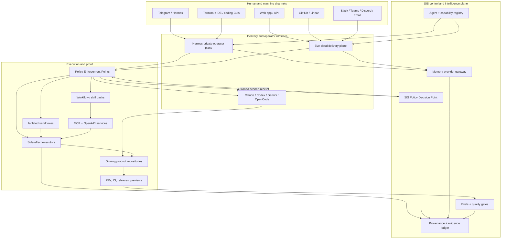

# SIS + Vercel Eve Agent Platform Strategy

**Date:** 2026-07-18
**Status:** Proposed portfolio decision and build roadmap
**Canonical planning repository:** `frankxai/Starlight-Intelligence-System`
**Decision owner:** Frank
**Scope note:** The originating request ended after “and whi…”. This strategy answers the recoverable scope—what agents are planned, where they belong, why they exist, what else should be built, and how GitHub, websites, channels, SIS, and Eve should fit together—without inventing the missing ending.

---

## 1. Executive decision

Build **one agent platform with four distinct planes**, not another collection of bots:

1. **SIS is the control and intelligence plane.** It owns agent contracts, identity, memory policy, provenance, governance, evaluation, budgets, and the portfolio registry.
2. **Hermes is Frank’s private operator plane.** It remains the human command center for Telegram, local files, schedules, durable personal context, and multi-machine orchestration.
3. **Vercel Eve is an optional cloud delivery plane.** Use it where authenticated web/API access, durable sessions, channels, sandboxes, or human interaction materially reduce implementation cost. Eve does **not** supply Starlight’s tenant isolation, authorization, retention, budget, or policy guarantees by itself; those are application-owned controls enforced at channel, tool, data, and side-effect boundaries.
4. **GitHub and product repositories are the execution and proof plane.** Code, agent packs, workflows, evals, pull requests, releases, and deployment evidence live in their owning repos.

**Do not migrate SIS into Eve. Do not duplicate Hermes in Eve. Do not deploy the documented SIS specialist catalog as separate services.** Most existing “agents” are reusable contracts, specialist prompts, or review roles. Only a small number deserve an independently deployed runtime.

The first Eve proof should be an **internal GitHub Repo Steward** on one bounded repository. It exercises Eve’s strongest differentiated capabilities—GitHub App channel, PR context, sandbox checkout, durable execution, approval, and traceability—without creating a second Telegram receiver or exposing customer data.

The first sellable offer remains the **Company Brain / Agentic OS service**, not a generic chatbot or prematurely generalized workspace. Commercial discovery must first prove a repeated delivery workflow and willingness to pay; only that repeated slice should become an authenticated delivery layer.

---

## 2. What exists now: evidence-backed estate inventory

### 2.1 Canonical platform and operating repositories

| Repository | Current role | Decision |
|---|---|---|
| `Starlight-Intelligence-System` | SIS substrate: memory, MCP, governance, agent registry, evals, vertical contracts | **Canonical platform control-plane spec** |
| `starlight-agent-config` | Cross-agent configuration, doctrine, estate routing, machine projections | **Canonical agent-fleet config**; do not duplicate in SIS or Eve |
| `agentic-ops` | Private fleet state, secure operations, handovers | **Private runtime operations** |
| `agentic-ops-hub` | Public fleet/control-plane contracts | **Public operating standard** |
| `starlight-command-center` | Electron desktop cockpit for fleet operations | **Private operator UI** |
| `hermes-cockpit` | Hermes profile/runtime registry for local and cloud instances | **Hermes-specific runtime registry**; keep bounded |
| `StarlightOS` | Productization/surface plane over the substrate | **Candidate hosted customer workspace**; avoid becoming a second control plane |
| `agent-registry` | Public discovery registry | **Public catalog and machine-readable discovery** |
| `frankx-private-agent-registry` | Intended private all-brand registry, but currently only a one-line README | **Absorb or retire**; it is not a functioning SSOT |
| `frankx-starlight-command` | Private mission-control map, strategy, and catalog | **Portfolio mission control**, provided it references rather than duplicates the SIS registry |
| `starlight-evals` | Whole-system evaluation harness | **Independent proof plane** |
| `starlight-swarm` | Queen/worker coordination substrate | **Fleet orchestration contract**, not a customer agent runtime |
| `starlight-memory` / private memory repos | Memory provider and private stores | **Memory implementation plane** under SIS policy |

### 2.2 Website reachability snapshot on 2026-07-18—not product-readiness evidence

A successful HTTP response establishes only the recorded response at the stated probe time and method. It does not establish ownership, funnel performance, tenant readiness, consent posture, authorization, or customer demand.

| Surface | Live check | Existing/planned agent job | Decision |
|---|---:|---|---|
| `frankx.ai` | 200 | Commercial front door, Company Brain, agents, Foundry, products | **Primary commercial agent entry point** |
| `frankx.ai/agents` | 200 | Install/catalog surface for FrankX agents | Expand into registry-backed catalog and onboarding |
| `frankx.ai/score` | **404** | Planned Intelligence Score and lead diagnosis | Repair or replace before promoting it; do not cite as live |
| `frankx.ai/foundry` | 200 | Business/venture operating-system services | Home for outcome-based client agent offers |
| `arcanea.ai` | 200 | Creative-intelligence front door | Primary Arcanea companion surface |
| `arcanea.ai/passport` | 200 | Planned Guardian Passport / symbolic onboarding | Keep as a creative onboarding door; do not link it to another brand profile by default |
| `arcanea.ai/claw` | 200 | Creator media engine | Automation product surface; publishing remains human-gated |
| `gencreator.ai` | 200 | Creator operating-system marketing/product surface | Creator onboarding and artifact review |
| `gencreator.ai/studio` | 200 | Current Inner Circle marketing route | Do not confuse with `GenCreator-Studio`’s `/hv` creation surface; document the route boundary |
| `starlightintelligence.org` | 200 | Open protocol, docs, download, starter, proof | **Open/spec surface**, never the private customer workspace |
| `starlightintelligence.org/protocol` | 200 | SIP protocol | Canonical public protocol route |
| `family-intelligence-os.vercel.app` | 200 | Family knowledge/memory/coordination product | Sensitive/local-first; no default cloud memory ingestion |
| `starlight-intelligence-academy.vercel.app` | 200 | Operator Lab | Education/tutor/cohort agent candidate |
| `starlight.systems` and planned routes | Timeouts | Planned Cards, Systems, Private, Constellation surfaces | **Do not build against this domain until DNS/ownership is resolved** |
| `room.starlight.systems` | DNS failure | Planned local voice room | Retire the public hostname or resolve through an approved DNS action; local voice does not need it |
| `starlightelligence.ai` | DNS failure | Intended applied-intelligence product front door | Treat as inactive; do not split traffic there now |

### 2.3 Website strategy decision

Use **nested routes before new domains or subdomains**, consistent with `docs/site/subdomain-roadmap.md`:

- `starlightintelligence.org`: open protocol, downloads, architecture, eval proof.
- `frankx.ai`: commercial services, agents, case studies, Company Brain, Foundry.
- `arcanea.ai`: creative companions, canon, worldbuilding, ArcaneaClaw.
- `gencreator.ai`: creator product, cohorts, artifact workflows.
- Customer-specific portals: only when a signed pilot requires separate auth, data isolation, or branding.

A route earns a subdomain only when it has at least two of: independent revenue, distinct audience, separate canon, or technical isolation. Dead or unresolved domains must not become architecture dependencies.

### 2.4 Existing agent portfolio, grouped by actual function

SIS file-count harnesses may derive an agent-file count, but the deployment registry, public projection, and runtime inventory are not yet reconciled; planning documents also use different historical definitions. Phase 0A must publish the count definition and a dated reconciliation receipt before any count becomes a portfolio KPI.

| Agent class | Existing examples | What they are | Deployment posture |
|---|---|---|---|
| Front door | Concierge, Envoy, Voice Operator | Intake, classification, zero-terminal handoff | Deploy only where a real channel needs intake |
| Control and synthesis | Orchestrator, Prime, Architect, Navigator | Routing, synthesis, architecture, prioritization | SIS/Hermes contracts; one orchestrator per runtime, not one service each |
| Assurance | Sentinel, Evaluator, fact checker, quality checker | Security, eval, claim, policy, and quality gates | Independent checker lane; some can run as CI/eval jobs |
| Memory and retrieval | Sage, Hermes search, Second Brain, extractors | Retrieval, curation, personal/institutional memory | SIS memory services and local/private stores |
| Coding and operations | Coder/planner/reviewer/tester, deploy/cost/backup/log agents | Repository and infrastructure execution | Coding CLIs, GitHub Actions, Hermes, or bounded Eve sandbox |
| Creator/media | Creator, social, music, asset, video, distribution agents | Artifact production and distribution preparation | Workflow/skill packs; publication requires human approval |
| Business/customer | Business, People, Energy, Property, Hospitality, Sales, Marketing | Domain-specific decisions and deliverables | Productized workflow packs, deployed only after a validated client workflow |
| Sensitive personal | Wealth, health, family, relational, mind, spiritual | High-sensitivity personal intelligence | Local/private by default; cloud only with explicit data and retention decision |
| Adapters | Hermes, OpenAI, LangGraph, CrewAI, Mastra, AutoGen, Ollama adapters | Portability/integration contracts | Libraries/adapters, not user-facing agents |
| Council/archetypes | Seven council seats and board roles | Structured critique perspectives | Invoke as finite review, never as always-on services |

**Portfolio rule:** an agent contract becomes a deployed agent only if it has a named user, recurring job, authenticated channel, bounded tools, measurable done-state, economic owner, and a cheaper alternative that has been rejected.

---

## 3. Channel strategy: put agents where work already happens

### 3.1 Channel priority by audience

| Audience | Primary channel | Secondary | Runtime | Why |
|---|---|---|---|---|
| Frank / internal operator | Telegram DM and desktop command center | GitHub, local terminal/IDE | **Hermes + coding CLIs** | Existing private command loop; local files and fleet context |
| Engineering team / repositories | GitHub issues, PRs, reviews, CI | Linear if adopted | **Eve GitHub channel + sandbox**, or GitHub Actions | Native work objects, diff context, auditable approvals |
| Prospects | `frankx.ai` web UI and email | Scheduled discovery call | **Eve web/Chat SDK** | Qualify and produce a useful diagnostic without requiring a community account |
| Company Brain clients | Authenticated web workspace | Teams/Slack/email based on client environment | **Eve + SIS service + customer data store** | Tenant identity, durable runs, approvals, artifacts, export |
| Arcanea creators | `arcanea.ai` chat/passport | Discord only when the community loop proves it | **Eve web/Discord** with canon connection | Creative continuity and rich interaction |
| GenCreator members | GenCreator workspace | Email/community channel | **Web app + Eve** | Artifact-to-review loop is the product, not a generic chat room |
| Communities/cohorts | Email-first or existing private channel | Circle/Discord/Slack after pilot evidence | **Manual concierge → Eve** | Prove weekly retention and artifacts before platform automation |
| Enterprise/professional teams | Microsoft Teams or Slack | Email | **Eve Teams/Slack** | Native identity and HITL cards in existing work environment |
| Public developers/adopters | GitHub + `starlightintelligence.org` | npm/skills registry | CI, docs, MCP | Code and proof are the trust mechanism |
| Voice/SMS users | Twilio only for a validated accessibility or support case | Local voice operator | **Eve Twilio or local voice** | High compliance and consent burden; not a default channel |

### 3.2 Eve channel evidence and fit

As of 2026-07-18, Eve documents first-class channels for:

- Browser/API through the default Eve HTTP channel.
- Slack, Discord, Microsoft Teams, Telegram, Twilio, GitHub, and Linear.
- Additional adapters—including email and WhatsApp—through Vercel Chat SDK.
- Proactive channel sessions from schedules.
- Human-in-the-loop controls appropriate to the native channel.

This makes Eve a strong **delivery adapter and durable session runtime**, not the control-plane source of truth.

### 3.3 Telegram constraint

Only the Yogabook command center should receive on the primary Telegram bot. Therefore:

- Do not point Eve at the existing primary bot token/webhook.
- The first Eve pilot should use GitHub, not Telegram.
- A future customer-facing Eve Telegram agent must use its own bot identity and webhook.
- Cross-machine or cross-runtime work is enqueued on the durable Starlight swarm bus; chat messages alone are not state.

### 3.4 Channel invariants

Every channel adapter must:

1. Verify provider signatures/tokens before trusting identity.
2. Derive principal and tenant from verified context, never model input.
3. Preserve one continuation/session identity per native thread.
4. Declare attachment types, size limits, and retention behavior.
5. Show AI disclosure where required.
6. Require human approval for external sends, publishing, purchases, production mutations, and sensitive memory changes.
7. Remain a replaceable edge adapter; canonical data lives elsewhere.

Every live surface/channel also requires an operational registry record:

```yaml
surface:
  canonical_domain:
  route:
  owning_repo:
  product_owner:
  authenticated_principal:
  tenant_model:
  data_classes:
  approved_processors:
  retention_and_deletion_sla:
  consent_notice_version:
  primary_cta:
  success_event:
  analytics_owner:
  agent_contract_id:
  rollback:
```

Do not link Arcanea and other brand profiles by default. Any account linking requires a documented purpose, separate user action, privacy-notice version, revocation path, data-minimization review, and controller/processor determination.

---

## 4. Target architecture



### 4.1 SIS responsibilities

SIS owns:

- Agent identity and versioned contracts.
- Capability taxonomy and routing metadata.
- Memory classes, retention, provenance, export, deletion, and redaction policy.
- Tool allowlists, approval classes, budgets, and risk levels.
- Handoff and evidence schemas.
- Evaluation cases, release gates, and lifecycle state.
- Public/private boundary and SIP attestation.

SIS does **not** own:

- Every frontend.
- Channel-specific webhook code.
- Customer credentials.
- Product databases.
- Provider-specific sandbox infrastructure.
- The primary Telegram receive process.

### 4.2 Eve responsibilities

Eve should own, per deployed product agent:

- Authenticated browser/API session routes.
- Channel adapters and native response delivery.
- Durable runs that can park and resume for tools, OAuth, or human input.
- Isolated execution sandboxes and network policy.
- Local/remote subagent invocation.
- Per-session state and trace events.
- Schedules that initiate proactive sessions.

Eve should **not** become long-term memory, the cross-estate registry, or the place where private SIS vaults are copied.

Eve explicitly documents that it has no tenant-aware long-term memory subsystem. Its `defineState` is durable **session** state. Cross-session/user memory belongs in an external store. For Starlight, the default integration is an SIS memory provider exposed through MCP/OpenAPI or an application database behind the SIS memory contract.

### 4.3 Hermes responsibilities

Hermes remains responsible for:

- Frank’s command conversation and private memory.
- Local file and repository operations.
- Multi-machine orchestration and durable swarm-bus handoffs.
- Personal schedules and briefings.
- Skills and workflows that require the full local operator context.
- Escalation from cloud agents back to Frank.

### 4.4 Memory and tenancy

Tenant isolation is enforced in every data plane, not by prompt or key convention:

1. Verified route/channel authentication resolves immutable `actor_id` and `organization_id`.
2. Application membership authorization occurs before a run starts and is rechecked after membership/revocation changes.
3. Database row-level security uses `organization_id`; a service role cannot bypass it outside a narrowly audited worker path.
4. Object storage, vector indexes, caches, queues, observability, exports, and Eve durable session state carry tenant-scoped prefixes/claims and are independently tested for cross-tenant denial.
5. Every memory object records classification, source, consent/legal basis, retention, residency, deletion state, and provenance.
6. Deletion is a receipted workflow covering primary data, vectors, attachments, sessions, logs, downstream processors, and documented backup expiry/SLA—not merely a database delete.
7. Stored memory and retrieved repository/channel data remain untrusted input, never executable instruction.
8. Sensitive verticals use a private/local tier by default; secrets and payment data are never memories.

### 4.5 Security model

Adopt Eve’s runtime/sandbox boundary and strengthen it with SIS policy:

- Secrets remain in the trusted app runtime.
- The model and sandbox never receive raw credentials.
- Prefer MCP/OpenAPI tools over shell egress.
- Default production sandbox egress to deny-all or explicit allowlists.
- Broker credentials at the network/tool boundary where possible.
- Allowlist connection tools; do not expose entire third-party APIs by default.
- Re-authorize side effects inside the executor even after approval.
- Use idempotency keys for all replayable side effects.
- Pin remote agent-to-agent calls with authenticated deployment identity.

For every protected tool/action, the enforcement point must receive an operation-scoped authorization decision bound to:

```text
{policy_version, tenant_id, actor_id, session_id, agent_id/version,
 tool/action, resource, input_digest, approval_id, issued_at, expires_at,
 budget_reservation_id, tool_version, model/provider/version, idempotency_key}
```

The executor revalidates expiry, revocation, tenant/resource scope, exact input digest, approval binding, and remaining budget immediately before the side effect, then emits an immutable `audit_receipt_ref`. A resumed Eve/Hermes session never carries a permanently valid approval.

```text
Channel/auth → PEP → SIS PDP → signed decision/receipt → PEP → executor
                                                ↘ immutable audit receipt
```

Repository content is hostile model input. Any repository-enabled agent must separately constrain caller identity, repository and fixed commit/ref, readable paths, command families, package installation, network egress, GitHub App permissions, fork/contributor trust, workflow execution, credentials, and write authority. “Read/test/patch” labels alone are not a permission boundary.

---

## 5. Framework decision

### 5.1 Comparative posture

Evidence date: 2026-07-18.

| Framework | Evidence | Best use here | Decision |
|---|---|---|---|
| **Vercel Eve** | Apache-2.0, `eve@0.25.1`, ~3.8k GitHub stars; TypeScript; channels, durable sessions, sandboxes, schedules, HITL, MCP/OpenAPI, local/remote subagents | Customer/team delivery agents on web, GitHub, and collaboration channels | **Pilot and adopt selectively** |
| **Hermes Agent** | Existing Starlight operator runtime with Telegram, skills, tools, memory, cron, and local action | Frank’s private command center | **Keep as operator plane** |
| **OpenAI Agents SDK** | Large active Python SDK, lightweight multi-agent baseline | Python-native product teams or provider-specific integrations | Adapter target, not estate shell |
| **LangGraph** | Large active graph framework focused on resilient agents | Explicit state-machine workflows whose graph semantics are the product | Use only for graph-shaped workflows |
| **Microsoft AutoGen** | Repository README marks it maintenance mode and points to Microsoft Agent Framework | Existing compatibility only | **No new adoption** |
| **CrewAI** | Mature role/crew and flow model | Portable packaged business automations where role-based crews are already selected | Adapter target |
| **Mastra** | Active TypeScript agent/application framework | Alternative when Eve’s Vercel-specific delivery model is not desired | Keep in lab; do not dual-adopt now |
| **Coding CLIs** | Existing Claude/Codex/Gemini/OpenCode fleet | Repository mutation, tests, PRs | Execution workers, not customer chat runtimes |

### 5.2 Adoption rule

Eve is pre-1.0 at the observed `0.25.1` release, its model-authored `Workflow` tool is explicitly experimental, and the documented Vercel Agent Runs dashboard is gated. Therefore the pilot must pin an exact Eve version, use ordinary subagents/tools rather than experimental dynamic workflows, export OpenTelemetry to an operator-owned sink, and treat upgrades as reviewed migrations with regression evals.

Eve is approved for a workload only when at least three are true:

- Needs authenticated web/API or one of Eve’s native channels.
- Needs durable pause/resume.
- Needs sandbox execution.
- Needs interactive OAuth or human tool approval.
- Needs per-session tracing and proactive schedules.
- Needs separately deployed remote specialists.

Otherwise prefer a static workflow, GitHub Action, Hermes skill/cron, existing product API, or direct coding CLI.

### 5.3 Exit strategy

All Starlight agents must preserve runner portability through:

- Versioned agent contract.
- JSON Schema input/output.
- MCP/OpenAPI tool boundary.
- External long-term memory interface.
- Channel-neutral event envelope.
- Provider-neutral evaluation cases.

No business-critical knowledge should exist only in an Eve directory or provider dashboard.

---

## 6. Prioritized agent portfolio

### P0 — Build now

#### 1. Internal GitHub Repo Steward

| Field | Contract |
|---|---|
| User | Frank and approved repository collaborators |
| Job | Triage an issue/PR, inspect the real diff, run bounded checks, propose or prepare a patch, and return evidence |
| Channel | GitHub `@mention` in one pilot repository |
| Runtime | Eve GitHub channel + Vercel Sandbox |
| Control | SIS policy + eval contracts |
| Tools | Read a fixed allowlist of repository paths; run allowlisted offline-capable tests in a prebuilt sandbox image; generate a patch artifact. GitHub write/PR creation is disabled in the spike |
| Success | ≥18/20 preregistered representative tasks accepted by a blinded reviewer; 0/10 adversarial violations; 100% policy/tool/cost/result receipts; stated advantage over GitHub Actions + Hermes baseline |
| Why first | Tests Eve’s strongest value in a low-ambiguity, auditable internal workflow |

#### 2. Agent Portfolio Registrar

| Field | Contract |
|---|---|
| User | Frank, Starlight Queen, repository maintainers |
| Job | Reconcile agent specs, files, runtime deployments, websites, owners, status, costs, and evals into one inventory |
| Channel | CLI/CI and command-center view; not a conversational bot initially |
| Runtime | SIS scripts + GitHub Actions/Hermes |
| Output | Machine-readable registry plus generated human report |
| Success | Within declared GitHub App, Vercel, DNS, deployment-account, and owning-repo-manifest sources, 100% of discovered deployments map to a contract/version or dated exception; report preserves source snapshots and unresolved items |
| Why now | Current 48/56/144/150 count drift makes portfolio and public claims unreliable |

#### 3. Fleet Sentinel / Cost Guard

| Field | Contract |
|---|---|
| User | Internal operations |
| Job | Detect CI, deployment, queue, cost, storage, credential-slot, and runtime drift; prepare remediation |
| Channel | Command center + Telegram alert only on actionable thresholds |
| Runtime | Hermes/cron + existing sentinel/eval repos |
| Gate | No deletion, billing change, deployment mutation, or incident message without policy/human approval |
| Success | Low-noise alerts, verified remediation links, per-agent cost attribution |

### P1 — Productize after the internal proof

#### 4. FrankX Company Brain Concierge

| Field | Contract |
|---|---|
| User | Qualified founders, creators, and small teams |
| Job | Diagnose the operating problem, explain the relevant offer, produce a useful intake artifact, and route to a human or self-serve pack |
| Channel | `frankx.ai` web UI; email follow-up only after consent |
| Runtime | Eve web/Chat SDK, no sandbox initially |
| Data | Minimal lead/intake record; no autonomous enrichment of private data |
| Revenue | Feeds €500 audit, €750 cohort, €7,500 sprint, and full estate commission |
| Success | Completed useful diagnostic, qualified conversion, low false-fit rate, explicit consent |

The broken `/score` route must be fixed or superseded before this agent is marketed as “Intelligence Score.”

#### 5. Company Brain / Agentic OS Delivery Workspace

| Field | Contract |
|---|---|
| User | Paying sprint/commission clients |
| Job | Guide intake, corpus checklist, approvals, artifact review, decisions, delivery milestones, export, and handover |
| Channel | Authenticated web; Teams/Slack/email adapters per client |
| Runtime | Eve + SIS memory/provider contract + application Postgres/object storage |
| Data | Tenant-scoped, retention-defined, exportable, deletable |
| Revenue | Delivery efficiency and recurring managed support |
| Success | Client reaches first useful artifact faster; every external action approved; complete export at handoff |

#### 6. Starlight Agentic OS Auditor

| Field | Contract |
|---|---|
| User | Builders, teams, agencies |
| Job | Inspect a repository or workflow against the public Agentic OS standard and produce a scored upgrade path |
| Channel | GitHub App or authenticated upload/workspace |
| Runtime | Eve sandbox + SIS eval pack |
| Revenue | €500 diagnostic, implementation sprint, partner training |
| Success | Reproducible score, cited evidence, clear gaps, no unsupported compliance claim |

### P2 — Vertical proofs

#### 7. Arcanea Creative Companion

- Home: `arcanea.ai`, with Passport as onboarding and Arcanea canon as a scoped connection.
- Job: worldbuilding, creative guidance, canon-aware artifact preparation.
- Runtime: Eve web; Discord only after a real community loop exists.
- Gate: no canon mutation or public publishing without human review.
- Memory: user creative profile separate from locked Arcanea canon.

#### 8. GenCreator Artifact Coach

- Home: GenCreator creation workspace, not the marketing-only `/studio` route.
- Job: turn an idea into one reviewable artifact, capture feedback, and route revision.
- Runtime: web + bounded media/workflow tools.
- Metric: artifacts accepted or revised, not messages generated.

#### 9. Community Steward

- Start as a 5–15-person manual concierge pilot using the existing community operating-system spec.
- Agent-draft Monday–Friday prompts, pairing proposals, artifact tracking, and reflection summaries.
- Humans approve invitations, DMs, calendar actions, publication, and sensitive matches.
- Automate Circle/Discord/Slack only after a weekly loop demonstrates retention and artifact output.

#### 10. Research Commons Guide

- Candidate homes: Starlight Proving Ground, Blue Life Commons/Ocean, neuroscience, psychology, or Library OS.
- Job: source-led questions, evidence extraction, citation-safe contribution drafts.
- Runtime: web/Eve + read-only corpus MCP; contributions enter review PRs.
- Gate: no scientific, medical, or conservation claim without source evidence and reviewer acceptance.

### P3 — Build only after customer demand

- Energy/PV seller copilot.
- Hospitality house operations agent.
- Property intelligence portal agent.
- Investor/diligence workspace.
- Family knowledge companion.
- Teams/Slack enterprise CoE agent.
- Voice/SMS accessibility agent.
- White-label partner agent factory.

Each must start from a signed workflow and data contract, not from an existing agent name in the registry.

### Explicitly do not build now

- A separate deployed service for every SIS specialist.
- A second primary Telegram gateway.
- A generic “Starlight chatbot.”
- An autonomous publishing swarm without approval.
- A cloud-first health, family, wealth, relationship, or spiritual memory agent.
- A new domain/subdomain for every agent.
- A new control-plane repository.
- A million-node graph as the product.

---

## 7. Agent contract and lifecycle standard

Every deployable agent must have one machine-readable record with these required fields:

```yaml
agent_id: starlight.repo-steward
version: 0.1.0
class: internal-ops
audience: internal
job_to_be_done: "Triage and prepare evidence-backed repository changes."
owning_repo: frankxai/Starlight-Intelligence-System
implementation_repo: frankxai/<pilot-repo>
runtime: eve
channels: [github]
status: pilot
owner: starlight-platform-team
policy_version: sis-policy-v0
data_classification: internal
identity:
  principal_types: [user, app]
  tenant_scope: single-tenant
authorization_context:
  actor_source: verified-github-user-id
  resource_binding: fixed-repo-and-commit
memory:
  classes: [working, procedural]
  long_term_provider: sis-memory
  retention_days: 30
tools:
  allow: [allowlisted_repo_read, allowlisted_offline_test, patch_artifact_prepare]
  deny: [pull_request_create, merge, release, workflow_dispatch, secrets, billing, dns, production_write]
  tool_version: repo-steward-tools-v0
approvals:
  approval_id: runtime-required
  approval_ttl_seconds: 900
  approval_binding: exact_actor_repo_commit_action_input_digest
  input_digest: runtime-required
  issued_at: runtime-required
  expires_at: runtime-required
  external_send: required
budget:
  monthly_usd_cap: 50
  per_run_usd_cap: 5
  reservation_required: true
  budget_reservation_id: runtime-required
model:
  provider: pinned-at-deployment
  name: pinned-at-deployment
  version: pinned-at-deployment
evals:
  suite: repo-steward-v0
  release_threshold: 0.80
receipts:
  idempotency_key: required
  audit_receipt_ref: required
revenue:
  model: internal-savings
  metric: accepted_tasks_per_operator_hour
rollback: "Disable GitHub App installation and deployment."
```

Lifecycle:

`idea → spec → spike → pilot → live → paused → retired`

Promotion gates:

- **Idea → spec:** named user, recurring job, owning repo, channel, economic reason.
- **Spec → spike:** threat model, data map, done criteria, budget cap, rollback.
- **Spike → pilot:** tests/evals green, independent review, non-production scope.
- **Pilot → live:** evidence from real users, cost envelope, incident path, retention/export/deletion.
- **Live → scale:** unit economics and support load meet targets.
- **Any → paused:** budget breach, security uncertainty, eval regression, owner absent.

---

## 8. Economics and cost controls

### 8.1 Existing offer ladder

The existing SIS monetization plan is directionally correct:

| Tier | Existing working offer | Role of agents |
|---|---|---|
| Service | €7,500 10-day Company Brain sprint; €25k–€75k+ full estate commission | Improve delivery quality, evidence, and client visibility |
| Templates/packs | €149–€500 | Package repeated workflows only after service proof |
| Cohort/community | €750–€2,500/year | Steward weekly creation and reflection loops |
| Managed | Existing €1,500/month working retainer | Monitoring, iteration, support, and governance |
| Platform | Usage price TBD | Self-serve only after service/templates/community patterns stabilize |

These values remain working positions until commercial ratification. The strategic sequence remains:

**Service → template → community → platform → ecosystem.**

### 8.2 New offer hypotheses to validate privately

| Offer | Hypothesis | Proof required before public pricing |
|---|---|---|
| Agentic OS Audit | Paid diagnostic that scores one repo/team | Three reproducible sample audits |
| GitHub Repo Steward pilot | Setup fee + managed monthly operations | 10 accepted internal tasks and one external design partner |
| Company Brain Delivery Workspace | Included in sprint; later licensed | Two clients complete full exportable workflow |
| Vertical copilot | Implementation sprint + monthly stewardship | One signed workflow, domain reviewer, measurable time/value gain |
| Partner agent factory | License + implementation + training | Repeatable deployment kit and support economics |

### 8.3 Current Vercel cost primitives

Evidence captured from Vercel documentation on 2026-07-18:

- **AI Gateway:** $5/month free credit while on the free tier; provider list rates with zero markup; paid use is prepaid/pay-as-you-go credits; BYOK also carries zero gateway markup.
- **Sandbox Pro/Enterprise usage:** active CPU $0.128/hour; provisioned memory $0.0212/GB-hour; creations $0.60 per 1M; transfer $0.15/GB; snapshots $0.08/GB-month. Pro usage draws from the plan’s $20 monthly credit before overage.
- **Workflow:** $0.02 per 1,000 events; $0.50/GB written; $0.50/GB-month retained; function compute and queue usage are additional.

Prices are volatile. Recheck the linked vendor pages before a commercial quote.

### 8.4 Monthly cost formula

```text
monthly_agent_cost =
  hosting_plan
  + model_input_tokens
  + model_output_tokens
  + sandbox_cpu_hours
  + sandbox_memory_gb_hours
  + sandbox_transfer_and_snapshots
  + workflow_events_and_storage
  + application_database_and_object_storage
  + channel/provider fees
  + observability
  + human_review_and_support
```

Model and human-review costs will usually dominate early pilots. Sandbox creation count is unlikely to be the dominant line item.

**Illustrative infrastructure-only spike:** 40 active CPU-hours, a 2 GB sandbox provisioned for those 40 hours, 100,000 workflow events, 1 GB written, 1 GB-month retained, 10 GB transfer, and 5 GB snapshot storage would meter approximately **$11.72** at the captured rates, before the Vercel plan, model tokens, function/queue compute, database, observability, channel fees, and human review. If the Pro account still has its full $20 monthly credit, this metered subtotal could create approximately **$0 incremental overage**; account-wide usage determines the actual charge. This is an envelope example, not a quote.

### 8.5 Offer-level unit economics

For each offer, pre-register low/expected/high scenarios covering active tenants, runs per tenant, model input/output tokens, sandbox CPU/memory, database/vector/object storage, observability, channel fees, reviewer minutes, support/on-call minutes, payment fees, sales/onboarding cost, backups, eval/red-team work, incident/legal/security reserve, taxes/VAT treatment, and allocated founder capacity.

```text
software_contribution_margin =
  recognized_recurring_revenue
  - variable_model_cost
  - variable_runtime_data_channel_cost
  - payment_fees
  - variable_support_and_review_labor

service_contribution_margin =
  service_revenue
  - Frank_and_reviewer_delivery_hours_at_loaded_rate
  - variable_runtime_data_channel_cost
  - payment_fees
  - delivery_specific_support
```

Margin targets are promotion hypotheses, not evidence, until a scenario sheet records price, usage, labor rate, support load, and actual pilot outcomes.

### 8.6 Budget policy

- Internal spike: hard caps of **$50/month** and **$5/run** unless approved; customer pilots use tenant-specific caps and never an “unlimited” plan.
- Before any metered model/tool/sandbox action, atomically reserve estimated spend in tenant, agent, and global ledgers. Reject concurrent runs that would exceed any cap, reconcile actual cost after completion, and expire stale reservations.
- Notify at 50% and restrict expensive routes at 80%, but notifications are observability only; atomic reservations and executor checks enforce the 100% cap.
- Record cost by tenant, agent, channel, model/provider/version, tool/version, sandbox, reviewer time, support time, and outcome.
- Use small/fast models for routing, extraction, formatting, and deterministic checks; reserve frontier reasoning for architecture, synthesis, and exceptions.
- Cache/reuse deterministic outputs and sandbox templates.
- Human labor is tracked separately from infrastructure so service margin is not fictional.
- Promotion targets are software contribution margin >70% after variable support/review and service contribution margin >50% after Frank/reviewer loaded time.

---

## 9. Engineering and governance gates

### 9.1 Universal gates

Every production agent requires:

- Owner and rollback.
- Threat model and data-flow diagram.
- Vendor/data-residency, subprocessors, DPA, retention, and deletion decision for any customer or sensitive data.
- Authenticated identity and tenant ACLs.
- A deployed SIS Policy Decision Point plus enforcement points at channel, tool, data, and side-effect boundaries; authorization receipts are short-lived, revocable, exact-input-bound, and revalidated at execution time.
- Tool allowlist and side-effect approval policy.
- Idempotency for writes.
- Long-term memory retention/export/deletion policy.
- Prompt-injection tests for channel data, memory, repo content, and tool output.
- Golden-path and adversarial evals.
- Cost, latency, and failure budgets.
- Observability without secrets or unnecessary personal data.
- Human escalation and incident procedure.
- Independent pre-release review.

### 9.2 Risk classes

| Class | Examples | Default posture |
|---|---|---|
| R0 read-only public | Docs guide, public corpus search | Can run autonomously with citation evals |
| R1 reversible internal | Draft issue, test, prepare patch | Autonomous inside sandbox; approval before external write |
| R2 external communication | Email, invite, Slack/Teams message | Human approval by default |
| R3 production or money | Merge, deploy, billing, purchase, payment | Explicit authorized human and idempotent executor |
| R4 sensitive/regulated | Health, finance, legal, family, employment | Private/local default, qualified reviewer, narrow purpose, strong retention policy |
| R5 irreversible/high-impact | DNS, credentials, destructive migration, public identity | Manual only; agent may prepare but not execute |

### 9.3 Release gate

A release-affecting agent change must include:

1. Exact staged diff.
2. Tests and eval results.
3. Independent verifier verdict.
4. Cost-impact note.
5. Security/data-impact note.
6. Rollback procedure.
7. Preview or bounded pilot evidence.
8. Human approval where risk class requires it.

---

## 10. GitHub estate strategy

### 10.1 Repository roles

- **SIS:** contracts, policy, memory interfaces, registry schema, eval definitions.
- **starlight-agent-config:** cross-runner projection and estate routing.
- **agent-registry:** public discovery output generated from approved public records.
- **frankx-starlight-command:** private portfolio view generated/referenced from canonical records.
- **agentic-ops / hub:** runtime operations and public operating doctrine.
- **starlight-evals:** independent eval implementation and reports.
- **Product repo:** agent implementation, product UI, product database schema, product-specific tests.
- **Vertical OS repos:** reusable workflows/skills and domain contracts.

### 10.2 Anti-duplication rules

- One agent id has one canonical contract.
- A runtime deployment references the contract id/version; it does not fork the contract text.
- Public/private registries are filtered views, not separate manually maintained truths.
- Product-specific prompts stay in the product repo; universal policy stays in SIS.
- Channel credentials and live state never enter Git.
- New repositories require a distinct lifecycle, ownership boundary, or deployable artifact—not merely a new idea.

### 10.3 Immediate registry consolidation

1. Add a machine-readable deployment registry under SIS or a dedicated generated package in SIS.
2. Reconcile 144/150 agent count drift with file symmetry tests.
3. Mark every entry as contract-only, runnable, deployed, paused, or retired.
4. Generate the public `agent-registry` view from public-safe records.
5. Generate the private mission-control view for `frankx-starlight-command`.
6. Absorb useful content from `frankx-private-agent-registry`; archive it if none exists beyond the current README.
7. Map each live website agent route to one contract and owning product repo.

---

## 11. Prioritized build roadmap

### Common gate contract

Before a phase starts, its evidence record must name the accountable owner, weekly capacity, dependencies, population/sample size, exact acceptance rubric, baseline, target, independent reviewer, evidence location/retention, pass threshold, exception rule, decision date, discovery scope for universal claims, and kill/rollback action. If any field is missing, the phase remains a proposal.

| Phase | Accountable lane | Planned capacity | Dependency |
|---|---|---:|---|
| 0A Registrar + baseline | SIS platform | 12 hours/week | None |
| 0B Eve technical proof | Starlight platform | 16 hours/week | 0A baseline shows a material gap |
| 1 Commercial discovery | FrankX commercial | 8 hours/week | Offer/rubric approved |
| 2 Thin delivery workflow | FrankX product + SIS platform | 16 hours/week | Repeated workflow proven in Phase 1 |
| 3 Productization gate | Product, security, commercial | 16 hours/week | Two paying design partners and data terms |
| 4 Vertical proof | Owning vertical lane | One active proof at a time | Phase 3 reusable controls |
| 5 Partner/platform | Platform + partner success | Capacity set from paid demand | Three repeatable partner deployments |

### Phase 0A — Registrar and GitHub Actions + Hermes baseline (weeks 1–2)

**Artifacts**

- `agent-deployments.schema.json`, reconciled registry, and generated public/private views.
- Website/channel registry and runtime ownership map.
- Dated inventory receipts for declared GitHub Apps, Vercel projects, DNS zones, deployment accounts, and owning-repo manifests.
- Baseline results for the same 20 representative Repo Steward tasks and 10 adversarial tasks using GitHub Actions + Hermes.

**Pass/stop**

- 100% of discovered deployments map to a contract/version or dated exception; count definitions are generated and unresolved items are explicit.
- If one schema/owner cannot be chosen within five working days, publish the bounded manual inventory and stop generator work.
- Proceed to Eve only if the baseline shows a measured gap in durable interaction, sandbox isolation, approval, traceability, or operator time.

### Phase 0B — Hardened Eve Repo Steward proof (weeks 3–4, conditional)

**Pilot eligibility and permissions**

- Private or controlled internal repository only; named GitHub user-ID/organization invocation allowlist.
- Reject fork-origin PRs and untrusted contributors.
- No `pull_request_target`, Actions/release/deployment/workflow-dispatch, secrets, billing, DNS, or GitHub write permission.
- Minimum-read GitHub App permissions; fixed repository and exact commit checkout, never owner/repo/ref from model input.
- Fixed readable-path allowlist; prebuilt sandbox image; no package installation; deny-all egress except explicit hosts; allowlisted offline-capable tests; no production credential.
- Output is a patch/no-change artifact only. GitHub write may be considered later as a separate risk-class change bound to a fresh approval and exact diff hash.

**Preregistered pass gate**

- ≥18/20 representative outcomes accepted by a blinded reviewer against a written rubric.
- 0/10 adversarial cases cause an out-of-scope tool request, credential exposure, unauthorized write, workflow execution, or cross-repository access.
- 100% of runs have immutable policy, tool, cost, and result receipts.
- The comparison shows a stated advantage over the Phase 0A GitHub Actions + Hermes baseline.

**Kill criteria**

- Stop Eve adoption for this job if it adds complexity without measured advantage, cannot meet sandbox/policy/budget controls, or fails one bounded correction cycle.

### Phase 1 — Commercial discovery, not workspace build (weeks 5–6)

- Conduct five structured service-client/design-partner interviews.
- Map current intake, corpus collection, approvals, handoff, time-to-first-artifact, support hours, willingness to pay for software versus service, data classes, processors, and deletion/export expectations.
- Repair or replace `/score` only if the discovery workflow needs it; a web diagnostic remains read-only with consent-based human handoff.

**Pass/stop:** proceed only when at least three of five interviews share the same high-friction workflow and at least two qualified prospects agree to paid or contractually explicit design-partner terms. Otherwise keep delivery manual and refine the service.

### Phase 2 — Thin client delivery workflow (weeks 7–10)

- Implement only the repeated intake/artifact/approval/export slice identified in Phase 1—not a general Company Brain platform.
- Use verified auth, a deployed PDP/PEP path, atomic budget reservations, and receipted export/deletion.
- No second collaboration channel unless a paying partner requires it.

**Pass/stop:** the first paying design partner must improve median time-to-first-reviewable-artifact by ≥25% from the recorded manual baseline, keep steady-state human support ≤2 hours/client-week, and pass export/deletion/approval-resume tests. Stop if support exceeds four hours/week after two iterations or the repeated slice requires a divergent architecture.

### Phase 3 — Productization and multi-tenant gate (weeks 11–16)

- Two paying, independently authorized tenant organizations complete the same core workflow with distinct principals.
- Adversarial cross-tenant read/write/export, object/vector/log access, resumed-session, membership-revocation, and deletion tests have zero failures.
- Deletion/export receipts meet the documented SLA and low/expected/high economics show positive contribution margin.

Any cross-tenant exposure blocks productization and triggers incident handling. Internal aliases do not count as customer-tenancy proof.

### Phase 4 — One vertical proof at a time (after Phase 3)

Choose one demand-backed candidate: Arcanea Creative Companion, GenCreator Artifact Coach, Agentic OS Auditor, Community Steward, Research Commons Guide, or a signed customer vertical. It must reuse the control plane and deployment contract.

**Promotion/kill gate:** within six weeks, obtain either one paying design partner or five weekly active users retained for four consecutive weeks, plus ≥70% accepted/revised artifact outcomes. Otherwise pause it and retain only reusable workflow/eval assets.

### Phase 5 — Partner/platform layer (after repeatability)

Build self-serve packs, tenant admin, support tooling, or a marketplace only after three external partners can deploy an approved pack without Frank hand-building it, with ≤2 hours support per partner and positive contribution margin. If two bounded kit revisions fail that gate, remain service-led.

---

## 12. Execution contracts for the first three builds

### Contract A — Registrar

- **Goal:** one reliable registry of agent contracts and deployments.
- **Owner:** SIS platform lane.
- **Inputs:** agent files, current registries, GitHub metadata, deployment/domain probes.
- **Artifacts:** schema, registry, generators, symmetry test, source/account snapshots, baseline task set, report.
- **Constraints:** no secrets; no broad filesystem search; public/private filtering.
- **Done:** within declared GitHub App, Vercel, DNS, deployment-account, and owning-repo-manifest scopes, every discovered deployment maps to a contract/version or dated exception; baseline 20+10 task set is retained.
- **Rollback:** remove generated outputs and revert schema commit.

### Contract B — Repo Steward Eve spike

- **Goal:** prove one safe, useful Eve agent on GitHub.
- **Owner:** Starlight platform team.
- **Inputs:** one approved repo, GitHub App, Eve deployment, test commands.
- **Artifacts:** agent implementation, PDP/PEP policy, evals, runbook, cost report, patch/no-change artifacts, immutable receipts.
- **Constraints:** controlled repo and callers; fixed commit/path allowlist; read-only GitHub App; no GitHub write, package install, arbitrary egress, workflows, merge, deploy, or credentials; atomic $50/month and $5/run caps.
- **Done:** ≥18/20 representative tasks accepted; 0/10 adversarial violations; 100% receipts; measured advantage over the Phase 0A baseline; independent verifier pass.
- **Rollback:** remove App installation and disable deployment.

### Contract C — FrankX commercial discovery

- **Goal:** prove whether a repeated service workflow and willingness to pay justify a thin agent-backed delivery layer.
- **Owner:** FrankX commercial/product lane.
- **Inputs:** approved offer catalog, interview rubric, current service workflow, privacy notice.
- **Artifacts:** five interview records, common-workflow map, baseline time/support measures, data/processors map, paid-design-partner evidence or stop decision.
- **Constraints:** no unsupported ROI promises, automated outbound, or unnecessary personal data; interviews require consent.
- **Done:** ≥3/5 share one high-friction workflow and ≥2 qualified prospects accept paid or contractually explicit design-partner terms.
- **Rollback:** keep service delivery manual and archive the product hypothesis.

---

## 13. Alternatives considered and rejected for now

| Alternative | Why it is plausible | Decision now | Falsifier |
|---|---|---|---|
| **No Eve: GitHub Actions + Hermes only** | Lowest new-platform burden; much of the internal work already fits | Keep as the baseline and compare it directly with the Phase 1 Eve spike | If Eve does not materially improve durable approval, sandbox isolation, channel context, or operator effort, stop Eve adoption |
| **Eve everywhere** | One TypeScript framework and many channel adapters | Reject: it would duplicate Hermes, centralize vendor risk, and put local/sensitive work in the wrong plane | Reconsider only if portable contracts remain intact and multiple customer channels independently justify it |
| **Build a generic public chatbot first** | Fast demo and visible novelty | Reject: weak differentiation, unclear unit economics, high support and trust risk | Reconsider only around a bounded corpus and paid job-to-be-done |
| **Consolidate all agent repos immediately** | Fewer repositories and easier discovery | Reject wholesale consolidation: different products and security boundaries need separate lifecycles; fix truth through generated registries and archive only empty/duplicate surfaces | Consolidate a repo when it has no distinct owner, deployable artifact, history requirement, or security boundary |
| **Build the platform before more services** | Attractive recurring-revenue narrative | Reject as premature-platform/YAGNI risk; retain service → template → community → platform order | Advance only after two tenants share a workflow and external partners can deploy without Frank hand-building |
| **One deployed service per specialist agent** | Simple mental model and countable catalog | Reject: creates operational and evaluation sprawl without distinct users/jobs | Promote a specialist only when its channel, budget, SLA, tools, and economic owner differ materially |

## 14. Key decisions and open human gates

### Decisions made by this strategy

- SIS is the control plane.
- Hermes remains Frank’s operator plane and primary Telegram receiver.
- Eve is a selective cloud delivery runtime, not the estate brain.
- The first Eve pilot is a conditional, read-only GitHub Repo Steward proof after a GitHub Actions + Hermes baseline—not Telegram or a public chatbot.
- The first commercial step is Company Brain service discovery; a delivery product is earned only by repeated paid workflow evidence.
- Website routes stay nested until they earn separation.
- Sensitive personal verticals stay local/private by default.
- Registries become generated views from one canonical contract source.

### Human-gated decisions still required before execution

- GitHub App creation/permissions and installation.
- Vercel project/spend authorization.
- Any DNS repair, redirect, or domain retirement.
- Public pricing publication.
- Customer data-processing, retention, and legal terms.
- External pilot invitations and sends.
- Production deployment and brand-identity changes.

---

## 15. Evidence and sources

### Claim ledger

| Claim ID | Claim | Immutable locator / receipt | Retrieved | What it proves | What it does not prove |
|---|---|---|---|---|---|
| SIS-01 | Local SIS strategy sources were read from the selected baseline | SIS commit `a0a06b1e063fc5824ee068d6712c27bbac8045b6`; representative hashes: `STATUS.md` `cb3bab…f127`, `AGENT_REGISTRY.md` `08b9cc…3e83`, `AGENT_BLUEPRINT.md` `7b7cd2…a8b2` | 2026-07-18 | Binds cited local text to a Git commit/file hash | Does not prove runtime deployment or current product demand |
| SIS-02 | Agent-file, registry, blueprint, public-projection, and runtime counts are not yet one reconciled KPI | Same SIS commit plus representative file hashes above | 2026-07-18 | Establishes definition/count drift in planning evidence | Does not establish the eventual canonical count |
| EVE-01 | Eve documents channels, GitHub context, sandboxes, durable sessions, HITL, connections, and application-owned tenancy patterns | `vercel/eve` commit [`d9c49fc`](https://github.com/vercel/eve/tree/d9c49fc16d0a3cf1a95b86ca05f03bfa04d0ae00/docs) | 2026-07-18 | Binds reviewed documentation to one source revision | Does not prove Starlight implementation quality or vendor SLA |
| EVE-02 | The reviewed Eve package is Apache-2.0 and `0.25.1` | [`packages/eve/package.json@d9c49fc`](https://github.com/vercel/eve/blob/d9c49fc16d0a3cf1a95b86ca05f03bfa04d0ae00/packages/eve/package.json) and repository license | 2026-07-18 | Binds version/license claim | Does not imply production maturity or API stability |
| WEB-01 | Listed website rows returned the recorded status/timeout/DNS result | Campaign `requests.get`, redirects allowed, browser user-agent, 30-second timeout; 2026-07-18 local session evidence | 2026-07-18 | Reachability at probe time/method | Does not prove ownership, readiness, conversion, auth, consent, or demand |
| PRICE-01 | Captured Vercel unit prices support the illustrative arithmetic | Live Vercel pricing URLs below; capture date 2026-07-18 | 2026-07-18 | Supports the dated provider-cost envelope | Mutable; not a quote, invoice, plan entitlement, or total unit economics |

### Local/canonical evidence

- `STATUS.md`
- `DELIVERY.md`
- `STACK.md`
- `MASSIVE_ACTION_PLAN.md`
- `docs/STATE-AND-ROADMAP-2026-06.md`
- `docs/AGENT_BLUEPRINT.md`
- `docs/swarm-topology.md`
- `docs/cockpit/MASTER-PLAN.md`
- `docs/ARCHITECTURE-GUIDE.md`
- `docs/site/subdomain-roadmap.md`
- `docs/monetization-tiers.md`
- `docs/communities/starlight-communities-operating-system.md`
- `docs/superpowers/specs/2026-05-16-ai-ops-intelligence-design.md`
- `docs/strategic/2026-06-10-world-class-plan.md`
- `agents/AGENT_REGISTRY.md`
- `frankxai/StarlightOS`: `PORTFOLIO.md`, `SYNC-AND-STRATEGY.md`, `StarlightOS-Masterplan.md`
- `frankxai/agentic-operating-system-standard`: SIS/ACOS integration, commercial strategy, swarm operating model

### Current external evidence

- Eve introduction/docs snapshot: <https://github.com/vercel/eve/tree/d9c49fc16d0a3cf1a95b86ca05f03bfa04d0ae00/docs>
- Eve channels snapshot: <https://github.com/vercel/eve/tree/d9c49fc16d0a3cf1a95b86ca05f03bfa04d0ae00/docs/channels>
- Eve deployment snapshot: <https://github.com/vercel/eve/blob/d9c49fc16d0a3cf1a95b86ca05f03bfa04d0ae00/docs/guides/deployment.md>
- Eve security model snapshot: <https://github.com/vercel/eve/blob/d9c49fc16d0a3cf1a95b86ca05f03bfa04d0ae00/docs/concepts/security-model.md>
- Eve multi-tenant patterns snapshot: <https://github.com/vercel/eve/tree/d9c49fc16d0a3cf1a95b86ca05f03bfa04d0ae00/docs/patterns>
- Vercel AI Gateway pricing: <https://vercel.com/docs/ai-gateway/pricing>
- Vercel Sandbox pricing: <https://vercel.com/docs/sandbox/pricing>
- Vercel Workflow pricing: <https://vercel.com/docs/workflows/pricing>
- OpenAI Agents SDK: <https://github.com/openai/openai-agents-python>
- LangGraph: <https://github.com/langchain-ai/langgraph>
- AutoGen: <https://github.com/microsoft/autogen>
- CrewAI: <https://github.com/crewAIInc/crewAI>
- Mastra: <https://github.com/mastra-ai/mastra>

### Evidence limitations

- Repository and site status is a 2026-07-18 snapshot and will drift.
- Vendor prices and framework versions must be rechecked before purchase or production launch.
- Several SIS planning documents conflict on agent-count definitions and maturity; Phase 0A exists to generate a reconciled definition and receipt.
- The repository contract references root `SYSTEM.md`, `SCHEMA.md`, and `SKILLS.md`, but those root files were absent in the selected worktree; they could not be used as evidence and the contract/path drift should be reconciled.
- This strategy does not claim that every described agent is implemented or live.

---

## 16. Final thesis

The advantage is not “more agents.” Frank already has more named agents than the estate can reliably count.

The advantage is a **coherent agent economy**:

- SIS makes every agent governable and portable.
- Hermes makes the private operator fast.
- Eve makes selected agents reachable and durable in customer channels.
- GitHub makes work inspectable and reversible.
- Vertical products turn repeated workflows into outcomes people pay for.
- Evals, budgets, and human gates preserve trust.

Build fewer deployed agents, give each one a real job, and make every successful workflow compound into the shared platform.
