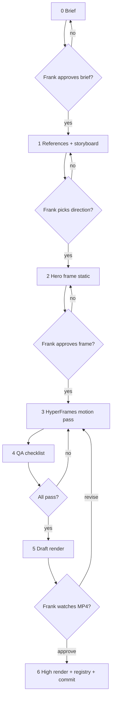

# Motion Process v2 — Viewer-First, Gate-Before-Ship

**Date:** 2026-06-18  
**Status:** Supersedes the execution half of `starlight-motion-production-plan-2026-06-18.md`  
**Trigger:** P0 wave shipped without viewer QA — output read as doc-slides, not designed experience.

---

## Postmortem — what went wrong

| Failure | What we did | What viewer needed |
|---------|-------------|-------------------|
| **No viewer brief** | Started from internal plan (Mind/Mesh/Steward labels) | One sentence: *who is watching, on what surface, what should they feel/know in 3 seconds?* |
| **Build-first** | Keyframes → HTML → render → commit in one session | Storyboard → hero frame approval → motion → **Frank review** → then commit |
| **Slideshow not motion** | 3 AI stills + crossfade + bullet text | Continuous visual logic — one idea per beat, motion carries meaning |
| **Tell not show** | Long copy blocks, jargon (/si, ROUTE→MEASURE…) | Visitor-facing language; system terms only if earned visually |
| **Skipped references** | Invented from palette tokens | Steal structure from 2–3 reference explainers + existing `docs/visuals/08–11` bar |
| **Skipped falsifiers** | Never opened at 390×844 or muted-autoplay | Mobile legibility + 3s hook test before render |
| **Skipped multi-CLI** | Solo Grok build | Plan said dispatch: Grok brief, Codex build, Frank pick — no receipt |
| **Draft = done** | Committed draft MP4s to `main` | Draft is iteration only; `main` gets **approved** assets |

**Verdict:** Infrastructure (HyperFrames scaffold, registry, render path) is useful. **Creative output is draft-superseded** — keep as pipeline proof, not as site creative.

---

## Principle

> **Motion is product design, not asset generation.**  
> If a stranger cannot answer "what is this?" after 3 seconds muted on a phone, it does not ship.

---

## Gated workflow (no step skip)



**Hard rule:** Nothing merges to `main` public motion paths until step 5 approval.

---

## Step 0 — Viewer brief (required template)

One file per asset: `site/motion/<slug>/brief.md`

```markdown
## Asset
- Slug:
- Surface: homepage hero | download page | social | research embed
- Duration target:

## Viewer
- Who: (e.g. technical founder, 30s, mobile-first)
- Prior knowledge: none | knows AI agents | knows SIP
- Job-to-be-done: After watching, they should ___________

## One message
- Single sentence (max 12 words):

## 3-second hook (muted)
- What must read without sound:

## Emotional arc
- Open: (tension / curiosity)
- Peak: (aha)
- Close: (CTA or loop back)

## Anti-goals
- What we refuse to show (jargon walls, feature lists, etc.)

## Falsifiers
- [ ] Stranger test: message clear in 3s muted
- [ ] Mobile 390×844 legible
- [ ] No paragraph longer than 2 lines at 1080p
```

**Gate:** Frank approves brief in chat or brief.md comment. No production until approved.

---

## Step 1 — References + storyboard

**References (15 min):**
- Pull 2–3 external references (product explainers, loops you respect)
- Pull 1 internal reference (`docs/visuals/10-queen-hero-wide.jpg` or site `BrainHero` for coherence)
- Note *what to steal*: pacing, density, typography scale — not pixels

**Storyboard (beat sheet):**

| Beat | Time | Visual (show) | Text (max 6 words) | Motion intent |
|------|------|---------------|-------------------|---------------|
| Hook | 0–3s | | | |
| … | | | | |

**Gate:** Frank picks one direction (A/B storyboard). No keyframe gen until pick.

---

## Step 2 — Hero frame (static)

- One **end-state frame** at target resolution — layout first, no timeline
- HyperFrames skill: *layout before animation*
- Prefer **code-built** diagram over image_gen when labels must be exact
- image_gen only for texture/atmosphere plates behind SVG/HTML structure

**Gate:** Frank approves static PNG (screenshot or exported still). This is the creative lock.

---

## Step 3 — Motion pass

- GSAP timeline serves the storyboard — every tween maps to a beat
- Rhythm: declare fast-fast-SLOW pattern before coding (see HyperFrames beat-direction)
- Copy: voice from Frank DNA — direct, warm, zero doc-paste
- Loop (hero): last frame must visually rhyme with first — not just fade

**Multi-CLI dispatch (when brief approved):**

```powershell
# brief.md committed under site/motion/<slug>/
./scripts/si-dispatch.ps1 -Lanes grok,codex -TaskFile site/motion/<slug>/brief.md -Parallel -Ledger
```

- **Grok:** brief expansion, reference synthesis, motion QA checklist
- **Codex:** HyperFrames implementation + lint
- **Frank:** hero frame + MP4 approval only

---

## Step 4 — QA checklist (automated + human)

| Check | How | Pass |
|-------|-----|------|
| Lint | `bunx hyperframes lint` | 0 errors |
| Mobile still | Export frame @ 390×844 or inspect tool | No clipped text |
| 3s hook | Watch muted, stop at 3s | One message clear |
| LCP budget | MP4 size | Hero WebM/MP4 < 2MB or CSS fallback |
| Reduced motion | `prefers-reduced-motion` | Static hero frame fallback documented |
| SIP | sidecar `.sip.json` | Present |

---

## Step 5 — Draft render → human review

```powershell
bunx hyperframes render --quality draft --output ../../public/motion/_draft/<slug>.mp4
```

- Draft lives under `_draft/` — **not** promoted to hero-loop/ until approval
- Frank watches full piece once, notes: *boring / unclear / off-brand / ship*

---

## Step 6 — Ship

- `--quality high` render
- Update `MOTION_REGISTRY.md` with `status: approved` + approval date
- Commit only after step 5 sign-off
- Site embed still board-gated separately

---

## Asset status (current P0 wave)

| Slug | Status | Action |
|------|--------|--------|
| `estate-hero-loop` | `draft-superseded` | Rewrite brief; do not embed |
| `estate-factory-scroll` | `draft-superseded` | Rewrite brief; do not embed |

Pipeline artifacts (HyperFrames projects, registry schema, render commands) **kept**. Creative **rework from step 0**.

---

## Rework order (recommended)

1. **Hero loop** — highest leverage; one message for cold visitor on starlightintelligence.org  
2. **Factory scroll** — only after hero passes; sells Estate Factory to warm lead  
3. **Receipt card** — proof artifact for hero-demo; smaller scope, good palette test  

**Best next session:** 20-minute brief workshop for hero loop only (viewer, one message, 3s hook). No render until you approve the brief.

---

**Built on SIP** — Starlight Intelligence Protocol v1.1.1