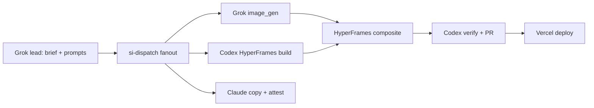

# Starlight Motion Production Plan — starlightintelligence.org

**Date:** 2026-06-18  
**Owner:** FrankX / Starlight Intelligence (Grok-led E2E, multi-CLI fanout)  
**Goal:** Ship high-quality motion design experiences on production — not decoration, but memory-bearing visual wedges that compound distribution.

---

## Executive shape

| Layer | Tool | Role |
|-------|------|------|
| **Lead / E2E** | Grok CLI (this harness) | Creative direction, prompt craft, QA, orchestration |
| **Still + key art** | Grok `image_gen` / Imagine | Hero frames, loop stills, social cards |
| **Motion comp** | HyperFrames CLI | Scroll-sync HTML video, `/queen` `/palace` class experiences |
| **Verify + ship** | Codex | Lint, a11y, perf budget, site integration PR |
| **Research lane** | Antigravity (agy) | Browser QA, competitor motion scans (DB recovery) |
| **Architecture** | Claude | SIP attestation copy, docs, board gates |

Dispatch surface: `scripts/si-dispatch.ps1` + `scripts/si-council.ps1` (committed).

---

## Production targets (priority order)

### P0 — Homepage + Estate Factory wedge (week 1)

1. **Hero loop** — 8–12s seamless loop: constellation → vault orbs → /si routing pulse  
   - Grok: 3 variant stills → pick one → HyperFrames `init` + seek-driven loop  
   - Ship: `site/public/motion/hero-loop/` or embed in `site/src/app/page.tsx`

2. **Estate Factory explainer** — 45s scroll chapter (Mind → Mesh → Steward)  
   - HyperFrames composition mirroring `docs/ops/hero-demos/` narrative  
   - CTA: `/download#codex-plugin-starter`

3. **Receipt motion card** — animated JSON receipt visual (arena/hero demo style)  
   - Grok still → light CSS motion on site (no heavy video dep)

### P1 — Product surfaces (week 2)

4. **`/palace` motion pass** — vault orb pulse tied to scroll (already partial; polish + WebM fallback)  
5. **`/queen` chapter transitions** — ROUTE→MEASURE→LEARN→RATIFY→LEDGER kinetic type  
6. **Plugin starter social pack** — 4 square assets + 1 vertical for X/LinkedIn

### P2 — Distribution factory (week 3–4)

7. **Render pipeline** — `npx hyperframes render` in CI (optional artifact upload to GitHub Release)  
8. **Motion registry** — `docs/visuals/MOTION_REGISTRY.md` with hashes, prompts, lane receipts  
9. **Model Arena for motion** — blind pick grok vs nb2 vs higgsfield per asset class

---

## Multi-CLI workflow (repeatable)



### Per-asset dispatch template

```powershell
./scripts/si-dispatch.ps1 -Lanes grok,codex -TaskFile motion-brief.txt -Parallel -Ledger
```

**motion-brief.txt** sections: subject, layout, palette (indigo/cyan/gold), typography (Geist/serif), motion intent, falsifier (legible at 390px), SIP footer required.

---

## Quality bar (non-negotiable)

- **Legibility:** readable at 1366×900 and 390×844 (browser-verified, plugin registry standard)
- **Performance:** prefer CSS/SVG seek loops; WebM < 2MB for hero; lazy-load below fold
- **Attestation:** every shipped visual lists SIP block in sidecar `.sip.json` or page footer
- **No slop:** geometric typography, constellation motif, no generic AI gradient soup
- **Provenance:** `agent-tools/` ledger OR `docs/visuals/` receipt per asset

---

## Grok CLI specifics

| Capability | Command / tool | Use |
|------------|----------------|-----|
| Image gen | Grok Imagine / image_gen in Build | Key art, texture plates, UI mock frames |
| Video | Grok video tools (when available) OR HyperFrames render | Short loops only after still approved |
| Orchestration | `scripts/run-estate-hero-demo.ps1` pattern | Generalize to `scripts/run-motion-wave.ps1` (future) |
| Subagents | explore for site audit, plan for storyboard | Pre-production only |

**Note:** For character-consistent or product shots, chain Higgsfield via MCP when Grok stills need polish — route through `/si`, not ad-hoc.

---

## File plan (this repo)

| Path | Purpose |
|------|---------|
| `docs/strategic/starlight-motion-production-plan-2026-06-18.md` | This plan |
| `docs/visuals/MOTION_REGISTRY.md` | Living asset ledger (create on first P0 ship) |
| `site/src/app/` | Integration targets |
| `tools/queen/` | Motion receipts can mirror Queen ledger pattern |
| `scripts/si-dispatch.ps1` | Multi-CLI router |

---

## First execution wave (immediate)

1. Grok generates 3 hero-loop keyframes (constellation + vault orbs)  
2. Codex scaffolds HyperFrames composition `site/motion/estate-hero-loop/`  
3. Claude writes attestation sidecar + updates `docs/visuals/VISUALS.md` index  
4. Codex opens PR; Grok reviews motion QA checklist  
5. Deploy via existing Vercel GHA — no README hero change until board lifts gate

---

## Falsifiers

- Motion ships without mobile legibility test → fail  
- Asset ships without SIP attestation → fail  
- Heavy video blocks LCP on homepage → fail; fall back to CSS loop  
- Single-CLI silo (no dispatch receipt) → fail factory test

**Built on SIP** — Starlight Intelligence Protocol v1.1.1  
*Starlight Intelligence System v8.3.0 — Motion Production Plan · 2026-06-18*