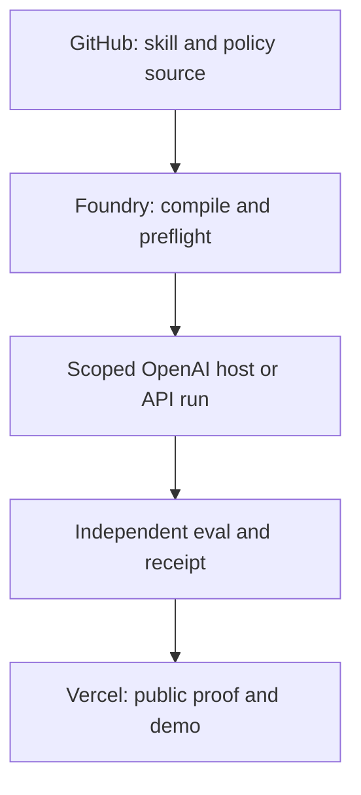

# OpenAI ecosystem release plan — 26 September 2026

Status: proposed execution plan. This is an independent Starlight plan, not an OpenAI partnership, endorsement, accepted submission, or release announcement. Owner: Frank Riemer. Review after 30 days or an official platform change.

## Direction

**Build what once took an institution.** Starlight should give people the context, expertise and dependable systems to carry ambitious work through to a useful result. GenCreator supplies the creative studio; Arcanea supplies original worlds and continuity; FrankX supplies teaching, editorial authorship and public proof.

The [vision and collaboration proposal](2026-09-27-openai-multimodal-proof-spec.md), revised 30 September, restores that broader purpose. The recommended creative demonstration builds on the existing World Seed portfolio proposal. The earlier water experiment remains a candidate in the Open Inventor Path; it is not the defining product or an approved launch decision.

This document remains the enabling developer release plan: source-controlled capability, authorized execution, independent review, portable result and recovery. Its platform and deployment observations are dated 26–27 September and require a fresh check before implementation or public claims.

The first external request is technical feedback on working artifacts. Credits, distribution, co-marketing, early access and a formal partnership each require their own evidence and agreement.

## Portfolio contract

| Surface | Existing asset | Role in this plan | Current boundary |
| --- | --- | --- | --- |
| SIS Foundry | `plugins/starlight-foundry`, `foundry/`, [submission runbook](../runbooks/openai-plugin-submission.md) | Portable capability source, compilation, preflight, host-specific evidence | Local validators and loader lifecycle only; no OpenAI Platform upload or connected host approval |
| Starlight Academy | [Academy plugin packet](https://github.com/frankxai/starlight-intelligence-academy/blob/main/docs/releases/OPENAI_PLUGIN_SUBMISSION.md) and `/mcp` | Four bounded public curriculum tools and an inspectable learning loop | Production deployment has been observed ready, but portal, in-host test, identity, and terms gates remain |
| SIS federation | [Codex worker issue #153](https://github.com/frankxai/Starlight-Intelligence-System/issues/153) | Scoped local Codex SDK execution, session and permission evidence | Planned, not connected or released |
| SIS agent platform | [draft PR #203](https://github.com/frankxai/Starlight-Intelligence-System/pull/203) | Guarded agent source, repo-scoped preview/install, offline fixture | Draft beta; no live Codex or cloud runtime claim |
| Starlight Research Desk | [draft PR #189](https://github.com/frankxai/Starlight-Intelligence-System/pull/189) | Demonstrate cited brief and signed run receipt, compare model routes | Draft; open-model demo currently uses other providers and does not prove an OpenAI production lane |
| Vercel | `starlight-intelligence-academy`, `starlightintelligence-ai`, `frankx-ai-vercel-website`, `gencreator-ai` projects | Git-backed previews, public product surfaces, observability | Project presence or a ready deployment does not verify a plugin host or partnership |

Keep the neutral receipt contract and source portability intact. Any OpenAI-specific adapter is a projection, not a rewrite of SIP. Do not alter SIP, the ten-system taxonomy, attestation semantics, or public product claims in this workstream.

## Release radar: verified as of 26 September 2026

| Official change | Product consequence | Action and proof |
| --- | --- | --- |
| GPT-6 Astra, 3 Sep; Sol and Luna, 22 Sep | Route difficult review and architecture to Astra, interactive production work to Sol, bounded repeatable classifications to Luna only after evals | Freeze model IDs in each experiment; record quality, latency, tokens, cost, and refusal/tool outcomes. Re-run image-input cases after the 25 Sep Sol/Luna encoding fix. |
| Agents API public beta, 10 Sep | Managed Codex harness may replace custom long-running orchestration in a specific lane | Separate proof from Codex SDK issue #153 and the self-hosted Agents SDK. One bounded task, resumable session, authorization check, and cancellation receipt before selection. |
| GPT-Live 1 GA, 10 Sep | A voice front door can wait on a reasoning agent without owning the memory substrate | Test spoken direction and correction in the chosen product workflow, including interruption, handoff and full voice plus backend cost. |
| GPT Image 2.5 Sunburst and Flare, 8 Sep | Precision edits for Arcanea or Academy assets versus faster daily generation | Separate creative benchmark with owned reference assets; no visual model choice without rights and quality evidence. |
| Prompt Cache Diagnostics GA, 8 Sep; Responses controls, 3 Sep | Long-running work can use async tools, steering, reasoning changes, and measurable cache behavior | Instrument repeat runs and cache misses before promising cost or latency gains. |
| Universal plugin submission path | Skills-only and remote MCP candidates can be submitted through different review routes | Foundry and Academy keep separate submission dossiers, security scans, positive/negative host cases, and publication receipts. |

Sources: [OpenAI API changelog](https://developers.openai.com/api/docs/changelog), [model guidance](https://developers.openai.com/api/docs/guides/latest-model), [Agents overview](https://developers.openai.com/api/docs/guides/agents-api/overview), [plugin submission](https://developers.openai.com/plugins/deploy/submission). Confirm current model access and pricing in the actual project before code or spend.

## Multimodal product story

The person speaks an idea, shows a sketch, selects a passage or shares source material. The application helps carry that intention through research, alternatives, revision and a finished work.

**Creative demonstration, recommended:** one original passage and spoken direction become a scene, image, soundtrack cue and reader experience in the existing Arcanea proposal. GenCreator prepares a permitted edition and channel package. Starlight preserves context, source, decisions and execution evidence. The person revises and exports the editable work. This remains a proposal within the portfolio review and current work-in-progress limits.

**Developer demonstration:** an existing skill completes a real scoped task, recovers interruption and leaves an inspectable result. A denied action and an independent review establish the permission and verification boundary.

**Learning demonstration:** the Academy's separate curriculum plugin is tested in a fresh connected host. Its exact tool, identity, scan and publication requirements stay in the Academy packet.

**Science candidate:** the Open Inventor Path and Blue Life K0 kit may test the same intelligence loop against observations and independent replication. Their physical maturity and expert review remain domain-owned.

The separate 12-case multimodal overlay in [#221](https://github.com/frankxai/Starlight-Intelligence-System/issues/221) checks continuity, correction, source fidelity, permission, cost and recovery. The developer baseline stays in [#218](https://github.com/frankxai/Starlight-Intelligence-System/issues/218).

The dated platform research in this branch records the Sora 2/Videos API shutdown on 24 September. Refresh actual media provider availability before implementation; this plan does not depend on OpenAI video generation.

## Architecture and operating boundary

- **GitHub:** source, review, immutable revisions, issue and PR evidence. Use the existing SIS Foundry and Academy repositories. No new repo for a model announcement.
- **Execution:** OpenAI Responses API is the default API contract for tool-rich applications; the Agents API beta, Agents SDK, and Codex SDK are distinct choices. Use a host capability matrix, an allowlisted tool surface, per-run budgets, idempotent external effects, cancellation, and an independent verifier. A claim about one host cannot be promoted to another.
- **Vercel:** site and preview delivery, thin API endpoints and optional AI SDK user interface. Any agent run that outlives a request needs durable session handling and a recoverable job boundary. Use the official Vercel AI Gateway only where routing, fallbacks or accounting add measurable value; keep direct OpenAI API access available for exact feature parity and model-specific evaluation. Do not silently switch providers inside a provenance-sensitive run.
- **Data:** separate public curriculum from private customer state. Keep keys server-side, redact traces, bind receipts to code/model/tool-policy versions, record deletion/retention rules, and keep private memory outside a public site bundle. EU residency and processing choices must be checked against the exact OpenAI project, model and processing tier.
- **Publication:** public plugin functionality must be useful on its own. Do not insert pricing, upgrade paths or sales funnels into a plugin. Direct B2B proposals belong on Starlight-owned channels. Listing, host behavior, and a commercial relationship each get distinct evidence.

## Release train and owners

| Window | Delivery owner | Deliverable | Acceptance gate | Stop condition |
| --- | --- | --- | --- | --- |
| 0–72 hours | Frank, with Foundry implementation and separate verifier roles | Freeze one 12-case developer task set, exact model IDs, baseline across existing route and OpenAI route, cost ceilings, and a 90-second demo script | At least one traceable end-to-end run and one denied action; every claim links to a revision and receipt | Missing API access, unknown spend, or no real task |
| Days 4–14 | SIS Foundry and Academy maintainers | Close or explicitly defer #153; run Academy production host cases; fix current failed Academy preview branch before claiming preview health; publish reproducible technical notes in a PR | Fresh host evidence, positive and negative cases, independent verifier, clean production/preview status | Portal identity/terms or tool scan fails; keep listing pending |
| Days 15–30 | Frank | One public neutral case study, one OSS program application if eligible, one showcase submission candidate, and a private partner memo | Real user result and reproducible repository links; external submissions explicitly recorded | No compelling result over baseline or no verified publisher |
| Days 31–90 | Frank, product maintainer, release verifier | Two design partners through owned B2B channel; release a narrow supported surface after host and support evidence | Adoption, repeat outcome, gross margin and failure rate observed; support owner named | Low activation, high cost, unreliable host run, or negative review |

Do not put a commercial launch date on a plugin until the verified publisher, terms, policy URLs, security scan, review and separate publish action have completed. The existing Foundry and Academy runbooks remain the authority for their own release gates.

## Partnership paths and exact asks

1. **Developer ecosystem, after artifact review:** submit a concise working demo to the OpenAI developer showcase when the public artifact and evidence exist. Ask for technical review of tool permissions, skill distribution and receipt design, plus permission to publish a case study. A showcase submission is editorial consideration, not a partnership.
2. **Open source, after reproducible maintainer proof:** apply to Codex for Open Source with SIS Foundry's public repository, maintainer workflows, adoption/quality evidence, and the specific request for API credits or security support. Eligibility and selection belong to OpenAI.
3. **Startup/product collaboration, after first users:** bring Academy and Foundry adoption and unit economics to OpenAI for Startups or an appropriate developer contact. Ask for a scoped technical collaboration or introduction tied to a measurable cohort, not a general strategic endorsement.
4. **Community, when reopened:** Amsterdam Codex workshop and reusable course can support a future Codex Ambassadors application. The 26 September check recorded paused applications; refresh status before applying.

Public copy must describe the actual implementation and current readiness. An integration, host test, program selection, listing and formal partnership each need their corresponding evidence before those terms are used.

## Scoreboard

For each demonstration: task completion with human acceptance; citation/grounding where relevant; unauthorized-action denial; recovery after interruption; median and p95 latency; total tokens and billed cost; cache hit rate; independent verifier pass; user activation and week-two repeat use. Compare against a frozen baseline and record failures. Gate promotion on quality and unit economics together, not the number of agents or generated assets.

The next engineering step is to reconcile the proposed creative demonstration with the existing World Seed/Creator Launch work, then complete one reviewable artifact through the authorized product train. The developer proof supplies the execution baseline. The partnership narrative should follow work people can inspect and use.

## Source of truth and review

- Foundry release: [local preflight and exact host gates](../runbooks/openai-plugin-submission.md).
- Academy release: [submission packet](https://github.com/frankxai/starlight-intelligence-academy/blob/main/docs/releases/OPENAI_PLUGIN_SUBMISSION.md).
- SIS implementation: [#153](https://github.com/frankxai/Starlight-Intelligence-System/issues/153), [PR #203](https://github.com/frankxai/Starlight-Intelligence-System/pull/203), [PR #189](https://github.com/frankxai/Starlight-Intelligence-System/pull/189).
- OpenAI: [models](https://developers.openai.com/api/docs/models), [Agents](https://developers.openai.com/api/docs/guides/agents), [plugin guidelines](https://developers.openai.com/plugins/app-guidelines), [Codex for Open Source](https://developers.openai.com/community/codex-for-oss), [Codex Ambassadors](https://developers.openai.com/community/codex-ambassadors), [showcase](https://developers.openai.com/showcase).

**Built on SIP** — operational planning artifact; no protocol or attestation rule change.
