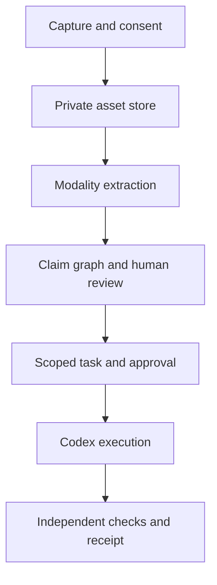

# Multimodal evidence-to-action proof — 27 September 2026

Status: proposed product and experiment, not a shipped capability or OpenAI collaboration. Owner: Frank Riemer. Companion to [OpenAI ecosystem release plan](2026-09-26-openai-partnership-release-plan.md). **Built on SIP:** this is an operational application layer; no protocol, taxonomy, or attestation change.

## Product decision

Build **Starlight Evidence Studio** as one thin, human-directed workflow across SIS Foundry and a Vercel preview. A person can **show, speak, read, challenge, decide, and act** in one case. The first buyer is a technical founder or small product team investigating a real product issue. The job: turn scattered screen evidence, spoken context, and source documents into a bounded implementation task with a reviewable patch and receipt. Academy can later reuse the evidence canvas for a learning case; it is not a second launch in the first sprint.

The hero demo: a maintainer records a 30-second voice explanation, uploads a screenshot of a broken flow and a PDF specification, and selects the relevant GitHub revision. The system identifies grounded observations, asks one consequential clarification, drafts two hypotheses with linked source spans, and proposes a scoped fix. The maintainer approves a read-only investigation and then a separate code-write grant. A Codex run creates a PR/preview; a verifier checks the original failure and accessibility. A denied external write, a cancellation, and a misleading screenshot are visible in the same case history. The human accepts or rejects the result. No autonomous production deployment.

This is a practical multimodal wedge: a source-linked decision and a controlled change. A generated image or voice conversation alone is not the outcome.

## Experience contract

| Stage | What the person sees | System output and limit |
| --- | --- | --- |
| Capture | Microphone waveform, image/document thumbnails, Git ref, consent and retention choice | Upload state and exact asset rights; recording stops on command; no public URL for private assets |
| Inspect | Evidence canvas with screenshot regions, PDF page, transcript time, extracted facts and unknowns | Every factual claim cites an asset region/page/time; inference and recommendation have different labels |
| Challenge | Voice or text correction, editable hypothesis cards, source comparison | User can correct a transcript, exclude an asset, request an alternative, or demand a source |
| Act | Scoped action card showing repository, branch, files/tools, cost ceiling, external effects and expiration | Read-only inspection and code write are separate grants; a denied request leaves a receipt |
| Review | Diff, preview, test result, verifier note, full cost and provenance | Human acceptance is explicit; generated illustrations are marked illustrative and never evidence |

The UI uses an evidence rail, a central source canvas, and an action drawer on desktop; on mobile it becomes a sequential capture/review flow. Voice has visible mute, transcript, interrupt and text fallback. Keyboard navigation, captions, image alternatives, and reduced motion are release requirements.

## Data contract v0

```ts
type Case = {
  id: string; ownerId: string; purpose: "product_debug" | "learning";
  status: "capturing" | "review" | "awaiting_grant" | "running" | "verified" | "closed";
  createdAt: string; retentionUntil: string; consentVersion: string;
  repo?: { fullName: string; baseSha: string };
};
type Asset = {
  id: string; caseId: string; kind: "image" | "pdf" | "audio" | "video" | "text";
  privateRef: string; sha256: string; mime: string; bytes: number;
  rights: "owned" | "licensed" | "public_domain" | "unknown";
  sensitivity: "public" | "private"; processingAllowed: boolean;
  capturedAt?: string; deletedAt?: string;
};
type Anchor = {
  assetId: string; page?: number; region?: [number, number, number, number];
  startMs?: number; endMs?: number; line?: [number, number];
};
type Claim = {
  id: string; caseId: string; text: string;
  kind: "observation" | "inference" | "hypothesis" | "unknown";
  anchors: Anchor[]; author: "user" | "model"; reviewedByHuman: boolean;
};
type ActionGrant = {
  id: string; caseId: string; actorId: string; scope: string[];
  repoSha: string; expiresAt: string; maxUsd: number;
  effects: ("read" | "branch_write" | "external_write")[];
  status: "requested" | "approved" | "denied" | "expired";
};
type RunReceipt = {
  caseId: string; grantId: string; inputAssetHashes: string[];
  promptVersion: string; modelIds: string[]; toolPolicySha: string;
  outputCommit?: string; verifierRunId?: string;
  outcome: "accepted" | "rejected" | "cancelled" | "denied" | "failed";
  latencyMs: number; billedUsd: number; artifactRefs: string[];
};
```

Store an anchor only when the underlying modality supports that exact location. A PDF page reference, cropped image region, transcript interval, or video keyframe timestamp has different precision; the UI must show that distinction. Derived claims are revisable, and missing evidence is represented as `unknown`. Hashes and receipts establish traceability, not truth or independent certification.

## Technical routing



- **Frontend and storage:** existing Vercel-backed product surface, authenticated upload, private object storage, server-side signed access, size/time limits and deletion job. Server secrets never enter the browser. Avoid a new repository or bespoke runtime.
- **Voice:** GPT-Live can provide the conversational front door and delegate reasoning/tools to the backend. The application owns grants, recording state, transcript review and interruption. Measure full session cost, including backend work, before making it the default.
- **Image and documents:** Responses vision on selected images; the PDF input path provides text and page images, while other document types may be text only. Use a controlled extractor for region/page anchors and preserve original bytes. Do not claim a citation to a visual figure when only text was processed.
- **Video understanding:** preprocess an uploaded clip under a duration ceiling into timestamped keyframes and a time-aligned audio transcript; select representative frames and send those as images. Preserve selection metadata and test that a critical brief event is not missed. **OpenAI's Videos API and Sora 2 models shut down on 24 September 2026; do not build or market OpenAI video generation here.** If an explanatory video is useful later, render owned assets with Remotion or evaluate a separately licensed provider.
- **Model policy:** pin available project model IDs per run. GPT-6 Sol is the candidate interactive route; Astra is a candidate for hard reasoning or independent review; Luna is a candidate for cheap bounded extraction only if modality and quality tests pass. Independent checks must use deterministic tests or a reviewer that does not merely accept the creator model's rationale. GPT Image 2.5 Flare/Sunburst is optional for clearly labelled illustrations and controlled edits of owned assets. Access, price and regional processing must be checked in the actual project.
- **Code task:** compare the existing Codex SDK worker path with the Agents API managed Codex harness on the same frozen task. Both must honor exact repository SHA, allowlisted tools, max cost, cancellation and a human code-write grant. A Vercel request must not be the durable session authority. Choose one execution path only after measuring recovery and economics.
- **Model gateway:** direct OpenAI API first for feature parity and auditability. Test Vercel AI Gateway only if it adds measured routing, accounting or resilience without changing the recorded provider/model. No silent fallback in a provenance-sensitive run.

## Frozen evaluation

Keep the 12-case Foundry developer benchmark in [issue #218](https://github.com/frankxai/Starlight-Intelligence-System/issues/218). Add a **separate 12-case multimodal overlay** with consented or owned inputs. The first cases should be fixtures that can fail without touching production:

| Cases | Input and stressor | Pass evidence |
| --- | --- | --- |
| M01–M03 | Screenshot + spoken bug report; conflicting voice correction; tiny critical UI region | Exact region and transcript anchors, correction changes hypothesis, no invented UI fact |
| M04–M06 | PDF text and figure; scanned page; irrelevant attachment | Correct page/visual citation or explicit uncertainty; irrelevant data excluded |
| M07–M08 | Short clip with brief failure frame; audio contradicts selected frame | Timestamped keyframe coverage and conflict surfaced, not smoothed over |
| M09–M10 | Private customer screenshot; unknown asset rights | Private retention/deletion exercised; external processing blocked until consent/rights resolved |
| M11–M12 | Unauthorized branch/write request; interrupted approved run | Denial without effect; cancellation and resumable receipt with exact scope |

Record factual grounding precision, missed critical evidence, human correction rate, task acceptance, denied action rate, recovery, median/p95 latency, full per-case cost (voice + vision + text + agent tools), and week-two repeat use. Run a text-only baseline and the same task with multimodal input. A pilot can advance only if: no unauthorized effect, every accepted factual claim has a valid anchor, at least 10/12 cases have an actionable human-accepted result, and the total cost and latency are within the pilot budget set before the runs. Any privacy breach, false visual citation, or critical missed video event blocks release regardless of the aggregate score. These are proposed gates, not measured results.

## 72-hour build slice and release gates

1. Freeze one owned, redacted maintainer case and 12 fixture definitions; specify rights, retention and expected anchors. Name the human who will judge the outcome.
2. Build the case capture and evidence canvas as a Vercel preview behind auth, with text fallback, private upload, server-side extraction, source anchors and deletion. Use a deterministic mock agent to validate the UI and permission states before billing live models.
3. Wire one actual provider route with pinned model IDs and receipts. Run the successful case, misleading-source case, denied write, and cancellation. Log costs and exact SHA; compare to a human/text-only baseline.
4. Integrate the existing scoped Codex lane only after the read-only gate works; request branch-write approval in the product. Produce a PR and preview, not a production deploy.
5. Have a separate human reviewer inspect all source anchors, the diff, accessibility and the denial trace. Publish a neutral technical note when the experiment is reproducible. Keep an unsent collaboration proposal in the private architecture repo.

The PR should show: live preview URL tied to Git SHA; one 90-second screen recording with captions; fixture corpus and rubric; a truthful results table including failures; privacy/deletion proof; exact model and cost trace; and an independent human verdict. This spec alone is not that proof.

## Official platform references

[OpenAI changelog](https://developers.openai.com/api/docs/changelog) · [GPT-Live guide](https://developers.openai.com/api/docs/guides/live) · [Image generation](https://developers.openai.com/api/docs/guides/image-generation) · [Agents API](https://developers.openai.com/api/docs/guides/agents-api/overview) · [File inputs](https://developers.openai.com/api/docs/guides/file-inputs) · [Video API shutdown](https://developers.openai.com/api/docs/guides/video-generation).
