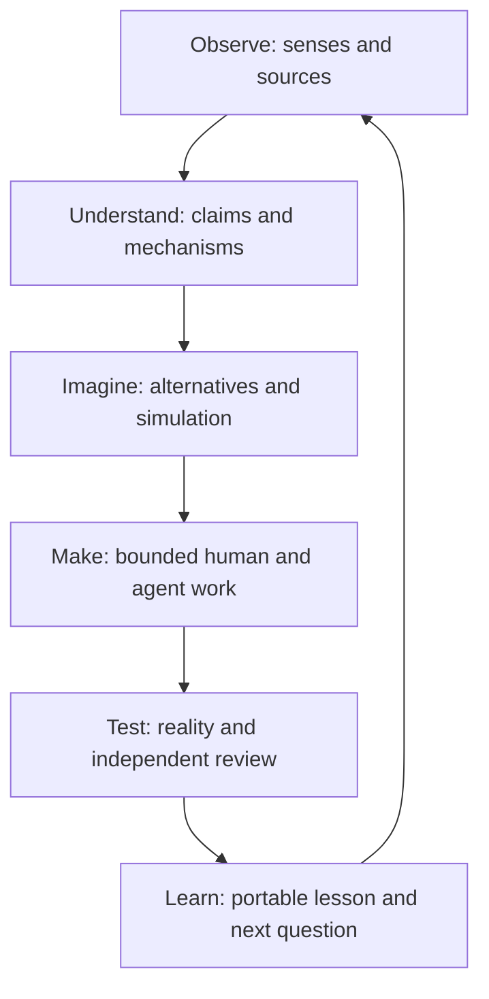

# Starlight Living Intelligence — multimodal frontier proof

Status: strategic and product proposal, 27 September 2026. Owner: Frank Riemer. This replaces the narrow developer-debug framing of this file. It is a companion to the [OpenAI ecosystem release plan](2026-09-26-openai-partnership-release-plan.md), not an OpenAI partnership or a shipped product. **Built on SIP:** no protocol, memory-authority, taxonomy or attestation change.

## Decision

Starlight should make a person's curiosity **compound into a tested contribution to the world**. The interface begins with what a human sees, hears, measures, reads and imagines. It helps build a revisable model of the situation, teaches the person to challenge it, assembles the right human and agent expertise, and produces an experiment, invention, learning artifact or creative work that can survive scrutiny and reuse.

This is a **shared intelligence loop across existing products**, not a new umbrella application:

The frontier question is concrete: **Can a multimodal system retain the distinction between observation, model, imagination and physical result as a person moves across devices, agents and domains?** A convincing answer is a human who learns a mechanism, builds a bounded artifact, finds a mistake, corrects it and enables a second person to reproduce the work. That is more valuable than a long chat, a flashy generated film or a pile of agent traces. Do not call it AGI or claim scientific discovery from a model output.

## One flagship mission: the Living Water Lab

A curious maker or educator notices a local water-edge problem. On a phone they capture a short narrated clip, photographs, a sketch and measured readings. Starlight builds a **Living Case**: precise image/frame/transcript anchors; readings with units, instrument and calibration; relevant primary sources; competing explanations; unknowns and a clear privacy boundary. The Academy turns the case into an interactive challenge: the learner must spot a weak inference and choose a discriminating test. The Knowledge Tree links the mechanism, skills and open question. Blue Life Commons supplies the proposed K0 dry-side observation kit and later controlled K1/K2 paths. Foundry routes a bounded scout, mechanism skeptic, maker and verifier. A generated visual can show an *illustrative* future variant, while an editable CAD/parts artifact and a preregistered comparison make a build possible. The Observatory records quality, cost and the next experiment.

The first 90-second demonstration should show a user correcting an attractive but unsupported claim and changing the proposed experiment. A second person should then be able to follow the K0 observation card and reproduce its logging method. **No result is represented as cleaner water, safe swimming, validated habitat benefit, approved hardware or measured scientific improvement until the appropriate physical and expert evidence exists.** The current [Open Inventor Path draft](https://github.com/frankxai/starlight-knowledge-tree/pull/9) and [Blue Life kit draft](https://github.com/frankxai/blue-life-commons/pull/36) already define the maturity ladder and domain boundaries; this proposal composes them, rather than replacing them.

This is the first domain because it forces every intelligence claim to meet physical measurements and independent replication. It is also visibly compelling: a phone, a living place, a field notebook, an interactive scientific model, an editable object, and a real experiment. The first test can use owned, redacted, controlled fixture media; real observations and any field use require explicit rights, instrument and expert review.

## Portfolio placement: one intelligence loop, distinct product owners

| Existing owner | Role in the mission | Current reality and integration rule |
| --- | --- | --- |
| [Starlight public web](https://github.com/frankxai/starlight-intelligence-web/pull/64) | Council-led entry, explorable map and portable first action | Council homepage is a draft preview; reconcile its overlapping Studio and receipt branches before changing the front door |
| [Academy](https://github.com/frankxai/starlight-intelligence-academy/pull/52) | Mission, faculty challenge, learner reflection and demonstrated transfer | Operator Lab/creative mission work is draft; the live campus is not proof of this new mission |
| [Knowledge Tree](https://github.com/frankxai/starlight-knowledge-tree/pull/9) | Concepts, mechanisms, skills, open problems and invention maturity | The Open Inventor Path is draft; graph schema changes have their own validator and editorial gate |
| [Blue Life Commons](https://github.com/frankxai/blue-life-commons/pull/36) | Domain kit, sources, CAD, measurements and ecological review | K0 manifest and dry-side CAD are proposed and machine-checked; no physical/field benefit is proven |
| [SIS Foundry](https://github.com/frankxai/Starlight-Intelligence-System/pull/203) | Capability compilation, host grants, bounded agent roles and portable receipts | Agent beta is draft; do not equate fixture or compiler pass with live Codex or multi-host enforcement |
| [Research Desk](https://github.com/frankxai/Starlight-Intelligence-System/pull/213) | Source, contradiction and evidence review | Deployment hardening is draft and has live provider, budget, signing and preview gates |
| [Observatory](https://github.com/frankxai/starlight-observatory) | Aggregate quality, cost, drift and human verdicts | Release candidate checks exist; no fabricated accuracy or customer outcome |
| [Portfolio authority](https://github.com/frankxai/agentic-ops/pull/72) | Cross-brand admission, media rights, interop owner and release placement | Registry and decision issues remain authoritative; this document cannot admit a new SKU |

Arcanea can use the same loop for **read → interpret → imagine → create**, under its own canon and rights; GenCreator can use it for **research → make → publish → learn** under creator ownership. A science observation cannot silently become Arcanea canon, and a creative image cannot become evidence of a physical effect. Starlight Technology and a future sky explorer can reuse the pattern only after the first domain proves transfer. Each product owns its UI, customer state, price and support promise. SIS owns the portable capability and evidence contracts. The founder's private memory never becomes shared customer data.

## Experience: a world canvas, not a chat wrapper

The case interface has four synchronized views: **Scene** (photo, clip, spatial sketch and timeline), **Reasoning** (claim cards attached to exact evidence and counterevidence), **Possibilities** (alternative mechanism, simulation or clearly labelled concept art), and **Fieldbook** (protocol, build files, measurements, decisions, review and receipt). Voice is an input and an interruptible guide; text, captions and keyboard access are equal paths. The person can remove an asset, correct a transcript, challenge a claim, compare versions, pause an agent, grant a bounded action and export the entire case.

An immersive 3D/AR layer is earned when it helps someone understand a spatial mechanism or assemble a part better than a drawing; the camera and offline log are useful earlier. The same case should work on a mobile browser, printable observation card and desktop maker workspace. The first release is a responsive web/PWA experience in the existing product; native mobile, XR and desktop shells need a measured job and an owning team. A beautiful illustration earns its place by making an uncertainty or design choice legible.

## Living Case contract, without a new truth authority

Use the existing Knowledge Tree invention record and SIS/portfolio contracts as owners. A product-level projection may connect these identifiers:

- **Capture:** case ID, actor, consent, purpose, rights, privacy class, retention, original asset hash, device/time, optional coarse location class. Private address and raw personal footage do not enter a public graph.
- **Anchor:** asset ID plus PDF page, image region, transcript interval, video keyframe timestamp or instrument reading and calibration reference. A model that saw only extracted text must not cite an unseen diagram.
- **Claim:** observation, sourced interpretation, hypothesis, simulation assumption, illustrative concept, unknown or measured result; each has a maturity state and counterevidence. A model or generated image cannot promote a physical claim.
- **Intervention:** bounded question, predicted effect and uncertainty, control, spend/tool scope, stop rule, human grant and independent reviewer. A code or CAD task records the base SHA and allowed effects.
- **Outcome:** raw values with units/times, acceptance/rejection by a person, artifact version, provider/model/tool policy versions, total cost, failure and next question. The receipt proves lineage and authorized process, not that a scientific claim is true.

Conflicts remain visible; neither memory consolidation nor a newer model erases a prior measurement. Durable lessons enter the authorized memory only after review. Derived public graph nodes contain minimum necessary references, not private media. Local customer, founder-private and managed tenant envelopes remain separate as proposed in [SIS runtime PR #214](https://github.com/frankxai/Starlight-Intelligence-System/pull/214).

## Frontier model composition and deliberate tool boundaries

| Job | Candidate capability | What must be tested |
| --- | --- | --- |
| Live field conversation | GPT-Live with delegated backend reasoning | Interruption, background task cancellation, consent, transcript correction, full voice plus backend cost |
| Complex cross-modal reasoning | GPT-6 Sol for responsive synthesis; Astra for hard mechanism or critique; Luna for bounded extraction only after modality eval | Pin actual available model IDs; compare to expert/text-only baseline and record false visual grounding |
| Images and documents | Responses vision, PDF text plus page images, controlled source extraction | Region/page precision; diagrams in non-PDF files require explicit conversion; file size and project access |
| Short video input | Local keyframe/scene selection plus aligned transcript, then image/audio reasoning | Critical-event recall and exact timestamps; OpenAI Sora 2/Videos API shut down on 24 September 2026, with no one-to-one replacement |
| Design visualization | GPT Image 2.5 Flare/Sunburst for rights-cleared concepts or edits | Fidelity to owned references; label as illustration, never observation |
| Bounded agent work | Existing Foundry route, Codex SDK worker or Agents API managed Codex comparison | Host-enforced grants, revoke/cancel/recover, exact repository SHA, independent check and cost |
| Delivery | Existing Vercel previews and product UI; private object storage and durable job owner | Auth, deletion, tenant isolation, exact deployment SHA, accessible mobile review and rollback |

Prefer direct API calls when they preserve feature access and traceability; evaluate Vercel AI Gateway only for measured routing/accounting benefit. OpenAI, Vercel, an on-device model and a human expert are replaceable participants in a case, with their exact roles recorded. No silent provider fallback in an evidence-sensitive run. An approved agent may create a reviewable branch or CAD candidate; it does not publish a kit, deploy to production or assert a physical result.

## Research and release: what would actually move the frontier

Freeze a small, rights-cleared corpus before tuning the experience: **12 multimodal cases** across ambiguous image region, contradictory voice, PDF figure, fleeting video event, bad measurement unit, stale source, seductive generated illustration, private location, revoked grant, interrupted run, independent replication and a null result. Each has a human-authored expected observation, acceptable uncertainty, prohibited inference and one consequential decision. Keep the separate 12 developer cases in [SIS #218](https://github.com/frankxai/Starlight-Intelligence-System/issues/218); [#221](https://github.com/frankxai/Starlight-Intelligence-System/issues/221) tracks this mission overlay.

Measure **evidence fidelity** (valid anchors and critical misses), **epistemic movement** (does correction change a hypothesis and test), **human learning transfer** (can a newcomer explain and repeat the method), **artifact utility** (a second person opens and uses CAD/card/protocol), **real-world repeatability** (raw logs and independent reproduction), and **economics** (full cost and time per accepted contribution). Record false confidence, dropouts, overrides and null results. A polished demo is an interface check, not a scientific result.

| Window | Reviewable outcome | Gate |
| --- | --- | --- |
| 72 hours | Owned/synthetic Living Case packet, accessible World Canvas prototype, K0 card, 12 frozen eval definitions and source/rights ledger | A new person can identify observation, hypothesis, illustration and unknown without coaching |
| 14 days | One live multimodal run, correction, denied action and cancellation receipt; Academy challenge and Knowledge Tree/Blue Life handoff through existing drafts | Exact source anchors, no unauthorized effect, human reviewer, full billed cost, working export |
| 30 days | One controlled K0 observation and five user walkthroughs; provisional K1/K2 hypothesis with preregistered test | Two independent readers can repeat logging; no unsupported water-benefit claim; negative result publishable |
| 90 days | Two independent K0 replications and educator/maker adoption signal; a reviewed public case study if permission exists | Transfer, retention and economics justify an offered kit/workshop or further research |

These are targets. Any privacy leak, false physical claim, critical missed evidence or inability to reproduce stops public promotion. No physical kit, new model access, hosted agent, customer cohort or partnership has been created by this plan.

## OpenAI collaboration thesis

Offer OpenAI a hard, unusually diverse testbed: **multimodal reasoning coupled to human learning, bounded agents, creative visualization and physical falsification**, with an open evaluation rubric and portable receipts. The first request is a technical review of one case with correction, denied action, measured cost and independent replication attempt. Specific questions: Can voice delegation retain provenance through interruption? Can multimodal models admit uncertainty at image/page/frame precision? Can a managed Codex session respect an expiring human grant? Can generated visual concepts stay clearly distinct from evidence as they move into a learning interface?

After proof, seek the suitable developer showcase, open-source or startup route on its own terms. A plugin listing, credits, co-marketing, access, endorsement and a formal partnership each require a separate decision and receipt. Public copy should describe an independently built product using OpenAI technology until an agreement exists. The [private technical proposal](https://github.com/frankxai/starlight-architecture/pull/2) is unsent.

Official capability references: [OpenAI changelog](https://developers.openai.com/api/docs/changelog), [GPT-Live](https://developers.openai.com/api/docs/guides/live), [file inputs](https://developers.openai.com/api/docs/guides/file-inputs), [image generation](https://developers.openai.com/api/docs/guides/image-generation), [Agents API](https://developers.openai.com/api/docs/guides/agents-api/overview), [video shutdown](https://developers.openai.com/api/docs/guides/video-generation). Confirm exact project availability, prices and processing options before spending or shipping.
