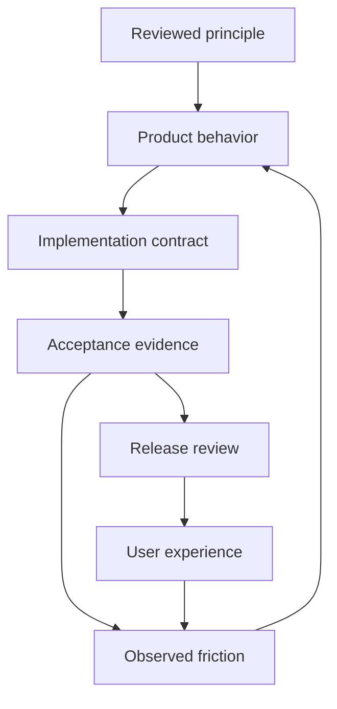

# Starlight — a place to begin, a way to contribute

Narrative, human design and community proposal · 30 September 2026  
Owner: Frank Riemer · Review lane: SIS PR #217  
Status: proposed experience and acceptance criteria. No new brand identity, product admission, platform migration, live community or constitutional change is established here.

## The story beneath the system

A person carries an idea for years. A song, a world, a useful invention, a school, a different way of working. They can see something of what it might become. Bringing it into existence takes knowledge, craft, time and people they have not yet found.

Starlight should help that person begin—and stay with the work long enough for it to matter.

Advanced intelligence brings research, memory, creation and execution within reach. Human judgment gives the work its direction. Beautiful tools make room for attention. A community brings other lives, skills and perspectives into the process. Over time, someone who needed help becomes someone who can offer it.

**Build what once took an institution. Create work that gives others a place to begin.**

This is proposed editorial expression of the reviewed portfolio principles. The existing brands keep their own promises. Starlight supplies dependable intelligence and coordination; GenCreator supplies creative production; Arcanea owns its original worlds; Academy supports learning; FrankX carries original teaching and public proof. The technology and the cultural work should strengthen each other.

Poetry belongs in what people recognize and remember: an image, a passage, a musical phrase, a generous invitation, a meaningful change in their own life. Product controls name the action plainly. A person should never need to decode a metaphor to save, stop, pay, share or delete.

## Tell the story through a person's work

Use a repeatable narrative with a real protagonist, a consequential choice and an inspectable result:

1. **Intention:** what the person wants to bring into the world, and why.
2. **Material:** the passage, sketch, source, recording or observation they start with.
3. **Making:** how human direction and intelligence develop the work.
4. **Judgment:** a disagreement, failed attempt or revision that improves it.
5. **Result:** something useful, beautiful or instructive they can keep.
6. **Contribution:** what another person can learn, adapt or add.

A case study should make the creator's decisions visible. A film can carry emotion; the companion page holds sources, revisions, actual exports and limitations. Scientific findings, fictional events and product outcomes retain separate standards of truth.

For the existing World Seed recommendation, show one author's original scene becoming an illustrated, scored, editable reader experience. Include the revision that made it better. Arcanea owns continuity; GenCreator owns the edition; Starlight preserves context and work history. A community participant can offer a critique, accessibility review or explicitly licensed translation without gaining access to the author's private workspace.

Sample invitation, for review:

> There is something you want to make. Bring the first page, the unfinished sketch, the question you cannot leave alone. Find the tools and people to carry it further. Keep your voice in the work. When you are ready, help someone else begin.

## Principles become product behavior

These are operational translations of the [reviewed portfolio strategy](https://github.com/frankxai/agentic-ops/blob/main/STRATEGY.md), subject to product review.

| Principle | What a person experiences | Architecture requirement | Acceptance evidence |
| --- | --- | --- | --- |
| Greater capability | An explanation they can apply; editable work they can continue | Source-linked outputs, editable formats and appropriate learning support | Person can revise the result and explain a consequential choice |
| Human authorship | Their voice and decisions remain recognizable | Versioned brief, selected references, rights and human decisions | Review compares source, direction, revision and final artifact |
| Sovereignty | They can inspect, pause, export and leave | Scoped access, revocation, portable exports, retention and deletion paths | Export opens independently; revoked access and deletion are tested |
| Honest value | Clear cost, progress and limitations | Task state, evidence, metering and recovery | Cost and all human effort accompany the accepted result |
| Beauty and attention | Legible, calm tools with meaningful imagery and motion | Governed design source, accessible alternatives and performance targets | Inspect the complete mobile, keyboard, loading, failure and recovery journey |
| Belonging and contribution | A useful way to help and receive recognition | Consent-scoped profiles, artifact attribution, stewardship and review | A newcomer contributes successfully; an appeal and withdrawal can be handled |

The engineering connection must be explicit:

Link each product requirement to its owning issue, contract or schema, acceptance case and release evidence. Keep these links in the existing Registry and product repositories. This proposal introduces no parallel constitution or mandatory universal schema.

## Cinematic design with an everyday working rhythm

The public experience can open a horizon. The workspace should make it easy to return to the next meaningful action.

**Public web:** an authored opening image, a short human promise, an actual work someone can explore, a transparent process story, and a clear route to create, learn or contribute. Extend the reconciled existing public front door; portfolio ownership between SIS and the web repository must be settled before implementation.

**Studio:** the user's material takes visual priority. Keep the brief, source, draft and revision near each other. Reveal specialist tools as the task needs them. Make the next action, saving state, cost and cancellation understandable.

**Desktop:** extend the existing Command Center for operator work where local files, long-running tasks, private context or offline recovery justify it. A future customer companion requires its own product admission and isolation from founder-private data.

**Mobile:** begin with a responsive experience for capture, review, short direction and contribution. Native investment needs a demonstrated job such as offline field capture or sustained media work. Do not force the whole desktop cockpit onto a phone.

**Community:** show works, invitations to help, people who chose to be visible, and upcoming creation sessions. Let someone participate privately and asynchronously.

Each surface should share selected work, permissions and understandable task state. It should express the same human promise while respecting its distinct job.

Cinematic craft is an authored composition: light, scale, framing, typography, pacing and sound. Starlight can use real materials, precise diagrams, daylight and restrained luminous accents. Arcanea may carry its own mythic art direction. GenCreator should foreground the creator's work. These are visual candidates, not a portfolio-wide identity replacement.

Design acceptance must include:

- A useful first frame and readable content before heavy media loads.
- Optional sound with visible control; captions and transcripts when speech matters.
- Reduced motion with an equally complete story; standard scrolling and keyboard access.
- Small-screen composition, legible contrast and an honest low-bandwidth fallback.
- Unambiguous save, sync, permission, failure and recovery states.
- A complete first-result journey with no invented screenshots, customer evidence or capability claims.

The shared Design Taste Kernel files named in SIS instructions were not accessible at the referenced local paths or the checked design repository root. Treat this as a design-source dependency before implementation/release; this document is an experience proposal, not a passed visual QA verdict.

## Image generation as directed craft

Use generated imagery to explore compositions, develop original world assets, create scene variants and prepare campaign art. Keep text, interface controls, exact diagrams and data in editable deterministic sources.

A production workflow should be:

1. **Brief:** audience, emotional purpose, placement, source context, rights and brand owner.
2. **Direction:** approved references, subject continuity, composition, palette, material and lighting constraints.
3. **Shot list:** hero, detail, scene, portrait and channel crops with a reason for each.
4. **Generation and selection:** compare outputs against the brief; reject generic symbolism and obvious rendering failures.
5. **Revision:** make targeted edits; inspect anatomy, objects, continuity and unintended text.
6. **Production:** retain selected masters and prompts; create responsive delivery assets, descriptions and accessible alternatives.
7. **Registration:** attach source, revision, generation method, rights review and placements to existing media/creative records.
8. **Release:** inspect the actual page and mobile crops; confirm approved assets and source references.

AI generation does not itself establish exclusive ownership or permission to use a person's likeness. Rights remain attached to the actual inputs and intended use.

The accompanying generated image is a conceptual editorial direction: people learning and creating together in a luminous shared studio. It depicts no existing Starlight building, event or live community. It is preview art, not a deployed asset or approved identity.

## Storage that respects the work and the person

Use the existing portfolio storage decisions. Give every piece of information an owner, scope, version, retention rule and export route.

| Information | Authority / storage role | Boundary |
| --- | --- | --- |
| Strategy, policy, canon, manifests and architecture decisions | Owning GitHub repository and Registry | Reviewed versions establish authority; proposals remain identifiable |
| Membership, consent, entitlements and transactional state | Product-owned Supabase/Postgres records | Tenant and role isolation; product authorization on reads and writes |
| Source masters, private evidence and review packages | Owner-controlled files and approved Drive custody | Private access; Drive is not a production delivery dependency |
| Approved web media derivatives | Vercel Blob/Image under existing media contracts | Publish selected assets only; preserve provenance and removal routes |
| Founder or customer local knowledge | Separate local vault and rebuildable local index | Explicit device/sync scope; never share the founder's live private database |
| Search and model retrieval indexes | Permission-aware projections of authorized sources | Rebuildable; revocation and deletion invalidate retrieval access |
| Community commitments and reflections | Consent-scoped SIS-style member memory with product-owned persistence | Public proof and private reflection are separate; no raw member data in GitHub |

Memory is selected knowledge used for a declared purpose. Collection needs a useful reason, a visible scope and an understandable retention choice. Do not silently turn every conversation, photograph or recording into permanent memory.

An artifact retains its editable source, revisions, authorship and rights. A released edition points to exact approved revisions. A correction should identify affected editions and placements. Concurrent work preserves both versions until a conflict is resolved; a sync operation must not silently promote a draft into canon.

Before managed multi-device adoption, demonstrate authorization, deletion propagation, recovery, conflict handling and export with synthetic fixtures. A shared identifier alone proves none of these properties.

## AI etiquette is how the architecture meets a person

Etiquette needs both writing guidance and enforceable boundaries.

| Situation | Expected behavior | System support |
| --- | --- | --- |
| First use | Identify the AI role and explain the useful next step | Clear role, task scope and capability state |
| Capture or memory | Ask for the relevant scope; show what will be retained | Consent record, preview, retention and deletion |
| Routine reversible work | Proceed within the assigned authority; show progress without demanding constant attention | Scoped tools, task state and cancellation |
| Consequential action | Present the actual result and obtain the required human decision | Existing release, spend, rights and external-action gates |
| Uncertainty or disagreement | Explain the source and doubt; challenge respectfully when necessary | Source references, confidence limits and review route |
| Mistake or interruption | Say what happened and offer a recoverable next step | Saved state, retry boundary and rollback |
| Community interaction | Be visibly AI-assisted; credit people; avoid synthetic members and fabricated enthusiasm | Identity labels, attribution and steward oversight |
| Proactive help | Respect quiet hours and chosen contact frequency | Opt-in channels, budgets and notification preferences |

The desired feeling is competent, considerate collaboration. AI should not assume intimacy, impersonate a human host, manufacture authority or make affection contingent on engagement. Community care and sensitive conflict belong with identifiable human stewards. Private reflection must not become public recognition or matching rationale without the member's choice.

## A global community grows through contribution

Build on [Starlight Communities](https://github.com/frankxai/starlight-communities). Its current implementation is a tested starter toolkit with creation-cell logic, a pilot kit, CLI/API, synthetic examples and bounded agent roles. It has no hosted member product, production authentication, multi-tenancy or enabled live platform adapters.

Its strongest idea is already clear: three to five people help each other create through a weekly quest, paired conversation, focused lab, proof, reflection and next commitment. Circle, Discord, Slack, email and web are optional surfaces. Preserve member memory and consent independently of the chosen platform.

Global participation should have several valid forms:

| Contribution | Useful first action | Recognition and review |
| --- | --- | --- |
| Create | Share an original artifact or a private progress object | Creator controls visibility and license |
| Improve | Review an artifact, document a bug or propose a change | Maintainer records accepted contribution and credit |
| Teach | Explain a method or host a practical learning session | Sources, scope and learner feedback |
| Translate and make accessible | Improve a guide, caption, interface or edition with permission | Original author and language/accessibility review |
| Research | Reproduce a result or add a reliable source | Domain review; evidence separate from speculation |
| Steward | Host a small cell or care for community practice | Clear conduct, escalation, appeals and workload limits |

Start with the existing 5–15 person concierge pilot. Invite different disciplines and appropriate language/time-zone coverage. Publish no member identities or contact anyone without authorization. Expand when members finish useful work and want to return, and when stewards can support that growth.

Local chapters and open guilds are later options. Entry should not require paid software, fluency in English, a technical background or public self-promotion. Offer low-bandwidth materials and asynchronous contribution. Include clear conduct rules, accessible reporting, human review and appeals.

A contributor chooses a license for the specific work. Participation does not transfer their IP or authorize model training. Private workspace material never becomes a shared commons by implication.

Measure completed and accepted contributions, repeat participation, first-time contributor success, useful cross-discipline collaboration, accessibility and steward effort. Avoid scoring belonging through message volume, competitive public rankings or manufactured activity.

## The first bounded implementation

Keep the reviewed portfolio work-in-progress limits and existing commercial train.

1. **Experience package:** storyboard the World Seed journey, write the invitation and operational states, select visual references and identify each artifact owner.
2. **One vertical slice:** the reconciled public web owner presents the actual artifact; the owning studio allows a source revision and editable export. Use existing storage and identity contracts.
3. **Community pilot:** a small creation cell reviews or contributes to a permissioned artifact using the existing pilot kit. Keep sensitive data private and external actions human-approved.
4. **Independent review before release:** inspect desktop and mobile, reduced motion, media controls, permissions, correction, interruption, export and community withdrawal. Record costs and all human operating effort.
5. **Evidence-led expansion:** decide the next admitted product improvement from completed work and observed friction.

These are proposed gates, not dates or completed milestones. They extend [the multimodal demonstration issue #221](https://github.com/frankxai/Starlight-Intelligence-System/issues/221); they do not replace developer baseline #218, product authority or the [draft portfolio architecture PR #72](https://github.com/frankxai/agentic-ops/pull/72).

The acceptance question is human: **did the person create something they value, keep meaningful control of it, and find a way to help someone else?**

Built on SIP — operational experience proposal.
