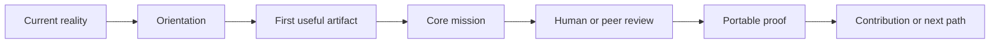
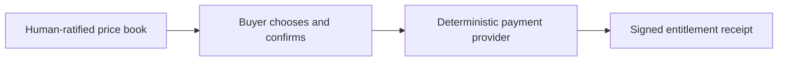

# Academy Atlas Operating Model

**Reference:** `starlight-academy-atlas-40`  
**Status:** Proposed portfolio reference; one source-backed public path; one paid validation bet  
**As of:** 2026-08-30

## Executive decision

Build one open Academy substrate, not forty disconnected schools.

- Five public houses create coherent promises, language, and community experiences.
- Forty domain packs give learners specific identities and paths without multiplying infrastructure.
- Graph Engineering remains the one source-backed public path.
- Expert-to-Product Architect becomes the one paid demand-validation bet.
- Four packs sit in Next: Augmented Reasoning Architect, Gen Creator, World Builder, and University Learning Systems Architect.
- Thirty-four packs remain visible options, not active offers.

The portfolio compounds through one control plane: Academy contracts, capability and execution graphs, learner-controlled Passport projections, open plugins and skills, governed managed capacity, and replaceable community surfaces.

## What the Academy provides

The Academy advances people across five kinds of transformation:

1. **Intelligence architecture:** from using AI tools to designing governed human-and-agent systems.
2. **Generative creation:** from tool experimentation to original media, products, and creator systems.
3. **World creation:** from fragments of lore and media to coherent, participatory worlds.
4. **Freedom systems:** from trapped expertise and fragmented identity to portable intellectual products and owner-light businesses.
5. **Institutional capability:** from scattered courses and pilots to open interfaces, local stewardship, and learner-owned proof.

The Academy serves students already learning in technical, design, film, art, music, game, business, and professional environments. The named institutions are reachable learner habitats, not partners or enrollment sources.

## Portfolio map

| House | Public promise | Eight domain packs |
| --- | --- | --- |
| Starlight Intelligence | Design trustworthy human-and-agent systems that turn judgment into governed capability. | Augmented Reasoning Architect; Agentic Systems Architect; Capability Graph Architect; Context and Memory Engineer; Human Authority Designer; AI Product Prototyper; Evaluation and Safety Designer; Intelligence Operations Lead |
| GenCreator Studio | Turn generative tools, lived expertise, and original taste into durable media and products. | Gen Creator; Gen T Creator; Expert-to-Product Architect; AI Music Creator; Visual Story Systems Designer; Knowledge Media Producer; Community-Led Creator; Creator Commerce Operator |
| Arcanea Worlds | Build living worlds whose lore, characters, systems, media, and communities can grow coherently. | World Builder; Lore Systems Architect; Character and Faction Designer; Interactive Narrative Designer; Game Experience Prototyper; Spatial and Immersive Storyteller; Sonic World Composer; Transmedia Franchise Architect |
| Freedom Systems | Turn identity, expertise, relationships, and systems into a humane freedom-scale practice. | Personal Brand Architect; Freedom-Scale Venture Builder; Offer Systems Designer; Trust and Authority Publisher; Client-to-Product Transitioner; Personal Intelligence Operator; Portfolio Career Architect; Practice-to-Platform Architect |
| Institutional Commons | Add portable, human-governed learning systems without surrendering local academic authority. | University Learning Systems Architect; Faculty AI Studio Lead; Institutional Knowledge Architect; Team Intelligence Facilitator; Public-Service Innovation Designer; Responsible AI Adoption Lead; Community Learning Steward; Academy Substrate Integrator |

The complete persona, age and career signal, learner habitats, modules, academic experience, community experience, free outcome, managed-capacity boundary, price hypothesis, and skill dependencies for every pack live in `foundry/examples/academy-portfolio-40.reference.json`.

## Portfolio status

| Lane | Count | Meaning | Packs |
| --- | ---: | --- | --- |
| Now — public reference | 1 | Inspectable source and public path exist; demand remains unproven. | Capability Graph Architect |
| Now — paid validation bet | 1 | The only current willingness-to-pay hypothesis. | Expert-to-Product Architect |
| Next | 4 | Near-term public packs after the active bet has a clear decision. | Augmented Reasoning Architect; Gen Creator; World Builder; University Learning Systems Architect |
| Later | 34 | Visible options with no activation claim. | Every other pack |

### Why Expert-to-Product is the active revenue bet

- The learner already possesses economically relevant expertise and repeated client or operating patterns.
- The problem is concrete: valuable methods remain trapped in custom delivery and founder-only explanation.
- The open output is intrinsically useful: a public method map, open core curriculum, flagship product specification, and buyer-conversation kit.
- Managed value has real marginal cost: private method memory, publishing and product integrations, managed model capacity, auditability, and bounded group review windows.
- The same substrate directly improves later Freedom Systems, GenCreator, and institutional packs.

No other paid pack enters active validation until this bet reaches a named continue, revise, or stop decision.

## Learner experience architecture

Every domain pack uses the same seven-stage learner graph:

The academic experience combines concepts, methods, tools, missions, artifacts, and explicit review. The community experience exists to improve learning through build rooms, critique, playtests, listening rooms, editorial councils, authority clinics, or steward rotations. A generic chat feed is not a learning design.

### Learner rights

- Observe before participating.
- Complete the full path without payment.
- Use a local or bring-your-own-key execution route.
- Access public modules, missions, rubrics, and credential thresholds.
- Export learner work and consented Passport projections without payment.
- Receive the same assessment standard in every tier.
- Withdraw consent and delete managed private state subject to a published retention policy.
- Appeal a consequential human decision through a named process.

Age bands in the Atlas describe discovery markets. They are not eligibility rules.

## Open-core economics

### The access constitution

The educational core is open and free:

- modules and readings;
- artifact-producing missions;
- rubrics and credential thresholds;
- local or BYOK execution;
- community reading and contribution;
- learner export and equal credential eligibility;
- low-bandwidth text routes, captions or transcripts, keyboard access, and exportable artifacts.

Payment buys capacity, privacy, integration, or a service guarantee. It never buys hidden knowledge, a private rubric, a softer threshold, or a stronger credential.

### Pricing hypotheses

| Tier | Price hypothesis | Paid value | Explicit boundary |
| --- | ---: | --- | --- |
| Commons | €0 | Complete educational path and portable proof | No managed compute, private tenancy, or guaranteed review capacity |
| Managed Studio | €29/month | Modest managed model, storage, sync, and studio tooling | No one-to-one coaching or consequential agent authority |
| Agentic Workspace | €99/month | Higher capacity, private project memory, sandboxes, integrations, and observability | No automatic publication, payment, credential, or permission action |
| Guided Season | €690/six weeks | Small learning cell, scheduled group studios, peer critique, bounded human review, and managed tools | No founder retainer or guaranteed commercial result |
| Ultra Managed | €390/month or €3,900/year | Private agentic workspace, substantial managed capacity, advanced integrations, audit trails, priority group review, and a small operator cell | No standing one-to-one access, hidden knowledge, softer rubric, or autonomous finance |
| Institution Department | €24,000–€60,000/year/department | Private tenancy, SSO, approved integrations, facilitator enablement, observability, service guarantees, and Commons sponsorship | No replacement of academic governance or ownership of learner work |

These are proposed prices, not observed willingness to pay. Current comparables show a broad market spanning roughly $250 self-paced courses, $899 guided experiences, and $999 annual on-demand access; they inform a test range rather than prove the Academy price.

### Commons financing hypothesis

Reserve 20% of Ultra and institutional contribution margin for:

- Commons compute credits;
- accessibility work;
- community stewardship;
- open adapters and maintenance.

The allocation is a governance hypothesis, not an automatic transfer. A named human owner ratifies it quarterly against actual margin and capacity.

## Commerce and authority

No agent receives autonomous payment authority.

An agent may explain published options or draft a recommendation. It may not invent or change price, discount, debt, credit, refund policy, credential state, or buyer intent. Payment state, entitlement state, learning state, and credential state remain separate records.

Checkout stays parked until price-book ownership, merchant authority, tax, refund, privacy, security, explicit confirmation, and reconciliation are resolved.

## Skills and agent topology

The default operating topology is sequential skill composition, not a persistent swarm.

### Academy Fabric plugin

The authentication-free, skills-only `starlight-academy-fabric` plugin contains:

1. `compose-domain-pack` — compile expertise or a learner problem into an open pack under an existing house.
2. `map-learner-journey` — map current reality to artifact, community, export, and optional capacity.
3. `design-learning-cell` — design small artifact-led communities without founder dependency.
4. `govern-managed-capacity` — price scarce capacity while keeping curriculum and assessment open.
5. `plan-institutional-adoption` — add Academy interfaces without replacing local authority or exit.

Graph Engineering remains a separate source plugin because it has a distinct capability graph, missions, execution topology, and public proof surface.

### Inactive agent candidates

| Candidate | Durable reason | Draft tasks | Denied authority |
| --- | --- | --- | --- |
| Academy Portfolio Navigator | Learner-partitioned session context and a bounded read-only catalog | Explain two or three pack options, prerequisites, free path, managed choices, assumptions, and source dates | Enrollment, payment, credential, publication, permission expansion |
| Domain Pack Curator | Recurring source reconciliation and isolated draft queue | Compile sources, persona observations, modules, missions, community formats, and price hypotheses; separate claim states | Merge, price change, activation, credential, publication |
| Institutional Adoption Planner | Institution-partitioned current-state context and constrained planning boundary | Prepare adoption maps, local ownership, privacy, accessibility, integration, and facilitator requirements | Contracting, provisioning, learner decisions, external communication, permission expansion |

All three remain inactive and draft-only. They stop before consequential action and hand work to a named learner or human owner.

## Graph engineering

The system maintains four distinct graphs rather than one ambiguous knowledge graph:

| Graph | Source of truth | Primary edges | Consequential authority |
| --- | --- | --- | --- |
| Portfolio graph | Ratified Academy Atlas release | house → pack → learner identity → skill dependencies | Human portfolio owner accepts activation and brand graduation |
| Capability graph | Public sources and accepted domain contracts | capability → mission → artifact → evaluator → proof → opportunity | Authorized human decides competence and credential |
| Execution graph | Versioned mission contract | task → tool → review gate → receipt | Named human approves consequential steps; edges never silently transfer authority |
| Commerce graph | Ratified price book and signed receipts | price option → buyer confirmation → provider event → entitlement | Merchant owner controls price/refund policy; buyer confirms commitment |

Learner Passport views are purpose-bound projections from consented records. They are not a mutable reputation score, hidden ranking, financial profile, or master identity database.

## Institutional adoption model

The Academy can work with a university, business, or public institution through one bounded installation:

1. **Map one program or workflow.** Name local owners, learners, capabilities, artifacts, systems, data, and consequential decisions.
2. **Install open interfaces.** Add capability, mission, artifact, review, consented export, plugin, and local-execution contracts around existing systems.
3. **Enable local stewards.** Faculty, facilitators, privacy, accessibility, IT, and learners practice operating the path.
4. **Decide from receipts.** At 30, 60, and 90 days, stop, revise, sustain, or expand. Export and exit remain available.

Platform replacement is never the default. The institution retains academic, privacy, procurement, and system authority.

## Activation and brand-graduation gate

A pack can seek sustained activation only after six consecutive weeks with:

- at least 25 weekly active learners;
- at least 60% artifact completion;
- at least 40% peer contribution;
- at least two independent stewards other than the founder;
- a repeatedly observed learner problem;
- a working complete free route;
- demand that is not founder-distribution-only;
- passed accessibility, privacy, license, and human-authority review.

Standalone brand graduation adds five further requirements: a distinct buyer, promise, distribution loop, steward base, and risk boundary. Without those, the experience remains a pack under its house.

## Execution plan

### Already built in this release

- Five-house, forty-pack machine-readable Atlas reference.
- Every pack populated with persona, market age signal, learner habitats, proposed modules, academic and community experience, open outcome, managed boundary, price hypothesis, and skills.
- Interactive `/academy` Atlas.
- Source-backed `/academy/graphs` Observatory.
- Academy Fabric plugin with five reusable skills.
- Three bounded draft-only agent task definitions.
- Open-core and commerce authority contract checks.
- Shared navigation, sitemap, Vercel invalidation, and CI checks.

### Next 72 hours after human release approval

- Review the forty pack names, identities, and house boundaries for brand coherence.
- Publish the complete free Expert-to-Product pack outline and first artifact mission.
- Invite twelve high-fit experts to direct problem conversations; record exact current work, costly friction, desired artifact, constraints, and existing spend.
- Run three public build rooms using the free material; observe artifact completion and questions without forcing a paid conversion.
- Ratify or revise the managed Ultra capacity specification and its cost model.

### Day 14 decision

- Continue only if the same costly learner problem repeats, the free path produces a useful artifact, and at least three qualified experts ask for managed capacity or a bounded group season.
- Revise if the problem is real but the identity, artifact, or managed boundary is unclear.
- Stop the paid bet if interest is content-only, willingness is speculative, or delivery requires founder one-to-one work.

### Day 30

- Publish the revised open pack, templates, mission, rubric, accessibility path, and local execution guide.
- If the Day 14 gate passes, open one six-week small-cell season with a deterministic published price and no automatic charge path.
- Compile contributor fixes into the Commons with consent and license clarity.
- Produce a continue, revise, or stop receipt before activating another revenue bet.

### Day 60–90

- Advance one Next pack based on adjacent observed demand, not portfolio symmetry.
- Prepare one bounded institutional adoption brief around an existing program.
- Train at least two independent stewards before expanding community capacity.
- Ratify a real Commons subsidy from actual contribution margin only after costs and obligations are known.

## Decision dashboard

| Layer | Primary measure | Guardrail | Stop signal |
| --- | --- | --- | --- |
| Learning | Useful artifact completion | Same rubric and credential threshold at €0 | Managed users advance while Commons learners cannot complete |
| Community | Peer-help and contribution distribution | Moderator load, safety, accessibility, consent | Founder supplies most help or invisible labor grows |
| Demand | Qualified requests for managed capacity | Free path remains obvious | Interest is praise or content consumption only |
| Economics | Contribution margin after compute, support, and review | Refund, tax, privacy, and service obligations are funded | Managed tier requires standing one-to-one delivery |
| Institution | Local owner capacity and learner rights | Exit, export, local governance, accessibility | Adoption requires platform lock-in or displaced academic authority |
| Portfolio | One active revenue bet and reusable substrate growth | No new top-level brand without graduation | Parallel launches fragment attention or infrastructure |

## Primary-source learner habitats

- University of Amsterdam, MSc Artificial Intelligence: <https://www.uva.nl/shared-content/programmas/en/masters/artificial-intelligence/artificial-intelligence.html>
- University of Amsterdam, Cultural Data & AI: <https://www.uva.nl/shared-content/programmas/en/masters/cultural-data-ai/cultural-data-and-artificial-intelligence.html>
- University of Amsterdam, Strategy and AI Transformation: <https://www.uva.nl/en/programmes/masters/business-administration-strategy-and-ai-transformation/business-administration-strategy-and-ai-transformation.html>
- Vrije Universiteit Amsterdam, MSc Artificial Intelligence: <https://vu.nl/en/education/master/artificial-intelligence>
- Amsterdam University of Applied Sciences, Communication and Multimedia Design: <https://www.hva.nl/opleidingen/communication-and-multimedia-design>
- Netherlands Film Academy: <https://www.filmacademie.ahk.nl/en/>
- Codam: <https://www.codam.nl/en/education/>
- Gerrit Rietveld Academie: <https://rietveldacademie.nl/en/page/16727/full-time-bachelor>
- TU Delft, Design for Interaction: <https://www.tudelft.nl/en/education/programmes/masters/dfi/msc-design-for-interaction>
- HKU Games: <https://www.hku.nl/en/study-at-hku/games/about-hku-games>
- HKU Music and Technology: <https://www.hku.nl/en/study-at-hku/music-and-technology/about-music-and-technology>
- MIT Media Lab, Media Arts and Sciences: <https://www.media.mit.edu/graduate-program/about-media-arts-sciences/>
- Carnegie Mellon Entertainment Technology Center: <https://etc.cmu.edu/>
- UAL Creative Computing Institute: <https://www.arts.ac.uk/creative-computing-institute>
- NYU Interactive Telecommunications Program: <https://tisch.nyu.edu/itp>

Professional learning comparables used only to frame price tests:

- IDEO U: <https://www.ideou.com/>
- Maven: <https://maven.com/>
- Section AI: <https://www.sectionai.com/>

## Release truth boundary

This document does not claim forty live academies, validated willingness to pay, active agents, autonomous payment, institutional partnership, enrolled students, issued credentials, or production commerce. It defines the smallest coherent portfolio and the contracts required to test it without sacrificing access, learner ownership, or human authority.
