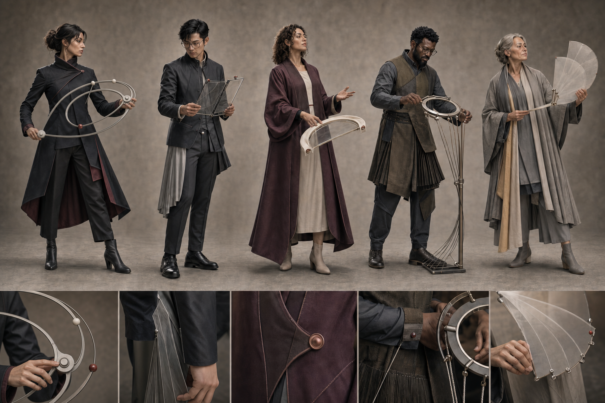
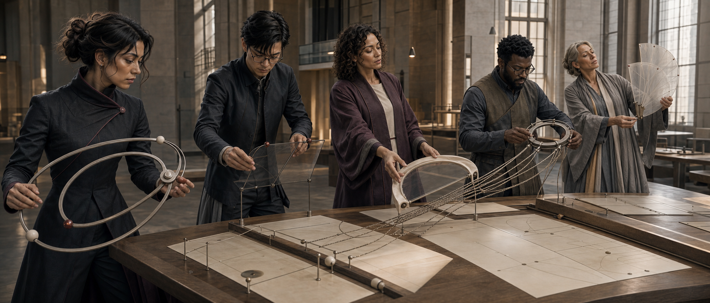
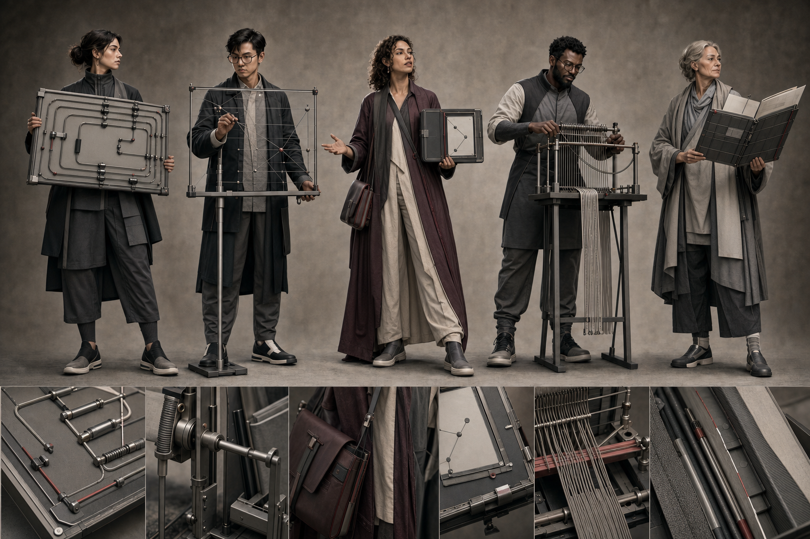
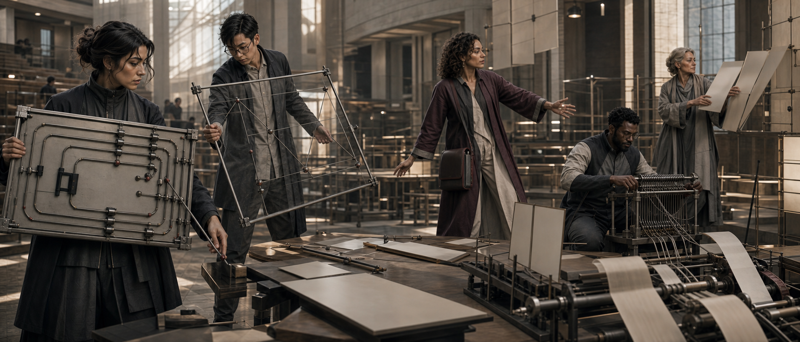
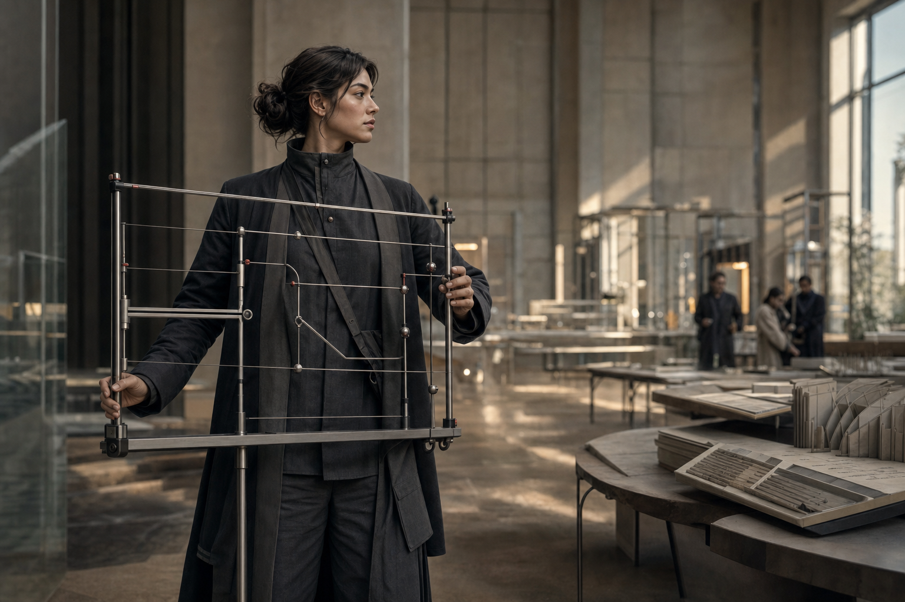

# Starlight cinematic character evolution

**Date:** 2026-08-29 · **Status:** v3 semantic redesign promoted for internal development · **Canon:** no

This pass translates the recommended Starlight character territory into original, live-action production language. It studies the transferable discipline behind premium ensemble cinema—story-first design, unmistakable silhouette, practical fabrication, material hierarchy, motivated light, and role-specific action—without copying Marvel characters, costumes, logos, trade dress, scenes, or any named artist's finish.

The result is not “Starlight dressed as superheroes.” It is **bounded intelligence made cinematic**: people whose responsibility, limit, instrument, and handoff can be understood before anyone reads a caption.

## V3 promoted character system



V3 treats costume, instrument, gesture, and responsibility as one design problem. The collective shares a material civilization and ethical behavior, but no longer shares one coat, one value mass, one footwear pattern, or one class of oversized rectangular device.

| Character | Memorable silhouette | Instrument that explains the work | Signature action and visible limit |
|---|---|---|---|
| Orchestrator | Branching ink coat, diagonal collar, split oxblood-lined tail | Overlapping double-ellipse route compass with sliding nodes | Rotates one route open while an oxidized-red stop node holds the rejected branch |
| Sentinel | Compact cropped jacket, frost-gray vertical pleat, precise translucent edge | Two thin smoked-mineral threshold lenses | Overlaps two paths to reveal a mismatch; the mechanism visibly ends at his wrist |
| Concierge | Plum cocoon silhouette around a warm-bone human center | Ivory aperture folio that unfolds into one curved opening | Opens exactly one welcoming route toward another person rather than displaying options |
| Weaver | Umber and mineral-olive diagonal tailoring with rhythmic pleats | Circular provenance spindle with separate incoming cords and one open braid | Rotates the ring while keeping every source strand visible and separable |
| Starlight Sage | Limestone, smoke, silver, and pale-ochre nested layers | Five translucent atlas leaves on a delicate spine | Fans patterns outward while leaving the final leaf incomplete for human interpretation |

### Why v3 makes more sense

- **One visual sentence per character.** Silhouette, color, instrument, and motion all describe the same responsibility.
- **Human-scale operation.** Every object can be carried, balanced, folded, pivoted, or manipulated through believable hands.
- **Beauty through restraint.** Each design has one dominant silhouette event and one controlled color family instead of equal detail everywhere.
- **Collective without uniformity.** Satin titanium pivots, ceramic nodes, mineral glass, tactile textiles, fine cord, and red stop markers establish common civilization while remaining a minority of each design.
- **Visible limits.** A stopped branch, wrist boundary, single aperture, retained source cords, and incomplete atlas leaf prevent visual metaphors from implying unlimited power.
- **No borrowed franchise shorthand.** The designs depend on Starlight's runtime meanings rather than armor, emblems, weapons, capes, cosmic energy, or recognizable entertainment trade dress.

The first v3 exploration solved most of the character system but gave Orchestrator a long arc that could read as a bow. The promoted board is a targeted correction: every successful identity, costume, instrument, inset, and material was frozen while only her object became a non-weapon double-ellipse route compass. This is the preferred top-tier iteration pattern—protect the design, diagnose one semantic failure, and change only that layer.

## V3 action proof



The cinematic proof forces the board designs to work under gravity, hand contact, eyelines, fabric movement, production light, and shared causality:

```text
Orchestrator routes
→ Sentinel compares and rejects
→ Concierge opens the human handoff
→ Weaver preserves sources while synthesizing
→ Starlight Sage reveals a pattern and returns the unfinished judgment
```

The frame uses physical cords, sliding nodes, glass refraction, pivots, folds, and shadows instead of magic beams or floating interfaces. It is more emotionally engaging because attention is on people making a difficult decision together. The spectacle comes from understanding becoming visible.

Remaining production tests:

- construct ergonomic foam and lightweight mechanical mockups for grip, balance, folding, and performer safety;
- create isolated front, profile, back, seated, walking, pressure, and handoff turnarounds for each identity;
- test silhouette and palette collision against the remaining eight North Stars;
- replace the earlier Orchestrator solo keyframe with her v3 costume and route compass;
- test a second scene with deeper spatial staging, partial occlusion, and a mobile-safe crop;
- apply exact notation only through deterministic post-production overlays.

## V2 baseline — what it taught us



The v2 costume board established the first contemporary material family, cast, and five-role order. It also exposed the problems v3 corrects: shared-workwear sameness, repeated dark value masses, similar footwear, rectangular tool dominance, and props that felt carried rather than naturally operated.

| Character | Human read | Exclusive instrument | Costume signal |
|---|---|---|---|
| Orchestrator | Makes a consequential route legible and reversible | Open routing frame | Charcoal architectural layers, precise verticals, restrained intervention red |
| Sentinel | Compares, refuses, and preserves rollback | Transparent comparison threshold | Dark technical tailoring, exposed boundary geometry, no militarism |
| Concierge | Opens one calm route for another person | Single-route folio | Warm bone and restrained plum, softer drape, accessible center of gravity |
| Weaver | Retains authorship while synthesizing sources | Provenance loom | Layered work silhouette, tactile woven structures, controlled rhythm |
| Starlight Sage | Reveals durable patterns without commanding | Nested evidence folio | Mineral gray layers, generous movement, quiet material authority |

The costume system works because the collective shares construction intelligence, not a uniform. The garments use contemporary architectural tailoring, ergonomic articulation, tactile fabrics, and a restrained material family. Identity comes from proportion, drape, posture, instrument, and behavior—not a chest emblem or colored suit.

## V2 ensemble iteration history



The v2 ensemble frame moves the designs out of a blank concept stage and into a common event. Every agent performs a different transformation inside the same evidence failure. The architecture, instruments, costumes, blocking, and light speak one world language while the role actions remain separable.

What succeeds:

- Five readable silhouettes survive a wide frame.
- Asymmetric foreground, middle-ground, and background staging replaces the first pass's presentation lineup.
- Connected gestures and attention create a route from Orchestrator through Sentinel and Concierge toward Weaver and Sage.
- Instruments remain physical, inspectable, and separate from the body.
- The scene expresses coordination without combat, flight, energy blasts, or military command imagery.
- Limestone, pale wood, woven acoustic surfaces, steel, glass, and late-day light give the collective a credible production world.
- Warm bone, charcoal, mineral gray, plum, and oxidized red hold together under one film grade.
- Evidence planes are intentionally blank or abstract; no generated writing is treated as information.

What must improve before public release:

- Exact public-facing notation still requires deterministic overlays after generation.
- A second action frame should test a more compressed failure state, partial occlusion, and motion continuity without losing any face or instrument.
- A single frame cannot prove costume mobility, rear silhouettes, prop operation, or continuity under action.

The preserved v1 image records the failed staging diagnosis: strong continuity and world design, but a shoulder-to-shoulder lineup and nonsemantic background marks. The v2 edit froze identity, costume, instrument, environment, and grade while changing only blocking, eyelines, action, and evidence-surface cleanliness.

## Previous Orchestrator identity anchor



This v1 frame remains a useful face, performance, lens, and environment reference. Its costume and oversized rectangular routing frame are superseded by the v3 branching coat and double-ellipse route compass.

The next Orchestrator sheet should preserve this face, age range, body type, hair logic, costume architecture, and routing-frame behavior. It still requires front, three-quarter, profile, back, seated, walking, and high-pressure continuity views before an identity generation can be locked.

## The precise cinematic grammar

Premium franchise cinema does not become believable through rendering polish alone. Its character images usually align eight systems at once:

1. **Dramatic consequence.** The image captures a choice, failure, discovery, collision, or handoff. “Standing powerfully” is not a story beat.
2. **Silhouette before surface.** Body proportion, garment mass, posture, negative space, and the relationship to a signature object must read at thumbnail size.
3. **Costume as narrative architecture.** A useful costume has a base silhouette, functional construction, cultural or institutional material logic, and a current story state. Wear, repair, access, and restraint say more than ornament.
4. **Practical credibility.** A costume must look sewable, wearable, repeatable, and movable under performance, stunts, heat, lenses, and lighting. Even speculative materials need seams, closures, weight, and a reason.
5. **Ensemble collision control.** Characters are evaluated together in grayscale and color so hair, height, value mass, accent placement, instrument geometry, and motion cadence do not collapse into one family blob.
6. **World integration.** Costume, object, architecture, typography, transportation, and interface share history and fabrication logic. A character should appear native to the set, not pasted onto it.
7. **Motivated spectacle.** Practical light and material response carry the frame; visual effects clarify a transformation the story already establishes. Unmotivated glow is visual noise.
8. **Cinematography as meaning.** Lens, camera height, blocking, depth, exposure, atmosphere, and grade express the character's relationship to the moment. A 65 mm identity frame and a 35 mm ensemble frame solve different problems.

For Starlight, the house translation is:

```text
person = responsibility, judgment, limit, relationship
instrument = transformation, evidence, handoff, state
cinema = consequence made visible through performance, material, space, and light
```

## Costume construction standard

Every final character needs a buildable costume packet, not only a beautiful front image:

- locked silhouette in front, profile, back, and three-quarter views;
- base layer, working layer, outer layer, closures, footwear, and carry system;
- fabric swatches and physical finish notes under daylight and tungsten light;
- articulation map for shoulders, elbows, hands, hips, knees, and seated work;
- clean, working, stressed, and repaired continuity states;
- instrument grip, storage, transfer, and safe-stop behavior;
- palette allocation by area and purpose, with contrast verified in grayscale;
- no unexplained armor panels, glowing cores, decorative circuitry, or costume technology that implies runtime powers.

The current material family is satin titanium, dark stainless steel, pale technical ceramic, clear or lightly smoked laminated glass, carbon-infused linen, tactile wool, precision woven cord, matte graphite composite, warm-bone technical textile, and sparse oxidized-red wayfinding details.

## Character invention workflow

Use this production sequence for each North Star:

1. **Runtime truth.** Verify the agent exists, what it can do, what it cannot do, its inputs, outputs, human stop, handoff, and failure path.
2. **Dramatic engine.** Write one sentence naming what this person wants, what pressure prevents it, and what responsible choice reveals the role.
3. **Visual sentence.** Define the body read, signature action, exclusive instrument, and visible boundary without aesthetic adjectives.
4. **Divergence.** Explore at least three structurally different silhouettes and costume architectures in monochrome.
5. **Mechanism proof.** Draw or generate the instrument separately and show input, transformation, output, stop, rollback, and transfer.
6. **Costume development.** Resolve construction, material, mobility, aging, palette allocation, and actor comfort.
7. **Identity lock.** Approve face policy, age band, body type, hair logic, silhouette, costume invariants, and controlled variation.
8. **Story keyframes.** Produce a calm-state identity frame, a pressure-state decision frame, and a handoff frame. Avoid poster posing.
9. **Collision scene.** Place the character beside at least four approved agents and test thumbnail, grayscale, crop, lighting, and action separation.
10. **Production tests.** Verify portrait, ultrawide, mobile crop, motion, low light, daylight, prop handling, and deterministic text overlays.
11. **Independent review.** A reviewer other than the maker checks runtime truth, originality, representation, continuity, anatomy, material logic, and artifact defects.
12. **Receipt and canon gate.** Store prompt, references, hashes, model route, scores, known risks, founder decision, and identity generation. Never overwrite a canonical master.

## Prompt compiler

AI prompting should behave like a production brief:

```text
use case and asset type
+ locked identity and continuity references
+ dramatic beat with pressure and consequence
+ role action: input → transformation → output
+ exclusive instrument and visible human stop
+ costume silhouette, construction, material, and story state
+ environment and shared world fabrication
+ composition, performance, eyelines, and negative space
+ motivated lighting, lens, depth, grain, and grade
+ exact preservation instructions
+ rights-aware avoid list and no-generated-text boundary
```

Avoid style-name shorthand. “Cinematic” must be decomposed into lens, blocking, production design, practical materials, motivated light, performance, atmosphere, and color science. Earlier prompts are preserved in [`prompts.md`](./prompts.md); the promoted semantic redesign and action-proof prompts are in [`prompts-v3.md`](./prompts-v3.md).

## Scale plan

This pass tests only five of the 13 North Stars. It does not authorize fleet fanout. After the founder records the representation decision and G0 locks the roster crosswalk:

1. lock Orchestrator as the family anchor;
2. finish Prime, Architect, Navigator, Sentinel, Weaver, Starlight Sage, Hermes, Concierge, Envoy, Voice Operator, Genius, and Evaluator;
3. generate no more than 12 identities per batch;
4. run collision scenes and continuity checks after every batch;
5. promote only receipt-bearing assets that pass the 95-point public-release threshold.

The v3 character board and v3 ensemble frame are the promoted internal direction. Earlier versions remain diagnostic provenance. None is character canon, a casting reference, a public campaign master, or evidence that the depicted agents possess capabilities beyond their runtime contracts.

Generation used the built-in `image_gen` route. File hashes and review status are recorded in [`design-loop-evidence.json`](./design-loop-evidence.json).

Built on SIP — Starlight Intelligence Protocol v1.1.1.
