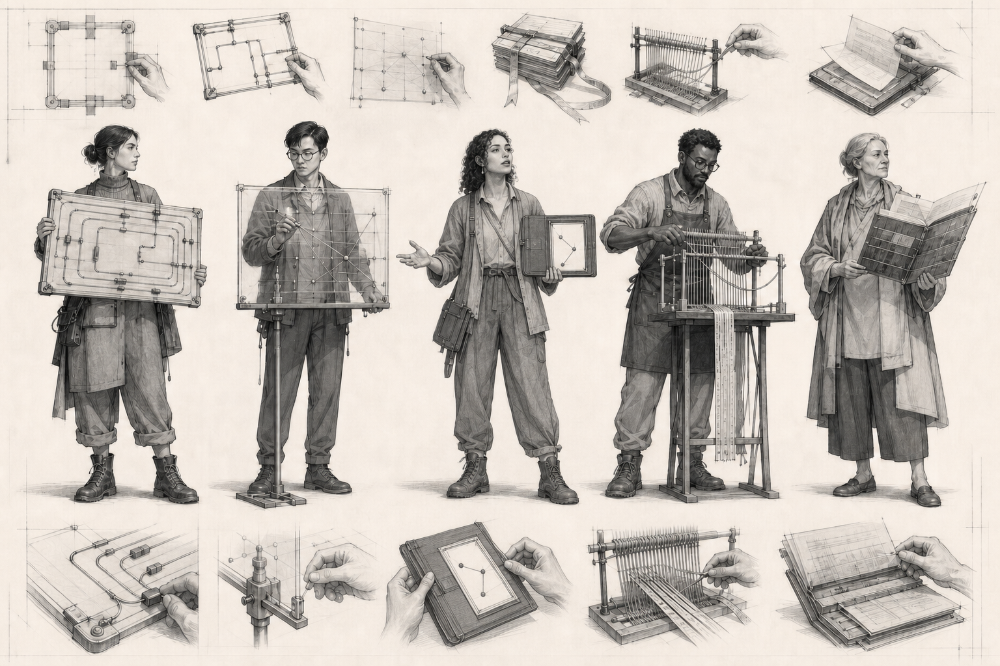
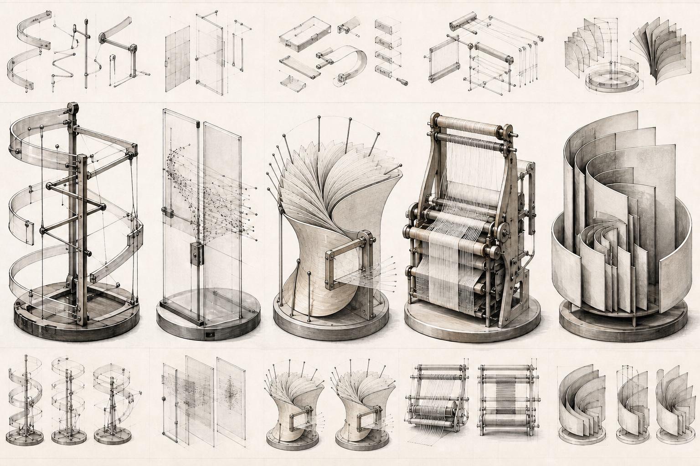

# Starlight character territory proofs

**Date:** 2026-08-27 · **Status:** ready for founder comparison · **Canon:** no

These two black-and-white boards test representation structure before color, costume systems, 3D, motion, or character fanout. Both use the same five functions in the same order: Orchestrator, Sentinel, Concierge, Weaver, and Starlight Sage.

They borrow story readability and production discipline from the Marvel research memo, not Marvel characters, costumes, logos, trade dress, or any named artist's finish.

## Territory A — Civic operators



**First read:** intelligent people using inspectable instruments to route, compare, welcome, weave, and teach.

**Strengths**

- Immediate human warmth, empathy, gesture, and cast-level storytelling.
- The transparent Sentinel plane, one-route Concierge folio, provenance loom, and layered Sage folio make limits visible.
- Strong monochrome hierarchy and practical materials; no superhero, robot, throne, or cosmic coding.
- Suitable for story strips, editorial illustrations, onboarding, and public-facing character moments.

**Risks to correct in the North Star round**

- Shared workshop clothing, boots, and neutral poses could become a uniform if repeated across 13 identities.
- The instruments currently carry more silhouette differentiation than the bodies.
- Fine pseudo-marks appear on some paper/ribbon details; final exact information must be applied deterministically, never generated.
- The craft-workshop register may need controlled contemporary cues so it does not become historical nostalgia.

## Territory B — Living notation



**First read:** a family of physical intelligence instruments whose mechanisms reveal what each system does.

**Strengths**

- Highly ownable, system-native, and independent of superhero or generic artificial-intelligence character tropes.
- Excellent silhouette separation, material honesty, and mechanical causality.
- Scales naturally into registry marks, diagrams, spatial installations, motion studies, and product objects.
- The Concierge's open folio/aperture expresses welcome without requiring a face.

**Risks to correct if used as the primary character class**

- Emotional distance is substantially higher; users may admire the system without forming character attachment.
- Repeated circular plinths and vertical museum presentation make the collective feel static and institutional.
- Sentinel and Weaver are visually precise but require story context to communicate refusal, rollback, and retained authorship.
- A whole 144-agent fleet could drift into beautiful machinery rather than memorable personalities.

## Comparison

| Criterion | Territory A | Territory B |
|---|---|---|
| Human warmth | Strong | Restrained |
| Role comprehension | Strong through pose plus tool | Strong through mechanism after brief study |
| Ownability | Good | Excellent |
| Character storytelling | Excellent | Moderate |
| Diagram and product grammar | Good | Excellent |
| Risk of generic artificial-intelligence imagery | Low | Low |
| Risk at 144-agent scale | Workwear sameness | Machine-family sameness |

## Design recommendation

Advance **Territory A — Civic operators** as the public character representation class. Import **Territory B — Living notation** as the exclusive-instrument, diagram, registry-mark, and motion grammar inside that territory.

This produces a useful division:

```text
person = responsibility, judgment, limit, relationship
instrument = transformation, evidence, handoff, state
```

Do not blend their silhouettes into cyborgs, powered armor, or costume technology. The person and instrument remain visibly separable so the system never implies that a visual metaphor grants runtime power.

## Cinematic evolution experiment

A founder-directed, non-canon follow-up tested the recommended combination in contemporary live-action costume and production design. It produced a five-person costume board, an ensemble archive keyframe, and an Orchestrator identity anchor. The experiment strengthens the recommendation but does not replace the founder territory verdict or G0 roster gate.

See [`../cinematic-evolution/README.md`](../cinematic-evolution/README.md) for the images, cinematic grammar, invention workflow, prompt provenance, hashes, and documented defects.

## Founder decision requested

Record one of:

1. `advance-a-with-b-instrument-grammar` — recommended;
2. `advance-a-only`;
3. `advance-b-only`;
4. `revise-both`, with a named structural reason.

Color, final character sheets, and the 13 North Star fanout remain blocked until that decision and the G0 roster crosswalk are recorded.

## Version history

- `v1` established both territories but used a retrieval role in the center position.
- `v2` is the reviewed comparison pair. It replaces that center role with Concierge so both boards satisfy the Foundry's required Concierge, Sentinel, and Weaver stress test while retaining Orchestrator and Starlight Sage.
- The v1 files remain preserved for provenance and may not be published as the approved comparison pair.

## Asset record

| Asset | Dimensions | SHA-256 |
|---|---:|---|
| `territory-a-civic-operators-v2.png` | 1536 × 1024 | `912728e326df9d3a34b25bc68461ba415034696fc98444ca288781bcd7ae7b67` |
| `territory-b-living-notation-v2.png` | 1536 × 1024 | `c0c91d4c8e2dca89efb8eec94e1242074482215d2a5d674a9cb6bb4fd722ef25` |

Generation used the built-in `image_gen` path. Exact base and targeted-edit prompts are preserved in [`prompts.md`](./prompts.md). Review evidence is in [`design-loop-evidence.json`](./design-loop-evidence.json).

Built on SIP — Starlight Intelligence Protocol v1.1.1.
