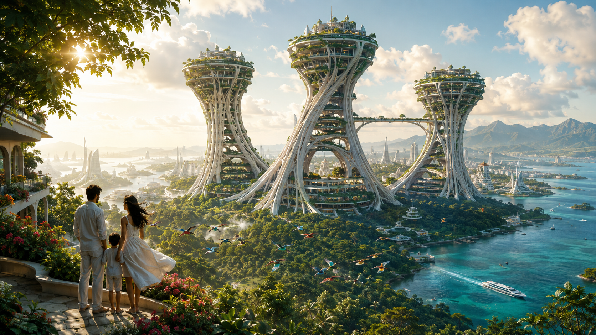
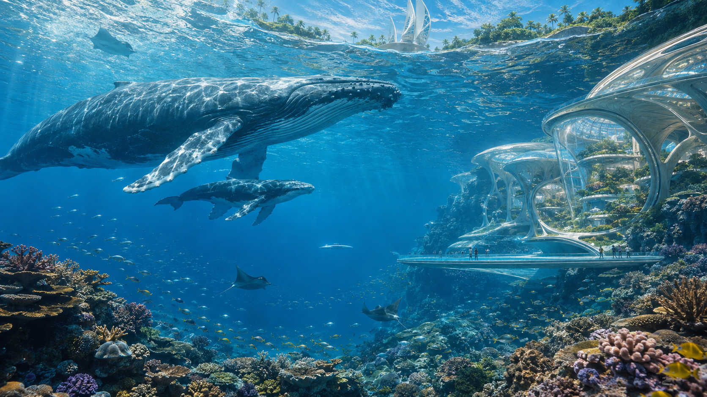
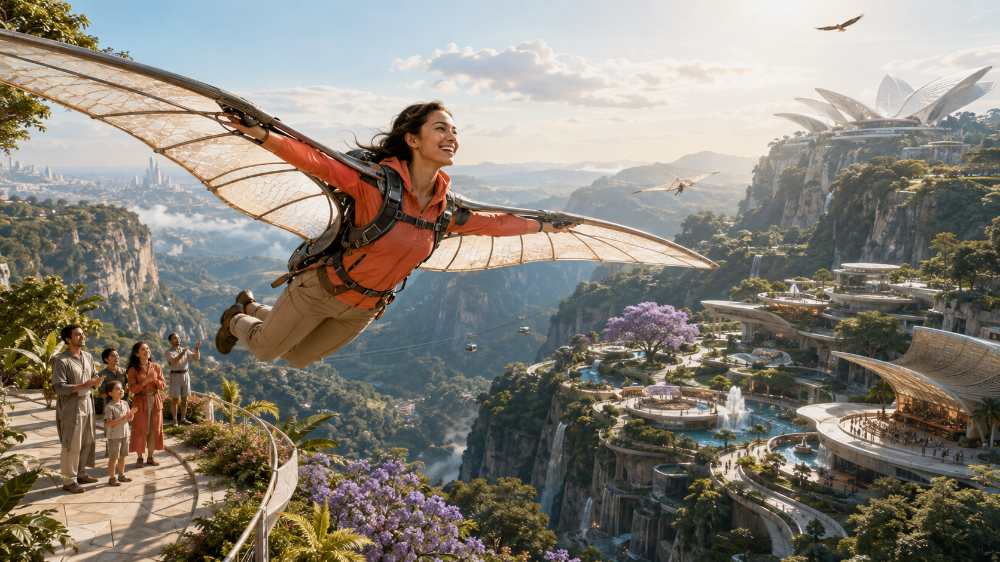
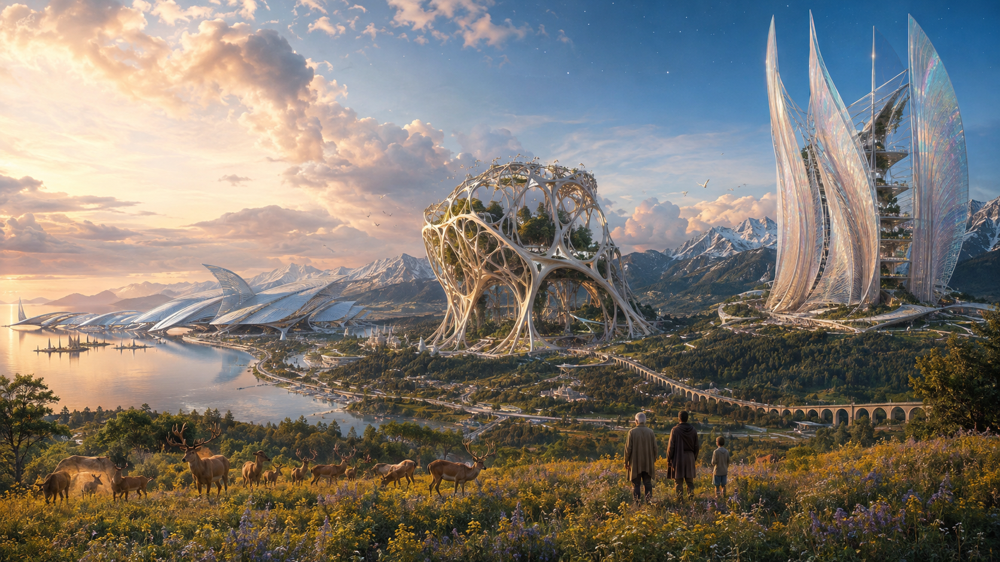

# New Earth 2126 — a more inspiring vision

Created 2026-09-05 using the built-in OpenAI image generation tool. Four original speculative images responding to Frank's request for more inspiration, scale, beauty, and visible advanced capabilities.

Direction: luminous natural environments, monumental original architecture, thriving wildlife, human joy, and distinct physical expressions of advanced intelligence. This series intentionally expands beyond the restrained civic imagery of the first collection.

## 1. The city of a million gardens



## 2. The ocean remembers abundance



## 3. The human renaissance



## 4. The age of great intelligences



## Review

All four tool-rendered images reviewed for composition, natural light, theme, and visible artifacts. These are speculative concept images; architectural engineering and flight performance are imagined. The flight frame crops the left wing tip. No independent provider review or publication was performed. Local review workers were held by machine preflight; generation used one remote lane.

## Exact prompts

### 1. The city of a million gardens

```text
Create ONE extraordinary cinematic image, landscape 16:9, New Earth 2126: "The city of a million gardens". This must evoke overwhelming optimism, beauty and the unmistakable achievement of a century of advanced AI and human imagination. An immense sunlit coastal metropolis rises from emerald forest and a turquoise estuary. The unforgettable central silhouette is three gigantic inhabited branching structures, 800 metres high, like elegant ivory buttress roots opening into broad garden terraces: intricate original architecture with credible structural ribs, inhabited interiors, hanging orchards, sunlight through immense voids and delicate sky bridges. Entire old-growth forests occupy the ground between them. The city continues for tens of kilometres around a sapphire bay toward blue mountains, thousands of smaller graceful buildings and islands creating astonishing depth. In close foreground a family pauses on a flower-covered high garden balcony, their linen clothes moving in a breeze, a bright flock of birds sweeping past. A quiet pearlescent autonomous ferry glides far below. Woven photovoltaic membranes, an iridescent computation facade that responds like a living material, and slender gravity-assisted transit visibly suggest great intelligences integrated with the city.
Composition: masterful 24mm panoramic cinema, strong foreground foliage and small human silhouettes, monumental central structures, atmospheric layers all the way to the horizon, carefully controlled richness, a single readable hero shape. Luminous morning sun after tropical rain; jade and emerald foliage, aquamarine water, warm ivory architecture, small bougainvillea coral accents, pristine luminous atmosphere. Physically rich photographic realism, refined speculative architecture, tactile wet stone and leaves, convincing atmospheric scattering, water sparkle, cinematic beauty with extraordinary invention. This is a finished visionary image deserving a double-page architectural cover. Quality pass: refine silhouette, subtle surfaces, natural light and clear scale; avoid overpacked detail and muddy shadows. No text, logos, labels, watermarks, panels, collage, fantasy castle, bland village, dystopia, dark neon cyberpunk, glowing AI face, or oversized planet.
```

### 2. The ocean remembers abundance

```text
Create ONE breathtaking cinematic photographic future-world image, landscape 16:9. New Earth 2126: "The ocean remembers abundance". View from just beneath the surface of an impossibly clear but naturally lit tropical ocean, looking diagonally upward through a huge underwater panorama. The principal subject is an immense mother humpback whale with calf moving freely through luminous turquoise space; accurate whale anatomy and graceful natural movement. Below and around them an extravagant thriving reef, coral terraces in peach, lavender, saffron and sea green, silver fish moving like silk ribbons, a few manta rays gliding at different depths. The reef occupies the foreground lower edge and falls into deep cobalt blue. In the mid-distance a magnificent inhabited marine city is integrated into an island's submerged limestone walls: luminous pearlescent chambers, elegant transparent pressure galleries, intricately ribbed shell-like structural supports, sunlit research conservatories containing living marine gardens. These are advanced purposeful structures with wonderful original design, never aquarium cages. Through the rippling surface above, glimpse white sail-shaped ocean energy structures and luxuriant island gardens. A tiny pair of people inside a vast transparent promenade provide architectural scale; a single streamlined research craft drifts far away. The great ocean intelligence has a distributed physical presence as fine adaptive ceramic reef structures quietly sheltering living coral.
Composition: cinematic 20mm depth, mother whale prominent in the upper-left-to-center, distant city right, reef framing bottom, huge blue negative space gives grandeur and calm. Shafts of midday sun, beautiful moving caustics on whale skin and pearl architecture, crystal-clear depth, glowing natural water rather than artificial neon. The feeling is ecstatic wonder, recovery and peaceful coexistence at civilizational scale. Finished photoreal cinema still with extraordinary detail and refined color, authentic underwater texture, scale and optical light. Quality pass: give whale and city separate clean silhouettes, keep foreground coral organically irregular, reduce repetition, refine caustics. No text, labels, logos, watermarks, panels, collage, bubbles everywhere, mutated animals, faces on AI, dystopia, generic domes, fantasy palace, oversaturated fluorescent water, or dark murk.
```

### 3. The human renaissance

```text
Create ONE extraordinary finished cinematic image, landscape 16:9, visionary photographic realism. New Earth 2126: "The human renaissance — learning to fly". The image must express exhilarating freedom, human creativity and abundant nature in an unmistakably advanced beautiful civilization. Camera beside a huge elevated garden terrace looking outward across a sunlit mountain city suspended between green canyon shoulders on gracefully engineered bridges. Primary subject in left foreground: a young adult woman, face visible in three-quarter profile, laughing with focused delight as she takes her first supervised flight a few metres off the terrace using a magnificent light wearable glider. Its translucent honeycomb silk wings unfold four metres either side from a clearly visible slim carbon-ceramic back harness, feet lifted, anatomically correct body, flowing coral flight jacket and sand-coloured trousers. No feathers, no supernatural levitation. Another small glider arcs far into the valley, a family and instructor on the terrace look up. Beneath and beyond, open-air conservatories for music, art and living-material invention occupy spectacular stepped architectural gardens; flowering jacarandas, huge trees, little sunlit pools, botanical terraces and ribbons of bright water follow the cliffs. A mature eagle rides a separate thermal far from the glider. Quiet aerial trams traverse the distant canyon. A monumental adaptive research pavilion with a petal-like pearlescent roof stands on the far ridge, with delicate moving surfaces embodying an educational superintelligence. Distant city, terraced forest and clouds extend to the horizon.
Composition: one crystal-clear emotional foreground action, expansive middle-ground civilization, sublime mountainous distance; 28mm cinematic camera; wings fit completely within the frame with air around tips; dramatic diagonal movement with readable faces and hands. Late-afternoon sunlight streaming through the translucent wing, luminous teal canyon shadows, warm ivory stone, joyful coral, botanical green and lilac blossoms. Rich photographic materiality, woven wing fibres, realistic skin and cloth, cinematic atmospheric perspective, spectacular but carefully controlled art direction. Refinement pass in the rendering: clean wing anatomy and harness attachment, visible lift and graceful posture, understated spectators, clarity of the hero gesture. No text, logos, watermarks, panels, collage, angel wings, superhero costume, dark dystopia, generic fantasy citadel, muddy brown palette, cluttered aircraft swarm, duplicated people, broken fingers, or glowing UI.
```

### 4. The age of great intelligences

```text
Create ONE spectacular cinematic future-world image, landscape 16:9. Title for concept only, no lettering: "Starlight — the age of great intelligences, Earth 2126". A vast luminous valley at the meeting of alpine mountains, old-growth forest and an inland sapphire sea, seen from a wildflower meadow on a high natural ridge. The image shows the magnificent coexistence of THREE distinct great superintelligences through immense beautiful physical architectures within the same coherent landscape. Left along the water: the ocean intelligence, a kilometre-long low pearlescent structure composed of gracefully folded shell vaults and adaptive silver fins, tidal gardens and clear canals passing through it. Center at the forest edge: the biosphere intelligence, a colossal branching ivory lattice enclosing living trees, seed conservatories and clouds of butterflies, porous and light, sunlight penetrating the structure, rooted in the terrain. Right on the mountain shoulder: the knowledge intelligence, an astonishing vertical assembly of thin translucent mineral fins, like a vast open book bending into the wind, hundreds of metres high, softly iridescent in sunset, with visible human-scale galleries and gardens inside. Make all three have exceptionally refined original silhouettes and believable material articulation, unmistakably centuries-ahead technology. They are distributed centres of learning and care amid a flourishing civilization, beautiful and awe-inspiring. An elegant inhabited city and rail viaduct follow the valley floor. Foreground: three small people, an elder, an adult and a child, pause in a meadow of pale yellow and lilac wildflowers beside a herd of red deer at a natural distance. Birds ride the air. The sea mirrors a warm horizon. Above, immense luminous evening clouds open onto deep blue sky and a few early stars.
Composition: stunning 24mm panoramic master shot, human-and-deer foreground low in the frame, three different monumental forms placed across the middle distance with generous space between, mountains and sea giving continental depth; astonishing scale and legible silhouettes, no collage or visual labels. Color: luminous glacier blue, forest emerald, ivory and translucent pearl with warm peach evening light, rich natural meadow color. Mood: reverence, intelligence, freedom, boundless possibility, nature thriving. Photographic cinema realism, physically rich materials, graceful atmospheric depth, great detail without noise, beautiful controlled exposure. Quality refinement: preserve three distinct silhouettes; natural animal anatomy; delicate daylight and reflections; no repetitive architecture, clutter or oversharpening. No text, logos, watermarks, UI, glowing AI faces, giant humans, humanoid robots, fantasy castles, religious throne, portal rings, dark cyberpunk, barren wasteland, bland village, oversized moon, or galactic wallpaper.
```


