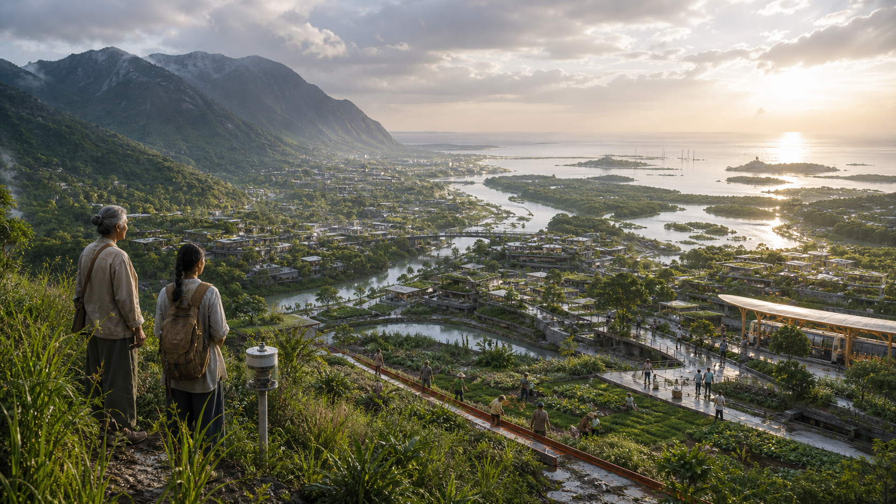
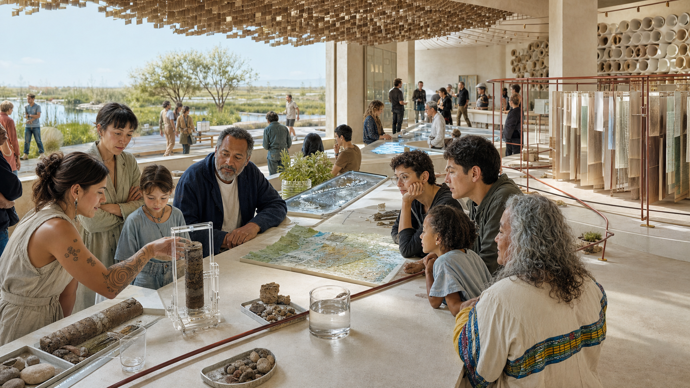
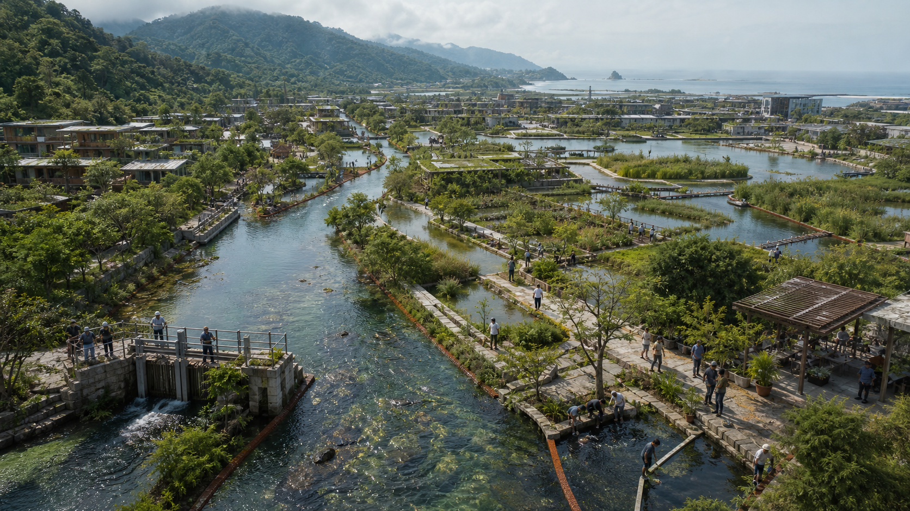
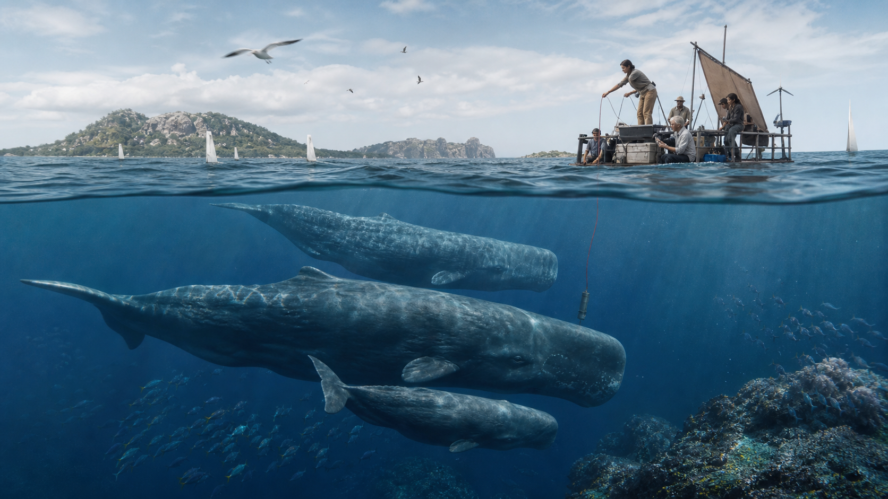
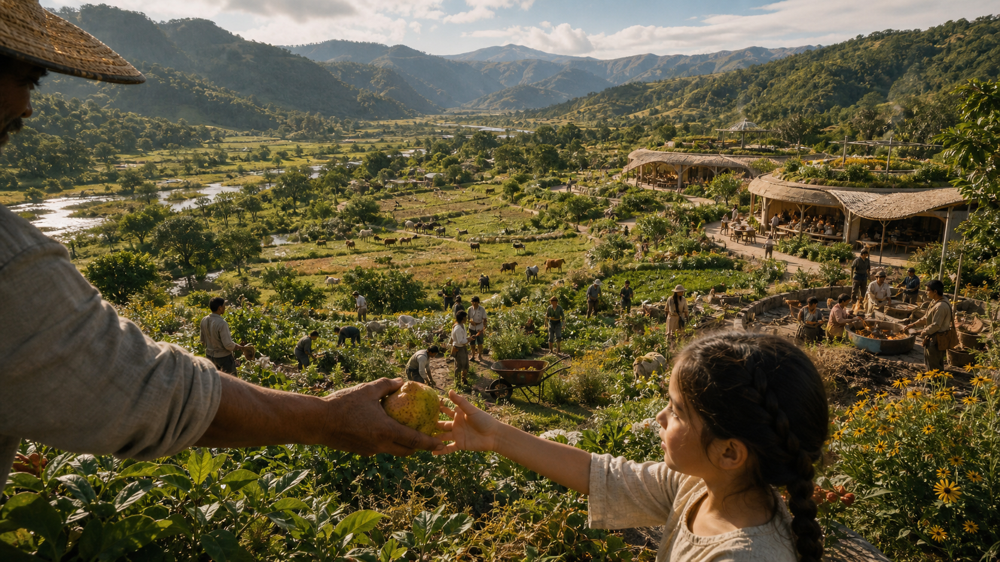
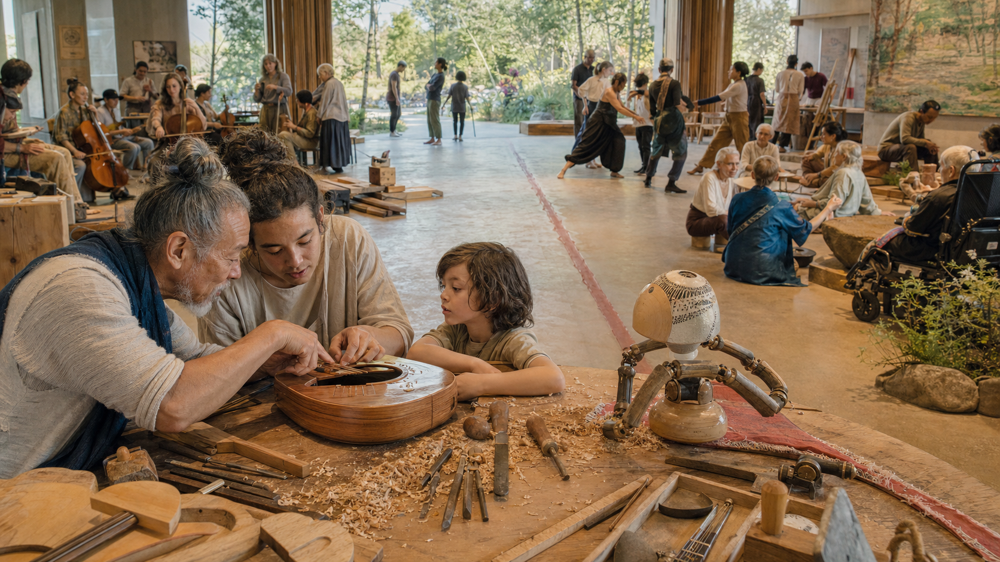
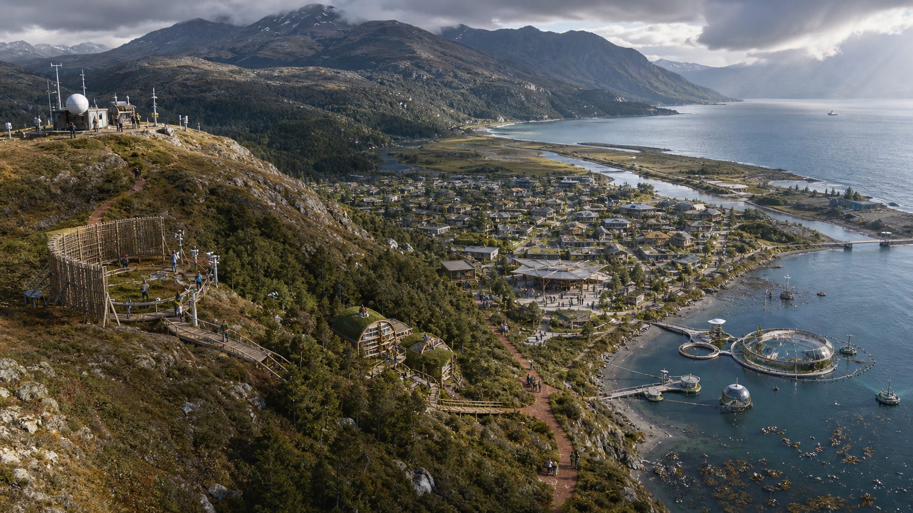
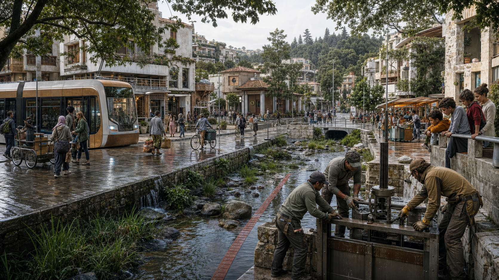
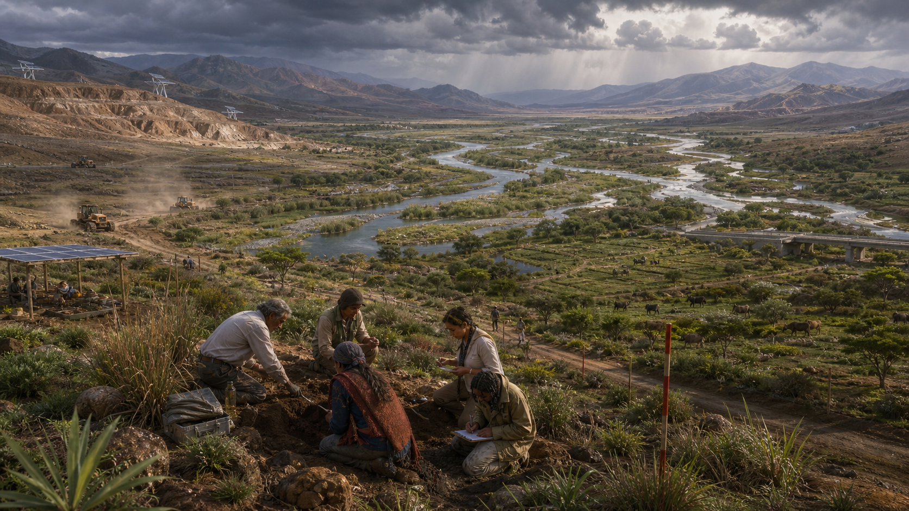
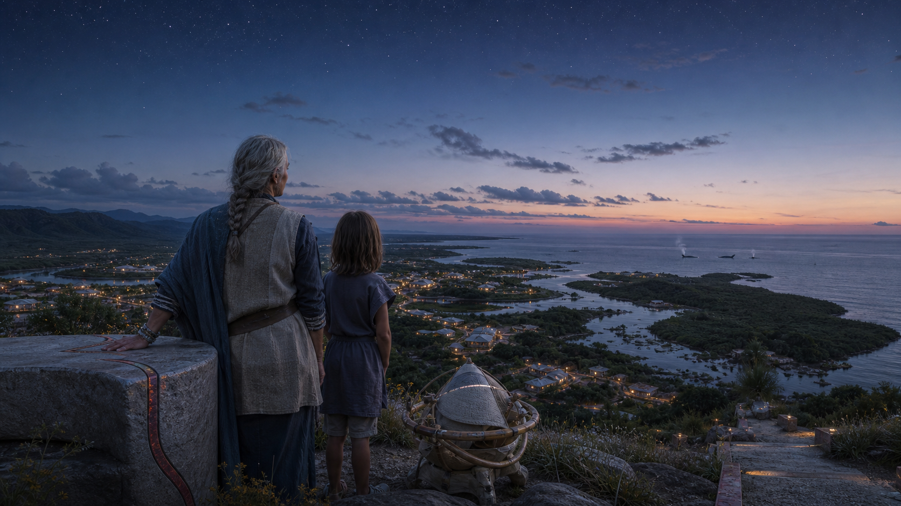

# New Earth 2126 — Starlight Intelligence civilization

Status: ten master frames generated, persisted, and inspected on 2026-08-24. The artifact set is ready for founder selection; no public release approval is implied.

This is a ten-frame speculative world study for the most life-affirming version of New Earth one century from now. It translates the phrase **Starlight Intelligence Empire** into an empire of capability, care, and shared infrastructure: a distributed civic civilization rather than a territorial or extractive power.

The images are future fiction. They are not forecasts, product claims, or evidence that AGI, superintelligence, animal-language translation, or the depicted infrastructure exists. The research below supplies plausible mechanisms and ethical constraints for the visual world.

## Final gallery

### 01 — The first light

The living watershed is the capital: mountain, forest, city, wetland, mangrove, and ocean joined by visible stewardship.

### 02 — The civic intelligence assembly

Plural artificial intelligences enter public life as inspectable materials and services; citizens retain responsibility for the decision.

### 03 — Living waters of abundance

Water abundance is a maintained circulation of river, treatment wetland, neighborhood channel, public work, and coast.

### 04 — The multispecies commons

The future begins by listening. A sperm-whale family owns the frame while human research remains passive, small, and accountable.

### 05 — The regenerative food continent

Food security becomes ecological richness: layered agroforestry, habitat, shared work, public kitchens, seed knowledge, and intergenerational care.

### 06 — The new human renaissance

Human evolution appears through lifelong practice, accessible tools, craft, music, movement, ecology, and care rather than instant skill upload.

### 07 — The great intelligence ecology

Climate, biosphere, civic, and ocean intelligences have distinct habitats and duties inside one place; none becomes the ruler of the whole.

### 08 — The living city at human scale

The most advanced city makes ordinary life richer: walkability, transit, water, access, repair, mixed generations, and functioning habitat.

### 09 — Planetary restoration in motion

Restoration keeps the scars visible. Recovery is ongoing work coordinated across soil, water, species, tools, and time.

### 10 — The Starlight horizon

The sequence closes on inheritance: elder, child, quiet intelligence, living basin, whales, and the first stars.

## Outcome contract

- **Audience:** builders, citizens, researchers, creators, and future generations who should feel invited to build the world rather than merely consume a spectacle.
- **Surface:** ten landscape master frames for a Starlight world gallery, editorial story, deck, website sequence, or future film storyboard.
- **First read:** intelligence has become reciprocal infrastructure among people, artificial systems, water, land, and other species.
- **Evidence inside the fiction:** ecological corridors, restored wetlands, circular water systems, agroforestry, renewable energy, public oversight, traceable decisions, bioacoustic research, and visible human stewardship.
- **Asset class:** Tier B, custom high-fidelity generated media.
- **Source method:** built-in Codex image generation; one model call per distinct frame.
- **Provenance:** generated for this repository from original, research-grounded prompts; no third-party images or living-artist style imitation.
- **Acceptance gate:** every exported image inspected at full frame; no fake text, logos, broken anatomy, sterile stock-utopia look, generic AI tropes, or incoherent ecology; diagnostic target at least 26/30.

## Canon and brand anchors

The series is grounded in two local Starlight sources:

1. `memory/vaults/horizon-vault.md`: intelligence should begin with care, remain human-centric, transparent, open, aligned, temporal, and humble.
2. The 2026-08-17 SIS foundation reset: the active visual territory is **Civic Intelligence** — calm, public-minded, documentary, human, accountable, and materially real. Dark command centers, black glass, neon, abstract nodes, glowing orbs, fake dashboards, and technology-as-spectacle are rejected.

The visual expression therefore uses clear institutional daylight, lived-in landscapes, workers and maintainers, warm mineral materials, place-specific ecology, and quiet advanced systems. Technology is legible through what it enables, not through floating interfaces.

## Research foundations

Research was accessed on 2026-08-24. The images extrapolate mechanisms; they do not reproduce source imagery.

- [UNESCO Recommendation on the Ethics of Artificial Intelligence](https://www.unesco.org/en/articles/recommendation-ethics-artificial-intelligence): human dignity, fairness, transparency, environmental responsibility, and meaningful human oversight.
- [UNEP Cities and the UN Decade on Ecosystem Restoration](https://www.unep.org/topics/cities/cities-nature/cities-un-decade-ecosystem-restoration): wetlands, restored canals and river edges, ecological corridors, pollinator gardens, mangroves, and community participation.
- [UN-Habitat: Integrating Nature-based Solutions into Urban and Territorial Planning](https://unhabitat.org/integrating-nature-based-solutions-into-urban-territorial-planning): urban forests, wetland restoration, green infrastructure, biodiversity-sensitive planning, and multi-level governance.
- [IPBES Nature Futures Framework](https://www.naturefuturesframework.org/nfftriangle): desirable futures must hold nature's intrinsic value, nature's contributions to society, and cultures' relationships with nature together.
- [UNEP: Water as a Circular Economy Resource](https://www.unep.org/resources/emerging-issues/water-circular-economy-resource-foresight-brief-no-033-february-2024): water reuse and circular resource management.
- [FAO Agroforestry](https://www.fao.org/agroforestry/about-agroforestry/overview/en): trees, crops, animals, and locally adapted production systems that support resilience and diverse yields.
- [Earth Species Project](https://earthspecies.org/what-we-do/): AI-assisted bioacoustics and research across animal vocalizations.
- [Project CETI](https://www.projectceti.org/research/index): field robotics, recordings, behavioral context, and machine learning used to study sperm-whale communication.
- [IEA Renewables 2025](https://www.iea.org/reports/renewables-2025): current energy-transition research across electricity, heat, and transport.

## Direction board

### Keep

- Sunlight, weather, water, skin, soil, wood, stone, ceramic, linen, and repair marks.
- One immediately readable subject plus foreground, middle distance, and planetary-scale consequence.
- Humans of different ages and backgrounds acting as stewards, makers, scientists, artists, farmers, caregivers, and citizens.
- Animals with ecological and social agency, never as props or anthropomorphic mascots.
- Artificial intelligences expressed through distinct public architectures, instruments, habitats, and services rather than one robot species.
- Maintenance, governance, and work visible inside abundance.

### Avoid

- Purple-blue fog, cyan neon, gold-on-black prestige coding, hacker darkness, starfield wallpaper.
- Glowing orbs, orbit rings, node clouds, portal imagery, humanoid robot councils, floating holograms, unreadable UI, generated logos, or text.
- Flying-car traffic, needle megatowers, vegetation pasted onto glass skyscrapers, empty plazas, spotless theme-park utopias.
- Impossible reflections, mixed biomes, mutant animals, tokenistic costuming, clone-like faces, malformed hands, and synthetic skin.
- Franchise echoes, living-artist imitation, generic solarpunk collage, and overprocessed game concept art.

### Signature

**The provenance line:** a thin oxidized-red physical line appears in every frame as a real rail, water-depth marker, ceramic seam, path edge, instrument cable, or civic bracket. It connects action to consequence without becoming interface decoration. With the logo removed, this recurring material behavior should still identify the series.

### System

- **Visual world:** civic biophilic realism; a documentary future built through stewardship.
- **Palette:** clear sky and water blues from the environment; warm mineral white; earth, bark, botanical green; deep navy only as structural ink; oxidized red as the single civic intervention color.
- **Light:** mostly clear morning or soft daylight; one underwater scene; one restrained dusk finale.
- **Camera:** physically plausible large-format photography and architectural visualization, varied from aerial to eye-level to waterline, with natural depth and restrained grading.
- **Technology:** quiet, embedded, modular, repairable, and climate-specific. Its function must be visible.
- **Artificial intelligence:** plural and non-anthropomorphic. Each intelligence has a different material presence and public responsibility, with human oversight close by.
- **Typography:** none inside the generated pixels. Titles, captions, claims, logos, and attestation are deterministic overlays outside the images.

## Ten-shot sequence

| # | Frame | Narrative job | Primary visible mechanism |
|---|---|---|---|
| 01 | The first light | Open at planetary scale | Watershed city, ecological corridors, renewable infrastructure |
| 02 | The civic intelligence assembly | Establish plural AI governance | Public deliberation, traceable evidence, human oversight |
| 03 | Living waters of abundance | Make abundance physical | Circular water, wetlands, mangroves, basin stewardship |
| 04 | The multispecies commons | Expand the moral circle | Bioacoustic listening, low-impact ocean research, animal agency |
| 05 | The regenerative food continent | Show nourishment at scale | Agroforestry, diverse crops, pollinators, habitat corridors |
| 06 | The new human renaissance | Show evolved human capability | Lifelong learning, craft, movement, science, collaborative tools |
| 07 | The great intelligence ecology | Reveal multiple great intelligences | Distinct climate, ocean, civic, and biosphere intelligence habitats |
| 08 | The living city at human scale | Prove daily life works | Walkable neighborhoods, transit, water, mixed generations, wildlife |
| 09 | Planetary restoration in motion | Show civilization repairing damage | Restored drylands, river basins, native herds, clean industry |
| 10 | The Starlight horizon | End with gratitude and care | Intergenerational stewardship, first stars, flourishing land and sea |

## Artifact contract

Final candidates use these stable names:

1. `01-the-first-light.png`
2. `02-civic-intelligence-assembly.png`
3. `03-living-waters-of-abundance.png`
4. `04-multispecies-commons.png`
5. `05-regenerative-food-continent.png`
6. `06-new-human-renaissance.png`
7. `07-great-intelligence-ecology.png`
8. `08-living-city-human-scale.png`
9. `09-planetary-restoration.png`
10. `10-starlight-horizon.png`

The exact generation prompts live in `PROMPTS.md`. `design-loop-evidence.json` records the export inspection and diagnostic verdict.

## Verification receipt

- **Masters:** 10/10 present and independently decodable as 24-bit RGB PNG.
- **Dimensions:** 1672 × 941 pixels each; 1.7768:1, composed for 16:9 editorial and cinematic use.
- **Visual inspection:** every image reviewed at original detail for anatomy, ecology, geography, water behavior, crop safety, fake text, logos, interface artifacts, scene hierarchy, and series continuity.
- **Prompt integrity:** ten distinct text-to-image calls; no reference images, third-party imagery, franchise shorthand, or living-artist imitation.
- **Manifest integrity:** SHA-256 and byte counts in `ASSET-MANIFEST.json` recomputed successfully on 2026-08-25.
- **Evidence validation:** `design-loop-evidence.json` passes the estate design-evidence validator.
- **Maker diagnostic:** 28/30. This is a production-quality self-review, not independent founder approval.
- **Release gate:** founder selection remains open. Machine admission returned `SWARM HOLD`, so no new independent critic agent was launched during production.

## Package map

- `README.md` — research, art direction, final gallery, and verification receipt.
- `PROMPTS.md` — exact ten-prompt production packet and global negative contract.
- `ASSET-MANIFEST.json` — dimensions, byte counts, provenance, and SHA-256 checksums.
- `design-loop-evidence.json` — artifact-by-artifact inspection notes and diagnostic verdict.

---

Built on SIP — Starlight Intelligence Protocol.
