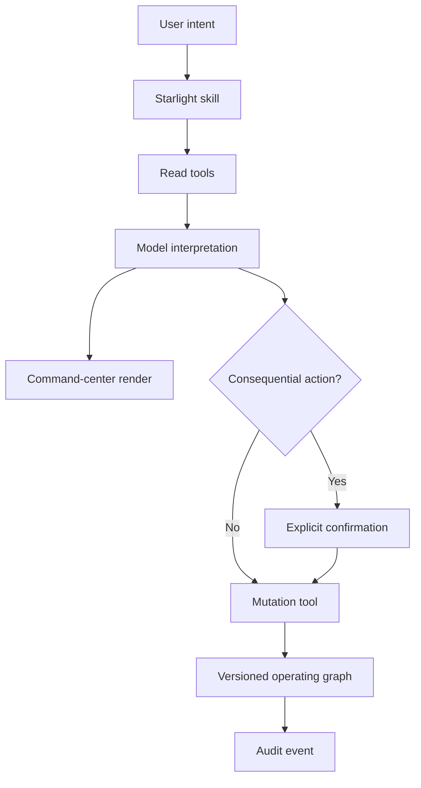

# Architecture decision: Starlight as a governed operating graph

## Decision

Starlight ships as skills + MCP + selective MCP Apps UI.

- Skills encode repeatable reasoning, sequencing, and output contracts.
- MCP tools own authenticated reads, controlled mutations, schemas, versions, and audit events.
- UI renders only the final portfolio snapshot because visual comparison and navigation improve comprehension there.
- The conversation remains the approval surface for consequential changes.

## Control flow

The model can inspect and reason before choosing whether UI materially helps. Rendering is decoupled from data processing, so the component mounts once with final context.

## State model

| Layer | Owner | Lifetime | Implementation |
| --- | --- | --- | --- |
| Business state | Supabase | Durable | Tenant-scoped JSONB document with atomic revision compare-and-swap |
| Request state | Cloudflare Worker | One MCP request | Fresh MCP SDK v2 server factory; no cross-request cache |
| UI state | Component instance | Render lifetime | React state |
| Widget preferences | Host widget | Host-defined | Feature-detected `window.openai.widgetState` |
| Model-visible selection | MCP Apps host | Until next user/model turn | `ui/update-model-context` |

Business state never lives only in the iframe. The UI can refresh read state and send model-visible selections, but it cannot approve or finalize work.

## Governance invariants

1. **Read before write.** Existing records are fetched before mutation.
2. **Optimistic concurrency.** Every mutable record carries a version. Stale writers fail.
3. **Human terminal authority.** Work cannot become `done` or `cancelled`, and decisions cannot become `approved` or `rejected`, without explicit confirmation in the tool input.
4. **Evidence is attributed.** Notes and rationale remain assertions; source URLs remain sources. Neither becomes truth merely by entering the graph.
5. **Audit is structural.** Every mutation increments the portfolio revision and appends an event.
6. **Headless parity.** Every outcome remains understandable without rendering the component.

## Adapter boundary

`StarlightStore` contains the governance rules. `SupabaseWorkspaceAdapter` owns production persistence and `JsonFileWorkspaceAdapter` exists only for deterministic local tests. Both preserve:

- stable record IDs;
- tenant and actor authorization on every call;
- atomic revision increments;
- per-record optimistic versions;
- audit events bound to actor and tenant;
- equivalent validation and confirmation requirements;
- snapshot reads with deterministic venture filters.

Replacing storage must not weaken these semantics. The database is an implementation detail; the governance contract is the product.

## Deliberate exclusions from v0.2

- No generic “run my whole company” tool.
- No direct external-system writes.
- No credential collection in the component.
- No UI-only business state.
- No checkout: Starlight is software/service infrastructure, while current embedded plugin checkout availability is constrained.
- No private SIS vault exposure. The remote plugin owns only its cloud workspace.
- No anonymous reads or writes. Cloudflare Access and the Worker both enforce identity.
