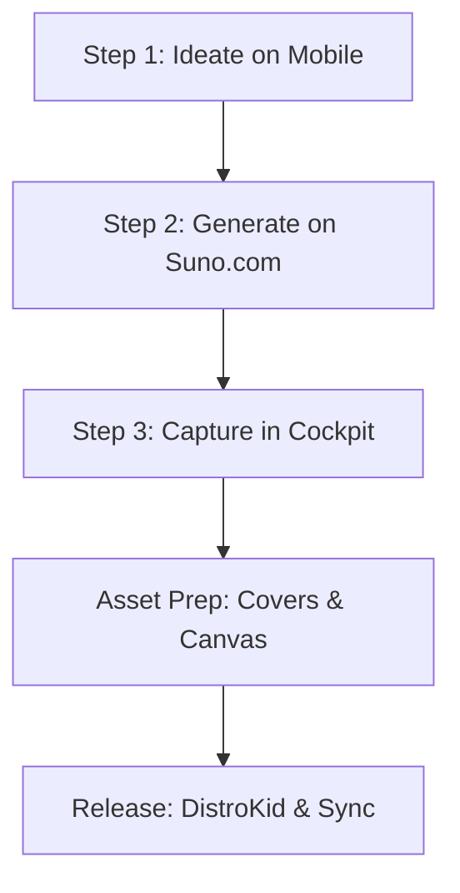

# SOP — Mobile Song Ideation & Chatbot Intake

> **Version:** 1.0  
> **Applicability:** Mobile Chat (Gemini, ChatGPT) & Visual Cockpit Intake  
> **Core Objective:** Bridge the quick, transient moment of song ideation on mobile with the rigorous cataloging and asset-pipeline standards of Arcanea Records.

---

## The 3-Step Lifecycle



---

## Step 1: Ideation (Mobile Chat)

When a creative spark strikes while you are away from your workstation, open your mobile chat assistant (e.g. Gemini, ChatGPT, Claude) and use the following structural pattern:

### The Intake Prompt Template
Copy and paste this framing prompt followed by your song idea:

> "Act as my Senior A&R Coprocessor for Arcanea Records. I have a new song idea: **[INSERT RAW IDEA HERE]**.
> 
> 1. Recommend which of our four labels this fits: **Frank Riemer** (cinematic/classical), **Frank's Vibes** (electronic/lo-fi), **Arcanea** (mythic/orchestral), or **Nona** (punk/abrasive).
> 2. Synthesize the optimal 3-layer Suno prompt (Genre/Style + Instrumentation/Mood + Vocal/Production Posture) based on our brand DNA.
> 3. Suggest a working title and a list of key structure tags (e.g., [Intro], [Contemplative Verse], [Build], [Outro])."

### Example Execution
* **Raw Idea:** "A warm, ambient electronic track that sounds like soft rain hitting window glass while studying late at night."
* **A&R Response:** 
  - **Label:** `franks-vibes` (Persona: Lumen)
  - **Suno Prompt:** `lo-fi chill-house, ambient rain texture, Rhodes piano chords, slow warm sub-bass, organic percussion, 82 BPM, dynamic-range-protected`
  - **Working Title:** *Liquid Glass*

---

## Step 2: Production (Suno.com)

1. Open **Suno.com** (using your mobile browser or desktop).
2. Click **Create** and toggle **Custom** mode.
3. Paste the **Suno Prompt** into the *Style of Music* field.
4. Add the suggested structure tags and lyrics in the *Lyrics* field.
5. Generate the tracks, select the best variation, and copy the Suno link (e.g. `https://suno.com/song/xxx`).

---

## Step 3: Intake (The Visual Cockpit)

Once back at your desk or via the visual interface:

1. Open the **Music Producer Cockpit** in your browser.
2. Under the **Intake Room** tab:
   - Enter the **Title** (*Liquid Glass*).
   - Select the **Label** (*Frank's Vibes*).
   - Enter the **Persona** (*Lumen*).
   - Paste the **Suno URL** (`https://suno.com/song/xxx`).
   - Paste the **Suno Prompt** used.
   - Enter the **Key** (e.g., *Am*) and **BPM** (*82*).
   - Click **Ingest Song**.
3. **What happens behind the scenes:**
   - The coprocessor appends the song to `catalog/master.csv` with a unique ID (e.g. `franks-vibes_20260529_liquid-glass`).
   - A markdown file is generated at `catalog/draft/franks-vibes_20260529_liquid-glass.md` containing the full draft details.
   - A visual card immediately pops up on the dashboard under **Drafts**.

---

## Step 4: Asset Suggestion & Coprocessing

With the draft cataloged, click the card in the visual cockpit to activate the coprocessors:

1. **Cover Art (`nb-image`):**
   - The cockpit reads the label DNA and suggests the exact Imagen command to run in your terminal:
     ```bash
     node scripts/nb-generate.mjs --prompt "cool grey background, single glass droplet on a felt surface, warm gold lighting accent, 1:1, organic texture" --output "franks-vibes_20260529_liquid-glass"
     ```
2. **Video Hook (Spotify Canvas & TikTok):**
   - Click "Generate Video Script" in the cockpit. It will instantly generate a 30-second pacing script with video transitions (e.g. "0-5s: Macro shot of water droplet, text: 'Liquid Glass by Lumen'...") to use when rendering video reels.

---

## Step 5: Notion Synchronization

1. Run `/music-label-board sync-notion` (or click **Sync Board to Notion** on the dashboard).
2. The local CSV and newly added song will mirror cleanly to your **AI Musicians Hub** Notion database as a visual card.

---

**Built on SIP** — `verticals/music-is/workflows/mobile-chatbot-sop.md` · v1.0 · 2026-05-29 · The Mobile-to-Studio Spine
